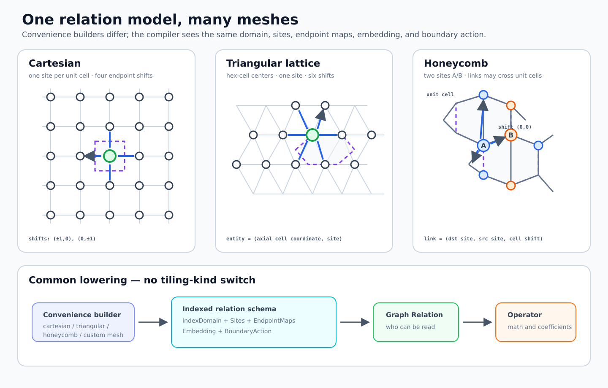
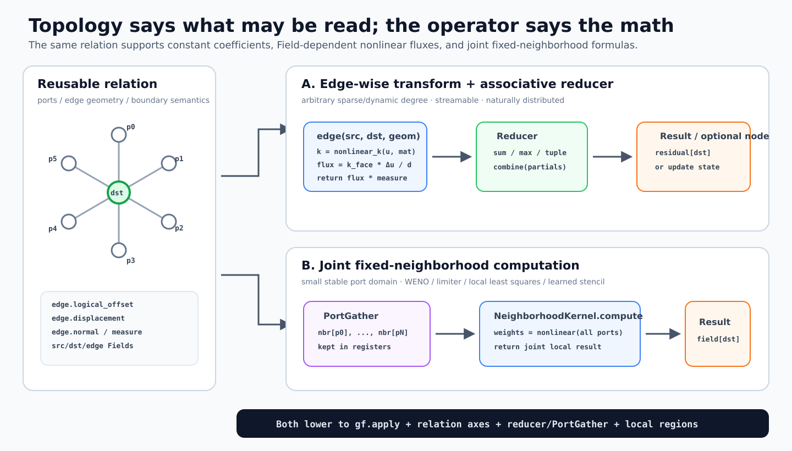
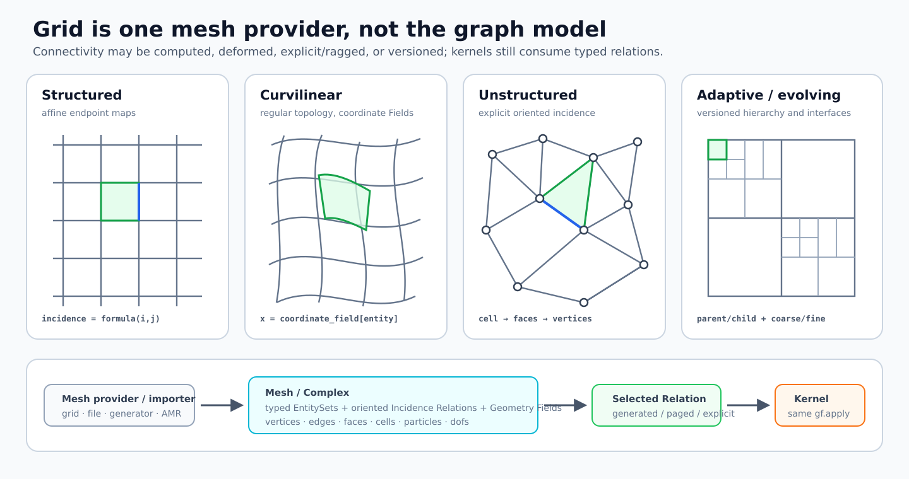

# GraphForge v2 项目设计

状态：alpha compiler vertical slice  
日期：2026-08-14

GraphForge 是一个面向科学计算的 graph/relation compiler。用户使用粗粒度
`MessagePassing` 描述 Static Graph 或 Dynamic Graph 上的计算；compiler 保留图结构、
reducer 和 field access 信息，自动生成 CPU loop/vector kernel 或 GPU block-tensor
kernel。

当前最重要的工程决策是：

> 先实现 coarse MessagePassing + naive Static/Dynamic Graph，再根据 profile 做一项
> 有明显端到端收益的硬件优化；细粒度语言只能从已验证的优化需求中反向设计。

阅读顺序：

- 本文档：当前范围、架构、接口和里程碑；
- [`DESIGN_DECISION_TIMELINE.md`](DESIGN_DECISION_TIMELINE.md)：从初始假设到当前实现的设计
  决策、验证、否决方案与结论时间线；
- [`docs/RELATED_WORK.md`](docs/RELATED_WORK.md)：相关系统与文献；
- [`docs/GPU_GRAPH_OPTIMIZATION.md`](docs/GPU_GRAPH_OPTIMIZATION.md)：GPU work-tile、
  subgraph 和 Dynamic Graph 优化路线；
- [`docs/SCHEDULING_ABSTRACTIONS.md`](docs/SCHEDULING_ABSTRACTIONS.md)：长期调度、layout、
  storage 和 distributed 抽象；
- [`docs/IR_DESIGN.md`](docs/IR_DESIGN.md)：IR 实现笔记与原型问题，规范以本文为准；
- [`docs/rfcs/0001-architecture.md`](docs/rfcs/0001-architecture.md)：早期讨论记录。

### 0.1 当前实现快照（2026-08-13）

- `gf.Tensor` frontend 由 native C++ OpBuilder 构造 `gf_tensor`，CPU 已走
  `gf_tensor → SCF/MemRef → LLVM dialect → ExecutionEngine`；仓库不再生成 C/C++ source。
- scalar CSR/dense/generated-radius 与 structured dense `MessagePassing` 均由 native OpBuilder
  构造 relation + `gf.apply`；Python interop 不再拼装 Domain MLIR。reducer 是带
  identity/lift/combine/finalize 的 symbol，`sum` 与 stable online-softmax 调度均由 region
  的类型和代数结构识别，而不依赖 Python 类名、字段名或 `kind` hint。
- 自定义 scalar FP32 `gf.Reducer` 已进入同一个 Domain/Iter/Kernel pipeline；tuple state 可
  round-trip 和参与 planning。implicit dense 已支持从任意 scalar FP32 reducer regions 生成
  generic TTIR，包括 tuple state 的 identity/lift/combine/finalize；stable online-softmax 等
  已证明代数仍选择更高效的 tile/dot schedule。
- Torch-free static-CSR MessagePassing 已把 edge/node UDF 保留为可微 `gf_tensor` DAG；
  gather/CSR expand/segment 的 VJP 由 `gf-tensor-vjp` 生成。结构上证明为 zero identity、
  component-wise additive combine 的 custom tuple reducer（例如 Mean）也能直接执行和自动
  求导，用户不写 backward。CUDA source-gradient 与 edge-weight gradient 两条 gate 均达到
  matched handwritten kernel 水平；edge-weight VJP 的 `auto` 会先生成
  `gf_tensor.checkpoint_candidate`，再由正式 MLIR budget pass 改写为
  `gf_tensor.checkpoint` 或 recompute，而不是 benchmark 特调。详细边界和数字见第 8.2 与第 12 节。
- optional node 由 native OpBuilder 捕获；`node_input_indices`/segment ABI 经过
  Domain→Iter→Kernel 保留，generic dense/CSR provider 已实际执行 edge→reduce→node。四个
  target-independent stage 在同一个 MLIRContext 内运行，不再为 native capture 调用 `gf-opt`
  子进程；serialized TTIR 仍保留为 vendor provider 的版本隔离边界。
- `Graph.halo()` placement 会经过 `gf-plan-distributed-tasks` 生成类型化
  `halo_pack → halo_exchange → halo_unpack`、interior/boundary dependency 和 Event join；
  Torch-free owner/ghost map、stdlib 多进程 neighbor transport 和 byte-exact exchange 已执行；
  CPU stdlib 和 CUDA device-buffer provider 已能在 active `DistributedRuntime` 下把 rank-local
  `gf.Tensor` 自动绑定为 owned+ghost local CSR 并执行普通 `MessagePassing` 及 reverse halo
  VJP；NCCL 直接使用 device pointer/stream event。没有 runtime、不支持的 topology/layout 或
  transport capability 时均 fail-closed，不会静默执行错误的单 shard 语义或隐藏 host staging。
- CSR degree statistics 已贯穿 Domain→Kernel。低于 60% padding utilization 的 launch 会由
  `gf-plan-degree-buckets` 生成 compiler-owned `degree-row-worklist` PhysicalInstance、并行
  bucket task、互斥输出 partition proof 和 Event join。worklist 稳定 ABI 是 packed i64 buffer
  `[bucket_offsets[B+1], bucket_cursors[B], row_ids[N]]`；materialization 被进一步 lower 为
  `reset → histogram → prefix/reset-cursors → scatter` Event 链，`gf-task-to-bundle` 将 Task IR
  导出为版本化 plan，Torch-free runtime 再由 provider resolver 绑定 executable。四个 worklist
  primitive 和 typed additive-reducer 的 bucket compute 都由 compiler 生成 TTIR，并已在本机
  provider 编译为 PTX/cubin、组成完整 bundle 执行。精确 histogram 使 compact-worklist grid
  使用真实 bucket 行数；没有 histogram 的 `degree_max>64` 则显式标记为
  `provider-deferred-high-degree`，不会生成后端无法兑现的 task plan。
- `degree_max > 64` 不再误入只支持单 neighbor tile 的 bucket translator。调度先生成
  `degree_worklist`。无 node epilogue 的 associative scalar reducer 现在从精确 degree CDF
  选择 `{8,16,32}` 中覆盖至少半数行的 short bound，并生成
  `direct-filter(<=short) + worklist-chunked(>short)`：tail kernel 从 reducer/UDF regions 生成，在
  寄存器中跨 64-edge tiles 合并状态，不再分配 partial buffer，也没有 finalize launch；带 node
  epilogue 的通用语义仍保留 `row_split_partial → row_split_finalize → release`。短/长行 writer
  通过 `degree-worklist` output partition 在 Task IR 中证明互斥。正式 power-law
  case（131072 行、90% degree-8 / 9% degree-64 / 1% degree-256）中，i32
  compiler-generated chunked-tail TTIR 对 `torch.sparse.mm` 的 local hot/cold 为
  1.508x/1.404x、random 为 1.353x/1.525x，四项 CI low 1.337–1.495。公开 auto 仍同时
  autotune reusable native CSR；i32/i64、local/random、hot/cold 八项 gate 全过，CI low
  1.255–1.849。连续 log-normal（mean 15.70/p99 137/max 256）和 exponential
  （mean 16.00/p99 74/max 176）random/i32/F1 也走相同 generated plan，hot/cold 分别为
  1.196x/1.157x 与 1.204x/1.439x；不能外推其他规模、dtype、vector width 或 tail 比例。
- Torch 只存在于 lazy `interop/torch` oracle/provider 边界；公开 Graph、Reducer、Tensor、
  runtime 和 native compiler frontend 不以 Torch 为基类或必选依赖。
- 本地 wheel 已捆绑 `gf-opt`、`gf-translate` 和 runtime，并在两个全新、无 Torch 的 venv
  验证相对 RPATH、native Tensor IR 和工具启动；manylinux_2_38 修复产物及从 sdist 独立重建
  也已通过。正式 PyPI wheel 仍须由 hosted trusted-publishing workflow 发布。当前本机 Python
  suite 为 230 passed、0 skip、10 subtests，LLVM/MLIR 22.1.8 lit 为 64/64；这不是
  ROCm/DCU/Metal/PPU 支持声明。

### 文档权属

`PROJECT.md` 是唯一规范性设计。Public API、语义、IR contract、pass legality、backend、JIT、
storage/distributed、visualization、性能门槛和里程碑必须在本文闭合；实现不能引用 `docs/`
中的独有规则来补全本文。`docs/` 只保存 related-work 调研、benchmark 原始协议/结果、build
操作说明、实现笔记和历史 RFC；若与本文冲突，以本文为准。专题内容可以先在 docs 中研究，
但成为决策时必须合并回本文并从专题文档移除规范性措辞。

---

## 1. 项目边界

### 1.1 唯一产品：compiler-centered execution system

GraphForge 的产品核心是 **compiler + 承载 compiler artifact 的最小 Tensor/runtime/autograd**，
不是通用训练框架、graph/attention/scientific kernel library，也不维护
一套与 cuSPARSE、FlashAttention、FLA、FSA、LAMMPS 或 PyG 竞争的内置算子实现。仓库边界是：

```text
属于 graphforge core                 不属于 graphforge core
----------------------------------  ------------------------------------
Python program capture/frontend     attention、diffusion、solver 等算法类
gf.domain / gf.iter / gf.kernel IR  手写 Triton/CUDA/厂商 kernel
verifier、analysis、rewrite/pass    SOTA adapter 与 performance oracle
generic IR → provider IR lowering   benchmark workload 与算法 reference
JIT/cache/artifact/debug interface  面向用户的预制算子目录
external-library dispatch proof     benchmark-only tuning template
Tensor/Buffer/Stream/Event C ABI     optimizer、NN Module、dataset/data loader
semantic reverse-mode transform     完整 ATen/eager operator 生态
```

因此 `DenseAttention`、`RadiusForce`、FLA/FSA adapter 等只能出现在 `examples/` 或
`benchmarks/`。核心可以定义 `Graph`、`MessagePassing`、structured reducer、tensor/relation
type 等**语言语义**，也可以在 pass 中识别其代数结构，但不能按类名、字段名或 workload 名
选择一个手写 kernel。所有可执行高性能代码必须来自：

1. user program → GraphForge IR → generic pass → provider IR 的生成；或
2. compiler 证明语义等价后 dispatch 外部库。

`kernel.reference()` 是 frontend 的语义解释器，只用于 correctness/differential test，不是
performance backend。手写 SOTA/oracle 放在 `benchmarks/kernels/`，GraphForge runtime 不得导入。
Tensor/autograd 只能提供 compiler 所需的通用 value、capture、VJP 与 execution substrate；
不得借此向 core 加入 optimizer、NN、dataset 或 workload-specific operator 实现。

### 1.2 产品定义

GraphForge 首先提供 graph/relation 编程接口：

```text
Graph / Relation
  + Node / Edge Fields
  + Message
  + Reducer
  + Update
  + Effects
```

Compiler 决定：

```text
logical/physical graph format
traversal and load balancing
feature tiling and reduction
CPU/GPU execution mapping
register/shared/HBM working set
materialization, fusion and reuse
```

用户不需要在 simulation source 中指定 block、warp、shared memory、pipeline stage、
HBM cache 或 NVMe spill。

### 1.3 核心原则

1. **语义统一，执行方式不统一。** 同一个 MessagePassing 可以使用 edge atomic、CSR
   row、subgraph tile、CPU loop 或其他合法实现。
2. **逻辑 graph 与物理 format 分离。** `StaticGraph` 不是 CSR；CSR 只是一个
   PhysicalInstance。
3. **粗粒度 API 优先。** M0–M2 不公开 graph loop language 或 `gf.Schedule`。
4. **内部结构不能过早丢失。** Relation provenance、ragged iteration、AccessMap、Effect
   和 Reducer 必须保留到 target lowering。
5. **优化必须端到端计时。** Graph build、preprocess、format conversion、padding、copy
   和 JIT 不能藏在 benchmark 外。
6. **Backend 由 capability 驱动。** 通用 pass 不硬编码 NVIDIA、海光或 PPU 名字。

### 1.4 M0–M2 范围

首阶段只承诺：

- Python frontend；
- Torch-independent `gf.Tensor` metadata/storage 与最小 Buffer/Stream/Event runtime；
- semantic reverse-mode autograd vertical slice；
- PyTorch Tensor 作为可选 zero-copy adapter；
- coarse `MessagePassing`；
- `StaticGraph`：COO/CSR 输入；
- `DynamicGraph`：builder/lifetime/rebuild 语义；
- 首个 Dynamic Graph：geometric `RadiusGraph`；
- reducer：先完成 `sum`，保留 tuple-state reducer 结构；
- CPU/CUDA reference evaluator；
- naive CPU CSR loop；
- 从通用 IR 生成 naive CUDA edge-atomic 与 CSR-row kernel；
- complexity-sane uniform-cell-list RadiusGraph builder；
- MLIR dump、differential test、compile cache 和 `explain()`。

### 1.5 当前非目标

以下能力不阻塞 M0–M2：

- public fine-grained node/edge/neighbor loop language；
- public schedule/layout/pipeline DSL；
- 任意 Python control flow 和副作用；
- optimizer、NN Module、dataset/data loader 和完整训练框架；
- 完整 eager Tensor operator surface、高阶梯度与任意 mutation autograd；
- 任意动态图 edge insertion/deletion；
- FFT、solver、全量 ATen 或完整 PyTorch replacement；
- bitwise deterministic 浮点 reduction；
- distributed runtime 和 out-of-core execution；
- DCU/PPU 的生产 codegen。

这些方向可以预留 IR 边界，但不能扩大首个 vertical slice。

---

## 2. 用户模型

### 2.1 统一 Graph 对象

Public API 只有一个 `gf.Graph`。用户不设置 `dynamic=True/False`；构造 topology 的方式
决定其 provenance 和 lifecycle。

```text
Graph
  ├── EntitySet / node schema
  ├── TopologyOrigin = External(indices) | Procedural(enumerator)
  ├── Lifecycle = Frozen(version) | Rebuildable(dependencies, predicate)
  ├── logical properties
  └── zero or more cached materializations
```

Static/Dynamic 只描述 lifecycle，不是两套 MessagePassing、runtime 或 backend。不能把
“外部/生成”“不变/重建”“物化/流式”混成一个 `dynamic: bool`；内部保留三个正交维度：

```text
origin:      External | Procedural
lifecycle:   Frozen | Rebuildable
realization: Materialized | Paged | Generated
```

典型组合：

```text
CSR snapshot: External   + Frozen      + Materialized/Paged
stencil:      Procedural + Frozen      + Generated
radius:       Procedural + Rebuildable + Generated/Materialized/Paged
```

每次 Kernel 调用前，runtime 将 Graph resolve 为本次调用一致的内部 `GraphSnapshot`：

```text
GraphSnapshot(logical_version, resolved_properties, ResolvedRelation, ready_event)

ResolvedRelation = MaterializedInstance
                 | PagedTileStream
                 | GeneratedTileProducer
```

Frozen Graph 直接 resolve 当前 version；Rebuildable Graph 检查依赖与 correctness
predicate，必要时运行 builder，再产生 snapshot。后续 consumer 只读取 snapshot，因此
构图不会与同一次调用中的 message passing 互相看到半更新状态。

`Graph.radius(...)` 本身只创建 logical relation，不立即构图。首次 Kernel 调用时 planner
才选择执行形态；“runtime build”不等于必须先生成完整 edge list，也不等于一定由一个独立
builder kernel 完成。允许三种合法计划：

```text
materialize:      build complete COO/CSR → one or many consumers
paged:            produce/load bounded edge tiles → consume → recycle buffers
generated-fused:  generate candidates → predicate → message → reduce，不写出 edge list
```

选择依据包括 reuse 次数、预估边数、memory budget、reducer、硬件能力和 distributed
partition。`kernel.inspect().explain()` 必须报告选择及峰值 working-set 估计。

### 2.2 External + Frozen topology：CSR/COO Static Graph

MVP 通过 COO/CSR 构造 static topology：

```python
import graphforge as gf

graph = gf.Graph.from_csr(
    row_ptr=row_ptr,
    col_idx=col_idx,
    num_src=num_nodes,
    num_dst=num_nodes,
    sorted=True,
    symmetric=False,
)
```

这个构造得到的是 External + Frozen：topology 由调用者作为一个显式、不可变版本提供，
不依赖 runtime Field 重新生成。Frozen 不是说 edge index 必须成为编译期常量；实际 index
内容通常不进入 kernel compile key。

传入的 `row_ptr/col_idx` 在 Graph 生命周期内不得原地修改，因为 PyTorch raw Tensor 的
任意 mutation 无法被可靠拦截。改变 topology 直接构造新 snapshot：

```python
graph = gf.Graph.from_csr(
    row_ptr=new_row_ptr,
    col_idx=new_col_idx,
    num_src=num_nodes,
    num_dst=num_nodes,
)
```

新对象有新的 logical snapshot/version，使旧 snapshot 的 derived format、statistics 和
execution plan 不会被误用；只要 schema/specialization 兼容，compiled kernel cache 仍复用。
旧 Graph 不要求用户显式 `del`：未完成的异步 launch/Event 持有旧 snapshot 与 buffer，完成
后才由引用计数/runtime cache policy 回收。Compiler 可以为一个 snapshot 缓存 COO、CSR、
bucketed CSR 或其他 PhysicalInstances。

M0 不提供语义含混的 `replace_csr()` convenience。未来若 timestep 间需要保留 global ID、
partition lineage、增量 delta 和 backpressure，应另行设计 `TopologyStream.publish(snapshot)`；
它发布新 immutable version，而不是原地改写正在被 kernel 使用的 topology。

如果应用每个 timestep 都从外部传入一份新 CSR，那么应用层可以称它为 temporal/dynamic
graph；在本编译模型里，它是一串 immutable External snapshots。它与 `Graph.radius`
的差别不是“边最终会不会变化”，而是 GraphForge 是否拥有生成 topology 的 recipe、依赖和
失效条件。两者可复用相同的 consumer kernel。

### 2.3 Procedural + Rebuildable topology：Radius Dynamic Graph

Dynamic Graph 的 topology 由 runtime Fields 派生，Graph 保存 builder、dependencies、
lifetime 和 invalidation condition。首个 builder 是 radius relation：

```python
graph = gf.Graph.radius(
    positions=position,
    cutoff=cutoff,
)
```

Radius relation 允许编译器可捕获的 builder UDF，而不把“距离”和“选边”写死。可复用逻辑的
主接口与 `MessagePassing` 一致，使用 class-based builder kernel：

```python
particle_type = torch.tensor([0, 1, 0, 1], dtype=torch.int64)
metric_scale = torch.tensor([1.0, 1.5])

class DifferentTypeAnisotropicRadius(gf.RadiusGraph):
    def metric(self, src, dst, edge, metric_scale):
        return torch.linalg.vector_norm(
            edge.displacement * metric_scale, dim=-1)

    def select(self, src, dst, edge):
        return src.particle_type != dst.particle_type

graph = DifferentTypeAnisotropicRadius()(
    positions=position,
    cutoff=cutoff,
    fields={"particle_type": particle_type},
    metric_scale=metric_scale,
)
```

这里 `particle_type: i64[N]` 是用户定义的每粒子类别 ID，例如原子种类、材料相或碰撞组；名称
不是内建魔法，`src.particle_type` 来自显式 `fields` 映射。简单的一次性规则也可写成
`Graph.radius(..., metric=lambda ..., select=lambda ...)`。两种写法在公开语义上归一化；正式
frontend 会将 class method 或 lambda capture 成相同 builder regions。class 便于命名、复用、
检查 IR 和持有多个 specialization，lambda 只是匿名 shorthand。

`metric(src, dst, edge) -> distance` 每个 candidate 返回一个浮点标量；endpoint namespace 含
`position` 和 `fields`，初始 edge namespace 含 `displacement`。`select(src, dst, edge) -> i1`
是 `distance <= cutoff` 之后的附加过滤器，并可读取 `distance/cutoff/displacement`。因此
`select` 只能删边，不会绕过 logical radius。UDF 必须是无副作用、shape-preserving 的 tensor
region；Python reference 可以直接执行，正式 frontend 将其 capture 为 builder region，而不是
在 device loop 中调用 Python。

性能 legality 必须和语义分开：默认 Euclidean metric 加任意附加 `select` 仍可用 Euclidean
cell list 产生 superset candidates；任意 custom metric 若没有编译器可证明的 Euclidean bound，
只能使用 all-pairs correctness path，并在 `explain()` 标记 `all-pairs-only`。后续 structured
metric 可以携带经 verifier 检查的 broad-phase bound，使 Mahalanobis、periodic minimum-image、
分类型 cutoff 等 UDF 安全 lower 到 cell-list/BVH。绝不能把未经证明的 cutoff 当空间包围盒而
静默漏边。

首版 RadiusGraph 语义：

```text
input fields: positions, cutoff, domain
builder: custom metric all-pairs reference；default Euclidean tensorized uniform cell list
logical relation: current positions 下 distance <= cutoff 的 neighbors
snapshot: one Kernel invocation 内 topology 一致
physical form: reference pairs, materialized COO/CSR, paged tiles, or generated tiles
rebuild: M0/M1 每次调用；以后由 version + correctness predicate 决定
```

当前实现保留 1D/2D/3D uniform cell-list correctness path，同时 default Euclidean builder-consumer
已从 relation/reducer regions 生成 fused TTIR，不创建 `N×N` distance matrix，也不物化
displacement/distance/message CSR ABI。2D/3D × none/periodic box/skew cell 明确拆成
consume-only、relation-reuse、logical-rebind 与递增 position version 的 topology-rebuild，共有
24 个 gate。严格 1.00x gate 下，consume/reuse/rebind 与 non-periodic rebuild 通过；periodic
box/skew rebuild 的 median 为 `0.998–0.999x`、CI low 为 `0.985–0.996x`，仍未通过。N=32768、
D3、degree32 的 non-periodic rebuild 为 `4.327x`（CI low `4.282x`）。custom unbounded metric、
per-particle cutoff、Verlet skin 和 kNN 不由这些结果外推。

如果 `positions` 是 GraphForge-managed Field，runtime 可以跟踪 write/version；如果是
external `torch.Tensor`，M0/M1 保守地每次重建，因为不能假设用户没有原地修改。以后
Verlet skin 是 physical optimization：logical cutoff 不变，candidate list 使用
`cutoff + skin`，consumer 仍检查真实 cutoff，并由最大位移条件保证安全复用。

Dynamic Graph 可以 materialize 并缓存 CSR，也可以从不物化完整 adjacency；两者都不会
改变其分类。分类依据是 topology 是否由 dependencies/builder 重新生成，而不是当前物理
形态。

RadiusGraph rebuild 后 edge 顺序和 edge ID 不稳定。M0/M1 只允许 message 使用
source/destination Fields 和 builder-produced/on-the-fly edge attributes；不允许把任意
persistent edge tensor 按位置绑定到 dynamic edges。未来若需要 persistent edge state，
必须定义 stable pair key 和 remapping 语义。

第一版不试图统一任意 edge insert/delete。RadiusGraph 是验证 Dynamic Graph builder +
consumer 编译链的最小代表。

### 2.4 Procedural + Frozen topology：Directional Stencil

Stencil 不是无标签的邻居集合。Relation item 必须保留从 destination coordinate 到 source
coordinate 的 affine access map，以及 port/direction metadata：

```text
src_coord = affine_map(dst_coord, offset, symbols)
port       = stable compile-time stencil item
offset     = (dx, dy, ...)
axis/side  = optional semantic facts
physical displacement/metric = lattice-derived constant, symbol, or Field
```

数值 coefficient、nonlinear flux/limiter 和 constitutive law 属于 operator，不属于 topology；
同一个 relation 应复用于 gradient、Laplacian、variable-coefficient diffusion、WENO 和 filter。
普通用户先构造 mesh，再取得可复用 neighborhood relation，不直接拼 `Graph.stencil + Port`：

```python
grid = gf.mesh.cartesian(
    shape=(nx, ny),
    spacing=(hx, hy),
    boundary=gf.boundary.periodic(),
)

cross = grid.neighbors(
    offsets=[(-1, 0), (+1, 0), (0, -1), (0, +1)],
)

class CentralDerivative(gf.MessagePassing):
    reducer = gf.sum()

    def edge(self, src, dst, edge, axis: gf.Const):
        return (
            edge.logical_offset[axis]
            * src.u
            / (2 * edge.mesh_spacing[axis])
        )

du_dx = CentralDerivative()(graph=cross, src={"u": u}, dst={"u": u}, axis=0)
du_dy = CentralDerivative()(graph=cross, src={"u": u}, dst={"u": u}, axis=1)
```

`axis` 是 specialization constant，未选中的 ports 因 coefficient 为零可在 lowering 中删除；
不需要为 Dx/Dy 建两个 Graph。

变系数和 edge-wise nonlinear 计算仍使用同一个 relation：

```python
class NonlinearDiffusion(gf.MessagePassing):
    reducer = gf.sum()

    def edge(self, src, dst, edge, eps: gf.Const):
        # k 可以是 node Field，也可以依赖当前 state。
        k_src = nonlinear_k(src.u, src.material)
        k_dst = nonlinear_k(dst.u, dst.material)
        k_face = 2 * k_src * k_dst / (k_src + k_dst + eps)

        normal_grad = (src.u - dst.u) / edge.distance
        return k_face * normal_grad * edge.dual_face_measure / dst.cell_volume

residual = NonlinearDiffusion()(
    graph=cross,
    src={"u": u, "material": material},
    dst={"u": u, "material": material, "cell_volume": volume},
    eps=1e-12,
)
```

如果 nonlinear formula 必须同时观察多个固定 ports（WENO、limiter、ENO selection），逐 edge
映射再 `sum` 不自然。提供第二个 coarse frontend `NeighborhoodKernel`：

```python
wide_x = grid.neighbors(offsets=[(-2, 0), (-1, 0), (0, 0), (+1, 0), (+2, 0)])

class WENO5(gf.NeighborhoodKernel):
    def compute(self, center, nbr, h: gf.Const):
        return weno5(
            nbr[-2, 0].u,
            nbr[-1, 0].u,
            nbr[ 0, 0].u,
            nbr[+1, 0].u,
            nbr[+2, 0].u,
            h,
        )

flux = WENO5()(graph=wide_x, fields={"u": u}, h=hx)
```

`NeighborhoodKernel` 只适用于 small finite stable port domain；frontend lower 成同一个
`gf.apply` 的 `PortGather + local compute`，不是第二套 backend/runtime。任意度数、动态 graph
和可流式 associative reduction 继续使用 MessagePassing。

`offset/port` 不是 runtime edge ID；它在 IR 中是稳定的小型 compile-time domain，允许
unroll、沿指定 axis 向量化、shared/LDS tile + halo、loop skewing 和 temporal blocking。
Compiler 不应先展开成 CSR，否则会丢失这些 affine facts。MLIR lowering 优先保留为
AffineMap/indexing map，再根据 target 降为 CPU loops/vector loads 或 GPU tiled loads。

Boundary 是 relation 语义而非默认为“缺边”：periodic 可以做坐标映射；Dirichlet/Neumann
通常通过 ghost Region、boundary Field/kernel 或显式 one-sided ports 表达。Compiler 只有在
boundary policy 明确时才能合法地消除 mask 或生成 distributed halo exchange。

非结构网格仍可使用 oriented relation item，但 `offset` 改为 edge-derived displacement、
face normal、orientation 和 metric Field；这类方向信息通常是 runtime data，不能获得完整
affine stencil 优化。

#### 通用 indexed complex / periodic tiling

`gf.mesh.cartesian/triangular/honeycomb/...` 只是 convenience builders，不能成为 Domain IR 的
case enum。普通用户不接触 `IndexedComplex`；它是 expert constructor/Domain IR schema。
规则平铺的核心是一个有限 quotient/unit-cell relation：

```text
IndexDomain D ⊂ Z^d
Site types S = {s0, ..., sk}
Entity = (cell_coordinate i ∈ D, site s ∈ S)
EndpointMap p:
  dst = (i, s_dst)
  src = (A_p i + b_p, s_src)
Embedding:
  x(i, s) = B i + c_s                 # affine
  or x = coordinate_field[(i, s)]     # curvilinear/deformed
BoundaryAction:
  periodic quotient / ghost / mask / domain-specific map
```

最常见 translational link 是 `A_p=I, b_p=integer shift`；保留一般 affine endpoint map 可
表达 reflection、staggered access 和跨 level map。Domain 可由 box 或整数约束/多个 pieces
定义，而不是只能 `shape=(n, m)`。

这个模型覆盖：

```text
Cartesian/triangular Bravais lattice: one site per unit cell
honeycomb:                         two sites + cross-site links
Kagome:                            three sites + cross-site links
FCC/BCC/crystal/staggered grid:    3D generators + typed sites
MAC grid:                          cell/face-x/face-y entity families
finite polygonal patch:            constrained IndexDomain
```

只有自定义 periodic complex 时才使用 expert API：

```python
mesh = gf.mesh.periodic(
    domain=gf.domain.integer_set(...),
    lattice_vectors=B,
    unit_cell=gf.UnitCell(
        sites={"A": c_A, "B": c_B},
        links={
            "nearest": [
                gf.Link(dst="A", src="B", cell_shift=delta_0),
                gf.Link(dst="A", src="B", cell_shift=delta_1),
            ],
        },
    ),
)

neighbors = mesh.relation("nearest")
```

Compiler 只依赖 `IndexDomain + EndpointMap + Embedding + BoundaryAction` interfaces；具体
tiling builder 只是生成这些对象。

六边形 cell center 只是 triangular lattice 的一个实例。使用 axial integer coordinates
`(q, r)` 时，六个 quotient links 的 shifts 是：

```text
(+1,  0), (+1, -1), ( 0, -1),
(-1,  0), (-1, +1), ( 0, +1)
```

若相邻 cell center 距离为 `a`，常用路径只需要：

```python
mesh = gf.mesh.triangular(
    shape=(nq, nr),
    spacing=a,
    boundary=gf.boundary.periodic(),
)
hex_neighbors = mesh.neighbors(shell=1)
```

Relation 同时提供 `edge.offset` 与 `edge.displacement = basis @ offset`。对完整六邻域，
`sum_k d_k d_k^T = 3 a^2 I`，因此一个对旋转对称的 gradient operator 是：

```python
class HexGradient(gf.MessagePassing):
    reducer = gf.sum()

    def edge(self, src, dst, edge, a: gf.Const):
        return edge.displacement * (src.u - dst.u) / (3 * a * a)

grad_u = HexGradient()(
    graph=hex_neighbors,
    src={"u": u},
    dst={"u": u},
    a=a,
)
```

它一次返回 `(du/dx, du/dy)`，不必创建 `dx_graph/dy_graph`。非周期边界、缺失邻居、变形
lattice 或非均匀 spacing 使用 least-squares state：edge 累加
`M += w outer(d,d)` 和 `b += w d (u_src-u_dst)`，node 求解小型 `M grad=b`；规则 interior 的
`M^{-1}` 可由 compiler constant-fold。有限 hexagonal patch 的 domain 可用 axial constraint
`max(|q|, |r|, |q+r|) < R`，与 parallelogram box 是不同 `IndexDomain`。

没有有限 unit cell 的 aperiodic tiling（如 substitution/cut-and-project 生成的结构）使用通用
`GeneratedTileProducer`；如果 endpoint connectivity 已显式给出，则使用 cell-complex
EntitySets + incidence relations。AMR 使用 hierarchical IndexDomain + parent/child/coarse-fine
relations。它们共享 MessagePassing，但不能假装都是 affine periodic lattice。

#### 不规则、曲线和非结构 Mesh

`grid` 只是 structured mesh builder；public compute model 不依赖它。更一般的 `gf.Mesh` 是
typed EntitySets、oriented incidence Relations 与 geometry Fields 的命名集合：

```text
EntitySets: vertices, edges, faces, cells, dofs, particles, ...
Incidence:  cell→faces, face→vertices, face→left/right cells, element→dofs, ...
Geometry:   position, normal, measure, Jacobian, metric, material region, ...
```

四类 mesh 共享这个 model：

```text
structured:   incidence 由 affine EndpointMap 生成
curvilinear:  logical incidence 仍规则，physical coordinates/metrics 是 Fields
unstructured: incidence 由 explicit/ragged connectivity 给出
adaptive:     versioned incidence + parent/child/coarse-fine Relations
```

例如 mixed triangle/quad 或 tetra/hex mesh：

```python
mesh = gf.mesh.from_cells(
    positions=vertex_positions,
    cells=cell_to_vertex,       # ragged or type-bucketed connectivity
    cell_types=cell_types,
    boundary_tags=boundary_tags,
)

cell_neighbors = mesh.adjacency(
    entities=mesh.cells,
    through=mesh.faces,
    oriented=True,
)
```

`mesh.adjacency(...)` 返回普通 Graph/Relation。Relation item 是共享 face，并提供相对
destination cell 定向的 `normal`、`measure`、center distance 和 boundary/region tag：

```python
class FiniteVolumeFlux(gf.MessagePassing):
    reducer = gf.sum()

    def edge(self, src, dst, face, eps: gf.Const):
        k_face = harmonic(src.k, dst.k, eps)
        normal_grad = (src.u - dst.u) / face.center_distance
        return k_face * normal_grad * face.measure / dst.volume

residual = FiniteVolumeFlux()(
    graph=cell_neighbors,
    src={"u": u, "k": k},
    dst={"u": u, "k": k, "volume": cell_volume},
    eps=1e-12,
)
```

Boundary face 不是“缺一条 edge”：relation 将其 route 到 ghost/boundary entity，或交给单独
boundary kernel。FEM 则通常直接消费 `element→dofs` HyperRelation，不必先构造 cell adjacency。
Mixed element types 可按 type/arity bucket 生成 variants，但 logical mesh 仍是一个对象。

不规则 geometry 不妨碍 generated/streaming/distributed：explicit incidence 可以是
MaterializedInstance/PagedTileStream；partition 后每个 rank 保存 owned cells/faces 与 ghost
endpoints。只有 affine stencil 专属的 unroll/vector/halo 推导会退化为一般 ragged traversal，
MessagePassing、Reducer、storage 和 ownership 语义不变。







### 2.5 Graph introspection

```python
print(graph.topology)             # ExternalCSR / AffineStencil / GeometricRadius
print(graph.lifecycle)            # frozen 或 rebuildable
print(graph.dependencies())
print(graph.physical_instances())
print(graph.explain())
```

`graph.explain()` 应显示 topology provenance、logical version、builder、dependencies、
invalidation/rebuild 原因、当前 physical instances、statistics 和 materialization cost。

### 2.6 MessagePassing

首版唯一 public compute API 是 coarse MessagePassing：

```python
class Diffusion(gf.MessagePassing):
    reducer = gf.sum(identity=0.0)

    def edge(self, src, dst, edge):
        return edge.weight * (src.u - dst.u)

    def node(self, dst, total, dt: gf.Const):
        return dst.u + dt * total
```

Subclass API 通过固定 method name override 捕获 region，不使用信息重复的
`@gf.edge def edge` / `@gf.node def node`。`edge()` 必须实现，`node()` 可选；functional
composition 若以后需要，使用独立构造函数而不是给 subclass methods 再加 decorators。

Public semantic regions 只有 `edge()` 和可选的 `node()`：

```text
contribution[e] = edge(src_snapshot[e], dst_snapshot[e], edge_fields[e], params)
aggregate[d]    = reducer(contribution[e] where dst(e) = d)
output[d]       = node(dst_snapshot[d], aggregate[d], params)  # node 存在时
                = aggregate[d]                                 # node 省略时
```

不再同时暴露语义重复的 `old` 与 `dst`，也不使用 `update` 这个容易暗示 traversal 内原地
更新的名字。`dst` 在 edge/node 中都是同一个 invocation-input snapshot 的只读 view；
`node()` 产生新的 output version。即使 runtime 最终复用输入 storage，也必须由 Effect、
alias/liveness proof 保证读完旧版本后才能覆盖，不能让某个 destination 的新值被同一次
traversal 中的其他 edge 看见。

`edge()` 和 `node()` 是 restricted staged regions，不是任意动态 Python：

- 支持 typed scalar/fixed-shape tensor arithmetic；
- 支持比较、cast、数学函数和 `gf.where`；
- compile-time 分支使用 `gf.static`；
- data-dependent Python `if`、I/O、global mutation 和未知 Python call 报错；
- diagnostic 指向用户源码位置。

Graph traversal 不由用户编写。Compiler 从 Graph schema 和 Reducer 生成 node/edge/
neighbor iteration。

如果算子语义只是计算 spatial residual/flux，推荐省略 `node()`：

```python
class DiffusionResidual(gf.MessagePassing):
    reducer = gf.sum()

    def edge(self, src, dst, edge):
        return edge.weight * (src.u - dst.u)

residual = DiffusionResidual()(graph=graph, src={"u": u}, dst={"u": u})
u_next = u + dt * residual
```

在 `GraphProgram`/supported Torch region 中，最后一行 pointwise update 仍可与 relation
consumer fusion。只有希望一个 operator 直接返回新 state 时才实现 `node(dst, aggregate)`。

### 2.7 Reducer

Reducer 是具有显式状态和代数契约的对象，但这些是 compiler contract，不等于要求普通
用户手写 state type。Public API 分成两层：内建 reducer 只暴露数学参数；custom reducer
暴露 Python regions，state/result 的 pytree、dtype 和 trailing shape 由 symbolic tracing 推导。

内建 online softmax 的标准写法是：

```python
class Attention(gf.MessagePassing):
    reducer = gf.online_softmax()

    def edge(self, src, dst, edge, scale):
        score = (src.key * dst.query).sum(-1) * scale + edge.bias
        return self.reducer(score, src.value)
```

`self.reducer(score, value)` 在 `edge()` 内只绑定逐边 operands，不当场执行 reduction。它避免
返回无名字 tuple、重复字符串 field name 或暴露 `gf.vector(V)` 一类 compiler type：

```text
score: [edges, *lanes]
value: [edges, *lanes, *payload]
output: [destinations, *lanes, *payload]
```

例如 `[E] + [E,D] -> [N,D]`；multi-head `[E,H] + [E,H,D] -> [N,H,D]`。
`lanes` 来自 score trailing shape，value 的相同前缀必须匹配；剩余维度全部是 payload。
静态维度进入 specialization key，动态维度保留 symbolic shape/guard。用户既不声明 `V`，也
不必知道 numerator state 的 shape。

Online-softmax state 由 compiler 推导为 `(maximum, denominator, numerator)`：

```text
maximum:     [*lanes]
denominator: [*lanes]
numerator:   [*lanes, *payload]
```

单个 item 的 lift 和两个 partial state 的稳定 combine 为：

```text
lift(score, value) = (score, 1, value)
m = max(a.maximum, b.maximum)
wa = exp(a.maximum - m)
wb = exp(b.maximum - m)
combine(a, b) = (m,
                 a.denominator * wa + b.denominator * wb,
                 a.numerator * wa + b.numerator * wb)
finalize(s) = s.numerator / s.denominator
```

`wa/wb` 自动在 payload axes 上 broadcast。该 combine 允许 compiler 在 lane、warp、block、
split row 和 distributed ranks 间分层归约，不物化 score/probability edge tensor。零度 destination
返回零 value；FP16/BF16 默认用 FP32 state，FP32/FP64 默认保持 dtype；可用
`gf.online_softmax(accumulation_dtype=...)` 覆盖。NaN policy、fast exp、reassociation 和
deterministic tree 必须进入 numeric policy/specialization key，不能由 backend 静默改变。

Custom reducer 才使用完整 protocol；同样不声明 state type：

```python
class Welford(gf.Reducer):
    associative = True
    commutative = True

    def identity(self, like):
        return dict(count=0, mean=gf.zeros_like(like), m2=gf.zeros_like(like))

    def lift(self, value):
        return dict(count=1, mean=value, m2=gf.zeros_like(value))

    def combine(self, a, b):
        # restricted staged Python; may return tuple/list/dict/dataclass pytree
        ...

    def finalize(self, state):
        return state.m2 / gf.maximum(state.count - 1, 1)
```

Compiler 用 symbolic `message` tracing `identity/lift/combine/finalize`，统一 pytree structure，
推导每个 leaf 的 dtype/shape，并生成 verifier constraints。`associative=True` 是用户契约而非
自动证明；debug 模式应做随机 partition/property check，但测试不能替代语义责任。不声明
associative 的 reducer 只能使用保持原 edge order 的串行/ordered plan，不能 split row、atomic
或 distributed combine。

内部完整 contract 是：

```text
state type
init / identity
lift(message) -> state
combine(state, state) -> state
finalize(state) -> output
associative / commutative
accumulation dtype
determinism requirement
atomic capability
```

这个契约允许 compiler 合法地改变 reduction 顺序、分层归约、split row、使用 atomic
或跨设备 combine。

Domain IR 不能长期使用 `reducers = ["sum"]` 这种字符串。目标形式是 reducer SSA value 或
symbol reference，携带 `identity/lift/combine/finalize` regions、推导后的 state/result types、
algebra/numeric attributes。Domain→Iter→Kernel 必须原样保留这些 regions；schedule pass 根据
state bytes、degree distribution 和 target capability 决定 warp/block/split/distributed plan；
provider translation 只 lower 已选计划。

当前 executable slice 已实现 `sum` 和 online-softmax 的 PyTorch semantic oracle，包括多头
shape inference、数值稳定和 zero-degree 行；online-softmax 的 direct TTIR/GPU fused lowering
及其独立 roofline/SOTA gate 是下一实现项，不能把 reference 结果宣传为 performance backend。

### 2.8 Lazy JIT、执行与调试

`gf.MessagePassing` 继承 `gf.Kernel`。Kernel 对象本身是 lazy JIT callable，正常路径不
显式调用 `gf.compile()`：

```python
kernel = Diffusion()

u_next = kernel(
    graph=graph,
    src={"u": u},
    dst={"u": u},
    edge={"weight": weight},
    dt=1e-3,
)
```

第一次调用执行：argument binding → target/device inference → specialization key → cache
lookup → JIT compile（miss 时）→ launch。后续相同 specialization 直接 dispatch 已加载的
`CompiledVariant`。同一个 Kernel 可以同时持有 CPU/CUDA、不同 dtype、feature shape、
index width 和 graph schema 的多个 variants。

`target="auto"` 是默认行为，由输入 Tensor/Graph instance 和 current device 推导，不必
写在普通调用中。显式编译只保留为 prewarm、AOT/export 和 CI 工具，例如
`kernel.precompile(signature, target=...)`，不是 JIT 的正常使用方式。

Semantic IR 在没有 backend specialization 时即可查看；iteration/kernel IR、PTX 或
binary 属于具体 CompiledVariant：

```python
print(kernel.ir("domain"))

variant = kernel.inspect()              # 最近一次调用使用的 variant
print(variant.ir("iteration"))
print(variant.ir("kernel"))
print(variant.backend)
print(variant.target)
print(variant.provider)
print(variant.artifacts())
print(variant.artifact("ptx"))       # CUDA provider 可用时
print(variant.explain())
```

`kernel.inspect()` 是交互调试便利入口；有多个 variants 或并发调用时应使用
`kernel.inspect(key=...)`/`kernel.variants()` 精确选择，不能让 debug convenience 影响
dispatch 语义。

Artifact 名称是 provider-dependent：CUDA 可能提供 TTIR/TTGIR/LLVM IR/PTX/cubin，HIP
可能提供 LLVM IR/AMDGPU/hsaco，CPU 可能提供 LLVM IR/object/assembly。请求不存在的
artifact 必须列出 available artifacts，而不是返回空字符串。Debug API 还应报告 launch
metadata、register/shared usage、occupancy、compile log 和 source-location mapping。

`explain()` 至少报告：

```text
graph kind and physical format
node/edge count and degree statistics
graph build/materialization
selected traversal and rejected alternatives
temporary and working-set bytes
estimated/read measured bytes, FLOPs and atomics
target/backend/provider
compile/cache/launch/build/consume timings
fallback and unsupported capability
```

---

## 3. 语义模型

### 3.1 核心对象

- `EntitySet`：typed node/particle/cell/element collection；
- `Field`：定义在 Entity、Relation item 或 relation-derived view 上的数据；
- `Relation`：从若干 source EntitySet 到 destination EntitySet 的 typed mapping；
- `Message`：对一个 relation item 的纯局部计算；
- `Reducer`：将 message 合并到 destination state；
- `Update`：由 old value 与 finalized reduction 产生新值；
- `Effect`：显式或推导的 `read/write/reduce(op)`；
- `GraphBuilder`：由 Field/version 生成 derived topology physical instance。

规范语义：

```text
msg[e]   = message(input_1(e), ..., input_k(e))
state[d] = reduce(combine, lift(msg[e]) for e where dst(e) = d)
y[d]     = update(old[d], finalize(state[d]))
```

### 3.2 Relation schema

逻辑 Relation schema 至少保存：

```text
source/destination EntitySet
arity
key/cardinality
functional or multi-valued
directed/symmetric/inverse properties
topology origin: external or procedural
builder and dependency provenance
lifetime and invalidation condition
coordinate/access map and port metadata
sortedness/uniqueness facts
```

三个维度独立分类：

| 例子 | Origin | Lifecycle | 可选 realization |
|---|---|---|---|
| CSR/COO snapshot | External | Frozen | Materialized/Paged |
| Affine stencil | Procedural | Frozen | Generated |
| Radius relation | Procedural | Rebuildable | Generated/Materialized/Paged |

因此 Static 的准确判据是 `lifecycle=Frozen`，Dynamic 的准确判据是
`lifecycle=Rebuildable`。不要用“external/procedural”“当前是否 CSR”“shape 是否动态”或
“Tensor 是否在 GPU”判断 Static/Dynamic。

Binary MessagePassing 是首版用户模型；IR 为 HyperRelation 留入口，但 M0 不实现完整
hypergraph lowering。

### 3.3 Logical Relation 与 PhysicalInstance

以下对象必须分开：

```text
Logical Relation: “哪些 entity 相关”
PhysicalInstance: “如何存储/生成这些 relation item”
```

`ResolvedRelation` 有三类：

```text
MaterializedInstance: 完整 COO/CSR/bucketed/compressed representation
PagedTileStream:      从 HBM/RAM/NVMe/remote store 异步产生有界 tile
GeneratedTileProducer:由 stencil/radius/dense-pair 等规则即时枚举 tile
```

External static graph 可以 materialize，也可以 paged；derived RadiusGraph 可以 materialize、
paged 或 generate-consume。`symmetric=True` 只表示语义性质，不强制 half storage；full/half、
atomic、duplicate compute 或 coloring 都是 compiler 决策。

任意 adjacency graph 不可能无损地从 message kernel 中“推导”出来；若没有 stencil、radius、
dense Cartesian product 等可计算规则，其 topology information 必须以完整、压缩、分区或
远程形式存在某处。Compiler 能避免的是“整图同时驻留 HBM”，不能消除信息本身。

所有形态向 consumer 提供统一的 bounded producer contract：

```text
acquire(tile_key, budget) -> RelationTile + ready_event
RelationTile             -> coordinates/segments + optional derived edge fields
consume(tile, reducer_state)
release(tile)            -> buffer reusable_event
```

`Reducer` 的 identity/combine/finalize 使 partial state 能跨 source tile、HBM batch 乃至
device 合并；不满足该契约的 reducer 不能选择 streaming/distributed plan。

Generated-fused plan 的合法条件至少包括：

- relation item/edge ID 不作为可观察输出逃逸；
- message 只读取 tile 可获得的 node fields、参数和可重算的 derived edge fields；
- reducer 可分块并具有合法的 `combine`；
- destination ownership 或 atomic/partial-merge 方案明确；
- builder/predicate 在要求的 determinism 与 snapshot 语义下可重放。

任意 persistent per-edge state、稳定 edge ordering、导出完整邻接表或不可分块 reducer 会
禁止纯 generated-fused plan，但仍可使用 paged plan。未来 autograd 若不保存 edge tiles，
backward 必须按同一 snapshot/version 重算 relation，并把 recompute 成本计入 planner。

### 3.4 Effects 与正确性

Effect 是并行正确性契约，而不只是优化 hint：

- `read` 可复制和重排；
- `write` 要求 ownership/alias 检查；
- `reduce(op)` 允许由 reducer 代数决定并行合并；
- external Torch Tensor 的 alias/mutation 必须与 custom-op schema 一致。

空 graph、零度 node、极大 degree、aliasing、不同 index width 和 reducer identity 都必须
有定义且进入 differential tests。

### 3.5 复杂算子不是一个巨大 message

`MessagePassing` 是 leaf relation operator，不是整个 simulation 的唯一 AST。复杂计算按
以下层级组合，避免把全局算法或多阶段数值格式塞进一个 `message()`：

| 需求 | Domain abstraction | 例子 |
|---|---|---|
| 单点/小 tensor 计算 | staged local function | equation of state、source term、3×3 tensor math |
| 一次邻域归约 | MessagePassing + Reducer | diffusion、SPH force、feature aggregation |
| 联合读取固定小邻域 | NeighborhoodKernel → PortGather | WENO、limiter、mixed derivative |
| 一个 element/face 连接多个 entity | HyperRelation + multi-output assembly | FEM local matrix、finite-volume face flux |
| 多个 leaf ops 的 SSA DAG | GraphProgram | reconstruction → Riemann flux → divergence → source |
| 迭代/全局算法 | LinearOperator/solver/task ops | CG、multigrid、FFT、time loop、collective |

Message region 可包含 fixed-shape vector/matrix/tensor arithmetic、纯 staged helper function，
并返回 tuple/struct；但不能通过隐藏 global mutation 在多个 relation item 间通信。

线性 stencil 用 MessagePassing + `sum`；WENO 等联合非线性格式使用第 2.4 节的
`NeighborhoodKernel` surface syntax。它 lower 为内部 `PortGather` structured reducer，再
执行 local compute。`PortGather` 不物化通用 edge tensor：port 数量是小型 compile-time
domain，samples 可保存在 registers/vector value 中。对于不定长邻域则必须使用普通
reducer、bounded scratch 或显式 ragged output，不能伪装成固定 neighborhood view。

有限体积中，一个 oriented face 同时关联 left/right cells，并可能向两端产生符号相反的
贡献；有限元 element 则连接多个 nodes 并产生 local vector/matrix。这些仍是 generalized
MessagePassing：使用 `HyperRelation`/incidence 将局部 contribution route 到一个或多个
typed destinations，再由 destination reducer 合并。`assembly` 是这种 routing/reduction
的 IR/effect 名称，不应是绕过 MessagePassing 的 public `gf.assemble()` 魔法调用。

例如 element-to-node residual 可规范化为：

```text
relation item = (element, local_port, global_node)
local[element] = element_kernel(endpoint_fields, geometry)
contribution[item] = local[element][local_port]
residual[global_node] = sum(contribution[item])
```

语义上仍是 edge/node；compiler 可以将同一 element 的多个 incidence 聚成一个 work tile，
只计算一次 `element_kernel` 再 scatter/reduce。若真正 assemble sparse matrix，则 destination
EntitySet 是 global `(row_dof, col_dof)` entries；matrix-free apply 则直接 destination 到
node residual，不生成 matrix。

多个 leaf operator 自动形成 lazy `GraphProgram` SSA DAG。普通 GraphForge-native 用法不要求
`@gf.program`：

```python
def euler_rhs(mesh, q, geometry):
    q_face = Reconstruct()(graph=mesh.cell_faces, q=q)
    flux = RiemannFlux()(graph=mesh.interior_faces, q_face=q_face, geometry=geometry)
    residual = Divergence()(graph=mesh.cell_faces, flux=flux)
    return AddSource()(q=q, residual=residual)

dqdt = euler_rhs(mesh, q, geometry)  # leaf calls return DeferredFieldValue
# 首次外部观察、同步、unsupported escape 或显式 materialize 时自动 plan/JIT/execute
```

GraphForge-managed `FieldValue` 有 `deferred/materialized` 状态。Leaf Kernel call 先向当前 lazy
DAG 添加 op 并返回 `DeferredFieldValue`；到 observation boundary 才规划整个可见 connected
component。Program IR 保留 Field version、Relation、Effect 和中间值用途；planner 自动选择
producer-consumer fusion、tile chaining、buffer reuse 或 recomputation，资源/通信代价过高
时仍拆成多个 kernels。

`@gf.program` 只保留为可选的显式 capture/AOT/export/debug boundary，不是 fusion hint，也
不是正常 JIT 所必需。对 raw eager `torch.Tensor`，一旦第一个 custom op 已 launch 就无法
事后融合；M0/M1 接受 eager op boundary，跨 op capture 由 `torch.compile`/FX region 提供。
长期可用 GraphForge lazy Field 或 Torch tensor-subclass/dispatch bridge 透明建立同一 DAG。

Auto-fusion 必须同时通过 correctness 与 profitability：relation snapshot/iteration domain
兼容，中间值未 escape，Effect/alias 无 barrier，reducer producer-consumer 可组合，并且
register/shared memory、occupancy、重复计算和 distributed communication 成本可接受。
`explain()` 应显示 fusion group、未融合边及原因。

Implicit solve 不应展开成“很多轮 MessagePassing”后丢失算法结构。Stencil/graph kernel
只实现 matrix-free apply，solver 保留为高层 op：

```python
A = gf.LinearOperator(domain=grid.cells, apply=Diffusion(graph))
x = gf.linalg.cg(A, b, rtol=1e-6)
```

这样 compiler/runtime 看得见 SpMV/stencil apply、dot、norm、preconditioner、收敛条件和
distributed all-reduce，才能做 pipelined CG、通信 overlap 或调用 PETSc/vendor library。
FFT、multigrid 和 sparse direct solve 同理：它们可以消费 Graph/Field view，但保留自己的
structured op，不能被强制降成无结构 edge traversal。

---

## 4. Compiler 架构

### 4.1 总体 pipeline

```text
Python coarse MessagePassing / GraphProgram / torch.library op
  → Kernel.__call__ lazy dispatcher
      bind args / infer target / build specialization key / cache lookup
  → gf.domain
      Graph/Relation/Field/Builder/Reducer/Effect
  → gf.iter
      named/dependent iteration, gather, segment, reduce, generate
  → target-dependent planning
      traversal, tiling, mapping, working set
  → gf.kernel or upstream structured dialects
  → codegen provider
  → CompiledVariant {IRs, artifacts, backend metadata, Executable}
  → Executable.launch(..., stream, depends_on) -> Event
```

M0 不需要完整走完所有层；reference evaluator 可以直接解释 `gf.domain`。

### 4.2 从第一天使用 MLIR，但 progressive 实现

GraphForge 使用 MLIR 的 SSA、TableGen、verifier、pass manager、bytecode、location 和
upstream dialect，不维护第二套长期 Python compiler IR。

Python frontend 通过 builder binding 直接构造 MLIR；Python 对象只是 ergonomic
handle/schema。Cache key 来自 canonical IR 与编译选项，不来自 Python object identity。

Dialect 分阶段增长：

```text
M0: gf.domain + minimal gf.storage interfaces
M1: gf.iter + minimal gf.kernel lowering
M2: only the tile/layout/pipeline ops required by the selected optimization
M6: full single-node gf.storage/gf.task use
M7: distributed gf.task
```

### 4.3 Dialect 职责

- `gf.domain`：Graph、Relation、Builder、Field、Reducer、Effect 和 provenance；
- `gf.iter`：coordinate hierarchy、segmented/generated iteration、gather/scatter/reduce；
- `gf.kernel`：target-planned program/workgroup/subgroup mapping、tile 和 local pipeline；
- `gf.storage`：Region、external PhysicalInstance、memory space、version 和 transfer；
- `gf.task`：launch、partition、privilege、event、copy、collective 和 time loop。

算术与控制流优先复用 `arith/math/scf/func/tensor/memref/vector/gpu`；规则 contraction 可
进入 `linalg`，通用 sparse tensor algebra 可评估 `sparse_tensor`。GraphForge dialect
只保存 upstream 无法表达的 relation 语义和 provenance。

#### 4.3.1 从 CAKE 吸收的 machine-schedule 边界

[CAKE（2026）](https://arxiv.org/abs/2608.12629)证明：对接近硬件上限的 kernel，只有
tile 尺寸而没有 named resource、执行 role、barrier handoff、pipeline stage 和 instruction
admission，既不足以复现专家 schedule，也无法给 compiler/agent 定位错误。GraphForge 采纳其
bottom-up 方法，但不复制其 NVIDIA-only IR：

```text
coarse MessagePassing / Tensor / GraphProgram       普通用户语义
  → gf.domain / gf.iter                              relation-aware iteration
  → gf.kernel                                       compiler 自动生成的 machine schedule
       declared resources + ownership + lifetime
       workgroup/subgroup roles
       producer/consumer handoff + barrier scope
       pipeline stages + buffer rotation
       target capability / instruction admission
  → vendor provider IR                              TTIR / LLVM / vendor IR
```

M0–M2 仍不公开 placement/schedule syntax。当前 `gf_kernel.launch`、
`gf_kernel.generated_launch` 与 `gf_kernel.dense_launch` 已携带由
`gf-select-kernel-schedule` 产生并由 dialect verifier 校验的 provider-neutral machine
schedule ABI：tile/warp/stage、named resources、execution roles、handoffs、instruction
contracts 与 target contract 必须成套出现且使用封闭 vocabulary。原生 Python binding 直接
遍历 verified MLIR operation，`kernel.schedules` 返回 typed `MachineSchedule`，并将真实选择
转换为 localized `AnalysisFinding`；它不正则解析文本，也不从 benchmark/log 推断。当前
`pipeline_stages=1` 会明确报告 `unknown`，因为尚未证明 compiler-controlled async overlap。
这些信息保存在 `gf.kernel`/`gf.storage`/
`gf.task`；只有至少两个经过 SOTA gate 的 kernel 家族反复需要同一组变换时，M3 才考虑提炼独立
expert/agent transform surface。自动 scheduler、expert transform 和 compiler agent 必须操作同一
份 typed schedule，不能维护三套互不相容的 hint。

每个新增 schedule primitive 同时需要：类型/效果、target legality、resource/lifetime analysis、
lowering、localized diagnostic 和 corpus regression。机械 metadata（地址、barrier phase、descriptor
encoding、warp identity）由 lowering 推导；普通模拟代码不写它。GraphForge 也不把 layout
algebra 强加给用户，但内部必须验证 producer/consumer access representation 一致。厂商指令只在
target schedule/provider 层出现，不能污染跨厂商 Relation 语义。

### 4.4 M0/M1 最小 passes

```text
gf-verify-domain
gf-infer-effects
gf-canonicalize-relations
gf-specialize-schema
gf-domain-to-iter
gf-normalize-iteration-domain
gf-lower-relations-to-coordinate-hierarchy
gf-select-naive-traversal
gf-iter-to-kernel
gf-kernel-to-triton
gf-kernel-to-llvm
```

M2 由实际选中的优化决定是否增加 working-set、promotion、layout、pipeline 或 Transform
passes；不预建尚未被 benchmark 需要的完整 schedule hierarchy。

每个 pass 必须：

- 有 verifier 和 positive/negative MLIR tests；
- 保留 source location；
- 可由 `gf-opt` 单独运行和打印；
- 对 materialization 或复杂度变化产生 remark；
- 不读取隐藏 Python/global state；
- 具有可序列化 options。

### 4.5 Sparse fusion 不是一个 pass

Fusion 是 compiler 主干，不是 backend 在 codegen 前临时做的 pattern matching。它分为
“恢复语义、证明合法、形成组、物理规划”四层；前一层的结果是后一层的显式输入：

```text
gf-infer-effects
gf-canonicalize-field-snapshots
gf-canonicalize-relations
gf-prove-relation-equivalence
        ↓
gf-analyze-fusion-legality
gf-form-apply-fusion-groups
        ↓
gf-fuse-pointwise-into-edge
gf-fuse-pointwise-into-node
gf-fuse-compatible-applies
gf-fuse-builder-consumer             # M4，generated relation
gf-lower-product-reducers
        ↓
gf-plan-fused-traversal
gf-plan-promotion
gf-plan-local-pipeline
gf-split-oversized-fusion-groups
gf-materialize-fusion-guards
```

不能把这些步骤做成一个 `gf-fuse-everything`：relation equivalence、effect/alias、reducer
代数、硬件 working set 和 profitability 是不同性质的分析，也有不同的 cache lifetime。
Domain fusion 不决定 thread/warp/CTA 映射；target planner 可以因为寄存器压力、shared memory、
occupancy 或通信边界拆开一个语义上合法的 fusion group。

#### 4.5.1 三种首要融合

1. **Region fusion**：把 `edge` 前后的纯 pointwise producer 融入 edge region，把 reduce 后的
   纯 pointwise consumer 融入 node region。这不消除 relation traversal，但消除临时 Field
   和额外 launch。
2. **Horizontal apply fusion**：两个 apply 读取同一 relation snapshot，destination domain
   相同且没有依赖时，只遍历一次 edge。不同 reducer 组成 product reducer，例如
   `sum[A] × max[B]` 的状态是 `(a, b)`，逐分量 combine；它不是把两个 reduction 随意
   reassociate。
3. **Generated-relation fusion**：radius/cell-list builder 产生的 bounded edge tile 直接被
   consumer 使用，不物化全图。该优化必须保留 fallback：若 tile 无法有界、edge state 要
   持久化或 consumer 需要稳定 edge ID，则退回 materialized/paged relation。

考虑下面两条相邻计算：

```text
%a = gf.apply %R snapshot(%x) reducer(sum)  edge @f
%b = gf.apply %R snapshot(%x) reducer(max)  edge @g
```

若 `%a`、`%b` 互不读取对方结果，可以改写为一次 `%R` traversal 和 product reducer，输出
仍是两个独立 SSA value。若 `%b` 的 edge region 读取 `%a[dst]`，则通常**不能**做一遍 edge
循环：`%a[dst]` 只有完成该 destination 的 reduction 后才存在。这时只能保留两阶段，或者在
选择 CSR row traversal 后，把 producer reduction、node 和 consumer traversal 作为具有明确
barrier 的同一 CTA program；后者属于 kernel fusion，不应伪装成 domain-level loop fusion。

#### 4.5.2 Legality contract

`gf-analyze-fusion-legality` 为每个候选产生可缓存的 proof/diagnostic，至少检查：

- relation 是同一个 SSA value，或由 `gf-prove-relation-equivalence` 证明 endpoint map、edge
  order 要求、boundary action、snapshot version 与 active subset 等价；
- 中间没有会被观察到的 write、atomic、I/O、random-state mutation 或未知 external effect；
- 输入 Field 读取同一 logical version，输出不存在 alias/use-before-finalize；
- node region 只在 reducer finalize 后对每个 destination 执行一次；
- reducer 的 state/result type 与 `init/lift/combine/finalize` 相容；product reducer 只组合
  已分别合法的 reducer；
- 浮点 reduction 不在 strict/deterministic 模式下擅自改变顺序。需要 reassociation 的变换
  必须由 fast-math/reproducibility policy 显式授权；
- generated relation 若不物化，则 edge ID 不可逃逸，edge-local state 不可跨 tile 持久化，
  producer/consumer 的 tile lifetime 有界；
- distributed apply 不跨 owner/halo/collective Event 乱融合。interior 与 boundary 可分别形成
  fusion group，但 collective 是显式 task-level barrier；
- storage version、prefetch/evict/writeback Event 不因 fusion 被绕过。

分析结果不是布尔值，而是：

```text
FusionDecision {
  legal: true | false
  required_guards: [...]
  semantic_barriers: [...]
  estimated_saved_bytes
  estimated_saved_traversals
  estimated_state_bytes_per_destination
  rejection_reason / source_locations
}
```

动态 degree、shape bucket 或 target capability 无法静态证明时，pass 可以产生 runtime guard 和
unfused fallback；不允许仅为命中优化而缩窄 public semantics。

#### 4.5.3 Profitability 与 hierarchical storage

合法不代表更快。`gf-form-apply-fusion-groups` 只形成候选，target planner 使用至少以下成本：

```text
saved relation/index bytes + saved Field bytes + saved launch/communication
  versus
larger reducer state + register pressure + shared/LDS bytes + occupancy loss
+ extra atomics + code size/JIT latency + recomputation
```

因此 hierarchical storage 不是 fusion 之后才补的 feature。fusion group 的 live-in/live-out、
tile-local reuse、state size、materialization boundary 会直接成为 storage/pipeline planner 的
输入。planner 可以选择：

- recompute 一个便宜 pointwise value，而不是写回 HBM；
- 将 relation index tile 和多个 apply 共用的数据提升到 shared/LDS；
- 对 RAM/NVMe/P2P 输入保留 bounded double/triple buffer；
- 因 reducer state 太大或跨设备 owner boundary 而拆组。

#### 4.5.4 Pass observability 与测试

每次 fusion 接受或拒绝都进入 `kernel.explain()` 和 optimization remarks，例如：

```text
fused apply#3 + apply#4: equivalent relation %r7; saved one CSR index traversal
rejected apply#4 + apply#5: consumer reads finalized %flux at edge scope
split group#2: estimated 184 registers/thread exceeds target budget 128
```

除普通 verifier/round-trip 外，fusion passes 必须有：

- positive/negative MLIR tests，特别覆盖 zero-degree、alias、dynamic version 和 node-once；
- pass idempotence，以及 canonical IR hash 在重复运行后不变化；
- differential tests：fused/unfused 在 CPU/CUDA、随机图和 adversarial degree 上一致；
- strict 与 relaxed floating-point 两套 oracle，不用 relaxed tolerance 掩盖非法 reassociation；
- compile-time、cold JIT、warm execution、peak memory 和 end-to-end 分开记录；
- 至少一个“融合反而更慢”的 case，验证 profitability guard 能保留 unfused fallback。

M0 先捕获上述 proof 所需的 relation/effect/version/reducer 信息，并实现 region 内
canonicalization；M1 实现 pointwise→edge/node 与同 relation、无依赖 apply 的最小横向融合；
M2 才把 fusion group 连接到真实 working-set/promotion/pipeline cost model；builder-consumer、
out-of-core 和 distributed fusion 分别随 M4/M6/M7 落地。这样不会为了早期 demo 引入一套
日后无法证明正确的 opaque fused-kernel IR。

### 4.6 Tooling

- `gf-opt`：dialect/pass 单测和 IR 调试；
- `gf-translate`：target source/object 导出；
- `_graphforge`：Python builder、compile、Executable/Event binding；
- MLIR bytecode/text cache；
- C API：隔离 Python/Torch adapter 与 compiler/runtime ABI。

项目固定 CI 验证过的 LLVM/MLIR revision。用户 wheel 不应在本机重新构建完整 LLVM。

---

## 5. Naive lowering

“Naive”表示优化简单，不表示算法复杂度错误。

### 5.1 Reference evaluator

Reference evaluator 定义权威语义：

- StaticGraph：PyTorch gather/index/reduce 或清晰 CPU loops；
- RadiusGraph：小规模 all-pairs reference；
- 支持空 relation、zero degree、tuple reducer 和 alias checks；
- CPU/CUDA correctness，不作为性能目标。

### 5.2 StaticGraph CPU baseline

```text
for dst in nodes:
    state = reducer.init()
    for edge in csr.row(dst):
        state = reducer.combine(state, message(edge))
    out[dst] = update(old[dst], reducer.finalize(state))
```

M1 先生成普通 nested loop；后续再加入 SIMD feature tile、thread partition 和 NUMA。

### 5.3 StaticGraph CUDA baselines

M1 只实现两个 traversal skeleton：

1. `edge_atomic`：每个 program/thread chunk 处理 edge，atomic reduce 到 destination；
2. `csr_row`：一个 program/warp/block 处理一个或多个 rows，局部 reduce 后写回。

同一个 compiled `edge/node` region 注入不同 skeleton，不为每个物理公式复制完整
kernel。

### 5.4 Dynamic RadiusGraph baseline

Performance path 不使用 `O(N²)` builder：

```text
bin particles
  → build cell offsets/members
  → enumerate neighbor cells
  → materialize COO/CSR
  → reuse StaticGraph MessagePassing kernel
```

第一版每次重建，不做：

- generate-consume fusion；
- Verlet skin/reuse；
- cell tile shared staging；
- particle reordering；
- CPU/GPU hybrid build。

这样可以独立测量 build 和 consume，为 M2 选择优化提供可信基线。

这里 materialization 只是 M1 baseline，不是 RadiusGraph 的长期语义。若预估 CSR 超过
memory budget，runtime 必须在分配前给出明确的 unsupported-plan/OOM diagnostic，不能先
尝试完整物化。后续 bounded plan 类似 FlashAttention 避免写出 score matrix：

```text
materialize/reuse O(N) cell directory
for each owned destination cell/tile:
  stage destination particles
  for each neighboring source cell tile:
    stage source positions/features to shared/LDS
    test radius predicate
    immediately message + update partial reducer state
  finalize owned destinations
```

完整 edge list 从未存在；shared/LDS 只放当前 source/destination tile，register 保存当前
partial reducer state。若单个 destination tile 的状态仍过大，则 split source tiles，写出
bounded partial states，再用 reducer `combine` 合并。`sum` 直接合并；online softmax 使用
可合并的 `(m, l, o)` 状态。

这并不意味着所有辅助结构都消失。高效 radius enumeration 通常仍需 cell directory、
sorted particle IDs 或其他 `O(N)` spatial index；它避免的是潜在 `O(E)` adjacency，而不是
无索引地反复扫描所有 particle。

### 5.5 “Dense lowering”的准确含义

GraphForge 不把 sparse adjacency 物化成 `N×N` dense matrix。

```text
sparse topology: CSR/index/segment stream remains sparse
dense payload: feature/message/reducer becomes block tensor, vector, dot/MMA
```

Compiler 可以在 degree bucket 或 work tile 内局部 padding/masking，但必须通过 cost model
证明收益，并在 `explain()` 中报告额外 work/bytes。

---

## 6. Target、Backend 与 Codegen Provider

术语必须区分：

- **Target**：`cpu-x86_64-avx2`、`cuda-sm120`、`hip-gfx...`、`ppu-zhenwu...`；
- **Backend plugin**：capability probe、compiler/toolchain、stream/event/allocator、loader；
- **Codegen provider**：`gf.kernel` 到 Triton、LLVM、CUDA/HIP C++ 等输入的转换；
- **Executable**：artifact + launch metadata；
- **Schedule/plan**：compiler 内部 traversal、tile、mapping 和 working-set 决策。

### 6.1 Target capability

至少描述：

```text
subgroup width
thread/workgroup limits
register/shared/LDS capacity
address spaces and visibility
atomic operations
barrier and memory model
async copy and transfer engines
supported dtype/vector/MMA operations
compiler/runtime version
```

### 6.2 首个 performance target：CUDA

首个 target 是本机 NVIDIA CUDA，首个 provider 是 Triton：

```text
gf.domain → gf.iter → gf.kernel
  → GraphForge generic lowering
  → serialized TTIR
  → vendor Triton compiler/cache
  → TTIR → TTGIR/NVGPU → LLVM IR → PTX → cubin
```

核心中不允许存在预写 `@triton.jit` workload kernel。Triton 是可替换 provider，不是 CUDA
backend，也不是公共 IR；`benchmarks/kernels/` 中的模板只用于 SOTA/performance gate，禁止被
`python/graphforge/` 导入。

当前 backend 能力必须按可执行证据报告，不能把 runtime detection 当作支持：

| Target | 当前状态 | 正式支持所需路径 |
|---|---|---|
| NVIDIA CUDA | compiler-generated TTIR 已在本机测量 | Triton CUDA → PTX/cubin |
| AMD ROCm/HIP | 只识别 provider identity；direct path 仍有 CUDA guard | Triton HIP → AMDGCN/hsaco + 真机 gate |
| 海光 DCU | 未实现/未测试 | DTK/ROCm plugin + 真机 CI |
| Apple Metal/MPS（包括 M5） | 仅可能走 Torch semantic/library fallback | `gf.kernel → MSL → shader library/metallib` |
| CPU | reference/Torch dispatch，无性能 codegen | vector/scf/OpenMP → LLVM |
| PPU | 未实现/未测试 | vendor compiler/runtime plugin + 真机 CI |

Apple Metal 不经过 TTIR。开发期可由 MSL source JIT，发布/缓存路径使用 `.metallib`；Apple
统一内存 target 也不能伪装为 discrete GPU 的 HBM↔RAM copy，`MemoryTopology` 应报告 shared/
unified physical storage、threadgroup memory 和真实 synchronization/cost。ROCm 虽可复用 Triton
provider 思路，但必须重新做 wave/subgroup、LDS、atomic、async-copy 和 artifact legality，不能只
删除 `device.type == "cuda"` guard 就宣称支持。

### 6.3 TTIR provider 边界

TTIR 是首选 GPU codegen provider 的输入，但不是 GraphForge 的稳定公共 IR 或唯一 backend
ABI。稳定边界停在 `gf.kernel`：它已经决定 program/tile、mask、load/store、local reducer
和抽象 pipeline constraint，但仍不包含某一厂商的 warp layout、shared/LDS/UB encoding 或
机器指令。每个厂商插件针对自己绑定的 Triton/LLVM revision 完成：

```text
GraphForge core: gf.domain → gf.iter → gf.kernel
                                      │
triton-nvidia plugin:                 ├→ versioned TTIR → TTGIR/NVGPU → PTX/cubin
triton-amd/dcu plugin:                ├→ versioned TTIR → TTGIR/AMDGPU → AMDGCN/hsaco
triton-ascend plugin:                 ├→ versioned TTIR → Ascend dialect → vendor binary
triton-ppu plugin:                    └→ versioned TTIR → PPU dialect → vendor binary
```

这不是“同一 TTIR 机械翻译成不同 assembly”。layout inference、subgroup/workgroup mapping、
片上存储分配、async copy、pipeline、barrier 和 target legalization 都属于厂商 backend。
TTIR/TTGIR 是 Triton 内部 dialect，不能假定跨 release/fork 稳定；因此
`gf.kernel → TTIR` bridge 位于 provider 插件内，并进入 cache key 的是 provider identity、
Triton commit、LLVM revision 和 target capability。

benchmark 可以用 `@triton.jit` 建立性能 oracle，但产品路径从第一版起就必须由
`gf.kernel` 生成 serialized TTIR。若 GraphForge 与 vendor Triton 使用不同 LLVM/MLIR
revision，provider 应通过独立 compiler worker/序列化边界隔离，不能把两个不兼容 MLIR ABI
链接进同一进程。缺少可靠 Triton backend 的 target 使用 LLVM 或 CUDA/HIP/device-C++
source provider，不能为了统一形式而伪造 TTIR 支持。

旧的 `python/graphforge/codegen/triton.py` 手写 fallback 已迁出核心，现位于
`benchmarks/kernels/sparse_triton_oracles.py`。`CompiledVariant` 分别报告 target backend、
provider identity 与 lowering strategy；provider cache key 包含 Triton/PyTorch 版本、vendor
backend hash、target arch 与 warp width。

`python/graphforge/codegen/ttir.py` 已建立 serialized TTIR provider boundary：输入 `.ttir` 文本，
由当前 vendor Triton 的 `IRSource` 解析，并从 TTGIR/target lowering 继续生成 PTX/cubin。
`gf-translate -gf-kernel-to-ttir` 现已实现第一条 provider-local direct conversion：它读取经过
verifier 的 `gf_kernel.launch`，严格匹配 `csr-row + scalar FP32 + multiply + sum`，并输出带 launch
manifest 的 TTIR 文本。GraphForge MLIR 与 vendor Triton 之间只传字符串；前者在独立
`gf-translate` 进程运行，因此两个不同版本的 MLIR C++ ABI 不会进入同一个 context。

这条 direct path 不调用 `@triton.jit` frontend。固定度 1–64 时，Kernel IR 中的
`degree_min/degree_max` proof 会选择 row-neighbor tile；有界非固定度 scalar CSR 也由
compiler-emitted masked TTIR 执行。
vendor TTIR→binary 目前仍在 Python JIT 进程内执行；若厂商编译器不满足进程内稳定性要求，再把
这一段移动到长期 worker，serialized boundary 和 cache key 无需改变。

最小 Iter/Kernel dialect 现已落地，文本 spelling 为独立 namespace
`gf_iter.traverse/yield` 与 `gf_kernel.launch/yield`。正式 vertical slice 是：

```text
gf.apply
  → gf_iter.traverse {coordinate_hierarchy = compressed-row | generated-neighborhood,
                      ordering = destination-major}
  → gf_kernel.launch {traversal = csr-row | generated-tile}
```

两段 pass 均克隆 edge/optional-node region，并保留 reducers、snapshot versions、effects 与
determinism。临时 `gf-lower-domain-to-kernel` 已删除，防止绕过 Iter 层。fusion 后的
multi-output/product reducer 也通过完整 pipeline。Iter/Kernel verifier 都明确拒绝 `warp32`
等 vendor schedule 泄漏。

Python weighted-sum capture 也已接入这条 canonical pipeline。bootstrap text binding 直接生成
generic MLIR syntax，调用 `gf-opt` parse/verify/pass manager；当 bundled `gf-opt` 或
`GRAPHFORGE_OPT` 可用时，同一个 `CompiledVariant` 可查看：

```python
kernel.ir("domain")   # verified gf.apply
kernel.ir("iter")     # gf_iter.traverse
kernel.ir("kernel")   # gf_kernel.launch
kernel.ir("gf.kernel.ttir") # gf_kernel 直接生成的 serialized TTIR candidate
kernel.ir("ttir")     # 当前胜出 executable 的 provider-normalized TTIR
kernel.ir("ttgir")
kernel.ir("llir")
kernel.ir("ptx")
```

本机 CUDA joint smoke 已验证上述全部 stage、独立 TTIR 重编译、launch ABI 与 reference 数值一致。
固定度与有界 ragged scalar/vector weighted sum、generated radius
distance sum、dense Cartesian streaming reducer 在工具可用时已经由普通 `kernel(...)` 自动
JIT 选择 direct path。超过已证明 degree bound 的高阶或通用 vector shape 由 compiler 显式
dispatch `torch.sparse.mm`；diffusion 尚无 generated codegen，回到 semantic evaluator。text binding
将由 MLIR Python/C API 原位替换，不成为第二套长期 IR。

2026-08-10 在 RTX 5070 Ti、131072 行、随机 source index 上的 steady-state 中位数如下；每个 bucket
以 in-tree Triton template 与 `torch.sparse.mm` 中较快者为 peer，门槛为不慢于 1.05×：

| fixed degree | Kernel IR→TTIR | Triton template | torch.sparse.mm | vs fastest peer |
|---:|---:|---:|---:|---:|
| 4 | 0.018208 ms | 0.022768 ms | 0.032096 ms | 0.800× PASS |
| 16 | 0.051216 ms | 0.057680 ms | 0.063840 ms | 0.888× PASS |
| 64 | 0.186800 ms | 0.190400 ms | 0.222816 ms | 0.981× PASS |

原始 samples、process-cache-aware JIT wall time 和 gate 结果在
`output/roofline/weighted_aggregation/kernel_ttir/results.json`，可视化在同目录
`runtime.png`；复现入口是
`python -m benchmarks.compiler.provider_gate --fail-on-gate`。这只把
**fixed scalar weighted sum** 标为
performance-ready，不能外推到 ragged、vector feature 或其他 reducer。

### 6.4 CPU

M0 reference evaluator 覆盖 correctness；M1 提供简单 nested-loop baseline；M5 再实现
`scf/affine/vector/openmp → LLVM` 的 performance backend。

### 6.5 国产后端

- 海光 DCU：优先探测并验证 compatible Triton provider；否则生成 portable HIP C++，由
  DTK/hipcc 编译；
- 真武 PPU：优先探测并验证厂商 Triton provider；否则生成其 CUDA-compatible device C++，
  由 `ppu-clang` 编译；
- 通用优化只查询 capability，不假定 warp=32、CUDA PTX 或 NVIDIA intrinsic。

在没有真实机器、toolchain 和 conformance tests 前，不声称功能或性能等价。

### 6.6 Backend conformance

每个 backend 最终必须通过：

- dtype/shape/index-width tests；
- empty/zero-degree/extreme-degree tests；
- reducer identity/state/numeric tolerance；
- alias/mutation/effect tests；
- reference differential tests；
- current stream/event behavior；
- cache artifact reload；
- explicit unsupported-capability diagnostics。

---

## 7. 第一轮硬件优化

详细调研见 [`docs/GPU_GRAPH_OPTIMIZATION.md`](docs/GPU_GRAPH_OPTIMIZATION.md)。

### 7.1 WorkTile 映射，不绑定物理 SM

“一个 subgraph 放到一个 SM”在 portable IR 中表达为有界 working set，而不是把完整
graph 放进 shared memory：

```text
Logical Graph + backing store / generator
  → partition / page / bucket / tile
  → WorkTile: row range / edge range / subgraph fragment / cell neighborhood
  → CTA / workgroup
  → selected indices, features and partial reducer in shared/LDS/registers
```

普通 CUDA/HIP execution 不保证 block 固定到特定 SM/CU。Compiler 映射到
CTA/workgroup；硬件 scheduler 决定物理放置。Persistent CTA + device queue 只在普通
overdecomposition 仍有明显 tail 时考虑。

### 7.2 两个候选方向

候选 A：StaticGraph feature aggregation。

```text
degree-aware mapping
neighbor × feature 2D tiling
subgraph/row-range work tile
compact source IDs
source-feature shared/L2 reuse
```

适合 feature width `16–128`、topology 重用多次的 MessagePassing。

候选 B：Dynamic RadiusGraph interaction。

```text
cell neighborhood → CTA
position/short-feature shared staging
generate-consume fusion
Verlet skin + rebuild/reuse
```

适合短 feature、多 timestep 粒子仿真。

### 7.3 M2 选择门槛

M1 完成后 profile 两个候选，只完整实现其中一个：

- 目标瓶颈占 naive end-to-end 时间至少 30%；
- 至少两类输入分布达到初始 `>=1.5x` end-to-end speedup；
- build/preprocess/padding/copy/sync 全部计时；
- 有 profitability guard 和 naive fallback；
- fallback 回退不超过 10%；
- correctness 与 resource limits 全部通过。

`1.5x` 是初始工程门槛，可由真实数据调整。

### 7.4 细粒度语言 gate

M0–M2 不固定 fine-grained public syntax。M3 只从已经实现的至少两个 workload 中归纳：

```text
dependent neighbor/feature axes
work tile and degree bucket
partial reducer state
materialize vs generate-consume
reuse/rebuild condition
cooperative staging intent
```

只有 coarse MessagePassing 无法表达至少两个真实需求时，才实现 fine-grained frontend。
硬件专有的 `sm_id`、shared-memory byte layout 或 CUDA intrinsic 不进入高层 API。
若将来开放 expert/agent surface，它编辑的是 compiler 已自动生成的 typed schedule，并通过与
自动路径相同的 verifier、cost model、lowering 和 corpus gate；不新增第二套手写 kernel runtime。

---

## 8. Tensor、Autograd 与可选框架适配

### 8.1 `gf.Tensor` 与 basic runtime

`gf.Tensor` 是 compiler value handle，不是完整 ATen replacement。它必须独立于 Torch 保存：

```text
dtype, shape/SymShape, strides, offset
Device/DeviceMesh
logical Region + version
PhysicalInstance + ownership
ready Event
requires_grad
```

最小 runtime C ABI 只负责 Buffer allocate/wrap/retain/release、Stream/Event、module load、kernel
launch 和错误/capability 查询。CPU/CUDA/HIP/Metal/PPU provider 实现同一 ABI；未实现的 device
必须返回 `unsupported`，不能静默复制到 CPU 或 Torch。当前第一 slice 有 aligned CPU Buffer、
同步 CPU Stream/Event，以及 in-process MLIR ExecutionEngine CPU executable；Python evaluator
仍只作 correctness oracle。当前 CPU pipeline 已是 canonical
`gf_tensor → SCF/MemRef → LLVM dialect → LLVM JIT`，不存在 C++ source emitter。

当前已落地独立 `gf_tensor` dialect：`input/add/mul/div/neg/conj/reshape/permute/broadcast/
checkpoint/reduce_sum/gather/segment_sum/csr_expand_rows/csr_segment_sum/grad` 使用 builtin ranked tensor
type，并由 C++ verifier 检查 element type、广播、relation index、CSR shape、
shape、axis、permutation、stride 与 cotangent contract。`Tensor.mlir()` 输出稳定的 generic MLIR，
`Tensor.mlir(verify=True)` 由同一个 native builder 构造并验证；CPU JIT 的跨对象结构缓存
以该 IR 的 SHA-256 semantic hash 为核心，不以 Python object identity 作为跨程序语义
identity。object identity 只允许作为已验证 executable 的进程内快速索引。

### 8.2 Semantic autograd

Autograd 是 semantic IR transform，不是 Python eager tape：

```text
Tensor/Relation program capture
  → functionalization + alias/version analysis
  → reverse-mode VJP
  → joint forward/backward fusion and checkpoint plan
  → gf.iter → gf.kernel → provider artifact
```

第一条 vertical slice 已覆盖通用 right-aligned broadcast、reshape/permute/transpose、
squeeze/unsqueeze/expand、任意 axis sum、complex64/complex128 `conj` 与 conjugate-Wirtinger
VJP。原生 `gf-tensor-vjp` pass 已将显式 `gf_tensor.grad(output, wrt, cotangent)` 反向改写为
普通 Tensor IR：广播梯度显式 reduce/reshape，sum 梯度显式 reshape/broadcast，complex mul
显式 conjugate，division 生成 quotient rule，并只生成通向所请求 `wrt` 的 adjoint branch。
静态 CSR MessagePassing 已将 endpoint gather、destination expand 和 segment reduce 保留为
canonical Tensor ops；其 VJP 分别生成 relation scatter/gather，用户的 edge/node UDF 不写
backward。zero-identity、逐 state component-wise additive 的 custom reducer（例如 tuple-state
Mean）由 compiler 分析 reducer regions 后降低成多个 CSR state reduction，再对用户 finalize
做普通 Tensor VJP；不按 Python class/name 特调。

CUDA 上第一条 source-field backward performance slice 从前向 UDF/reducer 推导 transpose
relation，缓存 immutable transpose snapshot，再将 reverse apply 送回相同
Domain→Iter→Kernel→TTIR pipeline。RTX 5070 Ti 的 regular/random、N=131,072、degree=16、
FP32/i64 bucket 为 0.0585 ms；手写 Triton 0.0592 ms，速度比 1.012x、95% CI
`[1.007, 1.020]`，通过该单桶 SOTA gate。JIT 333.07 ms 与 transpose materialization
56.38 ms 单独报告，未混入 warm backward。

edge-field VJP 也已经从相同前向 UDF 自动导出。`gf.autograd.grad` 的 `checkpoint=` 接受
`auto|save|recompute`；`auto` 以语义 identity `gf_tensor.checkpoint_candidate` 留在 canonical
IR。`gf-plan-tensor-checkpoints` 按静态 byte budget 与 producer cost proof 稳定选择 candidate，
改写为 `gf_tensor.checkpoint` 或原始 producer；GPU storage physicalization 只消费该决策并将
save 实现为 backward ABI input。`GRAPHFORGE_CHECKPOINT_BUDGET_BYTES=-1|N` 是当前 deployment
预算入口；CPU planner 使用 0B，因此重算候选。执行诊断分别报告 native load、planner、saved
bytes、checkpoint compile/materialize、backward compile 与 warm backward。当前 profitability
proof 只覆盖 irregular relation gather。RTX 5070 Ti 同一 regular/random bucket 的
`dweight[e] = dy[dst(e)] * x[src(e)]` 为 0.0158 ms；matched saved-state handwritten Triton
0.0198 ms，速度比 1.248x、95% CI `[1.238, 1.257]`。GraphForge 与 PyTorch autograd 都保存
8 MiB edge primal；recompute baselines 不保存。所有 provider 的 roofline x 轴使用同一个语义
operation intensity，provider-specific physical bytes 另列，不能通过不同 x 轴美化结果。
checkpoint 的静态 budget policy 已是正式 MLIR pass；planner 已使用 producer cost、SSA
liveness 与 peak budget 选择 device save、host-pinned spill 或 recompute，Python JIT 按该结果
执行同一 snapshot 的 joint forward/backward Task DAG。

vector-feature edge-weight VJP 也使用同一广播 VJP：`weight[E,1] * x[src,F]` 自动成为
`sum_f(dy[dst,f] * saved_x[src,f])`，并 lower 为 leading-dimension gather 加 per-edge TTIR
reduction，不是名为 GCN/dweight 的模板。相同 N/degree/FP32/i64 bucket 下，F16 为
2.0489 ms vs matched saved Triton 2.0559 ms（1.003x，95% CI `[1.003,1.004]`）；F64 为
2.3039 ms vs 2.3126 ms（1.004x，95% CI `[1.003,1.004]`）。两项余量很窄，只声明这两个
bucket 与 contiguous `[N,F]`/`[E,1]` layout 通过，不外推到任意 stride/dtype/feature width。

online-softmax backward 已由稳定 tuple reducer 的结构证明自动生成，并有独立 forward/VJP
correctness 与 SOTA gate。Dynamic radius 的默认 Euclidean distance-weighted UDF 已自动生成
固定 topology snapshot 的 position/source VJP；
membership/select 保持不可导，forward/backward 以 snapshot token 校验 positions、cutoff、periodic
和 builder fields。`gf_tensor.csr_euclidean_distance_sum_vjp` 将两类梯度打包为一次 edge-parallel
atomic TTIR launch；N=32768/D=3/degree≈32 为 0.2403 ms，对 matched handwritten Triton
0.2592 ms 是 1.079x（95% CI `[1.073,1.082]`），对 torch.autograd 1.0489 ms 是 4.36x。
Hierarchical storage planner 决定 save/recompute/spill；distributed VJP 保留 reverse
halo/collective Event DAG。

Public autograd 优先采用 functional API：`gf.autograd.grad` 与
`gf.autograd.value_and_grad`。`.backward()`/`.grad` mutation、高阶梯度和 optimizer 均不属于第一阶段。

### 8.3 PyTorch 只是可选 adapter

Torch 不再是 base dependency。安装 `graphforge-compiler[torch]` 后才提供：

1. `torch.Tensor` 的 DLPack/ExternalInstance zero-copy binding；
2. current device/stream/Event interop，无隐藏 host sync；
3. `torch.library` mutation/alias schema、FakeTensor/meta 和 `opcheck`；
4. `torch.compile`/FX/export 边界与 profiler correlation。

Torch allocator 拥有的 storage 未授权时不能迁移、evict 或复用。GraphForge 不实现 optimizer、
NN、dataset、serialization 或完整 ATen 生态；这些 high-level system 使用 GraphForge compiler，
不进入 core。

---

## 9. JIT 与 Runtime

### 9.1 Kernel 与 CompiledVariant

Public object model：

```python
class Kernel:
    def __call__(self, *args, **kwargs): ...       # lazy JIT + launch
    def ir(self, stage="domain") -> str: ...       # target-independent IR
    def variants(self) -> tuple[CompiledVariant, ...]: ...
    def inspect(self, key="last") -> CompiledVariant: ...
    def precompile(self, signature, target=None) -> CompiledVariant: ...

class CompiledVariant:
    key: SpecializationKey
    target: Target
    backend: BackendInfo
    provider: ProviderInfo

    def ir(self, stage) -> str: ...
    def artifacts(self) -> tuple[str, ...]: ...
    def artifact(self, name) -> bytes | str: ...
    def explain(self) -> str: ...
    def launch(self, args, stream=None, depends_on=()) -> Event: ...
```

`MessagePassing` 是 Kernel definition，而不是一次编译后的 executable。CompiledVariant
才拥有具体 target、backend IR、PTX/assembly/binary 和 launch metadata。Variant cache
必须 thread-safe；并发遇到同一个 missing key 时只允许一个 compilation，其余调用等待
同一个 future，避免重复 JIT。

### 9.2 Cache key

Cache fingerprint 至少包含：

```text
canonical semantic IR
topology origin/lifecycle/enumerator schema and physical-format class
dtype/index width/static shape bucket
reducer and effects
target capabilities
backend/provider/compiler/runtime version
compile options
```

实际 COO/CSR index 内容、logical version、positions/cutoff 的运行时值不进入 compile key。
因此换一个 schema 兼容的 Static Graph snapshot，或 Dynamic Graph 重新构图，都应复用已编译
kernel。ExternalCSR/AffineStencil/GeometricRadius、builder 参数的类型与维数、periodicity、index width、
shape/degree/distribution bucket 可以进入 planning/variant selection key。Graph version 只负责
使 derived physical instances、statistics 和 execution plan 失效，不应无条件触发代码重编译。

### 9.3 编译层级

```text
semantic cache: gf.domain normalization
planning cache: traversal/variant selection
provider cache: Triton/LLVM/source artifact
runtime cache: loaded module and launch metadata
```

首次可用结果优先；慢 autotune 后台运行并持久化 winner。

### 9.4 Runtime 最小接口

```python
class Executable:
    def launch(self, args, stream=None, depends_on=()) -> Event: ...
```

M0 的 Event 可以很薄，但同步边界必须明确，为 DynamicGraph build/consume overlap 和长期
distributed execution 保留语义。

JIT dispatch 不能把 compile 异常吞成 silent eager fallback。Error 必须包含 failing
stage、variant key、target/provider、可复现 IR 和 compiler log；必要时允许用户设置统一
artifact dump directory。

---

## 10. 长期 Storage 与 Distributed 边界

这一节只固定边界，不属于 M0–M2 实现范围。

### 10.1 Hierarchical storage

长期 memory topology 是图，不是简单线性枚举：

```text
register / shared-LDS / HBM
pinned RAM / pageable RAM / NVMe
peer HBM / remote memory
```

核心对象：

- `Region`：Field 的逻辑子集和版本；
- `PhysicalInstance`：Region 在具体 memory space 的 layout/compression 实例；
- `MemoryTopology`：space、capacity、transfer path 和 engine；
- `Event`：copy/launch/collective 的依赖。

Kernel-local register/shared placement 是 compiler 结果；RAM/NVMe/remote placement 是
runtime physical plan。二者共享 dependency/cost information，但不能伪装成相同 allocator
或 consistency semantics。

用户源码不写：

```python
# 非默认 API：不要把 optimization policy 塞进 Field
gf.Field(..., placement=..., cache=..., spill=...)
```

机器内存预算和允许的 storage tier 属于独立 deployment input；persistence、checkpoint、
external ownership 和 determinism 等影响可观察语义的要求才进入用户声明。

Graph 大于 HBM 时，目标不是把它放进 shared/LDS——shared/LDS 通常只是每个 workgroup 的
几十到数百 KiB scratchpad——而是保证每层只有 bounded working set：

```text
NVMe / remote: graph partitions, compressed adjacency, fields
RAM:           page cache, cell directory, partition metadata
HBM:           several prefetched relation/field tiles + output tile
shared/LDS:    current source/destination feature tile
register:      current message/reducer state
```

Runtime 使用 double/triple-buffered `PagedTileStream`：当 GPU consume buffer A 时，transfer
engine 将下一 tile 经 pinned RAM 搬入 buffer B；Event DAG 管理 prefetch、kernel、writeback
和 buffer reuse。若 PCIe/NVMe 带宽是实际下界，compiler 必须在 `explain()`/profile 中报告，
不能把 stall 隐藏成 kernel 时间。

Public 永远只有 `gf.Graph`，不定义 `SSDGraph`/`DistributedGraph` 子类，也不要求用户调用
`.stream()`。Backing store 是 GraphForge-owned Region 的 PhysicalInstance，不改变 logical
Graph API。Memory budget、prefetch depth、允许的 tiers 等放在 deployment config/CLI，并由
自动 planner 选择 materialized、paged 或 generated plan。

`gf.load()` 只是从持久化文件/对象存储恢复一个普通 `gf.Graph` handle；它读取 manifest/schema，
不承诺把 graph data eager 搬入 RAM：

```python
graph_in_memory = gf.Graph.from_csr(row_ptr=row_ptr, col_idx=col_idx, ...)
gf.save(graph_in_memory, "dataset.gfg")

graph_from_ssd = gf.load("dataset.gfg")    # type(graph_from_ssd) is gf.Graph

def step(graph, u):
    return Diffusion()(graph=graph, src={"u": u}, dst={"u": u})

out0 = step(graph_in_memory, u0)
out1 = step(graph_from_ssd, u1)             # 完全相同的 compute API
```

`Graph.from_csr()` 的 buffer operands 长期也接受统一 Buffer/FieldValue protocol；row_ptr/
col_idx 可以由 Torch memory、GraphForge RAM/HBM instance、mmap/paged file 或 distributed
partition 支撑。区别只存在于 binding/PhysicalInstance，不存在于 Relation/MessagePassing。

这里不是把一个 Python `Graph` 对象“存到 SSD”。进程中常驻的是小型 logical handle/schema/
manifest；真正占空间的 topology indices、partition pages 和 Fields 是 versioned
PhysicalInstances，可分别位于 NVMe、RAM、local/peer HBM 或 remote rank。`GraphSnapshot`
解析为当前 rank 的 owned/ghost Regions 与 `PagedTileStream`，而不是把 global graph 搬进内存。
Topology 和 Field storage 独立：即使 adjacency 能放入 HBM，超大 node/edge Fields 仍可分页；
反之 procedural radius/stencil 可不存 adjacency，但 positions/state 仍需 partition/stream。

进程可以由 `torchrun`/MPI/vendor launcher 启动；simulation source 不写 shared-memory tile、
NVMe spill 或通信 pipeline。

### 10.2 Distributed

Distributed execution 位于单 kernel 之上：

```text
Relation partition
  → owned/ghost Regions
  → halo pack/exchange/unpack
  → interior/boundary kernels
  → collective/reduction
  → Event DAG overlap
```

规则 tensor sharding 可以映射 tensor axis 到 device mesh axis；不规则 relation 还需要
partition、ghost、halo 和 migration。长期由 `gf.task` 表达，transport 可以接 MPI、
NCCL/RCCL、UCX 或 vendor runtime。

不同 topology 需要不同 distributed plan：

- affine stencil：目标计划按 grid axis 做 Cartesian decomposition，从每个 port 的 offset 自动推导
  各 axis 的左右 halo 深度。`Dx` 只要求 x 邻居，`Dy` 只要求 y 邻居；periodic、ghost 和
  physical boundary 分别 lowering，并令 interior tile 与 directional halo exchange overlap；
- geometric radius：目标计划优先 spatial/domain decomposition。每个 rank 拥有一个空间区域，只交换
  `cutoff`（或 `cutoff + skin`）宽度的 boundary particles；令 interior generate-consume 与
  halo exchange overlap，不生成 global adjacency；
- arbitrary adjacency：使用 vertex/edge partition。destination owner 负责最终 reducer，
  source features 通过 ghost cache/halo fetch 获得；rank 内 partition 仍可从 RAM/NVMe 分页。

对于超长程或 dense all-pairs relation，固定宽度 halo 不够，应使用 source-tile ring、2D
device mesh 或 collective partial-reducer combine。无论哪种计划，global graph 都只是逻辑
对象；任一时刻设备只持有 local owned state、必要 ghost state 和 bounded tiles。

正确性要求：每个 destination 有明确 owner；跨 tile/device 的 reducer 必须可 combine；
iteration snapshot/version 一致；migration、halo 和 output writeback 都进入 Event DAG。

### 10.3 MessagePassing 的 distributed lowering

Public `edge/node` 语义不变：

```text
aggregate[d] = reduce(edge(e) for e where destination(e) = d)
output[d] = node(destination_input_snapshot[d], aggregate[d])
```

Runtime 为每个 global destination 指定唯一 logical owner，并在两类基本计划中选择：

```text
owner-compute / pull:
  destination owner 遍历 incoming relation items
  remote source Fields 先 fetch 为 ghost/halo
  owner 完成 reducer 并只执行一次 node()

edge-compute / push:
  edge/element owner 计算 contribution
  按 destination ID 本地 combine partial reducer state
  将 partial state 发给 destination owner
  owner final combine 后只执行一次 node()
```

Destination-partitioned CSR、stencil 和 spatial radius 通常适合 pull；element/edge geometry
已自然分区或搬运 source Field 更昂贵时可以选择 push；dense/超长程 relation 可用 hybrid/2D
device mesh。选择是 physical plan，不改变用户 Kernel。

Reducer 的 `combine` 是 distributed 正确性的关键。若 custom reducer 不可跨 rank combine，
则必须把全部 message 送到 owner 按规定顺序处理；成本不可接受时 compiler 应拒绝该 plan，
不能把 reducer 偷换成近似算法。`node()` 必须等所有 local/remote partial state 到齐后在 owner
执行，不能在各 rank 重复执行再平均。

典型 overlap：

```text
pack/fetch halo ─→ exchange ───────────────→ boundary apply ─┐
                         interior apply ─────────────────────┼→ combine → node
remote partial reduce ─→ pack/exchange ─→ owner combine ────┘
```

用户不写 send/recv，但必须提供无法自动推断的 global entity identity/ownership 或 partition
manifest。示意：

```python
mesh = gf.DeviceMesh("cuda", (2, 4), names=("rack", "gpu"))
graph = gf.load("mesh.gfg").halo(
    mesh,
    partition=gf.ByDestination(mesh_axis="gpu", balance="edges"),
    depth="auto",
)                                  # still an ordinary gf.Graph
u = gf.Field.from_local(local_u, entities=graph.nodes)
u_next = Diffusion()(graph=graph, src={"u": u}, dst={"u": u}, dt=dt)
```

`Graph.halo()` 只产生带 ownership/ghost 要求的新 logical snapshot，不立即通信，也不产生
`DistributedGraph` 子类。Process group/device mesh 来自 deployment config、Torch DeviceMesh、
`torchrun`/MPI/vendor launcher；同一份
MessagePassing 可在 single GPU、paged HBM 和 distributed plan 间切换。详细 IR lowering 见
[`docs/IR_DESIGN.md`](docs/IR_DESIGN.md)。

能力状态必须诚实区分：M0/M1 只实现 in-memory single-node reference/naive path；M6 才交付
single-node NVMe/RAM/HBM `PagedTileStream`，M7 才交付 distributed ownership/halo/collective
runtime。当前 schema/IR 只是保证早期实现不会把“完整图必须驻留单卡”写死，不代表这些路径
已经可运行。

---

## 11. GPU-native Visualization

Visualization 是 GraphForge 的跨阶段辅助能力，但不是 `MessagePassing`，也不能强行塞进
TTIR。目标同时覆盖类 Matplotlib 的二维 Plot API 和类 Taichi GGUI 的 simulation Scene API，
并让 `Field/Graph/Tensor` 在渲染期间尽量保持 device-resident。

GPU 性能来源不是把 Matplotlib 的 Python Artist loop 搬到 GPU，而是 retained scene、长期
data binding、dirty Region、GPU geometry preparation 和 compute/graphics queue overlap。几十个
点的静态 publication plot 仍可由 Matplotlib 更快、更完整地生成；performance target 是百万级
动态 points/edges、mesh、volume 和每 timestep 更新的 simulation field。

### 11.1 Public API

Plot API：

```python
fig, ax = gf.viz.subplots(size=(1200, 720), backend="auto")

ax.scatter(
    particles.position,              # device-resident Field/Torch Tensor
    color=particles.temperature,
    size=2.0,
    cmap="viridis",
)
ax.graph(
    graph,
    position=particles.position,
    edge_color=graph.edge.weight,
    lod="auto",
)
ax.set(title="Temperature", equal_aspect=True)

fig.show()
fig.save("frame.png")
```

Scene API：

```python
window = gf.viz.Window("Simulation", size=(1280, 720), backend="vulkan")
scene = window.scene()

scene.particles(
    position=particles.position,
    color=particles.temperature,
    radius=particles.radius,
)
scene.mesh(vertices=mesh.x, indices=mesh.triangles)

while window.running:
    step_event = simulate()
    window.present(depends_on=step_event)
```

Scene 是 retained mode。创建 mark 时建立长期 binding；用户不必每帧重新提交完整 Tensor。
Field/Region version、dirty ranges 和 Event 决定更新范围。`ax.graph()` 接受 materialized、
generated、paged 或 distributed Graph，但不承诺绘制全部 edge；`lod="auto"` 根据 viewport、
pixel coverage 和 primitive/memory budget 在 GPU 上采样、聚合或生成 visible segments。

Matplotlib-compatible facade 只覆盖 `plot/scatter/imshow/subplots/show/savefig` 等高价值子集，
不复制完整 Artist inheritance system。SVG/PDF publication export 可以显式回退 Matplotlib；
任何 device-to-host fallback 必须 diagnostic 并报告 bytes，不能静默复制超大 Field。

### 11.2 Viz IR 与执行分层

```text
Field / Graph / Tensor + style mappings
                  ↓
gf.viz semantic scene
  Figure, Axes, Camera, Layer, Mark, DataBinding, Interaction
                  ↓
render planning
  visibility, LOD, dirty ranges, buffer lifetime, pass dependencies
                  ↓
compute preparation
  gf.kernel/Triton/LLVM: filter, compact, min-max, histogram, colormap,
  normals, contour, marching cubes, glyph expansion, indirect draw args
                  ↓ Event / external semaphore
graphics backend
  Vulkan/WebGPU/vendor API: rasterize, blend, depth, present
                  ↓
Window | device Image Field | PNG/video encoder | explicit readback
```

Triton 用于 render 前后的 tensor/graph compute，不替代固定功能 rasterizer、swapchain、字体
atlas 或窗口系统。稳定 render contract 是 `gf.viz` semantic scene/render plan；首个跨厂商
graphics backend 优先 Vulkan，WebGPU 作为浏览器/受限 portability backend。Backend 与 codegen
provider 的分离沿用第 6 节，不能把 Vulkan 当作 GraphForge compiler IR。

### 11.3 Data binding 与互操作

```text
VizDataBinding
  source: FieldView | TensorView | RelationView | GeneratedPrimitiveStream
  version / dirty ranges
  dtype / shape / stride / device
  semantic: position | scalar | color | index | normal | radius
  transform / normalization / colormap
  ownership and lifetime
```

优先路径是 shared allocation + external semaphore：simulation compute stream 完成写入后，
graphics queue 直接读取同一 allocation。真实 backend capability 必须区分：

```text
external_memory + external_semaphore
device_to_device_copy
host_staging
```

不能承诺任意 Torch allocation 都能被任意 graphics API 零拷贝 import。interop 不可用时可做
device copy；host staging 只能作为显式 fallback，其传输 bytes/latency 必须进入 `explain()` 和
profile。CPU readback 只允许在 picking result、显式 NumPy/export 或 fallback 发生。

### 11.4 Primitive、Graph 与超大数据

首期 primitives：2D line/scatter/image、particles、indexed lines、triangle mesh、scalar
colormap、vector glyph、axes/ticks/legend、GPU glyph-atlas text，以及 offscreen color/depth target。

Graph-specific preparation 包括：

- `RelationView → visible edge segments`，不建立全局 line vertex array；
- radius/generated relation 对 visible cell/tile generate-consume；
- GPU sampling、compaction、degree/histogram/quantile 和 indirect draw；
- structured grid 直接生成 surface/contour，不先物化 CSR；
- mesh adjacency 用于 normals、silhouette 和 feature edges；
- huge graph 使用 screen-space aggregation、LOD 和 bounded primitive budget。

SSD/distributed Graph 不能全部加载后绘制。Camera/viewport/LOD query 产生 visible Region set，
runtime 将其变为 async fetch/decode → GPU prepare → draw tasks。单机使用 paged tiles；distributed
首期使用每 rank offscreen render + depth/alpha compositing。Render task 共享 GraphForge Event、
priority 和 memory budget，但可完全关闭，避免改变 simulation benchmark。

### 11.5 Visualization performance contract

SOTA 按 primitive/backend/bucket 选择：small static 2D 对比 Matplotlib 的 startup/export quality；
large dynamic 2D/3D 对比 Taichi GGUI、VisPy/Datoviz 和 matched native Vulkan；volume/mesh 在可用
时加入 VTK/PyVista/native renderer。必须报告：

- first-frame compile/pipeline creation；
- steady FPS 和 frame p50/p95/p99；
- visualization 对 simulation throughput 的 slowdown；
- host/device 与 device/device transfer bytes；
- prepare、graphics、present 分阶段 GPU timestamp；
- peak render memory、visible primitive count 和 LOD error；
- headless/offscreen 与 interactive present 分开。

对 advertised large-dynamic bucket，GraphForge frame time 和 simulation slowdown 必须不慢于最快
等价 SOTA。未过 gate 或必须 host staging 的路径保持 opt-in，不能标为 GPU-native
`performance-ready`。

### 11.6 Visualization staged delivery

- **V0（已完成 report path）**：Matplotlib 从 benchmark JSON 生成 PNG/SVG；只做显式 CPU
  report，不宣称实时 GPU 绘图；
- **V1**：`Image/Point/Line/Triangle` Viz IR、Vulkan headless target、device-copy Tensor binding、
  scatter/image/particles correctness 与 frame-stage benchmark；
- **V2**：external memory/semaphore、retained dirty Region、Window/Camera/picking、graph/mesh view，
  CUDA 和至少一个非 NVIDIA backend CI；
- **V3**：contour/marching-cubes/volume、huge-graph LOD、generated visible-tile consume、paged/
  distributed compositing 和 notebook/WebGPU adapter。

---

## 12. 测试与性能契约

### `auto` 与 `reference` 的语义边界

普通调用 `Diffusion()(... )` 是 `auto` 路径，不要求用户显式 `compile`。第一次调用捕获
edge/node region、建立 specialization guard、选择 provider 并按需 JIT；后续相同
graph/schema/shape bucket 命中 executable cache。它可以选择 GraphForge 生成 kernel，也可以
dispatch 到 vendor sparse/dense library。两者都属于合法 lowering，但端到端计时必须包含
GraphForge 的 guard、cache lookup、launch 和 runtime 开销。

`kernel.reference(... )` 是显式语义 oracle：直接按定义 gather edge input、执行 Python/Torch
edge/node region 并 reduce。它追求覆盖所有合法语义、可读错误与 differential correctness，
不承诺 fusion、避免 edge tensor materialization 或性能。`reference` 不参加 SOTA gate；
`auto` 若不能证明专用路径合法/有利，可以回退到它，但此时该 bucket 只能标记
`correctness-only`，不能标为 `performance-ready`。

debug 对象必须让二者可辨识：`kernel.backend`/`kernel.provider`、guards、Domain/Iter/Kernel IR、
pass remarks、TTIR/LLVM IR/PTX/目标汇编以及 cache hit/miss 都可查询。不能把手写 backend
oracle 的成绩标成 `graphforge.auto`；只有从公开调用入口经过真实 planner 的结果才算系统成绩。

借鉴 CAKE，debug/agent contract 不能只返回字符串日志或最终 latency。每个 analysis finding
至少结构化保存 `stage/source_location/disposition/affected_resource/target_contract/estimate/`
`suggested_action`；缺少 model coverage 必须报告 `unknown`，不能伪装成 verifier 通过或从其他
GPU 继承 cost estimate。文本 `explain()` 是该结构的渲染，不是唯一数据源。

### 12.1 Correctness

每个 performance path 与 reference differential test：

```text
graph: empty, regular, random, skewed, heavy-tail
degree: 0, 1, small, medium, extreme
feature width: 1, 4, 16, 32, 64, 128
dtype: fp32/fp64; later fp16/bf16
index: int32/int64
reducer: sum; later max/online-softmax
alias/effect: legal and illegal cases
dynamic: boundary, periodic, empty cell, dense cell
```

### 12.2 Performance reporting

必须分别报告：

```text
capture / optimization / provider compile / cache lookup
graph build / preprocess / materialize
kernel consume
temporary and peak bytes
HBM traffic / atomics / occupancy when available
end-to-end latency and throughput
```

禁止只报告优化 kernel 而忽略 graph partition/build 成本。

### 12.3 SOTA performance gate

“支持某 workload/backend”只表示 correctness；只有通过本节 gate 才能标记为
`performance-ready` 或成为默认 provider。SOTA 是在同一真实硬件、软件栈和等价语义下，
预先登记候选中实测最快的可用实现，而不是固定选择最容易超过的 baseline：

```text
linear sparse: vendor sparse library / torch.sparse / framework native op
generic graph: PyG / DGL / vendor graph library / best published runnable kernel
structured stencil: framework compile / Taichi / Devito / handwritten target kernel
dynamic radius: HOOMD/LAMMPS/Taichi/PyG radius or matched handwritten builder+consumer
custom fused kernel: best Triton/TileLang/CUDA/HIP implementation with identical outputs
```

规则：

- benchmark schema、shape buckets、baseline 集合和调参预算在看结果前固定；
- dtype、index width、determinism、边界条件、图布局约束和数值误差必须一致；
- 每个 advertised bucket 的 `best_baseline_median / graphforge_median >= 1.00x`，且该速度比
  bootstrap 95% 置信区间下界也必须 `>=1.00x`；不能用 geomean 隐藏某个已宣称 bucket 的
  退化，统计不确定时不宣称持平；
- 固定 topology 的 warm consume、cold-cache consume、首次 JIT、disk-cache hit、preprocess
  和按 topology reuse 次数摊销的 end-to-end 分开报告；
- DynamicGraph 必须比较 `build + consume`，并同时覆盖 rebuild 与 Verlet/reuse policy；
- 调用 SOTA library 是合法 lowering，但 GraphForge dispatch/runtime overhead 必须包含在计时
  中；线性 SpMM/SpMV 等模式优先这样保证性能下界；
- 只有 fused、nonlinear、generated-relation 等 library 无法覆盖的区域才要求生成 kernel，
  并与最佳可运行手写 Triton/TileLang/CUDA/HIP kernel 正面对比；
- 新 provider 未通过 gate 时只能显式 opt-in，不能因为能够生成 binary 就成为默认路径；
- CI 保存 raw samples、环境、artifact hash 和 profiler counters；性能回归自动阻止
  `performance-ready` release，不能用重新命名 benchmark 消除历史基线。

单 shape autotune 与发布级 generalization 是两个独立 gate。先产生强 per-shape seeds，再构造
dispatcher portfolio；portfolio 的 shape domain、held-out shard 和 baseline 在调参前固定，并验证
guard overlap/gap、bucket boundary/tail、fallback correctness 与 dispatcher-inclusive latency。
新增 route 必须由跨 workload 的实测收益证明，不能用大量 shape 特调掩盖通用 schedule 的退化。

达到 `1.00x` 是发布下限，不是优化停止条件。对噪声较大的微秒级 kernel，增加迭代和独立
进程重复，并报告置信区间；若数据无法排除 GraphForge 更慢，则结论是“尚未达到”，不是
“约等于”。

### 12.4 Initial benchmark matrix

不能用一个 weighted-aggregation microbenchmark 代表“图/科学计算性能”。suite 按算法结构拆成
以下测试族；共享机器与统计元数据，但每族有独立语义、复杂度、byte/FLOP 模型、SOTA baseline
和图。尚未实现的测试必须显示 `PENDING`，不允许补造点或用 reference 点代替 auto 成绩。

| 测试族 | 必测 query | 关键扫描轴 | 主要 SOTA 候选 |
|---|---|---|---|
| static sparse linear | SpMV (F=1)、SpMM (F=4..128) | rows、nnz/degree、regular/heavy-tail、local/random、i32/i64 | vendor sparse、Torch sparse、最佳生成 kernel |
| static nonlinear/fused MP | diffusion、anisotropic flux、sum×max、edge MLP | reducer、feature、重用、fusion width | PyG/DGL、framework compile、Triton/TileLang/CUDA/HIP |
| structured/generated | 1D/2D/3D stencil、方向导数、规则/非规则 tile relation | radius/order、boundary、tile、materialized/generated | Taichi/Devito、framework compile、handwritten target kernel |
| radius graph | build-only、consume-only、build+consume、Verlet reuse | N、dimension、density、cutoff、cell occupancy、movement、periodic | PyG radius、Taichi、HOOMD/LAMMPS 或 matched native builder |
| exact kNN | index/build、query、consume、end-to-end | database/query N、dimension、k、batch、resident/transfer | Faiss GPU/cuVS、PyG kNN、matched native kernel |
| approximate kNN | build/train、query、update | recall@k、latency、memory、index params | Faiss/cuVS；必须画 recall-latency Pareto，不能与 exact 混排 |
| dense calibration/fallback | GEMV/GEMM、sparse-to-dense crossover | M/N/K、dtype、layout、density | vendor BLAS/BLASLt、Torch matmul/framework compile |
| system | cold JIT、disk hit、warm dispatch、paged/distributed | cache state、partition、storage tier、overlap | native runtime/library end-to-end |

StaticGraph 的初始笛卡尔积为：

```text
nodes:          2^12 ... 2^24
degree:         1, 4, 8, 16, 32, 64, 256, discrete power-law, log-normal, exponential
feature width:  1, 4, 16, 32, 64, 128
topology reuse: 1, 2, 8, 100
cache/locality: hot/cold × local/random
```

Dynamic query 必须把阶段拆开。radius 报告 candidate pairs、accepted edges、cell-list build、
neighbor enumerate、consume、峰值内存与 `build + consume`；kNN 报告 index build/train、host/device
transfer、query、consume 和 end-to-end。若 generated relation 不物化边，也要以相同输入/输出语义
比较并报告节省的 materialization bytes。近似 kNN 除速度外必须报告 recall，否则没有可比性。

Dense GEMM 有两个角色：一是现场测量 compute ceiling，二是验证 planner 在图足够稠密时是否
切换 dense lowering；它不是 SpMV/radius/kNN 的同语义竞争者，不能把不同算法的 GFLOP/s 直接
排名。所有 benchmark artifact 固定使用 `output/roofline/<operation>/<case>/`；每个 case 至少
保存 raw samples、roof/byte-model JSON、PNG 与 SVG。不同 operation 的点不得混在一张图中，
当前 registry 在 `benchmarks/evidence_manifest.json`；`output/` 只保存可再生测量产物：

```text
output/roofline/weighted_aggregation/<case>/{roofline.json,roofline.png,REPORT.md}
output/roofline/diffusion/<case>/{roofline.json,roofline.png,REPORT.md}
output/roofline/radius_graph_build/<case>/{roofline.json,roofline.png,REPORT.md}
output/roofline/radius_distance_aggregation/<case>/{roofline.json,roofline.png,REPORT.md}
output/roofline/online_softmax/<case>/{roofline.json,roofline.png,REPORT.md}
output/roofline/knn_graph/<case>/{roofline.json,roofline.png,REPORT.md}
output/roofline/dense_matmul_calibration/<case>/{roofline.json,roofline.png,REPORT.md}
output/roofline/dense_attention/<case>/{roofline.json,roofline.png,REPORT.md}
```

sort、graph build、communication 等非纯浮点 operation 仍要有独立 operational roofline；JSON
必须声明 useful-operation convention、byte model 与不适用的 hardware ceiling，不能拿估算 FLOP
冒充设备实际指令吞吐。

同一个 operation/workload 的主 roofline 使用 provider-independent semantic work 与 semantic
minimum bytes，因此所有 provider 必须具有完全相同的 x 坐标。candidate amplification、实际执行
FLOP、materialization bytes 和 provider-specific traffic 只能作为 diagnostics，不得反向修改主图
x。每张 radius 图同时保存 full theoretical panel 与共享 x 轴的 achieved-region zoom；
`benchmarks/common/check_outputs.py` 会拒绝同 workload 多个 semantic x 的 artifact。

总览只汇总各自 gate 的 pass/fail 与相对最佳 baseline 的 speedup，不混用不同 FLOP 定义。初始
baseline 是 PyTorch gather/scatter、Torch sparse/dense、reference evaluator 和手写
GraphForge lowering oracle；相应 frontend/backend 可运行后加入 PyG/DGL、vendor sparse/
dense library、Faiss/cuVS 与语义匹配的 LAMMPS/HOOMD/Taichi 实现。

### 12.5 已有本机证据

当前机器：AMD Ryzen 7 255（8C/16T）、RTX 5070 Ti 16 GB、PyTorch 2.11、Triton 3.6。

2026-08-12 新增的 generic reducer lowering 不再按 `sum`、`mean` 或 workload 名字选择
kernel。compiler 直接检查 `gf.reducer` 的 identity/combine regions：每个 state identity 为零、
combine 为逐分量加法且 relation 有可信 degree 上界时，edge 与 lift region 向量化到
`[block_rows, block_neighbors]` TTIR，tuple state 沿 neighbor axis 分别 `tt.reduce`，随后在
row tile 上解释 finalize 与 optional node region。当前 scalar generic tile 使用最多 512 个
row-neighbor 元素；destination field 被提升为每行一次 load 后再沿 neighbor 轴 broadcast。
因此 degree≤32 的 ragged/fixed case 可保留 16 rows，wide rows 采用更保守的 schedule；
`deterministic=true`
不会进入该 reassociation 路径，而保留串行顺序。

对相同的 scalar diffusion、regular/local、131,072 nodes、i64、hot-cache，公开
`MessagePassing.__call__` 的 compiler 路径与每个 bucket 最快可运行外部 peer 的测量为：

| degree | GraphForge auto | fastest external peer | speedup | gate |
|---:|---:|---:|---:|---:|
| 2 | 0.018 ms | Torch index_add 0.036 ms | 1.991x | PASS |
| 4 | 0.018 ms | Torch index_add 0.036 ms | 2.044x | PASS |
| 8 | 0.017 ms | Torch sparse 0.036 ms | 2.086x | PASS |
| 16 | 0.024 ms | Torch sparse 0.037 ms | 1.511x | PASS |
| 32 | 0.052 ms | Torch sparse 0.081 ms | 1.551x | PASS |
| 64 | 0.134 ms | Torch sparse 0.144 ms | 1.070x | PASS |

相应 JSON、roofline、latency plot 和 95% CI gate 位于
`output/roofline/diffusion/regular_local_cuda_i64_n131072_degree*/`。这组结果只支持 fixed-degree、
scalar FP32、当前 NVIDIA provider 的结论。早期在 131,072 nodes、目标平均 degree 16、local/hot
下，irregular `[0,32]` 曾为 0.045 ms，对 Torch sparse 的 0.037 ms 为 `0.840x FAIL`；skewed
`{8,32,64}` 曾为 0.050 ms，对 Torch sparse 的约 0.037 ms 为 `0.73x FAIL`。Kernel analysis 分别报告约
50% 与 24% 的全局 padded utilization，并要求 degree bucketing。现在已有 provider-neutral
ExecutableBundle/Event ABI、显式 packed worklist storage、四阶段 materialization、bucket Task
DAG 和 Task IR→bundle-plan translator。provider 现已从这些 task 生成并绑定 generic TTIR：
四阶段 worklist materialization 与 bucket compute 在 GPU 上端到端通过 correctness。对 75%
degree-8、20% degree-32、5% degree-64 的工程测量，`direct-filter + compact-tail` warm execute
约 0.0502 ms，直接 bounded-row 为 0.0462 ms，Torch CSR 为 0.0494 ms；含 materialization
约 0.231 ms。这是旧 runtime submission 的历史失败实验。当前通用路径已加入 destination
row-hoist、generic UDF task ABI、JIT autotune，以及经 Task DAG 证明的同流 prepared batch；
正式 irregular 为 `1.068x`（CI low `1.053`），skewed 为 `1.031x`（CI low `1.024`）并进入
公开 `auto`。旧实验不能代表当前 binary，也不能与新 artifact 混合。

对 `out[dst] += weight * (x[src] - x[dst])`：

| nodes | degree | GPU edge atomic | GPU CSR row |
|---:|---:|---:|---:|
| 131,072 | 16 | 36.1 Gedge/s | 22.8 Gedge/s |
| 131,072 | 64 | 15.4 Gedge/s | 53.5 Gedge/s |

CPU CSR row reduction 相比 scatter 快约 2.4–3.3 倍。旧的单进程观测中新 Triton
specialization 约 295 ms；现在以 `benchmarks/compiler/jit_latency.py` 的隔离 cache 协议为准：
generic CSR SpMM oracle 在 F=16 上 empty-cache provider compile 约 442 ms、首次
ready-to-result 约 570 ms，新进程 disk-cache ready-to-result 约 255 ms，而 warm execution
约 0.286 ms。完整边界和 artifact 信息见 `docs/BENCHMARKS.md`；这些仍是手写 oracle，不能
记为 GraphForge 编译成绩。

这些数据只证明 traversal 存在 crossover、JIT cache 必要；不代表 irregular、多 feature
或 DynamicGraph 的最终性能。

### 12.6 Sparse fusion lowering oracle

`gf-fuse-compatible-applies` 已实现 domain rewrite；compiler-generated product reducer TTIR
也已通过 C2 differential 与 matched performance gate。`benchmarks/sparse_compute/fusion.py`
仍保留 benchmark-only Triton parity oracle：两个无依赖 apply 读取同一规则 CSR relation，
一个做 `sum(message)`，另一个做
`max(abs(message))`。unfused 版本遍历两次并启动两个 kernel；fused 版本只加载一次
index/weight/source，使用 `sum × max` product reducer 输出两个 Field。

当前 RTX 5070 Ti、131,072 rows 的 warm-kernel 结果：

| degree | unfused | fused | speedup |
|---:|---:|---:|---:|
| 16 | 0.172 ms | 0.098 ms | 1.75x |
| 64 | 0.300 ms | 0.182 ms | 1.65x |

CPU Torch 共享一次 message 计算分别为约 1.68x、1.86x。该数据说明同 relation 横向 fusion
值得实现，不证明所有 graph op 都应融合；当前真实 pass 已经过 4.5 节 legality 和一个正式
bucket gate，更广 shape/register/working-set profitability 仍由 planner guard 决定。

同机 quick differential 覆盖 irregular/zero-degree CSR、scalar diffusion、nonlinear vector
message 和 optional node update：CPU 最大绝对误差 `1.19e-7`，CUDA `1.43e-6`。MLIR
compatibility SDK 和 PyG 后续已加入验证；DGL 与当前 dependency stack 不兼容，`nvcc` 仍
不可用，均明确标注而不补造数据。

### 12.7 Hierarchical roofline 与 SOTA baseline

`benchmarks/sparse_compute/weighted_aggregation.py` 和 `diffusion_roofline.py` 将
example、provider、topology/locality 与
hot/cold cache regime 连接起来。本机现场 ceiling 约为 DRAM 766 GB/s、L2 1.55 TB/s、关闭
TF32 的 FP32 33.4–33.9 TFLOP/s。hot 使用 L2 roof，cold 使用 DRAM roof，避免能驻留 48 MiB
L2 的 scalar graph 被错误报告成 `>100% DRAM roof`。

regular/local、131,072 nodes、degree 16 的 weighted aggregation：

| provider（hot） | F=1 | F=16 | F=64 | F=128 |
|---|---:|---:|---:|---:|
| Torch sparse | 0.028 ms | 0.204 ms | 0.280 ms | 0.450 ms |
| GraphForge auto | 0.026 ms (1.06x) | 0.033 ms (6.22x) | 0.125 ms (2.24x) | 0.243 ms (1.85x) |
| naive Triton CSR | 0.294 ms | 0.288 ms | 0.480 ms | 0.517 ms |
| GraphForge reference | 0.205 ms | 3.090 ms | 5.647 ms | OOM-risk/omitted |

这是从公开 `MessagePassing.__call__` 经过真实 recognition、guarded executable cache 与
backend launch 的 `graphforge.auto` 成绩，不是裸 `triton.fixed` 冒名。相同 case 的 cold
speedup 为 F=1 `1.11x`、F=16 `2.85x`、F=64 `2.08x`；六个 bucket 的 bootstrap 95% CI
下界均超过 `1.00x`。CUDA event 在 Python 调用前记录，所以 dispatch 造成的 GPU idle 也包含
在 latency 内。该结论只适用于 fixed-degree=16、local、FP32、i64 的已登记 bucket，不能外推到
dynamic radius 或其他硬件。

bounded ragged lowering 随后加入 degree-range proof、masked row×neighbor×feature tile 和安全
output pool。历史 `output/irregular/`、`output/skewed_i32/`、`output/skewed_i64/` 是旧矩阵快照，
不能代替当前 manifest 的正式 gate。当前正式 static evidence 包括 power-law random/i64/F1/hot、
irregular/skewed diffusion，以及 regular mixed-width case；这些 case 均通过严格 matched-peer gate。
power-law、log-normal 与 exponential 的 high-degree scalar gate 现在同时记录 public auto 和
compiler-generated chunked-tail TTIR；后者八项 i32 hot/cold/locality/distribution gate 的 CI
下界均超过 1.0，因此计入 direct-lowering evidence。auto 若实测更快仍可选择 native CSR。
新增的 fixed random/i32/degree16 vector gate 直接执行 compiler-generated
row-neighbor-feature TTIR：
F16 hot/cold 对 `torch.sparse.mm` 为 4.322x/3.801x（CI low 4.245/3.759），F64 为
1.966x/1.302x（CI low 1.956/1.288）。degree 0–32 的 bounded-ragged
random/i32 gate 使用读取 `row_ptr` 的 masked feature tile：F16 hot/cold 为
4.213x/3.270x（CI low 4.153/3.230），F64 为 1.595x/1.283x（CI low
1.584/1.270）。尚未登记的 F128、高 degree vector、其他 degree/dtype 保持未外推。output pool
只在旧 Tensor 没有外部引用时复用；旧结果仍可观察时分配新 buffer，回归测试验证不会被下一次
launch 覆盖。

scalar diffusion `sum(weight * (src.u - dst.u))` 也已由通用 region lowering 生成 fused
fixed/ragged kernel，不物化 edge message 或 `row_weight`。当前 regular degree 2/4/8/16/32/64、
irregular 与 skewed hot cases 的严格 gate 均通过；raw/plots 位于
`output/roofline/diffusion/<case>/`。未登记的 cold/random 组合不由历史目录外推。

2026-08-10 起新结果迁移到 per-operation layout；上述旧目录作为历史快照保留但不再追加。
registered cases 已覆盖 weighted aggregation、diffusion、radius graph build、radius distance
aggregation、exact kNN、standalone online-softmax 与 dense matmul calibration。exact kNN 的
M0 路径现由 `gf.ranked_relation` 保留 exact selection、stable source-index tie break 和
build-consume 语义，经 `ranked-pairs` Iter IR、`gf_kernel.ranked_launch` 与通用 edge-region
lowering 直接生成 TTIR；执行期分块选择、层次 top-k merge 并立即消费，不物化 NxN 距离矩阵、
CSR 或 selected-column tensor。N=8192/D=3/k=32 为 2.9498 ms，对 matched
cdist/top-k/gather-multiply-sum 3.9155 ms，严格 gate 1.327x（CI low 1.326）；
N=4096/D=5/k=16 为 0.6589 ms 对 1.0713 ms，1.626x（CI low 1.619）。这些结果只覆盖
CUDA/FP32、squared-Euclidean、k≤64、scalar additive UDF；任意 k 以
`next_pow2(k)` physical state 加 rank mask 执行，N4096/D5/k13 为 0.6625 ms 对 1.0744 ms，
1.622x（CI low 1.617）。不外推 custom metric、large k、generated backward 或 ANN。online-softmax case 由 benchmark 自定义 reducer 经结构证明后生成
max/exp/sum TTIR tile，对 matched handwritten Triton 为 1.007x（CI low 1.005），严格 gate
通过。dense matmul auto 的 Torch-free
cuBLASLt library dispatch 为 89.29 vs external torch.mm/cuBLAS 88.86 TFLOP/s，严格 gate
1.005x（CI low 1.004）；direct `tt.dot` 仍可单独强制用于 compiler 调试。

compiler 对线性 `mul/copy + sum` 与 weighted difference 做 structured recognition；regular
fixed-degree 选择 fixed tile，bounded ragged 根据 max degree/feature width 选择 masked tile，超出
已证明 bucket 才 dispatch native sparse provider。generic dynamic-row Triton 仍明显较慢，因此
planner 必须保留 guarded fixed-degree 与 ragged skeleton。完整 query×cache matrix、流量公式和
raw interpretation 见
`docs/BENCHMARKS.md`。

### 12.8 Dynamic radius build baseline

`benchmarks/graph_operations/radius_build.py` 从公开 `Graph.radius(...).resolve_csr()` 计时完整
builder，包括 cell
hash/sort、occupied-neighbor expansion、exact cutoff/filter 与 CSR row pointer。RTX 5070 Ti、
uniform 3D、N=32,768、目标平均 degree=32：

```text
build median:       3.127 ms
candidate pairs:    5,946,098
accepted edges:       978,044
candidate throughput: 1.90 Gpair/s
accepted throughput:  312.8 Medge/s
```

同一实现 N=2,048 与 all-pairs reference 的 edge set 完全一致；当前 Python/CUDA 回归继续覆盖该
edge-set differential（最新 suite 计数见 compiler 状态段）。
随后接入与 PyTorch 2.11/CUDA 12.8 匹配的 `torch_cluster.radius_graph`，在 registered N=32,768
数据集上先验证 978,044 条 edge key 完全一致，再计时；GraphForge build 3.117 ms，
torch-cluster 5.958 ms，即 `1.912x`，95% CI `[1.908, 1.915]`。这使该 uniform/non-periodic
bucket 通过当前最快可运行外部 peer gate，但不外推到 periodic、skewed occupancy 或
HOOMD/LAMMPS。正式 artifact 位于
`output/roofline/radius_graph_build/<case>/`；pipeline JSON 位于对应
`radius_distance_aggregation/<case>/pipeline.json`（运行 pipeline suite 后生成）。

### 12.9 Radius build + fused consume

`benchmarks/graph_operations/radius_pipeline.py` 已把同一公开工作负载拆成三个阶段：

```python
class DistanceAggregation(gf.MessagePassing):
    reducer = gf.sum()

    def edge(self, src, dst, edge):
        return edge.distance * src.x

out = DistanceAggregation()(graph=gf.Graph.radius(position, cutoff),
                            src={"x": x}, dst={"x": x})
```

compiler 识别默认 Euclidean radius 与该线性 reducer 后，直接在 consumer 中从 endpoint positions
重算 distance；不物化 `displacement[E,D]`、`distance[E]` 或 message tensor，也不为 max-degree
模板做 GPU→CPU guard。custom metric/select 不套用这个证明，仍走通用隐式 edge/fallback。

RTX 5070 Ti、uniform 3D、N=32,768、target degree=32、978,044 edges，20 次 synchronized
wall-clock median：

| phase | GraphForge | matched peer | speedup | bootstrap 95% CI |
|---|---:|---:|---:|---:|
| build-only | 3.117 ms | torch-cluster 5.958 ms | 1.912x | [1.908, 1.915] |
| consume-only | 0.039 ms | Torch sparse 0.052 ms | 1.319x | [1.304, 1.350] |
| build+consume | 3.245 ms | GF builder + Torch sparse 3.300 ms | 1.017x | [1.011, 1.020] |

consume-only 使用同一个 immutable CSR 与 distance values；build+consume peer 使用同一个
GraphForge cell-list builder，只替换 consumer；另行报告的 external torch-cluster + `index_add`
pipeline 为 6.077 ms。当前结果证明已超过本机最快可运行 matched peers，**不等于**覆盖
HOOMD/LAMMPS/CUDA radius builder 或其他分布。raw data 与图在
对应 case-local `pipeline.json` 与图。Radius 主链仍保持
`baseline/in-progress`，待外部 builder、periodic 与 occupancy scan 过 gate 后才能标
`performance-ready`。

### 12.10 Generated RadiusGraph build-consume vertical slice

第一版 compact cell-directory physical realization 已接入默认 Euclidean scalar
radius-distance-sum：

```text
positions
  → normalized cell coordinate + dense cell_ptr + particle_order
  → one program per destination
  → enumerate 3^D neighboring cells
  → cutoff + distance + message + sum
```

它只保存 `O(N + dense_cells)` directory，不物化 candidate COO、accepted CSR、distance 或
message。custom metric/select、`exclude_self=False`、非 scalar field 或过度稀疏的 dense-cell
domain 会回退现有 CSR 路径。runtime kernel 当前仍选择 `@triton.jit` performance oracle；canonical
compiler path 已接通 `gf.generated_radius → gf_iter.traverse → gf_kernel.generated_launch → TTIR`，后者
显式携带 positions、cell_ptr、particle_order、cell coordinates、extents、strides 与 neighbor
offsets，且 traversal 为 `generated-tile`。direct TTIR 已在本机经 vendor Triton 生成 TTGIR、LLIR、
PTX 与 cubin，并通过数值对照。首版 correctness-oriented scalar slot loop 未过性能门槛；随后
lowering 改为 masked `BLOCK_D=32` tensor gather/reduce，并 hoist destination position、extent 与
stride。通过门槛后 runtime 已默认选择 direct TTIR，动态图每次重建并重绑 directory，但复用按
cutoff/dimension/provider specialization 的机器码。

RTX 5070 Ti、N=32768、3D、target degree 32、accepted edges 978044、candidate
amplification 6.08× 时，cached consumer 的 direct TTIR generated path 为 0.3363 ms，Triton
oracle 为 0.3402 ms，materialized CSR consumer 为 0.0577 ms；但 build+consume 分别为
0.6386 ms 与 3.1940 ms，generated end-to-end 快 5.00×。单独看 graph physical build，compact
cell directory 为 0.254 ms/1.41 MiB，materialized cell-list CSR 为 3.137 ms，directory build 快
12.35×。因此 planner rule 是：一次性或频繁重建 relation 优先 generated；同一个
snapshot 多次消费时优先 materialize/cache CSR。

同一 `N=32768, D=3, target degree=32` 的独立 `do_bench` gate 中，vector direct TTIR 为
0.333539 ms，tiled oracle 为 0.333585 ms，比值 0.999865，已通过 `<= 1.03× oracle` 门槛。
优化前 scalar direct 的 1.61× 慢速结果保留在 `direct_ttir_gate.json`，用于防止向量化 pass 回退。

raw samples 和 useful-work roofline 位于
`output/roofline/radius_distance_aggregation/cuda_n32768_d3_degree32/`；build operational
roofline 位于 `output/roofline/radius_graph_build/cuda_n32768_d3_degree32/`。两者分别声明
FLOP/byte convention，不能与
weighted aggregation 的 arithmetic intensity 直接排序。

---

## 13. 推荐仓库结构

```text
CMakeLists.txt
cmake/

include/graphforge/
├── Dialect/
│   ├── Domain/
│   ├── Iter/              minimal traverse/yield added
│   ├── Kernel/            minimal launch/yield added
│   ├── Storage/           interfaces only in M0
│   ├── Task/              distributed task semantics
│   └── Tensor/            canonical Tensor ops + verifier
├── Transforms/            fusion, graph lowering, Tensor VJP
├── Conversion/
└── CAPI/

lib/
├── Dialect/
├── Transforms/
├── Conversion/
│   ├── DomainToIter/
│   ├── IterToKernel/
│   ├── KernelToTriton/
│   └── KernelToLLVM/
└── Target/
    ├── CPU/
    ├── CUDA/
    ├── HIP/
    └── PPU/

tools/
├── gf-opt/
└── gf-translate/

python/graphforge/
├── tensor/                dtype, value, views, capture, creation
├── autograd/              functional semantic VJP
├── graph/                 logical relation + dynamic builders
├── message_passing/       capture/planning/execution façade
├── reducer/               reducer semantic definitions
├── kernel/                variants + IR/artifact inspection
├── distributed/           mesh/partition/halo placement
├── compiler/              capture, MLIR bridge, bootstrap CPU codegen
├── codegen/
│   ├── provider.py
│   └── ttir.py
└── runtime/

lib/Runtime/
├── C ABI + CPU            first slice
├── CUDA/                  later provider
├── HIP/                   later provider
├── Metal/                 later provider
├── PPU/                   later provider
└── Storage/               later hierarchy runtime

tests/
├── mlir/
├── python/
├── torch/
├── differential/
├── backends/
└── performance/

benchmarks/
├── common/               measurement, roofline, plotting, artifact contracts
├── sparse_compute/       SpMV/SpMM, diffusion, fusion
├── graph_operations/     radius build/consume、exact kNN build、stencil
├── neural_networks/      dense/linear/sparse attention workloads
├── compiler/             JIT latency, provider gates and tuning experiments
├── memory_hierarchy/     rmem/smem/HBM/RAM/NVMe pipeline cases
├── distributed/          partition/halo/collective/overlap cases
└── kernels/              handwritten SOTA/oracles; never imported by core
```

---

## 14. 实现里程碑

### M0：Coarse semantics 与 reference

- 固定 LLVM/MLIR revision、CMake、TableGen 和 CI；
- Torch-independent runtime C ABI：CPU Buffer/Stream/Event 与明确 unsupported provider；
- `gf.Tensor` dtype/shape/stride/offset/version/PhysicalInstance metadata；
- broadcast/view/axis-reduction、complex dtype/conj capture 与 functional reverse-mode VJP；
- 最小 `gf.domain` 与 verifier；
- Entity/Field/Relation/Reducer/Effect；
- 统一 Graph 的 origin/lifecycle/realization schema；
- `ResolvedRelation = MaterializedInstance | PagedTileStream | GeneratedTileProducer` schema
  与 verifier；
- unified `gf.apply` edge/optional-node/reducer symbolic capture；
- straight-line GraphProgram SSA container/round-trip（M0 不做跨 op fusion）；
- `MessagePassing : Kernel` lazy callable、specialization key 和 variant registry；
- target-independent `kernel.ir("domain")`；
- CSR reference evaluator；
- small RadiusGraph all-pairs reference；
- minimal Region/ExternalInstance/Event interfaces；
- `gf-opt`、round-trip、canonical hash；
- 可选 PyTorch adapter 的 custom op、FakeTensor/meta、opcheck 和 current-stream contract；
- diffusion example 和 differential tests。

完成标准：不安装 Torch 仍可 import/allocate/inspect `gf.Tensor` 并构造 VJP；StaticGraph 与
RadiusGraph 的 coarse MessagePassing 能 capture、dump、round-trip，并与 PyTorch adapter
reference 一致；无 public schedule/fine-loop API。

### M1：Naive Static/Dynamic CPU/CUDA vertical slice

- `gf.domain → gf.iter → gf.kernel` 最小 lowering；
- `gf-infer-effects`、fusion legality analysis 与 optimization remarks；
- pointwise→edge/node region fusion；
- 同 relation、无依赖 apply 的横向融合，以 multi-output/product reducer 保留各自语义；
- CPU CSR nested loop；
- CUDA/Triton edge-atomic 与 CSR-row；
- three different message expressions reuse the same skeletons；
- `CompiledVariant` inspection：iteration/kernel IR、backend/provider metadata、可用
  artifact 列表和 PTX（provider 支持时）；
- uniform-cell-list RadiusGraph builder；
- materialize CSR 后复用 StaticGraph consumer；
- async Event/current stream；
- build/consume/compile/cache 分开计时。

完成标准：Dynamic performance path 不使用 `O(N²)` builder；Static/Dynamic 全部通过
differential tests；至少一个 sparse fusion 在 fused/unfused differential test 一致并产生
可读 remark；没有 graph reorder、subgraph packing、shared pipeline 或 public Schedule。

### M2：一项 profile-driven GPU optimization

- profile Static feature aggregation 与 Dynamic radius interaction；
- 按第 7.3 节门槛选择一个候选；
- 只实现该候选需要的 work-tile/layout/promotion/pipeline passes；
- profitability guard 和 naive fallback；
- end-to-end regression/performance report；
- persistent cache 和详细 `explain()`。

完成标准：按 12.3 节预登记的全部 advertised buckets 均不慢于各自最快 SOTA baseline；
至少两类输入达到 `>=1.5x` end-to-end speedup，且包含全部 preprocess/build 成本。未达到
SOTA 的 variant 保留为实验路径或 dispatch 到更快 library，不得成为默认 provider。

### M3：优化原语复用与 fine-language decision

- 将 M2 优化拆成可测试的内部 passes；
- 用 degree bucket、split row 或 online softmax 增加第二个复用案例；
- 比较 Static/Dynamic 共同需要的 axis、reducer、materialization 和 reuse 概念；
- 只有 coarse API 无法表达至少两个需求时，才实现 fine-grained frontend RFC。

完成标准：内部优化原语服务至少两个 workload；fine language 有证据支持或明确推迟。

### M4：Relation 与 program composition 扩展

- `IndexDomain`、multi-site `IndexedComplex`、`EndpointMap`、`Embedding` 和
  `BoundaryAction` interfaces；
- `AffineRelation` directional ports/endpoint maps，不物化 CSR；
- 至少用 Cartesian、two-site honeycomb 和 constrained patch 验证同一 schema，不实现
  tiling-kind switch；
- Dynamic RadiusGraph generate-consume、Verlet reuse 和 builder/consumer fusion；
- bounded tile producer/consumer 与 split reducer state；
- `NeighborhoodKernel → PortGather` 与一个 WENO/limiter 验证案例；
- 最小 HyperRelation/incidence assembly 与 multi-output reduction；
- GraphForge-native DeferredFieldValue lazy capture 与 automatic fusion；
- 验证 relation model 不只是 CSR wrapper，Program 不只是 opaque kernel list。

### M5：Performance portability

- CPU MLIR/LLVM performance backend；
- DCU HIP source backend 与真实 DTK CI；
- PPU source backend 与真实 `ppu-clang` CI；
- backend conformance suite。

### M6：Single-node hierarchical storage

- Region version 与多个 PhysicalInstance；
- PagedTileStream、bounded HBM buffers 和 backing-store manifest；
- HBM/pinned RAM/RAM/NVMe；
- async prefetch/evict/writeback；
- ring buffer/backpressure；
- out-of-core mini-app 和 end-to-end report。

### M7：Distributed task runtime

- owned/ghost partition；
- halo pack/exchange/unpack；
- interior/boundary split；
- MPI + NCCL/RCCL/vendor adapter；
- event-driven communication/computation overlap。

### Parallel V track：GPU-native visualization

该 track 在 M1 Event/ExternalInstance 稳定后可并行启动，不阻塞 graph compiler 的 M2–M7：

- V0：当前 Matplotlib benchmark JSON → PNG/SVG report；
- V1：offscreen Vulkan image/point/line/triangle 与 device-resident Tensor binding；
- V2：retained Window/Scene、particles/graph/mesh、external memory/semaphore、picking；
- V3：contour/marching-cubes/volume、huge-graph LOD、paged/distributed compositing。

完整 API、IR、interop fallback 与独立 SOTA gate 已固定在第 11 节。GPU visualization 不能
把 Matplotlib 的 Python Artist 执行机械搬到 GPU，也不能在 benchmark 中隐藏每帧
device-to-host copy。

---

## 15. 收口状态、覆盖边界与外部门槛

### 15.1 近期范围冻结：先完成主链，再研究 corner cases

当前不再扩张 neighborhood/fine-language API。已有 custom metric/select 保留 correctness 与
fallback，但近期只把以下两条主链做到 `performance-ready`：

```text
A. Static MessagePassing
   CSR/COO input → edge region → sum reduction → optional node region
   regular + ragged/heavy-tail, local + random, F={1,16,64,128}, FP32, i32/i64
   SpMV/SpMM + diffusion + 一个 nonlinear/fused message
   lazy auto dispatch、warm executable cache、CPU/CUDA、IR/artifact inspection

B. Default Euclidean RadiusGraph
   2D/3D, scalar cutoff, uniform distribution + skewed occupancy
   non-periodic + periodic box
   uniform cell-list build → exact filter → materialized CSR → 同一个 MessagePassing consumer
   build-only、consume-only、build+consume、topology rebuild/reuse 分开计时

C. Tensor + Autograd runtime substrate
   Torch-independent Buffer/Stream/Event → gf.Tensor capture → canonical MLIR
   elementwise/reduce → reverse-mode VJP → joint forward/backward lowering
   CPU executable first, then CUDA Driver provider; Torch only as zero-copy adapter/oracle

   当前 bootstrap CPU fused executable 已对 `broadcast * + axis-sum` 建立 result-ready benchmark。
   本机 f32 4096×1024 relaxed/result-ready case 的 kernel-only 为 0.834 ms、GraphForge
   end-to-end 为 0.851 ms，对 PyTorch 2.11 eager 5.633 ms、`torch.compile` 0.853 ms；两条融合
   路径处于测量噪声内的持平水平。GraphForge cold compile 为 239 ms，对 `torch.compile`
   first call 7405 ms。complex64 同尺寸 kernel/end-to-end 为 0.756/0.786 ms，对 eager
   11.646 ms、`torch.compile` 24.011 ms；后者明确警告
   complex codegen 不受支持。以上只是 bootstrap CPU provider 的一次测量，不替代跨 shape/dtype、
   strict/relaxed 与 canonical MLIR performance gate。
```

主链完成必须同时满足 correctness、complexity 与性能，不以“API 能运行”代替完成：

- Static advertised buckets 全部通过第 12.3 节 SOTA gate；regular fixed-degree 生成 kernel，ragged
  可以合法 dispatch 到 vendor sparse provider，但必须包含 GraphForge runtime overhead；
- Radius 默认路径不分配 `N×N`，与 all-pairs oracle edge set 一致，并对 matched PyG/
  torch-cluster、HOOMD/LAMMPS 或手写 CUDA baseline 分别比较 logical-rebind 与真实
  version-changing `topology rebuild + consume`；
- output 至少覆盖 latency、throughput、candidate amplification、peak bytes 与 95% CI；
- 只有上述矩阵通过后，才将 provider 标为 `performance-ready` 并继续细粒度语言设计。

当前明确不作支持声明的 **coverage boundary**：custom anisotropic metric 的 spatial bound、自定义 select 专项优化、per-particle/
pairwise cutoff、stable dynamic edge ID、arbitrary insertion/deletion、Verlet incremental update、BVH、
out-of-core/distributed RadiusGraph、online-softmax/top-k 等 reducer corner cases。它们保留 IR 入口，
但不阻塞已登记主链，也不再为单个案例修改 public API。hierarchical memory 与单机/CPU-MPI
distributed execution 已实现；NCCL device-buffer provider 与单卡 communicator + local-D2D
conformance 已实现，但它不是 NCCL P2P 证据；RCCL 和真多卡 correctness/overlap/performance
仍属于 X0 的外部硬件门槛。
所有 pass 必须保留 `StorageClass/Residency/Transfer/Event` 与
`Partition/Ownership/Halo/InteriorBoundary` 信息。

#### 15.1.1 图算法只作为 compiler probes

GraphForge 不以覆盖 NetworkX 算法数量为目标，也不在 core 中加入按 workload 命名的
`pagerank`、`bfs` 或 `triangle_count` kernel。首轮只实现三个结构互补的算法，用它们发现
通用 IR、pass 和 runtime 的缺口：

| Probe | 用现有语义表达的主体 | 必须暴露/验证的 compiler 能力 | 不足时应增加的通用抽象 |
|---|---|---|---|
| PageRank | CSR MessagePassing + pointwise update | loop-carried Tensor、收敛检测、跨迭代 buffer 复用、dangling mass reduction、分区迭代中的 halo/collective overlap | `gf_control.while`、loop-carried SSA、device-side convergence、loop memory planning |
| BFS | relation traversal + active vertex set | 动态稀疏 frontier、push/pull 切换、去重、原子 claim、power-law load balance | typed frontier/worklist、expand/filter/compact、bitmap、atomic CAS/min、direction-switch analysis |
| Triangle counting | 两个有序 CSR row 的交集 | merge/galloping/binary-search schedule、orientation、skewed intersection load balance | relation-intersection traversal；不能把交集伪装成物化二阶边集 |

选择这三个是为了覆盖三种不同形态：稳定全图迭代、数据依赖的动态活动集、以及双 relation
交集。Connected components、SSSP、K-core、clustering 等只有在它们能证明上述 primitives
仍不够时才加入；单纯增加算法数量不构成 compiler 进展。NetworkX 可作为 optional API 和
correctness oracle，性能基线则必须是语义匹配的 cuGraph、GraphBLAS 或手写 kernel，不能拿
Python NetworkX 的解释器耗时声称加速。

probe 采用两阶段交付：先仅在 `examples/` 与 `benchmarks/graph_algorithms/` 用现有通用 API
写出、记录 IR/launch/临时内存并明确失败点；再只为失败点增加通用 op/pass。每个 probe 的
完成证据必须同时包含小图 differential、至少一个真实 social/power-law dataset、warm
kernel 与 end-to-end（含转换/JIT）计时、peak bytes、launch count、provider artifact 和
相对匹配 SOTA 的 95% CI。内部 reorder 必须保持原始 node-key 映射；小图由 adapter 的
`should_run` 回退，不要求 GraphForge 强行接管。

### 15.2 Compiler 基础设施收口审计

目前已经越过纯 M0 reference：Python coarse frontend 有 semantic evaluator、compiler-emitted
TTIR、native-sparse dispatch 与 guarded executable cache；默认 Euclidean RadiusGraph 有
tensorized CPU/CUDA cell-list baseline。以下记录已经关闭的实现链和仍受支持矩阵约束的边界：

目前已落地两条相互校验的 M0 路径：Python semantic reference slice 支持统一 `Graph` 的
CSR/small-radius、`MessagePassing` lazy callable、sum reducer、optional node、variant inspection
和 CPU/CUDA differential；真正的 out-of-tree MLIR skeleton 固定 LLVM 22.1.8，包含
`!gf.relation`、`gf.relation/apply/yield`、`gf_iter.traverse/yield`、`gf_kernel.launch/yield`、
verifier、`gf-opt`、fusion grouping、compatible-apply rewrite 与正式
`gf-lower-domain-to-iter → gf-lower-iter-to-kernel` vertical slice。`gf.apply` 已保存
edge/optional-node region、Field snapshot version、
effect 和 determinism，横向 fusion 生成 multi-region product reducer，并对 finalized-result
dependency 与 version mismatch 保留 unfused program。

本地 compatibility SDK 只用于开发构建；toolchain discovery 从环境、wheel 或 editable build
定位工具，不依赖固定 `/tmp` 路径。正式 CI 仍以 pinned LLVM/MLIR 22.1.8 为权威。
Tensor、scalar CSR/dense/generated-radius 以及 structured dense online reducer frontend 已由
C++ OpBuilder 原生构造；Torch compatibility bridge 只保留 typed capture 和显式 tool/provider
进程边界。native Domain→Iter→Kernel→Task 已改为同一 MLIRContext 内的 pass pipeline；
serialized TTIR 只保留在 vendor provider ABI 边界。当前 Python suite 为 230 passed、
0 skip、10 个参数化子测通过；LLVM/MLIR 22.1.8 lit 64/64。以下编号是实现审计，不是第二份
TODO 台账；所有未完成项只在 §15.3 登记：

1. 已在校验 SHA256 的官方 LLVM/MLIR 22.1.8 SDK 上完成 clean build、64/64 lit、完整 Python
   suite、strict docs、wheel audit、无 Torch smoke 与 sdist→wheel rebuild；hosted 结果见 C0；
2. `ReducerDef`、`gf_storage`、`gf_task`、global-ID/owner map 与可执行 planner 已落地；
   Field snapshot、typed Effect 与 Region privilege 已映射为 apply operands、storage instance
   版本和 task read/write/reduce 集合，不再增加平行的 Python compiler IR；
3. generated-radius、structured dense、optional node、multi-output apply 与 vector field
   projection 已迁入 native OpBuilder，并以显式 node-input index/segment ABI 贯穿各级 IR；
4. straight-line GraphProgram SSA、round-trip 与 canonical hash 已由 C1 关闭；
5. native capture 的 target-independent stage inspection 已使用 in-process MLIR API；任意
   用户提供的 textual MLIR 仍可由 `gf-opt` 调试，vendor lowering 保留 serialized TTIR
   boundary；vendor compile/cache 已进入 J0 persistent worker；
6. 已完成 canonical `gf_tensor` capture/verifier、semantic hash、elementwise/view/reduction 与
   static-CSR relation reverse-mode VJP、additive tuple reducer VJP、SCF/MemRef/LLVM CPU JIT，
   以及 CUDA transpose-relation source-gradient、scalar/vector checkpointed edge-weight-gradient、
   dynamic-radius fixed-snapshot geometry-gradient gates；`gf-plan-tensor-checkpoints` 已在静态
   byte budget 下选择 save/recompute/spill；representative reducer algebra、CPU vector/parallel
   mapping 已由 C4/C6/C9 关闭。未登记 shape 不进入支持声明；debug evaluator 永远只作 oracle；
7. runtime C ABI、CPU LLVM executable 与 CUDA Driver executable 已由 R0 关闭；
8. 可选 adapter 的 `torch.library`、FakeTensor/meta、`opcheck`、autograd 和 current-stream
   external binding 已由 A0 关闭；
9. strict/relaxed floating reducer、alias 和 dynamic-version negative tests 已建立；
10. 将当前 relation 上的 degree proof 升级为正式 Iter analysis op，并让 Kernel planning 为
   ragged/vector/generated traversal 输出 tile/mask/mapping；`degree_sum` 与 min/max 已贯穿
   Domain→Kernel，schedule 会计算 padding utilization 并将低于 60% 的图标记为
   `degree-bucketing-required`。`gf-plan-degree-buckets` 已生成 packed row-worklist
   PhysicalInstance、degree bucket task、partition proof 和 join；provider-neutral worklist
   build 与 typed additive bucket TTIR 已执行通过。`degree_max>64` 已组合 compact high-tail
   worklist 与 register-resident chunked reducer；正式 power-law 矩阵覆盖 local/random ×
   i32/i64 × hot/cold，public `prepared_auto` 八项全过，CI low 1.255–1.849；i32 generated
   chunked-tail 四项 CI low 1.337–1.495，continuous log-normal/exponential generated gate
   也通过。结论不外推未登记 tail/规模；edge-balanced/merge-path/persistent 只作为候选 schedule；
11. direct `gf_kernel → serialized TTIR` 已覆盖 fixed/bounded-ragged scalar sum、fixed/bounded-
    ragged vector feature tile、generated radius distance sum、dense Cartesian streaming reducer、解释
    任意 scalar FP32 reducer region 的 generic dense/CSR edge→reduce→optional-node 路径，以及
    fused multi-region product reducer。普通 `broadcast/multiply/cumsum/sum` Tensor IR 已可
    结构融合成 register-resident map→scan→contract recurrence；online reducer 的显式
    `block_prune_threshold` 会生成动态 tile admission，且不支持的 provider fail-closed。
    注册 FLA/FSA case 均通过严格 SOTA gate；`Graph.triangular()` 作为通用 lower-inclusive
    关系把 boundary 保留到 Domain/Iter/Kernel，并生成动态 source 上界与 pair mask；full/
    triangular N4096/D64 dense streaming 对 Flash SDPA 分别为 1.074x（CI low 1.069）和
    1.117x（CI low 1.100）；GQA Hq16/Hkv4 lane mapping 不复制 KV，并以 1.084x
    （CI low 1.078）通过；
12. vendor compile/cache 隔离 worker 与 fresh/warm/persistent latency artifact 已由 J0 关闭；
13. scalar sum 与 stable online-softmax 已从 reducer types/regions 结构识别；任意 scalar
    tuple algebra 已有 correctness-first dense/CSR TTIR fallback；zero/additive tuple algebra 已
    从 reducer regions 自动进入 bounded CSR row-neighbor tile；dense tuple state 已支持 exact
    merge 和近似 block admission；代表性 stable tuple、product、ragged/deterministic tree 已由
    C4 gate 关闭，未登记的跨 CTA/max 组合不进入当前覆盖声明；
14. 本地 `graphforge-compiler` native wheel 已完成 bundled tools/runtime、相对 RPATH、
    manylinux_2_38 dependency audit、两次 clean-venv no-Torch smoke 与 sdist→wheel rebuild；
    repository/maintainer/issue URL metadata 已写入 sdist/wheel 并由 clean-install smoke 校验；
    hosted Linux/macOS matrix 和 trusted publishing 仅在 C0/P0 登记；
15. provider-neutral `ExecutableBundle`/Completion/PreparedBundle、`gf-task-to-bundle`、
    runtime-owned CUDA Driver、stream event 与 module/binary cache 已由 R0/J0 关闭；
16. hierarchy memory 的 async transfer/version legality、capacity/peak liveness、pinned↔HBM DMA、
    RAM↔NVMe spill 已由 runtime 执行；distributed typed partition、exact owner/ghost、halo
    pack/exchange/unpack 和真实两进程 transport 已完成；Task IR 表达的 interior/halo/boundary
    dependency 已在 CPU host transport 自动执行器中落地：runtime 缓存 topology split，先启动
    halo worker、实际 realize owned-source-only interior，再运行 ghost-dependent boundary，并用
    一等 `gf_tensor.scatter_rows` 线性拼回 owned row domain。N65536/degree16/F64、25% boundary、
    显式 5 ms receive-delay 模型的两进程 artifact 测得 13.7224 ms overlap，38.2262 ms 对
    40.8632 ms serialized（1.069x）；该 artifact 不冒充真实多节点或多 GPU 网络证据。CPU contiguous
    forward/reverse VJP、CUDA Buffer forward/reverse binding、`.gfg` paged rank binding 与真实
    mpi4py/MPICH provider 均通过。16 MiB local-host MPI halo 的 pack/transport/unpack/total 为
    3.10/5.53/0.06/8.87 ms（端到端 1.892 GB/s）。Torch-free NCCL 2.28.9 provider 已用
    native Buffer/Stream 完成 communicator + rank-local D2D byte-exact gate；完整 device-transport
    fixture 已走通 MessagePassing forward/reverse VJP 且无 host staging。forward 自动执行器会把
    halo enqueue 到 communication stream，在独立 compiler stream realize interior，等待后执行
    boundary，并用 CUDA `gf_tensor.scatter_rows` 合并。fixture 的 host trace 只证明提交/依赖顺序，
    不作为设备并发计时。尚缺 RCCL 与真多卡 profiler/performance gate；
17. CUDA runtime 已通过 Driver API 自主管理 primary context、allocation、stream/event、
    module/function 与 launch；TTIR vendor compile 后可选择 GraphForge Driver launcher，并在
    当前 Torch stream 上保持互操作依赖，不再要求由 Torch 发射 kernel；
18. checkpoint planner 已使用真实 SSA live interval、抽象 recompute cost 与 peak-live budget，
    可选择 device save、host-pinned spill 或 recompute；CUDA runtime 会实际异步搬移 spill，
    `autograd.joint_plan` 已执行同 snapshot forward/backward Task DAG；
19. `gf.online_softmax()` 在自有 Tensor runtime 中展开为稳定的 detached row-shift、exp、
    CSR reductions 与 normalize，forward 和 score/value VJP 均由 native Tensor IR/LLVM JIT
    执行；power-law backward 的 dx/dweight 正式门槛也已通过。
20. `gf_control.repeat` 已把一个或多个固定次数 loop-carried Tensor state capture 为一个
    multi-result region；CPU lowering 生成 `scf.for`，并为每个 carried value 复用两个 typed
    ping-pong MemRef，rank-0 reduction/scalar algebra 每迭代 hoist 一次，不在 vector element loop
    内重复。单状态 CUDA runtime 复用两个 device buffer；多状态 CUDA command
    graph/persistent plan 仍待实现。
    CSR sum IR 保留真实 `degree_min/max` proof；fixed-degree weighted gather、sum 和任意由
    add/mul/div 组成的 node epilogue 结构融合为 row×neighbor TTIR tile，每次迭代一次 launch，
    未知或长尾 relation 进入任意长度 tiled-loop fallback。fixed repeat 的自动 VJP correctness
    fallback 会按迭代特化 body 并复用已有 Tensor/CSR/reducer VJP；反向结构化 loop/tape 与性能
    gate 尚未完成。实现中没有 PageRank-named op。

M0 的检查点不是代码量，而是：

```text
coarse API 是否自然
semantic IR 是否完整、稳定、可验证
Static/Dynamic reference 是否正确
PyTorch integration 是否无隐藏 copy/sync
是否完全没有把 backend schedule 泄漏给用户
```

通过该检查点后才进入 M1 naive codegen。

### 15.3 单一收口台账

本表是未完成工作的唯一执行台账；上文的“下一步”必须映射到这里。`DONE` 只表示已有测试或
benchmark artifact 的能力，`PARTIAL` 不得用于发布声明。每关闭一项必须同时更新本表、测试
计数和对应 artifact，不能只修改文档状态。

| ID | 状态 | 收口项 | 完成证据 |
|---|---|---|---|
| C0 | DONE | LLVM/MLIR 22.1.8 权威 Linux CI | 本机用官方 SDK SHA256 pin 完成 clean build、64/64 lit、230 Python tests + 10 subtests、strict docs、manylinux_2_38 audit、两次 wheel/no-Torch smoke 与 sdist→wheel rebuild；hosted run `31793915112` 的 LLVM/MLIR clean-build 与独立 Torch compatibility jobs 均通过（该 hosted run 对应变更前的 53 lit/206 Python tests） |
| C1 | DONE | straight-line GraphProgram SSA/canonical hash | native module composition/round-trip、relation CSE、跨 apply SSA 与 stale-version negative、optional `@gf.program` JIT；有依赖的 applies lower 为带显式 value read/write 与 depends-on 的 runtime `ExecutableBundle`，CPU differential 和 CUDA 两个独立 generated PTX leaf 均执行通过；无依赖 applies 仍走单个 horizontal product kernel |
| C2 | DONE | multi-output apply、vector projection、horizontal fusion codegen | generic product Domain→TTIR differential；N=131072/D=16 matched gate 1.043x handwritten fused oracle，95% CI low=1.008 |
| C3 | DONE | general Tensor canonicalization/layout/dtype coverage | strided/broadcast view、FP16/32/64/complex CPU 与 FP16/32/64/complex64/128 CUDA TTIR differential；`Dim/TensorSpec/ShapeSpecializer` 统一跨参数 guards 并以实际 binding 生成 concrete MLIR cache specialization |
| C4 | DONE | automatic VJP 与 reducer coverage | sum/additive tuple、stable weighted 与任意 captured associative reducer 的 balanced/deterministic tree VJP 均由 compiler 生成；非交换 tuple-state 覆盖 empty/ragged/order。结构证明的 scalar/vector product 已提升为一等 `gf_tensor.csr_segment_product{,_vjp}`，CPU LLVM 与 CUDA TTIR 均执行，排除当前 edge 的反向在零值处精确；uniform-degree row/feature CTA mapping 一次产生整行梯度。Dynamic Euclidean radius 以固定 selected-topology snapshot 自动生成 position/source VJP，并由 packed `gf_tensor.csr_euclidean_distance_sum_vjp` 一次 launch 执行。Product N=131072/D=16 对 tuned handwritten Triton 为 1.021x（95% CI low=1.016）；radius N=32768/D3/degree≈32 为 1.079x（CI `[1.073,1.082]`）；stable tuple softmax、matmul VJP、power-law dx 与 dweight-F16 gate 亦通过 |
| C5 | DONE | checkpoint candidate 的静态 budget planning | `gf-plan-tensor-checkpoints`、0/128B lit、CUDA save/recompute integration |
| C6 | DONE | checkpoint liveness/cost/spill 与 joint Task DAG | SSA live interval/recompute cost/peak budget、device/host-pinned/recompute tier、CUDA physical spill differential；`autograd.joint_plan` 以同一 snapshot 执行 forward→parallel backward dependency DAG |
| C7 | DONE | native Tensor dense matmul | rank-2 `gf_tensor.matmul`、CPU LLVM contraction、FP16 GPU tiled `tt.dot`/tail mask 与两侧 automatic VJP；auto 对合法 contiguous FP16 contraction 选择 Torch-free cuBLASLt，2048³ 为 89.29 vs external torch.mm/cuBLAS 88.86 TFLOP/s，严格 gate 1.005x（CI low 1.004）；`GRAPHFORGE_MATMUL_PROVIDER=ttir` 保留直接 TTIR 调试路径 |
| C8 | DONE | structured scan 与动态 tile reducer | 一等 `gf_tensor.cumsum(axis,reverse)`、CPU LLVM/CUDA TTIR 和 reverse-mode VJP；普通 map→scan→contract Tensor DAG 结构融合为单 recurrent kernel，L64/T512/K16/V16 对 official FLA 最快 peer 为 1.037x（CI low 1.025）。`online_softmax(block_prune_threshold=...)` 作为 reducer 近似语义保留在 Domain/Kernel IR，generic dense lowering 生成只包围 payload load/update 的动态 `scf.if`；B1/H16/N4096/D64 对 official FSA 为 1.182x（CI low 1.177），并分别对 exact Flash SDPA 审计误差 |
| C9 | DONE | CPU LLVM vector/parallel mapping | contiguous pointwise DAG 使用 512-bit semantic Vector IR、LLVM 合法拆分、动态 scalar tail 与懒创建 persistent range worker pool；4M FP32 fusion 对 Inductor 1.073x（CI low 1.053）。MessagePassing 的 gather→edge UDF→CSR reduce 融为嵌套 LLVM loop；N131072/degree16/i32/permuted 热 SpMV 对最快已安装 provider-native CSR peer 6.318x（CI low 5.540）。只登记这两个 bucket，不外推 power-law CPU |
| C10 | DONE | implicit triangular relation、causal dense streaming 与 grouped lanes | `Graph.triangular()` 表达通用 lower-inclusive topology，不引入 attention core op；edge count/degree/reference materialization 正确，boundary 贯穿 Domain→Iter→Kernel，TTIR 使用动态 source tile 上界与 `src<=dst` mask。source/destination lane 可按整除 group 映射，GQA 不复制 KV。width-aware schedule 对 full/triangular/GQA(Hq16/Hkv4) B1/N4096/D64 分别超过 external Flash SDPA 1.074x（CI low 1.069）/1.117x（CI low 1.100）/1.084x（CI low 1.078），并保留 tuned benchmark-only Triton parity oracle |
| S0 | DONE | Static MessagePassing registered performance matrix | social-like power-law 已覆盖 local/random × i32/i64 × hot/cold 八个 public-auto gate（CI low 1.255–1.849）；i32 compiler-generated CDF bucket + chunked-tail TTIR 的 local/random × hot/cold 四项为 1.353–1.525x（CI low 1.337–1.495），log-normal/exponential generated hot/cold 也全部过线。fixed-degree vector TTIR 的 random/i32/degree16 F16 hot/cold 为 4.322x/3.801x、F64 为 1.966x/1.302x（最低 CI low 1.288）；bounded-ragged degree 0–32 的 F16 为 4.213x/3.270x、F64 为 1.595x/1.283x（最低 CI low 1.270）。provider 逐样本轮转交错，避免 thermal/order drift。irregular/skewed diffusion、regular degree 2–64 与 horizontal fusion 也严格通过；仅对 manifest 已登记 case 声明 |
| D0 | DONE | default Euclidean RadiusGraph performance-ready | compiler generated relation ABI 已携带 box/skew lattice 与 inverse，wrapped cell traversal 在 kernel 内执行 minimum-image 并直接 reduction，不物化 CSR/distance；N=32768、D=2/3、none/box/skew、consume/reuse/rebind/rebuild 共 24 个严格 gate 全过，periodic rebuild 为 3.861–6.064x（CI low 3.769–5.909）。Torch-free runtime 也以通用 gather/square/sum/sqrt/reducer Tensor IR 执行 fixed-snapshot forward/VJP；CPU custom metric/select 接受一次 batched Tensor UDF，membership stop-gradient，selected-edge metric 保持可导 |
| D1 | DONE | generated builder-consumer fusion | N=32768/D3/degree32 fresh pipeline 对 materialized 4.425x（CI low 4.397），显式 CSR/distance/message ABI 为零、modeled peak bytes 降 7.03x |
| K0 | PARTIAL（ranked M0 已测） | exact procedural kNN build+consume | `Graph.knn` 已捕获为 provider-neutral `gf.ranked_relation`，经 `ranked-pairs` lower 到 `gf_kernel.ranked_launch`；compiler-emitted TTIR 完成 256-candidate stable local top-k、pairwise hierarchical merge 与 selected-edge UDF/reducer fusion，不物化 N² distance matrix/CSR，位置 mutation 复用同一 executable。任意 k≤64 使用 masked `next_pow2(k)` physical state；CUDA differential 覆盖 k3 全重合 stable tie、k13 bipartite 与 k63 上界。三个端到端严格 gate 已通过：N8192/D3/k32 为 1.327x（CI low 1.326），N4096/D5/k16 为 1.626x（CI low 1.619），N4096/D5/k13 为 0.6625 ms 对 1.0744 ms、1.622x（CI low 1.617）。关闭剩余范围仍需 large k、general metric UDF、memory-budgeted spill/task bundle 与 generated backward；不得外推到 ANN |
| R0 | DONE | runtime-owned provider ABI | CPU ExecutionEngine；CUDA Driver primary context、allocator、stream/event、module/function/kernel launch；TTIR 经 runtime-owned launcher 执行，且 native CUDA Tensor 在禁止 import Torch 的子进程完成 compile/launch/readback |
| M0 | DONE | hierarchy memory execution | `gf_storage.transfer/release` bundle lowering、capacity/peak-liveness、native pinned↔HBM async DMA、RAM↔NVMe spill/version differential；32 MiB artifact H2D/D2H 7.20/7.13 GB/s |
| X0 | PARTIAL | distributed partition/halo execution | typed overlap DAG、exact owner/ghost、bundle resolver、CPU/CUDA rank-local forward/reverse VJP、版本化 `.gfg` paged shard 与 mpi4py/MPICH `mpiexec -n 2` 均通过；16 MiB MPI halo 为 8.87 ms/1.892 GB/s。CPU host-transport 自动执行器已缓存 interior/boundary subgraph，实际并行 halo worker 与 interior LLVM execution，并以 `gf_tensor.scatter_rows` 合并；N65536/degree16/F64 的受控 5 ms link model 测得 13.7224 ms overlap 和 1.069x 端到端收益。Torch-free NCCL provider 直接接受 native/external device-buffer slices；rank-one NCCL 2.28.9 communicator + local D2D byte gate 通过。CUDA device fixture 已验证 communication-stream halo enqueue、独立 compiler-stream interior、wait、boundary、CUDA scatter merge 及 automatic reverse VJP 的提交顺序；host trace 不冒充 GPU 并发计时或 NCCL P2P 证据。当前只有一张 GPU；RCCL、真实 2+ GPU NCCL correctness/profiler overlap timeline 和 peer-link performance 待完成 |
| B0 | PENDING | ROCm/DCU provider | vendor TTIR pipeline、真机 correctness/performance CI |
| B1 | PENDING | Metal provider | provider ABI、MSL/Metal lowering、Apple 真机 CI |
| B2 | PENDING | PPU provider | vendor compiler/runtime plugin 与真机 CI |
| J0 | DONE | persistent isolated vendor compile/cache worker | out-of-process JSON protocol、content-addressed vendor cache warmup、worker crash/PID recovery test；RTX 5070 Ti artifact：cold 248.994 ms、warm-worker 2.751 ms、runtime disk-load 2.455 ms |
| P0 | PARTIAL | PyPI release engineering | compiler CI 的 hosted Linux clean-build/audit/smoke 已通过；CPython 3.10–3.12 × manylinux_2_38 x86_64/macOS arm64 release workflow、pinned LLVM SDK SHA、auditwheel/delocate、no-Torch smoke、strict twine、sdist 与 trusted publishing 已提交。repository/maintainer/issue URL 已进入 PEP 621 metadata；增强后的 smoke 会从安装后 METADATA 校验它们。当前源码重新生成 sdist 后在独立目录完成 native wheel rebuild、auditwheel manylinux_2_38 repair、strict twine、无 Torch clean-venv compiler/runtime/metadata smoke。两份 SDK URL 和 workflow actionlint 通过，PyPI JSON 当前为 404（只说明尚未发布，不构成名称保留）。待完整 hosted release matrix、PyPI trusted-publishing environment 与首次发布 |
| A0 | DONE | optional Torch adapter productization | zero-copy/current-stream；CSR topology 与 UDF fields 均为显式 functional `torch.library` operands，FakeTensor/meta、registered autograd、四项 `opcheck` 与 Inductor fullgraph forward+backward test/example |
| V0 | DONE | GPU-native visualization parallel track | 独立 `gf.visualize.heatmap` 只组合通用 Tensor IR，返回可查看 MLIR/TTIR 的 lazy `Raster`；`Tensor.prepare()` 绑定稳定动画 buffer，`to_numpy/save/show` 位于可选 interop/encoding 边界。2048² FP32 scalar→RGB 对 matched torch.compile/Inductor 为 1.153x（CI low 1.140），cold JIT 与 PNG encoding 分开报告；core 无 heatmap/render op |
| G0 | PARTIAL | representative graph-algorithm compiler probes | fixed-iteration PageRank 已有 `gf_control.repeat`、CPU/CUDA correctness、bounded canonical IR、2-buffer/1-launch-per-iteration artifact，以及 degree 4/16/32 × N65536/262144 的 matched `torch.sparse.mm` roofline/latency benchmark；RTX 5070 Ti 完整 artifact 为 1.049–2.337x（CI low 1.043–2.312），首个 cold provider compile 后其余 shape 的 capture+compile+prepare wall 为 13.70–17.01 ms。fixed repeat 的 pointwise/CSR MessagePassing 自动 VJP correctness fallback 已通过，但反向结构化 loop/tape/performance、设备侧 convergence、BFS frontier/worklist、triangle sorted-intersection 仍待完成；没有用 NetworkX 作性能分母 |
| L0 | PARTIAL | matrix-free solver compiler probe | `gf.linalg.LinearOperator` 保留 Tensor/MessagePassing `matvec`、adjoint callback 与参数元数据；`gf_control.repeat` 已支持多 shape/type carried SSA 和 variadic yield、native builder/verifier round-trip，CPU lowering 为每个 state 生成 typed double buffer，并将 rank-0 reduction/scalar algebra hoist 为每迭代一次以防 dot product 退化成 `O(N^2)`。`gf.linalg.cg` 以 `(x,r,p,rᴴz)` 四状态捕获 fixed-count CG，并接受 callable/LinearOperator preconditioner；一维 P1 FEM 不组装 sparse matrix，CPU LLVM forward 与自动 algorithmic VJP 通过。关闭范围仍需 bounded device-side `gf_control.while`、multi-state CUDA loop plan、distributed collective semantics、structured reverse loop/tape、residual-guarded implicit adjoint VJP，以及 matched forward/backward performance artifact |

执行顺序固定为 `C0/C1/C2/C3/C4/C6 → S0/D0/D1/K0 → R0/M0/X0 → B*/J0/P0/A0`；V0 是独立
track；G0/L0 是以算法驱动 compiler 修改的独立 diagnostic track。外部硬件或发布凭据缺失不会把对应项伪标为 DONE，而应保留 PENDING 并记录可复现的
本地 conformance 输入。

---

## 16. 固定决策摘要

除非原型提供反证，以下决定不再在 M0 中反复讨论：

1. 产品核心是 graph/relation compiler，MessagePassing 是首个 public frontend；
2. M0–M2 同时覆盖 StaticGraph 与以 RadiusGraph 为首例的 DynamicGraph；
3. M0–M2 不公开 fine-grained graph loop、Schedule、placement 或 pipeline API；
4. 从 M0 起使用最小 MLIR dialect，不维护第二套 Python compiler IR；
5. reducer 使用 `init/lift/combine/finalize` 和显式代数属性；
6. PyTorch 是第一等 frontend/interop，不是 GraphForge IR；
7. Kernel 普通调用自动 JIT；显式 compile 只用于 prewarm/AOT/export；
8. 每个 CompiledVariant 必须可查看 IR、backend/provider、code artifact 和 explain；
9. 首个 performance target 是 CUDA，首个 provider 是 Triton；
10. Dynamic baseline 使用 complexity-sane cell list，不拿 `O(N²)` 冒充性能实现；
11. M2 只做一项由 profile 选出的显著优化；
12. work tile 映射 CTA/workgroup，不承诺绑定物理 SM；
13. 细粒度语言必须由至少两个已实现优化的共同需求驱动；
14. 所有优化报告包含 build/preprocess/materialization 和 JIT 成本；
15. Logical Graph 不要求完整物化；M0 固定 materialized/paged/generated 的 IR contract，
    generate-consume、out-of-core 与 distributed 执行分别在 M4/M6/M7 落地。
16. `assembly` 是 generalized MessagePassing 的 typed route/reduce，不是独立 public primitive；
17. 普通 GraphForge-native composition 默认 lazy auto-plan；`@gf.program` 不是 fusion hint，
    raw eager Torch 的跨 op fusion 首期通过 `torch.compile` capture。
18. Fusion 是独立的 legality/grouping/planning pass pipeline；domain-level 合法 fusion 与
    target-level profitable kernel fusion 分开，所有拒绝与拆组理由可观测。
