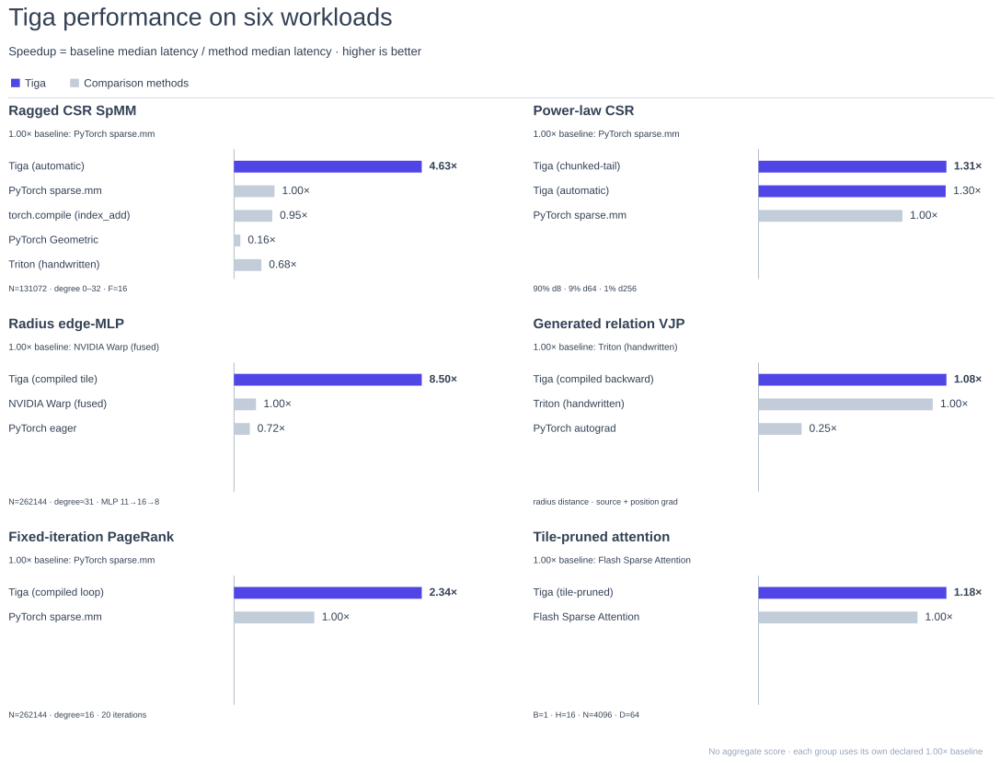

<div align="center">
  
  <p><strong>An MLIR-based compiler for sparse relations, dynamic graphs, reducers, autograd, and heterogeneous execution.</strong></p>
  <p>
    <a href="https://github.com/walkerchi/TIGA-lang/actions/workflows/compiler-ci.yml"></a>
    
    
    <a href="LICENSE"></a>
  </p>
  <p>
    <a href="docs/getting-started.md">Getting started</a> ·
    <a href="docs/programming-model.md">Programming model</a> ·
    <a href="docs/compiler-pipeline.md">Compiler internals</a> ·
    <a href="docs/benchmark-results.md">Benchmark report</a> ·
    <a href="examples/README.md">Examples</a>
  </p>
</div>

Tiga captures **relation + message UDF + reducer** as compiler IR, then
chooses the traversal, load-balancing strategy, fusion boundary, memory plan,
and target lowering. Static CSR, ragged social graphs, runtime radius/kNN
relations, and dense implicit relations use the same call surface. The first
call JIT-compiles a guarded variant; later calls reuse it.

| Program stays visible as | Compiler can decide | Current executable targets |
|---|---|---|
| graph/relation semantics, edge and node UDFs, reducer algebra | row vs edge tiles, degree buckets, hub splitting, build-consume fusion, VJP and halo tasks | LLVM CPU JIT; TTIR → vendor Triton → NVIDIA PTX; versioned provider ABI for additional targets |

Tiga is deliberately a compiler rather than a catalog of attention,
kNN, or GNN kernels. Workload definitions live in `examples/` and performance
peers live in `benchmarks/`; the core package contains reusable IR, passes,
providers, and a Torch-free tensor runtime.

> **Beta software (0.1.x).** The measured paths below are real, but coverage is
> still deliberately narrow. Unsupported target/shape combinations fail closed
> or use an explicit correctness evaluator; they are never presented as
> optimized.

## Performance report

Each group below is one matched workload bucket with its baseline fixed in
[`benchmarks/evidence_manifest.json`](benchmarks/evidence_manifest.json).
The release overview follows a consistent relative-throughput grammar, but it
does not average unrelated workloads into a synthetic score.

<div align="center">
  
</div>

<details>
<summary><strong>Open the complete 13-workload compiler report</strong></summary>
<br>
<div align="center">
  
</div>
</details>

The report is generated from the same registered JSON used by the confidence
gates. Reproduce the per-kernel rooflines and the all-in-one report with:

```bash
python -m benchmarks.common.check_outputs
python -m benchmarks.common.plot_cases
python -m benchmarks.common.plot_collections
```

The [full benchmark report](docs/benchmark-results.md) records raw boundaries,
confidence intervals, cold-JIT time, accuracy checks, and known losses. In
particular, periodic/skew radius rebuild and some high-degree generated paths
are not claimed as SOTA.

## One programming model

```python
import tiga as gf


class WeightedNeighbors(gf.MessagePassing):
    reducer = gf.sum()

    def edge(self, src, dst, edge):
        return edge.weight * (src.x - dst.x)


row_ptr = gf.tensor([0, 2, 3, 5], dtype=gf.int64)
col_idx = gf.tensor([0, 2, 1, 0, 1], dtype=gf.int64)
graph = gf.Graph.from_csr(row_ptr, col_idx, num_src=3)

x = gf.tensor([1.0, 2.0, 4.0], requires_grad=True)
weight = gf.tensor([2.0, 3.0, 4.0, 5.0, 6.0], requires_grad=True)

kernel = WeightedNeighbors()
y = kernel(
    graph=graph,
    src={"x": x},
    dst={"x": x},
    edge={"weight": weight},
)
dx, dw = gf.autograd.grad(y.sum(), (x, weight))

print(kernel.explain())
print(kernel.ir("domain"))
```

There is no required `gf.compile(...)`: calling the `MessagePassing` object is
the JIT boundary. After a compiled call, `kernel.ir(stage)`, `kernel.code(kind)`,
`kernel.schedules`, and `kernel.explain()` expose the selected IR, PTX or other
available artifacts, machine schedule, cache behavior, and compiler remarks.

Reducers use the same compiler surface. Built-ins include additive reduction
and stable online softmax; users may subclass `gf.Reducer` and define
`identity`, `lift`, `combine`, and `finalize`. See
[the custom reducer example](examples/custom_reducer.py).

## Sparse computation is first-class

Sparse computation is not represented as a call to one fixed `spmv()` operator.
The relation, edge UDF, reducer algebra, field roles, index width, and degree
distribution remain visible in `gf.domain` IR. This lets the compiler fuse
`gather → message → reduce → node` and choose a physical traversal after seeing
the actual graph and target.

| Sparse relation | Logical meaning | Possible physical strategy |
|---|---|---|
| Static CSR | Given row pointers and source indices | destination-row tile, edge tile, warp/CTA row, or sparse-library dispatch |
| Ragged / power-law CSR | Highly skewed degree distribution | degree bucketing, split high-degree rows, chunked edge worklists |
| Radius graph | Neighbors selected from positions at runtime | cell-list build, materialized CSR, or generated build-consume fusion |
| Exact kNN | `k` selected sources per destination | ranked candidate tiles + local top-k + hierarchical merge + fused consume |
| Paged `.gfg` relation | Graph exceeds device or host memory | destination-sharded page stream through NVMe/RAM/HBM instances |
| Distributed relation | Sources cross ownership boundaries | compiler-derived halo and an interior/communication/boundary task plan |

```text
relation + fields + edge UDF + reducer
                  │
                  ├─ degree histogram / locality / index-width analysis
                  ├─ reducer algebra and deterministic-order analysis
                  └─ storage ownership and halo analysis
                                   │
                                   ▼
       row tile │ edge tile │ chunked worklist │ generated traversal
                                   │
                                   ▼
             fused gather → message → reduce → node kernel
```

Dynamic sparsity uses the same `MessagePassing` interface; the graph builder is
part of relation semantics rather than an unrelated preprocessing API:

```python
class DistanceWeightedSum(gf.MessagePassing):
    reducer = gf.sum()

    def edge(self, src, dst, edge):
        return edge.distance * src.x


positions = gf.tensor([[0.0, 0.0], [0.3, 0.0], [0.8, 0.0]])
x = gf.tensor([2.0, 3.0, 5.0], requires_grad=True)
radius_graph = gf.Graph.radius(positions, cutoff=0.6)
out = DistanceWeightedSum()(
    graph=radius_graph,
    src={"x": x},
    dst={"x": x},
)
```

Stable online softmax and user-defined associative reducers are also sparse
row reductions, not special attention operators. Their forward state and VJP
remain compiler IR, so a sparse UDF does not require a user-written backward.

### Registered sparse evidence

These RTX 5070 Ti results use matched sparse semantics and timing boundaries.
`>1.00×` means Tiga is faster than the named peer.

| Sparse workload | Registered case | Tiga | Matched peer | Result |
|---|---|---:|---:|---:|
| Scalar CSR weighted sum, random gather | 131,072 rows, degree 4, FP32 | 0.0183 ms | Triton CSR 0.0222 ms | **1.21×** |
| Scalar CSR weighted sum, local/hot | 131,072 rows, degree 16, FP32 | 0.0186 ms | `torch.sparse.mm` 0.0310 ms | **1.67×** |
| Vector CSR SpMM, random/hot | 131,072 rows, degree 16, F=16, i32 | 0.0512 ms | `torch.sparse.mm` 0.2213 ms | **4.32×**, CI-low 4.245 |
| Vector CSR SpMM, random/cold | same topology, F=64 | 0.2684 ms | `torch.sparse.mm` 0.3495 ms | **1.30×**, CI-low 1.288 |
| Ragged vector CSR SpMM, random/hot | 131,072 rows, degree 0–32, F=16, i32 | 0.0548 ms | `torch.sparse.mm` 0.2308 ms | **4.21×**, CI-low 4.153 |
| Social power-law CSR | 90% degree 8 / 9% degree 64 / 1% degree 256; i32 local/random; hot/cold | compiler-generated CDF buckets + chunked tail TTIR | `torch.sparse.mm` | **1.353–1.525×**, CI-low 1.337–1.495; public auto's wider i32/i64 matrix is 8/8 |
| Log-normal social CSR | 131,072 rows; mean 15.70 / p50 7 / p99 137 / max 256; random i32 | compiler-generated chunked-tail TTIR | `torch.sparse.mm` | **1.196× / 1.157×** hot/cold, CI-low 1.186 / 1.138 |
| Exponential-degree CSR | 131,072 rows; mean 16.00 / p50 11 / p99 74 / max 176; random i32 | compiler-generated chunked-tail TTIR | `torch.sparse.mm` | **1.204× / 1.439×** hot/cold, CI-low 1.198 / 1.376 |
| Sparse online-softmax reducer | 131,072 rows, degree 32 | compiler-generated TTIR | hand-written Triton | **1.007×**, CI-low 1.005 |
| Product-reducer backward | 131,072 rows, degree 16 | compiler-generated zero-safe VJP | hand-written Triton | **1.021×**, CI-low 1.016 |
| Fixed-iteration PageRank | N=65,536/262,144, degree 4/16/32, 20 iterations | one fused CSR+node TTIR launch/iteration | matched `torch.sparse.mm` loop | **1.049–2.337×**, CI-low 1.043–2.312 |

The scalar, high-degree scalar, fixed-degree vector, and bounded-ragged vector
rows above are compiler-generated TTIR. Auto still keeps an independently
measured native CSR choice and may select it for a particular locality/cache
regime. Vector shapes beyond the proven degree/feature bounds dispatch
explicitly to an external sparse library and remain labeled as dispatch results.
The [benchmark results](docs/benchmark-results.md) separate sparse consume,
dynamic graph build, build+consume, backward, and cache regimes.

### Benchmark coverage

| Family | Registered workloads | Stress dimensions |
|---|---|---|
| Sparse compute | SpMV/SpMM, diffusion, horizontal fusion, online softmax and product reducers | fixed, bounded-ragged, discrete power-law, log-normal and exponential degree; local/random; hot/cold; i32/i64; scalar/vector |
| Graph operations | radius build/consume/rebuild, periodic and skew boxes, exact kNN build+consume | particle count, dimension, target degree, topology lifecycle |
| Neural workloads | exact/causal/GQA dense attention, tile-pruned sparse attention, linear recurrence, dense matmul | sequence shape, causality, grouped heads, accuracy contract |
| Autograd | edge UDF VJP, reducer VJP, radius-distance VJP | `dx`, `dweight`, feature width, saved/recomputed state |
| Systems | CPU fusion, JIT latency, RAM↔HBM↔NVMe transfer, halo overlap | threads, cold/warm compile, storage tier, interior/boundary ratio |

The matrix is intentionally wider than one fixed-degree kernel, but it is not
complete: real SNAP/OGB graph ingestion, high-degree vector split-row TTIR,
multi-GPU NCCL/RCCL measurements, and non-NVIDIA hardware remain open gates.

## What is implemented

| Area | Current path | Status |
|---|---|---|
| Sparse relations | Static/bounded-ragged CSR and power-law load balancing | Executable and benchmarked |
| Generated sparse relations | Radius and exact kNN build/consume boundaries | Executable; registered coverage is narrow |
| Dense implicit relations | Cartesian and triangular traversal without stored edges | Executable and benchmarked |
| User kernels | Captured edge/node UDF plus built-in or user reducer algebra | Implemented |
| Structured control | `gf_control.repeat/while`, bounded IR and two-buffer CPU execution; class (`gf.control.Repeat/While`), functional and `@gf.jit` AST spellings | Fixed iteration and device-side convergence implemented; multi-state CUDA loop plan pending |
| Autograd | Compiler-derived Tensor and relation VJP; fixed repeat reuses them automatically | Registered UDF/reducer families implemented; reverse control-loop optimization pending |
| NVIDIA GPU | `gf.domain → gf.iter → gf.kernel → TTIR → vendor Triton → PTX/cubin` | Executable and benchmarked |
| CPU | `gf_tensor → Vector/SCF/MemRef → LLVM → ExecutionEngine` | Executable and benchmarked |
| Memory hierarchy | Logical regions, physical HBM/RAM/NVMe instances, async transfer/event DAG | Executable single-node paths |
| Distributed | `Graph.halo()` ownership/ghost planning, pack/exchange/unpack, automatic interior/halo/boundary execution | CPU overlap measured; CUDA device-direct dual-stream order exercised; multi-GPU NCCL/RCCL measurement pending |
| ROCm / Hygon / Metal / PPU | Versioned provider ABI and conformance contract | Plugin and real-hardware validation required |
| Torch | Optional zero-copy/framework adapter | Compatible, never a core dependency |

Tiga is a compiler, not an attention, kNN, or visualization operator
library. Workload programs and hand-written comparison kernels live in
`examples/` and `benchmarks/`; no `@triton.jit` workload kernel is imported by
the core package.

## Dense and generated comparison

Registered results below were measured on the repository's RTX 5070 Ti host.
Each row compares matched semantics, dtype, shape, and timing boundary. A value
above `1.00×` means Tiga was faster; the full page records confidence
gates and limitations.

| Workload | Registered case | Tiga | Matched peer | Speedup |
|---|---|---:|---:|---:|
| Dense exact attention | B1/H16/N4096/D64 FP16 | 0.7720 ms | PyTorch Flash SDPA 0.8288 ms | **1.074×** |
| Dense grouped-query attention | Hq16/Hkv4/N4096/D64 FP16 | 0.7769 ms | PyTorch Flash SDPA 0.8424 ms | **1.084×** |
| Tile-pruned sparse attention | B1/H16/N4096/D64 FP16 | 0.9073 ms | official FSA 1.0724 ms | **1.182×** |
| Causal linear recurrence | L64/T512/K16/V16 FP32 | 0.1056 ms | official FLA 0.1095 ms | **1.037×** |
| Exact kNN build + consume | N8192/D3/k32 FP32 | 2.9498 ms | cdist/top-k pipeline 3.9155 ms | **1.327× · CI low 1.326** |
| Dense matmul | 2048³ FP16 | 89.29 TFLOP/s | torch.mm/cuBLAS 88.86 TFLOP/s | **1.005×** |
| GPU heatmap preparation | 2048² FP32→RGB | 0.0996 ms | Inductor 0.1148 ms | **1.153×** |

These are registered buckets, not universal claims. Exact dense attention,
linear attention, sparse attention, relation build, and relation consume have
different mathematical work and are never placed under one misleading speedup
claim. Read the [benchmark results](docs/benchmark-results.md) for the complete
comparison tables, and the [methodology](docs/performance.md) for raw-artifact
layout, roofline definitions, and reproduction commands.

## Compiler architecture

```text
Python MessagePassing / Tensor program
                  │ capture + specialize
                  ▼
    gf.domain ─ relation, UDF regions, reducer algebra
                  │ fusion, effects, ownership, autograd
                  ▼
    gf.iter   ─ dense / sparse / generated traversal
                  │ tiling, work partition, load balance
                  ▼
    gf.kernel ─ provider-neutral machine schedule
          ┌───────┴────────┐
          ▼                ▼
 serialized TTIR      Vector/SCF/MemRef
          │                │
 vendor GPU stack         LLVM
          │                │
     PTX / binary        CPU JIT

 gf.storage + gf.task preserve physical instances, transfers,
 versions, halo communication, and overlap as an event DAG.
```

Keeping `gf.domain`, `gf.iter`, and `gf.kernel` separate retains graph and
reducer structure long enough to choose CSR row tiling, dense tensor-core
streaming, generated-neighborhood fusion, or distributed interior/boundary
splitting before committing to a vendor layout.

## Run it

The PyPI distribution name is `tiga-lang`:

```bash
pip install tiga-lang   # PyPI's bare "tiga" is unrelated

python examples/message_passing_autograd.py
python examples/custom_reducer.py
python examples/radius_autograd.py
python examples/torch_interop.py  # optional adapter
```

Building the native compiler from source requires the pinned LLVM/MLIR 22.1.8
SDK:

```bash
cmake -S . -B build -G Ninja \
  -DMLIR_DIR=/path/to/llvm-22.1.8/lib/cmake/mlir
cmake --build build --target check-tiga
```

## Documentation

| Read this | For |
|---|---|
| [Getting started](docs/getting-started.md) | Installation, first JIT call, artifact inspection |
| [Programming model](docs/programming-model.md) | Graphs, MessagePassing, generated relations, reducers |
| [Compiler pipeline](docs/compiler-pipeline.md) | Domain/iteration/kernel IR and lowering |
| [Tensor runtime & autograd](docs/runtime-and-autograd.md) | Torch-free Tensor, views, complex dtypes, VJP |
| [Memory & distributed](docs/memory-and-distributed.md) | HBM/RAM/NVMe placement and `Graph.halo()` |
| [Examples](examples/README.md) | Runnable programs grouped by capability |
| [Benchmark results](docs/benchmark-results.md) | Human-readable comparisons and current limits |
| [Project specification](PROJECT.md) | Design contract, milestones, and remaining gates |

Tiga is licensed under Apache-2.0.
