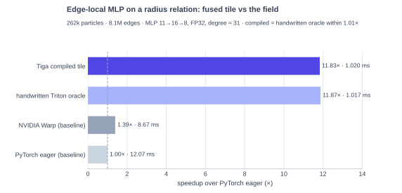
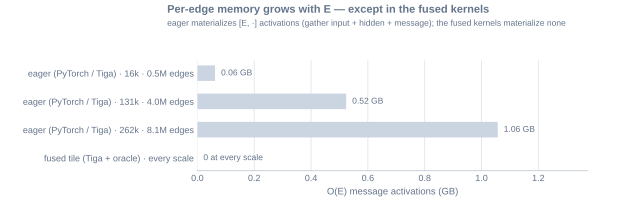
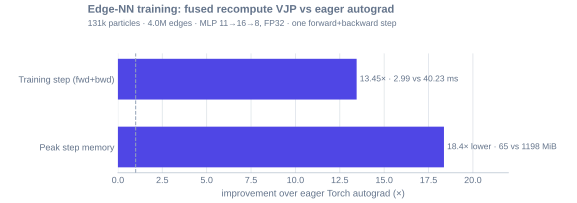
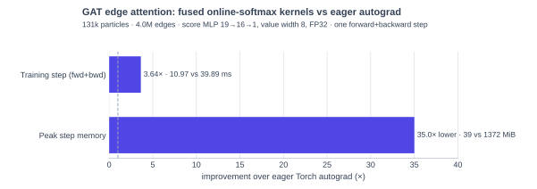
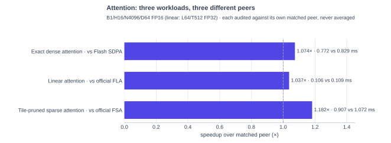
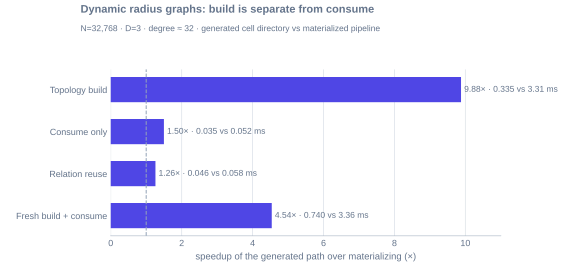
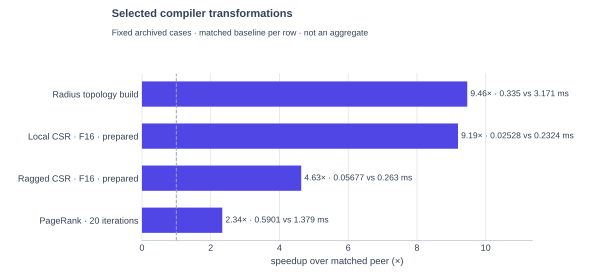
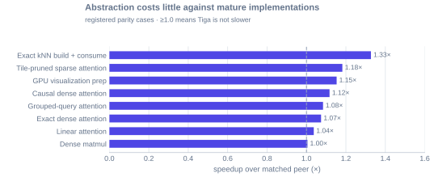
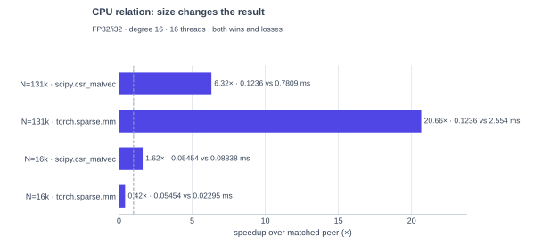
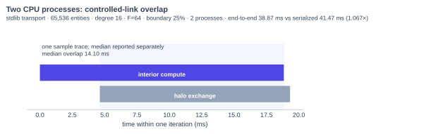

# Benchmark results

Every result on this page answers three questions: what problem was computed,
what equivalent implementation was the peer, and how narrow is the claim.
The page splits by device because **the peer set is different per device**:
GPU results face cuSPARSE, handwritten Triton/Warp kernels and the official
Flash/FLA/FSA attention implementations, while CPU results face SciPy, Torch
CPU sparse and the runtime's own serialized schedule — the two fields are
never mixed into one chart. The full evidence matrix lives in the case
artifacts and the [full matrix](#the-full-matrix) below.

!!! note "Snapshot"

    GPU results are from the repository's NVIDIA RTX 5070 Ti environment; CPU
    results are from its paired host CPU (16 threads). They are registered
    case results, not projections to other devices or shapes. Raw
    JSON/SVG/HTML artifacts are generated under
    `output/roofline/<operation>/<case>/` and intentionally remain out of Git.

## GPU

Measured on the RTX 5070 Ti. Peers: `torch.sparse.mm` (cuSPARSE),
handwritten Triton and NVIDIA Warp kernels, and the official Flash SDPA /
FLA / FSA attention implementations.

=== "Sparse"

    **The problem.** The inner loop of every GCN, diffusion step and graph
    kernel: one weighted sum over each node's in-edges.

    $$
    \text{out}[i, f] \;=\; \sum_{e\,=\,(j \to i)} w_e \cdot x[j, f]
    $$

    The graph is a CSR relation with 131,072 rows and mean degree 16; what
    makes the problem hard is degree skew — the slices below run from regular
    degrees to irregular (0–32), power-law, log-normal and exponential
    neighborhoods. The peer is `torch.sparse.mm` (cuSPARSE) on identical FP32
    semantics.

    <object class="gf-chart" type="image/svg+xml" data="/assets/results/sparse-relations.svg" aria-label="Compiler tile speedups vs torch.sparse.mm across relation families">
      
    </object>

    Each row is the same formula evaluated on a different graph slice —
    hover a row for its exact definition. Compiler-generated
    row×neighbor×feature tiles beat the sparse library across every
    registered topology — up to **4.32×** on fixed-degree F16
    vectors, and 1.2–1.5× even on heavily skewed social-graph slices where
    load balancing, not tiling, dominates.

    Registered cases: [↓ full matrix](#matrix-weighted_aggregation)

    ??? info "Benchmark source — `sparse_compute/weighted_aggregation.py`"

        ```bash
        python -m benchmarks.sparse_compute.weighted_aggregation --quick
        ```

        ```python
        --8<-- "benchmarks/sparse_compute/weighted_aggregation.py"
        ```

=== "Edge-NN"

    **The problem.** A PointNet++-style message where a small MLP reads the
    edge itself — the per-edge work cannot be hoisted into a node-wise
    precompute, and materializing `[E, ·]` messages explodes memory with the
    edge count:

    $$
    \text{message}_e \;=\; \mathrm{MLP}\big(\,\text{pos}_j - \text{pos}_i \,\|\, x_j\,\big),
    \qquad
    \text{out}[i] \;=\; \sum_{e\,=\,(j \to i),\; \|\text{pos}_j - \text{pos}_i\| \le r} \text{message}_e
    $$

    The only way out is a fused tile kernel in which messages exist only
    inside a tile. Tiga captures the MLP with `gf.nn.trace` and emits
    that kernel; the peers are a handwritten Triton oracle with the same
    tiling, a handwritten NVIDIA Warp scalar kernel, and the eager
    gather → MLP → `index_add` fallback (MLP 11→16→8, FP32, degree ≈ 31; all
    cross-checked against the eager oracle, max abs error ≤ 5e-5).

    

    One workload, four implementations of it — the provider names mean:

    - `tiga-compiled-tile` — the edge UDF's MLP captured by
      `gf.nn.trace` and compiled by Tiga into the fused tile kernel;
    - `triton-fused-tile` — a handwritten `@triton.jit` oracle with the same
      tiling, the performance reference;
    - `warp-fused` — a handwritten NVIDIA Warp scalar kernel (hash grid +
      in-kernel MLP);
    - `tiga-eager` — the same UDF on the eager fallback, which is what
      any uncapturable UDF gets today.

    The compiled kernel matches the handwritten oracle within 1.00–1.04× and
    is **8.5×** faster than the NVIDIA Warp baseline and **11.8×** faster
    than the PyTorch eager baseline, with zero per-edge activation memory.

    Registered cases: [↓ full matrix](#matrix-radius_edge_mlp)

    **Why is Warp only 1.4×?** Fusion alone is not enough. The Warp kernel
    eliminates all O(E) traffic but evaluates the MLP with scalar FMAs —
    ~800 instructions per edge, about 1.3% of the GPU's fp32 peak — so it is
    issue-bound, not memory-bound, and its advantage grows only with scale
    (0.89× at 16k particles → 1.30× at 131k → 1.39× at 262k). PyTorch eager
    wastes memory but its cuBLAS GEMMs are instruction-efficient. The tile
    kernel is the point where both are fixed at once — `tl.dot` restores the
    instruction economics *and* nothing per-edge leaves the tile — which is
    where the 11.8× comes from.

    

    **Training is fused too.** A grad-mode call runs the same tile forward
    under an autograd bridge; the backward is a symbolic-VJP recompute tile
    kernel — per-edge activations are replayed inside the tile, weight
    gradients accumulated as tile outer products, so no [E, ·] tensor exists
    in either direction:

    $$
    \mathrm{d}W_l \mathrel{+}= a_{l-1}^{\top}\, \mathrm{d}h_l,
    \qquad
    \mathrm{d}a_{l-1} = \mathrm{d}h_l\, W_l,
    \qquad
    \mathrm{d}\,\text{message}_e = \mathrm{d}\,\text{out}[\text{dst}(e)]
    $$

    

    One forward+backward step at 131k particles / 4.0M edges runs **13.45×**
    faster than eager Torch autograd with **18.4×** lower peak memory
    (65 MiB vs 1.2 GiB) — eager saves [E, ·] gathers, hidden activations and
    messages for its backward; the recompute VJP saves only the O(N) inputs.

    Registered cases: [↓ full matrix](#matrix-edge_nn_backward)

    ??? info "Benchmark source — `autograd/edge_nn_backward.py`"

        ```bash
        python -m benchmarks.autograd.edge_nn_backward --quick
        ```

        ```python
        --8<-- "benchmarks/autograd/edge_nn_backward.py"
        ```

    ??? info "Benchmark source — `neural_networks/radius_edge_mlp.py`"

        Run it with `python -m benchmarks.neural_networks.radius_edge_mlp
        --quick`. The core of each implementation, side by side:

        === "Tiga"

            The UDF is ordinary Python; `gf.nn.trace` makes the MLP visible
            to the compiler, which emits the fused tile kernel.

            ```python
            --8<-- "benchmarks/neural_networks/radius_edge_mlp.py:tiga"
            ```

        === "Torch eager (baseline)"

            The same math by hand: gather per edge → MLP on `[E, ·]` →
            `index_add`. Every intermediate is materialized.

            ```python
            --8<-- "benchmarks/neural_networks/radius_edge_mlp.py:torch"
            ```

        === "NVIDIA Warp (baseline)"

            Handwritten fused kernel: hash-grid neighbor query, in-kernel
            MLP, per-thread accumulators — nothing per-edge hits memory.

            ```python
            --8<-- "benchmarks/neural_networks/radius_edge_mlp.py:warp"
            ```

        === "Triton tile (oracle)"

            The shape the compiler targets: one 128-edge block per program,
            both MLP layers as `tl.dot`, masked atomic segment-add.

            ```python
            --8<-- "benchmarks/neural_networks/radius_edge_mlp.py:triton"
            ```

    **GAT-style attention: nn scores with `gf.online_softmax()`.** The same
    edge nn chain also fuses into attention — the reducer just changes:

    $$
    s_e \;=\; \mathrm{MLP}\big(\,\text{pos}_j - \text{pos}_i \,\|\, x_j \,\|\, x_i\,\big),
    \qquad
    \text{out}[i] \;=\; \sum_{e\,=\,(j \to i)} \mathrm{softmax}_e(s)\, x_j
    $$

    Softmax couples the edges of one destination row, so the additive atomic
    tile cannot express it. Tiga switches to a **row-centric** kernel:
    one program owns one CSR row, streams its edges in chunks, evaluates the
    score network in registers and carries the online-softmax state
    $(m, l, \text{acc})$ in `scf.for` iter_args — FlashAttention's rescaling,
    on graph edges. Training is fused too: the forward persists only the
    per-row $(m, l)$, and the backward replays the score chain per chunk and
    applies the softmax Jacobian adjoint in-tile,
    $\mathrm{d}s_e = w_e\,(\langle \mathrm{d}\,\text{out}_i, v_e \rangle -
    \langle \mathrm{d}\,\text{out}_i, \text{out}_i \rangle)$, streaming
    gradients to fields, positions and weights.

    

    One forward+backward step at 131k particles / 4.0M edges runs **3.6×**
    faster than eager Torch autograd with **35×** lower peak memory (39 MiB
    vs 1.4 GiB — eager materializes [E] scores, [E] weights and [E, F]
    weighted messages; the fused kernels keep only O(N) state).

    ??? info "Benchmark source — `neural_networks/gat_attention.py`"

        ```bash
        python -m benchmarks.neural_networks.gat_attention --quick
        ```

        ```python
        --8<-- "benchmarks/neural_networks/gat_attention.py"
        ```

=== "Attention"

    **The problem.** Three workloads that share compiler machinery but not a
    mathematical program — they are never averaged into one "attention
    speedup":

    - exact dense attention, $\;\text{softmax}(QK^{\top}/\sqrt{d} + M)\,V$;
    - linear attention as an unnormalized causal recurrence;
    - tile-pruned sparse attention with a semantic admission threshold.

    

    Each is audited against its own matched peer at B1/H16/N4096/D64 FP16
    (linear: L64/T512 FP32): **1.074×** vs exact Flash SDPA, **1.037×** vs
    the official FLA recurrence, **1.182×** vs the official FSA kernel with
    the same pruning threshold (accuracy against exact attention reported
    separately).

    Registered cases: [↓ dense_attention](#matrix-dense_attention) · [↓ linear_attention](#matrix-linear_attention) · [↓ sparse_attention](#matrix-sparse_attention)

    ??? info "Benchmark source — `neural_networks/dense_attention.py`"

        ```bash
        python -m benchmarks.neural_networks.dense_attention --quick
        ```

        ```python
        --8<-- "benchmarks/neural_networks/dense_attention.py"
        ```

    ??? info "Benchmark source — `neural_networks/linear_attention.py`"

        ```bash
        python -m benchmarks.neural_networks.linear_attention --quick
        ```

        ```python
        --8<-- "benchmarks/neural_networks/linear_attention.py"
        ```

    ??? info "Benchmark source — `neural_networks/sparse_attention.py`"

        ```bash
        python -m benchmarks.neural_networks.sparse_attention --quick
        ```

        ```python
        --8<-- "benchmarks/neural_networks/sparse_attention.py"
        ```

=== "Reducers & VJP"

    **The problem.** Two generated-reducer workloads on the same CSR
    relation: an online softmax that keeps only running max/denominator/
    numerator state per row,

    $$
    \text{out}[i] \;=\; \frac{\sum_{e=(j \to i)} e^{s_e - m_i}\, v_e}
    {\sum_{e=(j \to i)} e^{s_e - m_i}},
    \qquad m_i = \max_{e=(j \to i)} s_e
    $$

    and the reverse-mode VJP of a product reducer — both written as reducer
    algebra, both compiled, never hand-derived.

    The compiler's stable-tuple-state online softmax runs **1.007×** vs a
    matched hand-written Triton kernel; the zero-safe generated product VJP
    runs **1.021×**; and the radius-geometry backward (gradients through
    `edge.distance` itself) runs **1.079×** vs matched Triton — **4.36×**
    vs Torch autograd.

    Registered cases: [↓ online_softmax](#matrix-online_softmax) · [↓ message_passing_backward](#matrix-message_passing_backward)

    ??? info "Benchmark source — `neural_networks/online_softmax.py`"

        ```bash
        python -m benchmarks.neural_networks.online_softmax --quick
        ```

        ```python
        --8<-- "benchmarks/neural_networks/online_softmax.py"
        ```

    ??? info "Benchmark source — `autograd/message_passing_backward.py`"

        ```bash
        python -m benchmarks.autograd.message_passing_backward --quick
        ```

        ```python
        --8<-- "benchmarks/autograd/message_passing_backward.py"
        ```

=== "Radius graphs"

    **The problem.** The relation itself is computed from geometry and
    changes with it — neighbors are pairs within a cutoff, messages weighted
    by distance:

    $$
    E \;=\; \{\, (j \to i) : \|\text{pos}_j - \text{pos}_i\| \le r \,\},
    \qquad
    \text{out}[i] \;=\; \sum_{(j \to i) \in E} \|\text{pos}_j - \text{pos}_i\| \cdot x_j
    $$

    Reporting separates **building** the relation from **consuming** it: the
    generated cell directory (0.335 ms) replaces materialized CSR
    construction (3.31 ms), and a fresh positions-to-output pass (0.740 ms)
    keeps geometry, distance and reduction fused end to end — 4.5× faster
    than materialize-then-`torch.sparse.mm` (3.36 ms) at N=32,768,
    degree ≈ 32.

    

    The registered 24-case 2D/3D matrix also covers periodic box and
    skew-cell rebuild with minimum-image filtering fused in-kernel. This
    result is not extrapolated to custom unbounded metrics, non-uniform
    occupancy or a different particle distribution; the
    [dynamic graph strategies](dynamic-graphs.md) page explains when the
    compiler chooses each realization.

    Registered cases: [↓ radius_distance_aggregation](#matrix-radius_distance_aggregation) · [↓ radius_graph_build](#matrix-radius_graph_build) · [↓ knn_graph](#matrix-knn_graph)

    ??? info "Benchmark source"
        === "`graph_operations/radius_pipeline.py`"

            ```bash
            python -m benchmarks.graph_operations.radius_pipeline --quick
            ```

            ```python
            --8<-- "benchmarks/graph_operations/radius_pipeline.py"
            ```

## Across the compiler

Two summary views over the same registered GPU evidence. First, where
retaining relation structure lets the compiler change the execution plan
(not merely dispatch the same dense primitive):



Second, what the abstraction costs against mature specialized
implementations — coverage/parity evidence, not the reason to use the
compiler:



Registered cases: [↓ pagerank](#matrix-pagerank) · [↓ dense_matmul_calibration](#matrix-dense_matmul_calibration) · [↓ horizontal_fusion](#matrix-horizontal_fusion) · [↓ visualization_heatmap](#matrix-visualization_heatmap)

??? info "Benchmark source — `graph_algorithms/pagerank.py`"

    ```bash
    python -m benchmarks.graph_algorithms.pagerank --quick
    ```

    ```python
    --8<-- "benchmarks/graph_algorithms/pagerank.py"
    ```

??? info "Benchmark source — `graph_operations/knn_build.py`"

    ```bash
    python -m benchmarks.graph_operations.knn_build --quick
    ```

    ```python
    --8<-- "benchmarks/graph_operations/knn_build.py"
    ```

??? info "Benchmark source — `neural_networks/dense_matmul.py`"

    ```bash
    python -m benchmarks.neural_networks.dense_matmul --quick
    ```

    ```python
    --8<-- "benchmarks/neural_networks/dense_matmul.py"
    ```

??? info "Benchmark source — `visualization/heatmap.py`"

    ```bash
    python -m benchmarks.visualization.heatmap --quick
    ```

    ```python
    --8<-- "benchmarks/visualization/heatmap.py"
    ```

## CPU

Measured on the paired host CPU (16 threads). Peers here are a different
field: SciPy's `csr_matvec`, `torch.sparse.mm` on CPU, and the runtime's own
forced-serialized schedule — none of them appear in the GPU charts above.

=== "Sparse relation"

    **The problem.** The same weighted CSR SpMV as the GPU sparse tab —

    $$
    \text{out}[i] \;=\; \sum_{e\,=\,(j \to i)} w_e \cdot x[j]
    $$

    — but the host baseline field is different: SciPy's `csr_matvec` and
    `torch.sparse.mm` on CPU. The compiler lowers the traversal to one fused
    16-thread LLVM loop: relation walk, weight fetch and reduction in a
    single pass, no materialized message buffer.

    

    At N=131,072 (degree 16, FP32, hot cache) the generated loop runs
    0.124 ms — **6.32×** over `scipy.csr_matvec` (95% CI low 5.54) and
    **20.66×** over Torch CPU sparse. The narrow end is stated too: at
    N=16,384 the runtime's fixed overhead dominates the 23 µs Torch call
    (**0.42×**), while SciPy is still 1.62× behind. The claim is large-N
    streaming, not per-call latency at toy sizes.

    Registered cases: [↓ cpu_relation](#matrix-cpu_relation) · [↓ cpu_pointwise_fusion](#matrix-cpu_pointwise_fusion)

    ??? info "Benchmark source — `sparse_compute/cpu_relation.py`"

        ```bash
        python -m benchmarks.sparse_compute.cpu_relation --quick
        ```

        ```python
        --8<-- "benchmarks/sparse_compute/cpu_relation.py"
        ```

=== "Distributed"

    **The problem.** One message-passing step across two processes: each
    rank owns half the nodes, needs its neighbors' ghost layers, and should
    hide the halo exchange behind interior compute instead of serializing it.

    

    Two real CPU processes on the public `Graph.halo()` path, 65,536
    entities, degree 16, feature width 64, 25% boundary, and an explicit
    5 ms receive-delay model: the automatic `interior ∥ halo → boundary`
    schedule hides a median 14.10 ms of communication, finishing at
    38.87 ms vs 41.47 ms forced serialized (**1.067×**). Evidence for
    scheduler ordering under a controlled link model — not an inter-node or
    NCCL measurement.

    ??? info "Benchmark source"
        === "`distributed/automatic_overlap.py`"

            ```bash
            python -m benchmarks.distributed.automatic_overlap --quick
            ```

            ```python
            --8<-- "benchmarks/distributed/automatic_overlap.py"
            ```

## Reproduce and inspect

Every formal case writes raw samples, median, bootstrap confidence interval,
device/software metadata, arithmetic-intensity model, roof ceilings, and
SVG-first plots with PNG fallbacks. The [performance
methodology](performance.md) defines the common artifact layout and the
reproduction commands; the [benchmark suite](benchmark-suite.md) page lists
every entry point.

## The full matrix { #the-full-matrix }

Generated from `benchmarks/evidence_manifest.json` and the measured case
artifacts under `output/roofline/` by
`python -m benchmarks.common.full_matrix` — every row is one registered
gate, or, for cases without registered gates, one measured provider against
the best non-Tiga peer.

--8<-- "docs/includes/full-matrix.md"

## What is not yet claimed

- performance portability to ROCm/Hygon, Metal, or PPU before real provider
  plugins and hardware artifacts exist;
- radius-build SOTA for non-uniform distributions or custom unbounded metrics;
- exact kNN performance outside N8192/D3/k32;
- multi-GPU NCCL overlap or throughput from a one-GPU binding test;
- universal sparse performance from one degree distribution or feature width.
