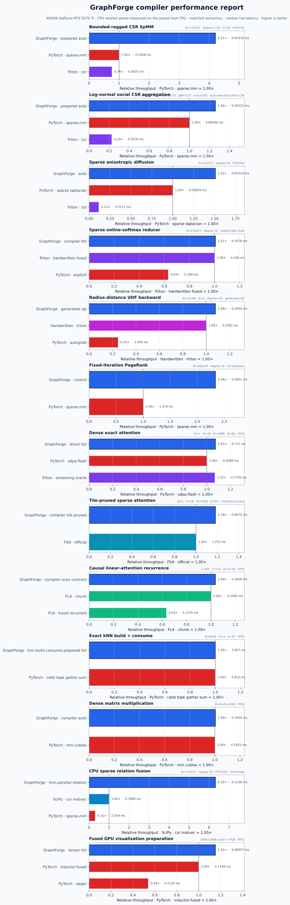
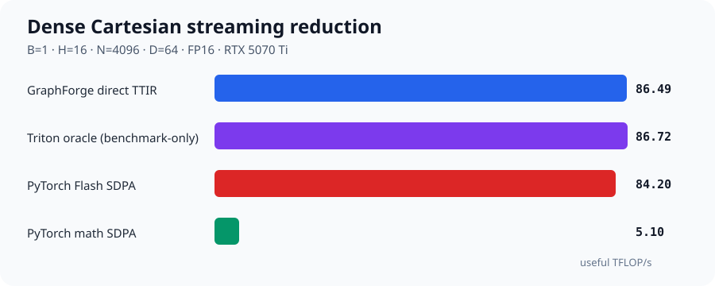

# Benchmark results

This page is the human-readable index of GraphForge's registered performance
evidence. It answers three questions for each result: what program was compiled,
what equivalent implementation was used as the peer, and how narrow is the
claim?

!!! note "Snapshot"

    GPU results are from the repository's NVIDIA RTX 5070 Ti environment. They
    are registered case results, not projections to other devices or shapes.
    Raw JSON/SVG/HTML/REPORT artifacts are generated under
    `output/roofline/<operation>/<case>/` and intentionally remain out of Git.

<figure class="gf-figure gf-figure--chart">
  <iframe src="assets/charts/compiler-performance-report.html" title="Interactive registered GraphForge compiler performance report" loading="lazy"></iframe>
  <noscript></noscript>
  <figcaption>Select any registered workload from the Plotly dropdown · <a href="assets/compiler-performance-report.svg">SVG fallback</a> · each panel uses its predeclared matched baseline.</figcaption>
</figure>

## Compiler transformations

For latency rows, speedup is `peer latency / GraphForge latency`. For throughput
rows, it is `GraphForge throughput / peer throughput`. Higher is better. The
headline table contains cases where retained relation structure enables a
different execution plan—not cases that merely dispatch the same mature dense
primitive.

| Transformation | Program submitted to GraphForge | Registered case | Removed or changed work | Speedup / gate |
|---|---|---|---|---:|
| Generated radius build + consume | radius relation + distance UDF + sum | N32768/D3/degree≈32 | CSR, distance and message materialization; modeled peak bytes ↓7.03× | **4.425×**, CI low 4.397 vs materialized pipeline |
| Periodic generated radius rebuild | same program with box/skew minimum image | 2D/3D, N32768, degree≈32 | wrapped candidates are generated and consumed in-kernel | **3.861–6.064×**, CI low 3.769–5.909 across registered rebuild cases |
| Fixed vector CSR traversal | weighted vector message + sum | N131072/degree16/F16/i32 random/hot | row × neighbor × feature tiling instead of generic sparse-library path | **4.322×**, CI low 4.245 vs `torch.sparse.mm` |
| Bounded-ragged vector traversal | same UDF, degree 0–32 | N131072/F16/i32 random/hot | masked bounded row tiles | **4.213×**, CI low 4.153 vs `torch.sparse.mm` |
| CPU fused relation loop | gather + edge UDF + CSR reduce | N131072/degree16/i32 random/hot | intermediate tensors and library boundary | **6.318×**, CI low 5.540 vs fastest installed provider-native CSR peer |
| Fixed-iteration PageRank | `gf_control.repeat` around CSR message + node update | N262144/degree32/20 iterations | fused CSR+node launch and persistent two-buffer plan | up to **2.337×**, CI low 2.312 vs matched `torch.sparse.mm` recurrence |

These numbers are deliberately not averaged into one cross-workload geomean:
radius construction, SpMM and PageRank have different semantic work. The chart
shows the registered high-water case for each transformation, and the tables
below retain the full matrix and confidence bounds.

## Mature primitive parity

The following results demonstrate that the abstraction need not lose much to a
mature specialized implementation. They are coverage/parity evidence, not the
main reason to use the compiler.

| Family | Registered case | GraphForge | Fastest matched peer | Result |
|---|---|---:|---:|---:|
| Exact dense attention | B1/H16/N4096/D64 FP16 | 0.7720 ms | Flash SDPA 0.8288 ms | **1.074×**, CI low 1.069 |
| Causal dense attention | same shape | 0.4459 ms | causal Flash SDPA | **1.117×**, CI low 1.100 |
| Grouped-query attention | Hq16/Hkv4/N4096/D64 FP16 | 0.7769 ms | Flash SDPA 0.8424 ms | **1.084×**, CI low 1.078 |
| Tile-pruned sparse attention | B1/H16/N4096/D64 FP16 | 0.9073 ms | official FSA 1.0724 ms | **1.182×**, CI low 1.177 |
| Linear attention | L64/T512/K16/V16 FP32 | 0.1056 ms | official FLA 0.1095 ms | **1.037×**, CI low 1.025 |
| Exact kNN build + consume | N8192/D3/k32 FP32 | 3.9076 ms | cdist/top-k/gather 3.9110 ms | **1.0009×**, CI low 1.0003; parity only |
| Dense matmul | 2048³ FP16 | 89.29 TFLOP/s | torch.mm/cuBLAS 88.86 TFLOP/s | **1.005×**, CI low 1.004 |
| GPU visualization prep | 2048² FP32 | 0.0996 ms | Inductor 0.1148 ms | **1.153×**, CI low 1.140 |

Exact kNN is the clearest unfinished performance path. It still dispatches an
exhaustive cdist/top-k build and only compiles the selected-relation consumer,
so the measured result is parity rather than an algorithmic win. The next
general compiler mechanism is a partitioned
ranked relation: candidate tiles → local top-k → hierarchical merge → fused
selected-edge consume. Cache-reuse timing is not accepted as rebuild timing.

<figure class="gf-figure">
  <object type="image/svg+xml" data="assets/dense-attention-performance.svg" aria-label="Dense Cartesian streaming comparison">
    
  </object>
  <figcaption>Exact, grouped-query and causal dense relation cases. Sparse and linear attention remain separate semantics.</figcaption>
</figure>

## Sparse relations and reducers

| Workload | Registered topology | GraphForge evidence | Comparison |
|---|---|---|---|
| Scalar CSR weighted sum | 131,072 rows, random source, degree 4/16/64, FP32 | compiler-generated TTIR | 0.824×/0.899×/0.990× GraphForge-to-Triton latency ratio; GraphForge is faster in each bucket |
| Regular local CSR | 131,072 rows, degree 16, scalar FP32 | auto-selected generated/native path | 0.0186 ms vs `torch.sparse.mm` 0.0310 ms, **1.67×** |
| Regular random vector CSR | 131,072 rows, degree 16, F=16, i32, hot/cold | compiler-generated row-neighbor-feature TTIR | **4.322×/3.801×** vs `torch.sparse.mm`; CI low 4.245/3.759 |
| Regular random vector CSR | same topology, F=64, hot/cold | compiler-generated row-neighbor-feature TTIR | **1.966×/1.302×** vs `torch.sparse.mm`; CI low 1.956/1.288 |
| Irregular random vector CSR | 131,072 rows, degree 0–32, F=16, i32, hot/cold | compiler-generated bounded-ragged row-neighbor-feature TTIR | **4.213×/3.270×** vs `torch.sparse.mm`; CI low 4.153/3.230 |
| Irregular random vector CSR | same topology, F=64, hot/cold | compiler-generated bounded-ragged row-neighbor-feature TTIR | **1.595×/1.283×** vs `torch.sparse.mm`; CI low 1.584/1.270 |
| Power-law social slice | 90% degree 8, 9% degree 64, 1% degree 256; i32 local/random; hot/cold | compiler-generated CDF buckets + chunked-tail TTIR | **1.353–1.525×** vs `torch.sparse.mm`; CI low 1.337–1.495; public auto's i32/i64 matrix is 8/8 |
| Log-normal social slice | mean 15.70, p50 7, p95 58, p99 137, max 256; 1.60% zero-degree; random i32 | compiler-generated chunked-tail TTIR | hot/cold **1.196×/1.157×** vs `torch.sparse.mm`; CI low 1.186/1.138 |
| Exponential-degree slice | mean 16.00, p50 11, p95 48, p99 74, max 176; 3.09% zero-degree; random i32 | compiler-generated chunked-tail TTIR | hot/cold **1.204×/1.439×** vs `torch.sparse.mm`; CI low 1.198/1.376 |
| Online-softmax reducer | 131,072 rows, degree 32 | compiler schedule, stable tuple state | **1.007×**, CI low 1.005 vs matched hand-written Triton |
| Product reducer backward | 131,072 rows, degree 16 | zero-safe compiler-generated VJP | **1.021×**, CI low 1.016 vs matched hand-written Triton |
| Radius distance backward | fixed selected snapshot, N32768/D3/degree≈32 | generated geometry VJP | **1.079×**, CI low 1.073 vs matched hand-written Triton; 4.36× vs Torch autograd |
| Fixed-iteration PageRank | N65536/262144, degree 4/16/32, 20 iterations | one `gf_control.repeat`, two device buffers, one fused CSR+node TTIR launch/iteration | **1.049–2.337×** vs the same `torch.sparse.mm` recurrence; CI-low 1.043–2.312 |

Fixed-degree and bounded-ragged vector CSR use compiler-generated TTIR in the
registered rows above. Shapes beyond the proven bounds that dispatch to an
external sparse library are labeled as dispatch results. A correctness
evaluator is never included in a “fastest backend” conclusion.

The log-normal and exponential cases are continuous seeded generators, not
renamed fixed-degree inputs. Each result stores degree min/mean/p50/p95/p99/max,
zero-degree fraction, and coefficient of variation. Both now execute and gate
the compiler-emitted CDF-bucket/chunked-tail TTIR in addition to the public auto
choice; auto may still retain native CSR when its warm autotune is faster.

## Dynamic graph boundaries

Dynamic graph reporting separates topology build from relation consume:

| Boundary | Included work | Why it is separate |
|---|---|---|
| Build-only | broad phase, candidate filtering, exact neighbor selection, relation output | measures the graph constructor |
| Consume-only | a fixed relation snapshot and user message/reducer | measures generated relation traversal |
| Build + consume | positions-to-output end to end | the fair number for changing geometry |
| Rebind/reuse | reuse of a proven-valid topology snapshot | valid only when positions/topology version permits it |

The registered Euclidean radius pipeline uses a generated cell directory
rather than an `N×N` distance matrix. Its 24-case 2D/3D matrix separates
non-periodic, periodic box and skew-cell consume/reuse/rebind/rebuild. All
registered gates pass; periodic rebuild ranges from 3.861× to 6.064× because
minimum-image filtering and the user reduction stay fused instead of emitting
CSR, distance and message arrays. This result is not extrapolated to custom
unbounded metrics, non-uniform occupancy or a different particle distribution.

The [dynamic graph strategies](dynamic-graphs.md) page explains when the
compiler chooses implicit tiles, spatial generation, incremental snapshots,
ranked selection, or paged/distributed traversal.

## Attention comparisons are not interchangeable

Exact Flash SDPA, causal recurrence/FLA, and tile-pruned FSA solve different
mathematical programs. They share compiler mechanisms—relations, scans, online
reducers, and conditional tiles—but not a common FLOP count or accuracy
contract. Consequently:

- exact dense and causal dense results are audited against exact Flash SDPA;
- linear recurrence is audited against the same unnormalized causal recurrence;
- sparse attention uses the same pruning threshold as its FSA peer and reports
  error against exact attention separately;
- these rows are never combined into a single “attention speedup” geomean.

## Distributed automatic overlap

The CPU runtime benchmark uses two real processes and the public
`Graph.halo()` MessagePassing path. For 65,536 entities, degree 16, feature
width 64 and a 25% boundary, an explicit 5 ms receive-delay model produced
13.7224 ms median measured communication/interior overlap. Automatic execution
was 38.2262 ms versus 40.8632 ms forced-serialized, or **1.069×**. The artifact
contains per-rank timestamps and a human-readable timeline under
`output/distributed/automatic_cpu_overlap/`.

This is evidence for scheduler ordering and performance under the stated
controlled link model. It is not an inter-node measurement and is not evidence
for NCCL, RCCL, or multi-GPU overlap.

## Reproduce and inspect

```bash
export PYTHONPATH="$PWD/python"
export GRAPHFORGE_OPT="$PWD/build/bin/gf-opt"
export GRAPHFORGE_TRANSLATE="$PWD/build/bin/gf-translate"

python -m benchmarks.compiler.provider_gate --fail-on-gate
python -m benchmarks.sparse_compute.weighted_aggregation
python -m benchmarks.graph_algorithms.pagerank
python -m benchmarks.graph_operations.radius_pipeline --fail-on-gate
python -m benchmarks.graph_operations.knn_build --fail-on-gate
python -m benchmarks.neural_networks.dense_attention --fail-on-gate
python -m benchmarks.neural_networks.linear_attention --fail-on-gate
python -m benchmarks.neural_networks.sparse_attention --fail-on-gate
python -m benchmarks.distributed.automatic_overlap
python -m benchmarks.common.check_outputs
```

Every formal case writes raw samples, median, bootstrap confidence interval,
device/software metadata, arithmetic-intensity model, roof ceilings, and
SVG-first plots with PNG fallbacks. The [performance methodology](performance.md) defines the common artifact
layout and reproduction commands; the [benchmark protocol](BENCHMARKS.md)
defines semantic matching, cache states, cold-JIT accounting, and the acceptance
gate.

## What is not yet claimed

- performance portability to ROCm/Hygon, Metal, or PPU before real provider
  plugins and hardware artifacts exist;
- radius-build SOTA for non-uniform distributions or custom unbounded metrics;
- exact kNN performance outside N8192/D3/k32;
- multi-GPU NCCL overlap or throughput from a one-GPU binding test;
- universal sparse performance from one degree distribution or feature width.
- PageRank convergence-mode SOTA until device-side termination and a matched
  cuGraph/GraphBLAS peer are implemented; the registered row is fixed iteration.

Those exclusions are part of the result, not footnotes to hide.
