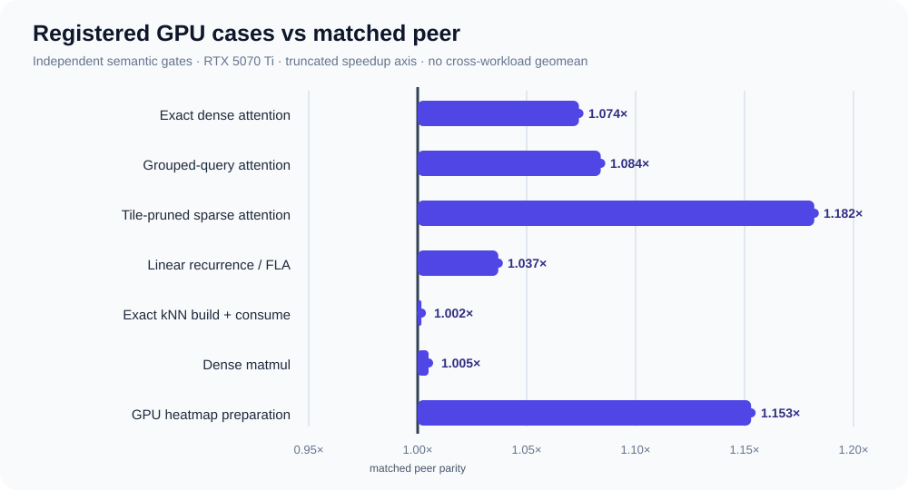

# Benchmark results

This page is the human-readable index of GraphForge's registered performance
evidence. It answers three questions for each result: what program was compiled,
what equivalent implementation was used as the peer, and how narrow is the
claim?

!!! note "Snapshot"

    GPU results are from the repository's NVIDIA RTX 5070 Ti environment. They
    are registered case results, not projections to other devices or shapes.
    Raw JSON/PNG/REPORT artifacts are generated under
    `output/roofline/<operation>/<case>/` and intentionally remain out of Git.



## Headline comparison

For latency rows, speedup is `peer latency / GraphForge latency`. For throughput
rows, it is `GraphForge throughput / peer throughput`. Higher is better.

| Family | Program submitted to GraphForge | Registered case | GraphForge | Fastest matched peer | Speedup / gate |
|---|---|---|---:|---:|---:|
| Exact dense attention | Cartesian relation + online-softmax reducer | B1/H16/N4096/D64 FP16 | 0.7720 ms | Flash SDPA 0.8288 ms | **1.074×**, CI low 1.069 |
| Causal dense attention | Triangular relation + same reducer | B1/H16/N4096/D64 FP16 | 0.4459 ms | causal Flash SDPA | **1.117×**, CI low 1.100 |
| Grouped-query attention | Dense relation with grouped source-lane mapping | Hq16/Hkv4/N4096/D64 FP16 | 0.7769 ms | Flash SDPA 0.8424 ms | **1.084×**, CI low 1.078 |
| Sparse attention | Conditional tile admission inside online reducer | B1/H16/N4096/D64 FP16 | 0.9073 ms | official FSA 1.0724 ms | **1.182×**, CI low 1.177 |
| Linear attention | broadcast × multiply × scan × contraction | L64/T512/K16/V16 FP32 | 0.1056 ms | official FLA 0.1095 ms | **1.037×**, CI low 1.025 |
| Exact kNN pipeline | procedural exact kNN + weighted consume UDF | N8192/D3/k32 FP32 | 3.9072 ms | cdist/top-k/gather pipeline 3.9137 ms | **1.002×**, CI low 1.0005 |
| Dense matmul | `gf_tensor.matmul` contraction | 2048³ FP16 | 89.29 TFLOP/s | torch.mm/cuBLAS 88.86 TFLOP/s | **1.005×**, CI low 1.004 |
| GPU visualization prep | ordinary scalar→RGB Tensor expression | 2048² FP32 | 0.0996 ms | Inductor 0.1148 ms | **1.153×**, CI low 1.140 |


The close kNN and matmul results are shown rather than rounded into a larger
claim: both pass their pre-registered `1.00×` confidence gate, but neither is
evidence of a broad advantage across shapes.

## Sparse relations and reducers

| Workload | Registered topology | GraphForge evidence | Comparison |
|---|---|---|---|
| Scalar CSR weighted sum | 131,072 rows, random source, degree 4/16/64, FP32 | compiler-generated TTIR | 0.824×/0.899×/0.990× GraphForge-to-Triton latency ratio; GraphForge is faster in each bucket |
| Regular local CSR | 131,072 rows, degree 16, scalar FP32 | auto-selected generated/native path | 0.0186 ms vs `torch.sparse.mm` 0.0310 ms, **1.67×** |
| Regular random vector CSR | 131,072 rows, degree 16, F=16, i32, hot/cold | compiler-generated row-neighbor-feature TTIR | **4.322×/3.801×** vs `torch.sparse.mm`; CI low 4.245/3.759 |
| Regular random vector CSR | same topology, F=64, hot/cold | compiler-generated row-neighbor-feature TTIR | **1.966×/1.302×** vs `torch.sparse.mm`; CI low 1.956/1.288 |
| Irregular random vector CSR | 131,072 rows, degree 0–32, F=16, i32, hot/cold | compiler-generated bounded-ragged row-neighbor-feature TTIR | **4.213×/3.270×** vs `torch.sparse.mm`; CI low 4.153/3.230 |
| Irregular random vector CSR | same topology, F=64, hot/cold | compiler-generated bounded-ragged row-neighbor-feature TTIR | **1.595×/1.283×** vs `torch.sparse.mm`; CI low 1.584/1.270 |
| Power-law social slice | 90% degree 8, 9% degree 64, 1% degree 256; i32/i64; local/random; hot/cold | degree-bucket/worklist planner | all eight registered gates pass; CI-low range **1.255–2.015×** |
| Online-softmax reducer | 131,072 rows, degree 32 | compiler schedule, stable tuple state | **1.007×**, CI low 1.005 vs matched hand-written Triton |
| Product reducer backward | 131,072 rows, degree 16 | zero-safe compiler-generated VJP | **1.021×**, CI low 1.016 vs matched hand-written Triton |
| Radius distance backward | fixed selected snapshot, N32768/D3/degree≈32 | generated geometry VJP | **1.079×**, CI low 1.073 vs matched hand-written Triton; 4.36× vs Torch autograd |

Fixed-degree and bounded-ragged vector CSR use compiler-generated TTIR in the
registered rows above. Shapes beyond the proven bounds that dispatch to an
external sparse library are labeled as dispatch results. A correctness
evaluator is never included in a “fastest backend” conclusion.

## Dynamic graph boundaries

Dynamic graph reporting separates topology build from relation consume:

| Boundary | Included work | Why it is separate |
|---|---|---|
| Build-only | broad phase, candidate filtering, exact neighbor selection, relation output | measures the graph constructor |
| Consume-only | a fixed relation snapshot and user message/reducer | measures generated relation traversal |
| Build + consume | positions-to-output end to end | the fair number for changing geometry |
| Rebind/reuse | reuse of a proven-valid topology snapshot | valid only when positions/topology version permits it |

The registered Euclidean radius pipeline uses a tensorized uniform cell list
rather than an `N×N` distance matrix. Periodic/skew rebuild remains slower than
the current external peer in the full matrix, so GraphForge does **not** claim
radius-build SOTA. This limitation is preserved even though consume/reuse and
non-periodic registered gates pass.

## Attention comparisons are not interchangeable

Exact Flash SDPA, causal recurrence/FLA, and tile-pruned FSA solve different
mathematical programs. They share compiler mechanisms—relations, scans, online
reducers, and conditional tiles—but not a common FLOP count or accuracy
contract. Consequently:

- exact dense and causal dense results are audited against exact Flash SDPA;
- linear recurrence is audited against the same unnormalized causal recurrence;
- sparse attention uses the same pruning threshold as its FSA peer and reports
  error against exact attention separately;
- these rows are never combined into a single “attention speedup” geomean.

## Distributed automatic overlap

The CPU runtime benchmark uses two real processes and the public
`Graph.halo()` MessagePassing path. For 65,536 entities, degree 16, feature
width 64 and a 25% boundary, an explicit 5 ms receive-delay model produced
13.7224 ms median measured communication/interior overlap. Automatic execution
was 38.2262 ms versus 40.8632 ms forced-serialized, or **1.069×**. The artifact
contains per-rank timestamps and a human-readable timeline under
`output/distributed/automatic_cpu_overlap/`.

This is evidence for scheduler ordering and performance under the stated
controlled link model. It is not an inter-node measurement and is not evidence
for NCCL, RCCL, or multi-GPU overlap.

## Reproduce and inspect

```bash
export PYTHONPATH="$PWD/python"
export GRAPHFORGE_OPT="$PWD/build/bin/gf-opt"
export GRAPHFORGE_TRANSLATE="$PWD/build/bin/gf-translate"

python -m benchmarks.compiler.provider_gate --fail-on-gate
python -m benchmarks.sparse_compute.weighted_aggregation
python -m benchmarks.graph_operations.radius_pipeline --fail-on-gate
python -m benchmarks.graph_operations.knn_build --fail-on-gate
python -m benchmarks.neural_networks.dense_attention --fail-on-gate
python -m benchmarks.neural_networks.linear_attention --fail-on-gate
python -m benchmarks.neural_networks.sparse_attention --fail-on-gate
python -m benchmarks.distributed.automatic_overlap
python -m benchmarks.common.check_outputs
```

Every formal case writes raw samples, median, bootstrap confidence interval,
device/software metadata, arithmetic-intensity model, roof ceilings, and PNG
plots. The [performance methodology](performance.md) defines the common artifact
layout and reproduction commands; the [benchmark protocol](BENCHMARKS.md)
defines semantic matching, cache states, cold-JIT accounting, and the acceptance
gate.

## What is not yet claimed

- performance portability to ROCm/Hygon, Metal, or PPU before real provider
  plugins and hardware artifacts exist;
- radius-build SOTA for periodic/skew or non-uniform distributions;
- exact kNN performance outside N8192/D3/k32;
- multi-GPU NCCL overlap or throughput from a one-GPU binding test;
- universal sparse performance from one degree distribution or feature width.

Those exclusions are part of the result, not footnotes to hide.
