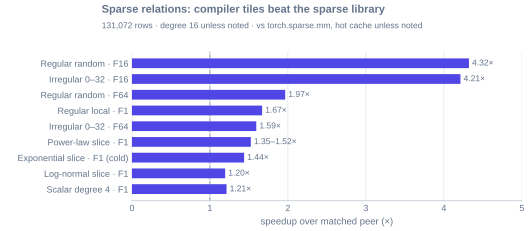

# Benchmark results

For runtime/memory comparisons, large-graph capacity and distributed overhead,
see [performance and scalability](experiments.md). This page contains the historical archive.

These are **historical measurements**, not performance results for the current checkout. The archived input set covers 44 registered cases across 18 operations, plus six supporting artifacts. GPU cases use the recorded RTX 5070 Ti environment; CPU results belong to the paired host. No cross-device score is computed.

[Reproduce the charts](benchmark-reproducibility.md) · [Download raw evidence](assets/results/evidence.zip) · [Chart-to-input index](assets/results/chart-inputs.json) · [Full matrix](#the-full-matrix)

!!! warning "Scope and provenance"

    Original code revisions, driver/package versions and raw repetitions are incomplete in some historical files. Replotting is reproducible from the archive; equivalent fresh performance is not guaranteed. A `--quick` run is a smoke measurement, not a reproduction of every archived case.

## Reading the figures

Fresh large-graph capacity evidence is reported separately in
[the billion-edge experiment](memory.md#billion-edge-capacity). Its complete
forward timings must not be mixed with the historical warm operator timings below.

A speedup above 1 means the named candidate is faster than its stated peer; milliseconds remain visible. Ratios from different workloads or timing scopes are never averaged. `F` means feature width, not floating-point precision. Memory charts distinguish estimated per-edge intermediates from measured peak allocation. Scroll charts horizontally on narrow screens; click a figure to open its SVG at full size.

## GPU

=== "Sparse"

    Weighted CSR aggregation computes a weighted sum over each destination row. The selected topology slices use 131,072 rows and mean degree 16, FP32 values, and the index width encoded by each archived case. `F=1/16/64` is the feature width.

    

    The candidate is `tiga.prepared_auto`, the peer is `torch.sparse.mm`, and cache is hot. Preparation is outside this warm timing. This is a fixed selection, not a claim of winning every registered topology. [All sparse cases](#matrix-weighted_aggregation).

=== "Edge-NN"

    An edge MLP consumes relative position and source features, followed by destination aggregation. The fused and eager paths compute the same selected workload; a handwritten Triton tile is an oracle, not compiler-generated code.

    

    

    Zero in the second chart means no materialized per-edge activation array, **not zero total device memory**. Its GiB values are derived from intermediate tensor sizes; they are not peak-allocator measurements.

    

    The training chart compares a forward+backward step and measured peak allocation; its timing scope differs from forward-only. [Forward case](#matrix-radius_edge_mlp) · [Backward case](#matrix-edge_nn_backward) · [Program examples](examples/attention.md).

=== "GAT"

    This graph attention case includes an edge-wise score, destination normalization and aggregation. It is not dense SDPA.

    

    The peer is eager autograd on the same recorded graph. This supporting case is archived but not registered in the 44-case matrix; its exact source is in the [chart index](assets/results/chart-inputs.json).

=== "Attention"

    Dense exact attention, linear attention and tile-pruned sparse attention are different mathematical workloads. Each row has its own matched peer; comparisons across rows are not rankings.

    

    [Dense cases](#matrix-dense_attention) · [Linear case](#matrix-linear_attention) · [Sparse case](#matrix-sparse_attention). The matrix states shapes, precision and provider identity.

=== "Dynamic relations"

    Building a radius topology, consuming a ready topology, and rebuilding then consuming have different timing boundaries. Reuse excludes construction; end-to-end includes it.

    

    No phase-only ratio establishes the end-to-end speedup. [Build case](#matrix-radius_graph_build) · [Consumption case](#matrix-radius_distance_aggregation).

## Across the compiler

Each row below selects an explicit archived workload and a matched baseline. The selections are fixed by the generator, not an automatic best-case scan.

Baseline names and exact filters are in `benchmarks/evidence_manifest.json` and `benchmarks/common/plot_docs_results.py`; absolute candidate/peer times are printed beside the bars. [PageRank](#matrix-pagerank) · [kNN](#matrix-knn_graph) · [Matmul calibration](#matrix-dense_matmul_calibration) · [Heatmap](#matrix-visualization_heatmap).

## CPU

=== "Relations"

    The same FP32/i32 degree-16 relation loop is compared with SciPy CSR matvec and Torch sparse at two node counts, with 16 threads. Both wins and losses are shown.

    

    The 131k case is registered; the 16k comparison is a supporting archive. The result does not establish scaling across CPUs, thread counts or NUMA placements. [Registered CPU relation](#matrix-cpu_relation).

=== "Distributed"

    Historical internal overlap probe, not the public execution policy (which completes communication before computation). Two CPU processes use a deliberately delayed transport link; this is not an NVLink, RDMA or multi-GPU benchmark.

    

    The timeline is one rank's first sample; the median annotation comes from the full recorded sample set. It does not claim that every sample has the same overlap. [Runnable distributed example](examples/distributed-memory.md#two-process-halo-exchange).

## The full matrix

The table is generated from the same archived registered inputs, including slower paths. It is the detailed evidence view, not another independent measurement. Each operation lists its case conditions, timing scope and peer.

--8<-- "docs/includes/full-matrix.md"
