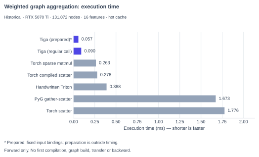

# Tiga 与同类对比 { #how-tiga-compares }

Tiga 是面向 message passing 与图计算的**编译器**——不是 framework，也不
是通用深度学习编译器。普通输入/输出使用 Torch Tensor，但 Torch 由使用者
单独安装；原生 CPU 路径无需 Torch。项目目前为 alpha，对比必须区分抽象、
实测性能与工程成熟度，不能把一个案例当作全面排名。

## 一个具体操作的耗时 { #aggregation-timing }

计算内容：每个目标节点收集邻居的 16 维特征，乘以对应边的权重，再求和。
图中是同一份输入的前向执行耗时，**单位为毫秒（ms），柱子越短越快**，不是加速比。
紫色为两条 Tiga 路径，灰色为其他具体实现；不是框架整体排名。

[](assets/results/spmm-provider-compare.svg)

窄屏可横向滚动图表，或点击图片查看完整图；全部数值也在下方可展开表格中。

例如 `Tiga (regular call)` 为 0.090 ms，`Torch sparse matmul` 为 0.263 ms。
`Tiga (prepared)*` 的 0.057 ms 需要提前固定输入绑定并完成准备，不能当作首次调用耗时。
这里只测预热后的前向执行，不包含首次编译、构图、数据传输或反向传播；
hot cache 表示重复执行时不主动清空缓存，不保证全部数据驻留 L2。

??? info "完整数值与实现含义（含 reference）"

    | 图中名称 | 存档标识 | 具体实现 | 耗时（ms） |
    |---|---|---|---:|
    | Tiga (prepared)* | `tiga.prepared_auto` | 固定输入绑定后的重复执行，准备不计时 | 0.057 |
    | Tiga (regular call) | `tiga.auto` | 预热后的常规调用 | 0.090 |
    | Torch sparse matmul | `torch.sparse.mm` | 稀疏矩阵乘法 | 0.263 |
    | Torch compiled scatter | `torch.compile.index_add` | 编译后的 gather、乘权重与累加 | 0.278 |
    | Handwritten Triton | `triton.csr` | benchmark 中的一份手写 CSR kernel，不代表 Triton 性能上限 | 0.388 |
    | PyG gather-scatter | `pyg.message_passing` | 本例的消息收集与累加，不是融合稀疏聚合路径 | 1.673 |
    | Torch scatter | `torch.index_add` | 未编译的 gather、乘权重与累加 | 1.776 |
    | 不在柱图中 | `tiga.reference` | 用于正确性对照的参考实现，不是优化执行路径 | 3.061 |

    数值为存档重复测量的中位数，四舍五入至三位小数。benchmark 在计时前
    用 `torch.sparse.mm` 检查前向结果；这不代表梯度验证或完整训练性能。

测量条件：RTX 5070 Ti，131,072 个节点，平均度数约 16，不规则 CSR、随机局部性，
特征宽度 16，FP32 数值、32 位索引。这是**历史存档**，不是当前 revision 或当前默认
Torch 路径的新性能结论。原始数据与重画命令见[图表复现](benchmark-reproducibility.zh.md)。

重新测量该 workload（结果可能随版本与环境变化）：

```bash
python -m benchmarks.sparse_compute.weighted_aggregation --topology irregular --locality random --device cuda --index-dtype i32 --nodes 131072 --degree 16 --features 16,64
```

同一数学程序的可运行原生实现见 [CSR 聚合例子](api-examples.zh.md#message-passing)；
API 选择不应只由此图决定。

## 一览

| 同类 | 定位 | Tiga 的区别 |
|---|---|---|
| [PyG](https://pytorch-geometric.readthedocs.io/en/latest/notes/sparse_tensor.html) | GNN framework，具有 gather-scatter 与融合的稀疏聚合路径 | 上图测量 PyG 2.8.0 的 gather-scatter 实现，不是其 `message_and_aggregate()` 路径；不能把该结果推广到所有 PyG 算子 |
| [DGL](https://www.dgl.ai/) | 提供 `gspmm` / `gsddmm` 等融合算子的 GNN framework | Tiga 侧重保留关系来源、生成式拓扑与 VJP；此处没有足够的对齐数据给 DGL 做性能排名 |
| [torch.compile](https://pytorch.org/docs/stable/torch.compiler.html) | 通用 PyTorch 编译入口 | Tiga 从关系与 reducer 语义出发；不能由某个版本或案例推断所有稀疏算子的捕获、融合或性能 |
| [Taichi](https://www.taichi-lang.org/) / [Warp](https://nvidia.github.io/warp/) | Python kernel JIT | 编程抽象不同：Tiga 的入口是关系与 edge/node UDF |
| [Triton](https://triton-lang.org/) | tile / kernel DSL 与编译器 | Tiga 当前 NVIDIA 路径通过序列化 TTIR 交接给 Triton |
| [TileLang](https://github.com/tile-ai/tilelang) | 外部 tile / kernel DSL | 当前没有集成的 TileLang provider；不是已经支持的 Tiga backend |
| [Graphiler](https://github.com/xiezhq-hermann/graphiler) | 基于 DGL + TorchScript 的研究型 GNN 编译器 | 前端与运行时契约不同；此处不对维护状态或性能排名作推断 |
| [GALA](https://github.com/ADAPT-uiuc/GALA-GNN-Acceleration-LAnguage) | 研究型 GNN DSL 与编译器 | 自带前端与 benchmark 套件，需要先对齐工作负载才能比较 |

## 什么时候用 Tiga，什么时候不用

适合评估 Tiga 的场景是自定义图消息、稀疏聚合，以及需要检查生成代码的研究/开发。
先运行具体 workload 的正确性与梯度对照，再按相同输入和计时范围测量性能。
支持的 edge-nn 路径有编译 VJP；部分 Torch CSR backward 采用语义重放，
不能笼统声称所有前后向都由融合 kernel 执行。

Tiga 目前不提供完整训练框架、模型库或生产级全平台发行承诺，
也不能仅因内置一个 PageRank 或 attention 示例就替代对应生态。
已有工程应按缺失的能力决定是否集成，不必为了使用 Tiga 更换全部 Tensor 接口。
已验证范围、内存与多 GPU 限制见[当前状态](roadmap.zh.md#latest-validation)。

这些取舍背后的完整设计调研——Ebb、Simit、TACO、GraphIt、Taichi、
Legion 等——保存在仓库的
[`docs/RELATED_WORK.md`](https://github.com/walkerchi/TIGA-lang/blob/main/docs/RELATED_WORK.md)。
