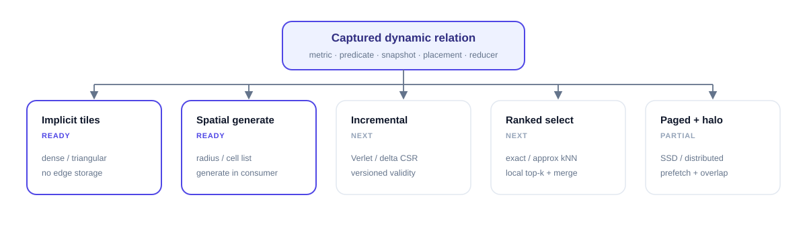

# Dynamic graph acceleration

A dynamic graph is not one storage format. It is a logical relation whose
neighbor set depends on changing data. GraphForge keeps that relation semantic
in IR long enough to choose whether edges should be generated, cached,
incrementally repaired, partitioned, or paged. Materializing CSR is one legal
realization, not the default meaning of `Graph.radius` or `Graph.knn`.



## The realization matrix

| Relation and lifecycle | Physical structure | Compiler opportunity | Best regime | Current status |
|---|---|---|---|---|
| Dense Cartesian or triangular | no edge array; query/source tiles | fuse message, online reducer and value contraction; keep state in registers/shared memory | attention, all-pairs kernels whose output is much smaller than the relation | executable and benchmarked |
| Euclidean radius, rebuilt | sorted cell directory plus occupied-cell ranges | generate candidates inside the consumer, reject by distance, and avoid CSR/distance/message tensors | low-dimensional particles with bounded cell occupancy | executable for 2D/3D default metric, including periodic box/skew cases |
| Radius with bounded motion | cell directory or neighbor list plus a skin | reuse while the displacement certificate holds; rebuild only on invalidation | molecular dynamics and time stepping with coherent motion | snapshot/version reuse exists; a full Verlet invalidation policy is next work |
| Exact kNN | candidate tiles plus hierarchical local top-k and merge | fuse distance, selection and consume; bound temporary storage by `queries × tiles × k` | exact low/moderate-dimensional search | semantic path exists; current exhaustive `cdist/top-k` is parity evidence, not a compiler win |
| Approximate kNN | IVF/HNSW/tree directory plus refinement relation | compile probe/refine as nested generated relations and expose recall as part of the contract | high-dimensional search where exact all-pairs is unnecessary | planned; no performance claim |
| Mutable edge stream | immutable CSR base plus sorted delta segments/tombstones | fuse base and delta traversal, compact asynchronously, version snapshots | temporal/social graphs with small batches of edge updates | planned |
| Skewed materialized graph | degree CDF worklists and chunked high-degree tails | different schedules for short rows and split rows; disjoint output ownership avoids atomics | power-law social graphs | executable and benchmarked |
| SSD/distributed graph | destination shards, paged CSR, ghost map and halo plan | prefetch pages, execute interior while communication runs, then execute boundary | graphs larger than one accelerator or host memory | paged CPU and automatic halo execution exist; real multi-GPU performance remains open |

“Dynamic” therefore has at least three independent axes:

- **topology change:** none, bounded motion, batched deltas, or full rebuild;
- **relation density:** sparse materialized, sparse generated, or implicit dense;
- **residency:** one device, host-backed, SSD-paged, or distributed shards.

Those facts belong in the captured relation and its snapshot token. They should
not be handwritten `cache(..., space="shared")` hints in every user kernel.

## Generated radius traversal

For a default Euclidean radius graph, the compiler may lower

```text
destination particle
  → its cell coordinate
  → adjacent occupied cells
  → candidate source particles
  → exact metric/select predicate
  → message + reducer
```

The directory is `O(N + cells)` and edges are never required to exist in global
memory. Build/consume fusion removes four otherwise materialized arrays: row
pointers, column indices, edge distances and messages. This is where the
registered 4.425× fresh-pipeline result comes from; merely replacing one CSR
consumer with another cannot produce that algorithmic saving.

Custom metrics need a proven broad-phase bound before they may use this path.
Without one, GraphForge retains exact semantics and selects a general fallback.
A `select` UDF may remove candidates but cannot bypass the radius predicate.

## Exact kNN needs hierarchical selection

The current public exact-kNN result is intentionally only 1.002×: both sides
execute exhaustive distance construction and the same mature top-k family.
The missing compiler transformation is a general ranked-relation lowering:

```text
query tile × candidate tile
  → metric UDF
  → local k selections
  → hierarchical merge
  → selected-edge message/reducer
```

It must be represented as a multi-task compiler plan, not as a workload-named
Python or Triton kernel. The plan also needs a temporary-memory budget and may
choose a spatial directory only when it can certify exactness. Approximate
search is a different public contract and must report recall as well as speed.

## Load balance for power-law graphs

One thread block per row wastes most lanes on short rows and stalls on hubs.
GraphForge records the degree distribution and selects a mixed schedule:

1. short and medium rows enter degree-CDF worklists with row-specific tiles;
2. high-degree rows split into fixed-size edge chunks;
3. chunk partials are finalized through a deterministic task dependency;
4. destination ownership remains disjoint, avoiding global output atomics;
5. the planner may reorder physical rows while preserving logical IDs.

This mechanism is useful for PageRank, aggregation and many NetworkX-style
algorithms that are expressible as frontier/relation/reducer programs. Frontier
compaction and sorted-intersection are still required for efficient BFS and
triangle counting; they are compiler diagnostics on the roadmap, not completed
claims.

## Incremental, paged and distributed execution

A snapshot token connects positions or edge deltas to the selected realization.
Reuse is legal only while its certificate remains valid. For bounded particle
motion, a future Verlet plan will track maximum displacement and rebuild when
the skin is exhausted. For temporal graphs, a base CSR plus delta segments can
serve the same role, with compaction scheduled outside the critical path.

For large graphs, `Graph.open(...)` preserves the same MessagePassing call. The
physical planner partitions by destination, reads only the required pages,
constructs a ghost map, and emits this dependency graph:

```text
page prefetch ─┬─> interior compute ───────────────┐
halo pack → exchange → unpack → boundary compute ─┼─> merge
SSD refill ────────────────────────────────────────┘
```

The user does not invoke communication primitives manually. Placement and halo
depth are graph properties; pack/exchange/unpack and stream/event dependencies
are compiler/runtime tasks. Current CPU execution validates this model, while
multi-GPU NCCL/RCCL throughput remains an explicit open gate.

## Performance boundaries

Every dynamic benchmark must say which boundary it measures:

| Boundary | Required timed work |
|---|---|
| build-only | directory/broad phase, filtering, selection and relation output |
| consume-only | traversal of one fixed, already-valid snapshot |
| build + consume | positions or updates to final user output |
| certified reuse | validity check plus consume; never mislabeled as rebuild |

Cache reuse, approximate search and a different metric are not hidden inside a
headline speedup. See [benchmark results](benchmark-results.md) for the measured
cases and [benchmark protocol](BENCHMARKS.md) for acceptance rules.
