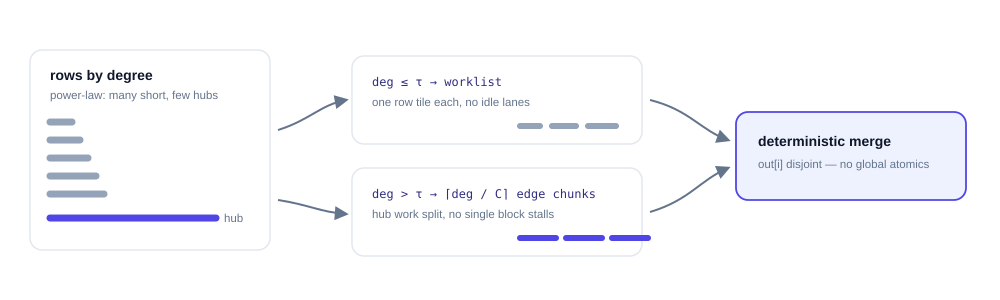

# Dynamic graph acceleration

A dynamic graph is not one storage format. It is a logical relation whose
neighbor set depends on changing data. Tiga keeps that relation semantic
in IR long enough to choose whether edges should be generated, cached,
incrementally repaired, partitioned, or paged. Materializing CSR is one legal
realization, not the default meaning of `Graph.radius` or `Graph.knn`.

<figure class="gf-figure" markdown="1">


<figcaption markdown="1">
[Open the full-size SVG](assets/dynamic-relation-strategies.svg). The realization is a compiler choice; it is not a different user Graph type.
</figcaption>
</figure>

## The realization matrix

This matrix combines native and Torch-adapter implementations with
explicitly marked plans. Generated CUDA traversal is not the native
MessagePassing default: native radius currently consumes materialized CSR,
and native kNN/dense MessagePassing is not supported. See [coverage](roadmap.md).

| Relation and lifecycle | Physical structure | Compiler opportunity | Best regime | Current status |
|---|---|---|---|---|
| Fixed grid stencil | CSR generated from grid dimensions and offsets | reuse topology across field updates; an offset-only traversal is a separate optimization | regular-grid filtering and local updates | CPU/CUDA constructor and Torch execution available; currently materializes CSR |
| Dense Cartesian or triangular | no edge array; query/source tiles | fuse message, online reducer and value contraction; keep state in registers/shared memory | attention, all-pairs kernels whose output is much smaller than the relation | executable and benchmarked |
| Euclidean radius, rebuilt | sorted cell directory plus occupied-cell ranges | generate candidates inside the consumer, reject by distance, and avoid CSR/distance/message tensors | low-dimensional particles with bounded cell occupancy | executable for 2D/3D default metric, including periodic box/skew cases |
| Radius with bounded motion | cell directory or neighbor list plus a skin | reuse while the displacement certificate holds; rebuild only on invalidation | molecular dynamics and time stepping with coherent motion | snapshot/version reuse exists; a full Verlet invalidation policy is next work |
| Exact kNN | candidate tiles plus hierarchical local top-k and merge | fuse distance, selection and consume; keep M0 selection state register-local | exact low/moderate-dimensional search | executable FP32 squared-Euclidean M0; three strict gates pass; large-k/metric/spill remains partial |
| Approximate kNN | IVF/HNSW/tree directory plus refinement relation | compile probe/refine as nested generated relations and expose recall as part of the contract | high-dimensional search where exact all-pairs is unnecessary | planned; no performance claim |
| Mutable edge stream | immutable CSR base plus sorted delta segments/tombstones | fuse base and delta traversal, compact asynchronously, version snapshots | temporal/social graphs with small batches of edge updates | planned |
| Skewed materialized graph | degree CDF worklists and chunked high-degree tails | different schedules for short rows and split rows; disjoint output ownership avoids atomics | power-law social graphs | executable and benchmarked |
| SSD/distributed graph | paged CSR for offload; destination shards and a halo plan for distributed execution | page through topology, or exchange the halo before computing owned rows | large stored graphs and spatial partitions | single-device paging and two-host NCCL measured separately; see [experiments](experiments.md) |

“Dynamic” therefore has at least three independent axes:

- **topology change:** none, bounded motion, batched deltas, or full rebuild;
- **relation density:** sparse materialized, sparse generated, or implicit dense;
- **residency:** one device, host-backed, SSD-paged, or distributed shards.

Those facts belong in the captured relation and its snapshot token. They should
not be handwritten `cache(..., space="shared")` hints in every user kernel.

## Fixed rules are generated, not necessarily dynamic { #fixed-grid-stencil }

`Graph.stencil(dims, offsets=None, periodic=False)` defines source coordinates as
the destination coordinate plus each offset. No positions or distance search
are required. Changing node values does not change this topology. The current
constructor materializes CSR; it does not promise an implicit, edge-free kernel.
See the [five-point grid example](examples/dynamic-relations.md#regular-grid-stencil)
for indexing, periodic boundaries and Torch gradients.
Omitting offsets uses `tg.stencil.von_neumann()`; `tg.stencil.moore()` and
explicit tuples are also supported. See [neighborhood macros](examples/dynamic-relations.md#stencil-neighborhood-macros)
and [radius/kNN distance metrics](examples/dynamic-relations.md#distance-metrics).

## Generated radius traversal

For a default Euclidean radius graph, the compiler may lower


On the generated CUDA path, the directory is `O(N + cells)` and edges need
not exist as an array in global memory. Build/consume fusion removes four otherwise materialized arrays: row
pointers, column indices, edge distances and messages. The [archived dynamic
benchmark](benchmark-results.md#gpu) compares the resulting build-and-consume
path with explicit construction and aggregation.

Custom metrics need a proven broad-phase bound before they may use this path.
Without one, Tiga retains exact semantics and selects a general fallback.
A `select` UDF may remove candidates but cannot bypass the radius predicate.

### CUDA hash-directory implementation and matched Warp comparison { #radius-hash-grid }

Contiguous FP32 2D/3D non-periodic Euclidean inputs use a fixed-size modular
[hash grid](https://en.wikipedia.org/wiki/Spatial_hashing). Torch-compiled
preprocessing computes bucket keys; vendor sort/search primitives build their
ranges. Tiga emits the neighbor traversal, exact distance predicate and scalar
distance-weighted sum through Domain/Iter/Kernel IR. Bucket wrapping is hashing,
not periodic geometry: collisions add candidates, never accepted edges. Periodic
geometry retains the separate dense directory. Custom metrics keep their exact
fallback. This path does not cover general EdgeNN fusion; backward may still materialize CSR.
Index snapshots and ordinary outputs own independent storage, even through
`detach()` aliases. Only private index scratch is explicitly reused. Inference
tensors have no version counter, so data-dependent caches conservatively rebuild.

September 20, 2026 validation on RTX 5070 Ti, Torch 2.11.0+cu128, Triton 3.6.0,
Warp 1.9.1: 131,072 uniform 3D points, approximately 4.02M directed edges,
one FP32 feature, `sum(distance * x)`, no self edges or neighbor truncation.
All rows in both coordinate snapshots match an independent materialized reference
(maximum absolute error below 5e-7).

| Implementation | Index build (ms) | Fixed-index compute (ms) | Rebuild + compute (ms) | Peak allocated buffers (MiB) |
|---|---:|---:|---:|---:|
| Tiga dense-directory baseline | 0.4030 | 1.2374 | 1.6968 | 21.68 |
| Tiga hash-directory | 0.1808 | 0.3218 | 0.5626 | 16.00 |
| Warp hash grid | 0.0620 | 0.2469 | 0.2905 | 8.78 |

The new Tiga path is about 3.02× faster than the dense baseline for rebuild plus
compute on this case. **Warp remains faster and uses less allocated memory.**
These numbers do not establish a general radius-search advantage over Warp.
Earlier EdgeNN charts use different computations and timing boundaries.

Each provider runs in a fresh process with five warmups and 30 samples per
phase. Times are synchronized wall-clock medians; changing coordinates is
outside the timer for both providers. Fixed-index execution disables Tiga's
adaptive CSR cache, so both methods query their spatial index. Allocation peaks
include inputs and provider scratch, not driver/modules or reserved free blocks;
Warp's reported upper bound combines its pool high-water counter with constant
Torch inputs. CUDA-event samples, both snapshot hashes and source hashes are in
the raw records: [Tiga](assets/results/radius-warp/release-n131072-tiga.json),
[dense baseline](assets/results/radius-warp/release-n131072-tiga-dense.json),
[Warp](assets/results/radius-warp/release-n131072-warp.json).

Run the [matched benchmark source](https://github.com/walkerchi/TIGA-lang/blob/main/benchmarks/graph_operations/warp_radius.py)
after installing optional benchmark-only `warp-lang==1.9.1`:

```bash
for provider in tiga tiga-dense warp; do
  python benchmarks/graph_operations/warp_radius.py --provider "$provider" \
    --nodes 131072 --repeats 30 --output "output/radius-$provider.json"
done
```

The benchmark is separate from ordinary installation; Tiga does not depend on Warp.

## Exact kNN needs hierarchical selection

Exact kNN is an executable ranked-relation lowering rather than a library
dispatch; the measured gates are reported in [benchmark
results](benchmark-results.md). The compiler path is:


These steps are represented by provider-neutral Domain/Iter/Kernel IR and the
core emits TTIR—there is no workload-named Python/Triton kernel. M0 keeps the
physical key state at `next_pow2(k)`, masks lanes beyond the exact semantic k
and therefore supports every k≤64 without global scratch. Larger k still needs
a memory-budgeted multi-task spill plan; a spatial directory may be chosen
only when exactness can be certified. Approximate search is a different public
contract and must report recall as well as speed.

## Load balance for power-law graphs

One thread block per row wastes most lanes on short rows and stalls on hubs.
Tiga records the degree distribution and selects a mixed schedule:



For a row `i` of degree `d_i` with chunk size `C` and degree threshold
`tau`, the schedule and the merge it preserves are:

$$
d_i \le \tau \;\Rightarrow\; \text{one worklist tile},
\qquad
d_i > \tau \;\Rightarrow\;
\text{out}_i = \mathrm{finalize}\!\Big(
\bigoplus_{c=1}^{\lceil d_i / C \rceil} \mathrm{partial}_{i,c} \Big)
$$

1. short and medium rows enter degree-CDF worklists with row-specific tiles;
2. high-degree rows split into fixed-size edge chunks;
3. chunk partials are finalized through a deterministic task dependency;
4. destination ownership remains disjoint, avoiding global output atomics;
5. the planner may reorder physical rows while preserving logical IDs.

This mechanism is useful for PageRank, aggregation and many NetworkX-style
algorithms that are expressible as frontier/relation/reducer programs. Frontier
compaction and sorted-intersection are still required for efficient BFS and
triangle counting; they are compiler diagnostics on the roadmap, not completed
claims.

## Incremental, paged and distributed execution

A snapshot token connects positions or edge deltas to the selected realization.
Reuse is legal only while its certificate remains valid. For bounded particle
motion, a future Verlet plan will track maximum displacement and rebuild when
the skin is exhausted. For temporal graphs, a base CSR plus delta segments can
serve the same role, with compaction scheduled outside the critical path.

The two reuse contracts, written out — the Verlet certificate on the left
(each particle moves less than half the extra neighbor-list radius), the temporal base-plus-delta form
on the right (base CSR `B`, edge insertions `Δ⁺`, tombstones
`Δ⁻`):

$$
2\max_i \lVert p_i(t) - p_i(s) \rVert < r_{\mathrm{skin}}
\;\Rightarrow\; \text{safe reuse}(s \!\to\! t),
\qquad
R(t) \;=\; B \;\cup\; \Delta^{+} \;\setminus\; \Delta^{-}
$$


For large stored graphs, `Graph.open(...)` exposes paged topology through the
MessagePassing interface. Distributed execution is a separate placement path:
the runtime packs, exchanges and unpacks the halo, then computes all owned rows.
The public policy is **communication then compute**, not split interior/boundary
overlap. Placement and halo depth are graph properties; communication is managed
by the runtime. Single-device paging and two-host NCCL results are reported
separately in [experiments](experiments.md); these do not establish a combined
distributed-offload capacity guarantee.

## Performance boundaries

Every dynamic benchmark states which boundary it measures; [benchmark
results](benchmark-results.md) defines the build-only, consume-only,
build + consume and certified-reuse boundaries and reports the measured cases,
and the [performance methodology](performance.md) defines the acceptance
rules.
