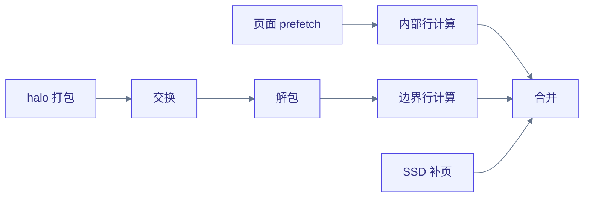

# 动态图加速 { #dynamic-graph-acceleration }

动态图不是某一种存储格式，而是一条逻辑关系——邻居集合依赖不断变化的数据。
Tiga 让这条关系在 IR 里以语义形式保留足够久，再来决定边应当生成、
缓存、增量修复、分区还是分页。物化 CSR 只是一种合法的实现方式，而不是
`Graph.radius` 或 `Graph.knn` 的默认含义。

<figure class="gf-figure">
  <object type="image/svg+xml" data="/assets/dynamic-relation-strategies.svg" aria-label="动态关系实现策略">
    
  </object>
  <figcaption><a href="/assets/dynamic-relation-strategies.svg">打开完整尺寸的 SVG</a>。实现方式是编译器的选择，而不是另一种用户 Graph 类型。</figcaption>
</figure>

## 实现方式矩阵 { #the-realization-matrix }

| 关系与生命周期 | 物理结构 | 编译器机会 | 最佳场景 | 当前状态 |
|---|---|---|---|---|
| 稠密笛卡尔或三角 | 无边数组；query/source tile | 融合消息、online reducer 与数值收缩；状态保留在寄存器/共享内存中 | attention、输出远小于关系规模的全对 kernel | 可执行且已完成基准测试 |
| 欧氏半径，每次重建 | 排序网格目录加非空网格区间 | 在消费方内部生成候选、按距离拒绝，避免 CSR/距离/消息张量 | 网格占据数有界的低维粒子 | 2D/3D 默认度量可执行，含周期边界盒/斜切情形 |
| 有界运动的半径 | 网格目录或邻居列表加 skin 层 | 位移证书有效期间复用；仅在失效时重建 | 运动连贯的[分子动力学](https://baike.baidu.com/item/分子动力学)与时间步进 | 已有快照/版本复用；完整的 [Verlet](https://en.wikipedia.org/wiki/Verlet_integration) 失效策略是下一步工作 |
| 精确 kNN | 候选 tile 加分层局部 top-k 与合并 | 融合距离、选择与消费；M0 选择状态保持在寄存器内 | 精确的低/中维搜索 | FP32 平方欧氏 M0 可执行；三道严格门禁通过；大 k/度量/spill 仍为部分完成 |
| 近似 kNN | IVF/HNSW/树目录加精化关系 | 将 probe/refine 编译为嵌套的生成式关系，并把召回率作为契约的一部分 | 无需精确全对的高维搜索 | 已规划；无性能声明 |
| 可变边流 | 不可变 CSR 基图加排序增量段/墓碑标记 | 融合基图与增量遍历、异步压缩、快照版本化 | 边更新为小批量的时序/社交图 | 已规划 |
| 偏斜的物化图 | 度数 CDF 工作表与分块的高度数尾部 | 短行与拆分行使用不同调度；不相交的输出所有权避免[原子操作](https://baike.baidu.com/item/原子操作) | [幂律](https://baike.baidu.com/item/幂律分布)社交图 | 可执行且已完成基准测试 |
| SSD/分布式图 | 目标分片、分页 CSR、ghost map 与 halo 计划 | prefetch 页面，通信与内部计算重叠，再算边界 | 超过单个加速器或主机内存容量的图 | 已有分页 CPU 与自动 halo 执行；真实多 GPU 性能仍未解决 |

因此，“动态”至少有三个相互独立的维度：

- **拓扑变化：** 无、有界运动、批量增量或完全重建；
- **关系密度：** 稀疏物化、稀疏生成或隐式稠密；
- **驻留方式：** 单设备、主机后备、SSD 分页或分布式分片。

这些事实属于被捕获的关系及其快照令牌，不应以手写的
`cache(..., space="shared")` 提示散落在每个用户 kernel 中。

## 生成式半径遍历 { #generated-radius-traversal }

对于默认[欧氏](https://baike.baidu.com/item/欧几里得度量)半径图，编译器可能将其
lowering 为

目录开销为 `O(N + cells)`，边从不需要在全局内存中实际存在。构建/消费融合
消除了四个原本需要物化的数组：行指针、列索引、边距离与消息。已注册的 4.425×
fresh-pipeline 结果正来源于此；仅仅把一个 CSR 消费方换成另一个不可能带来
这种算法级收益。

自定义度量需要已证明的宽相（broad-phase）界才能使用此路径。否则 Tiga
保留精确语义并选择通用回退。`select` UDF 可以剔除候选，但不能绕过半径谓词。

## 精确 kNN 需要分层选择 { #exact-knn-needs-hierarchical-selection }

精确 [kNN](https://en.wikipedia.org/wiki/K-nearest_neighbors_algorithm) 是一种
可执行的排序关系 lowering，而非库调用 dispatch；实测门禁见[基准测试结果](benchmark-results.md)。
编译器路径为：

这些步骤由 provider 中立的 Domain/Iter/Kernel IR 表示，核心生成 TTIR——
不存在以负载命名的 Python/Triton kernel。M0 将物理键状态保持在
`next_pow2(k)`，屏蔽超出精确语义 k 的 lane，因此无需全局暂存即可支持所有
k≤64。更大的 k 仍需要带内存预算的多任务 spill 计划；只有当精确性可以被
证明时才会选择空间目录。近似搜索是另一份公开契约，必须同时报告召回率与速度。

## 幂律图的负载均衡 { #load-balance-for-power-law-graphs }

每行一个线程块会在短行上浪费大部分 lane，并在 hub 节点上停顿。Tiga
记录度数分布并选择混合调度：

对于度数为 $d_i$ 的行 $i$，给定块大小 $C$ 与度数阈值 $\tau$，调度及其
保持的归并语义为：

$$
d_i \le \tau \;\Rightarrow\; \text{一个 worklist tile},
\qquad
d_i > \tau \;\Rightarrow\;
\text{out}_i = \mathrm{finalize}\!\Big(
\bigoplus_{c=1}^{\lceil d_i / C \rceil} \mathrm{partial}_{i,c} \Big)
$$

1. 短行与中等行进入度数 CDF 工作表，使用按行特化的 tile；
2. 高度数行拆分为固定大小的边块；
3. 各块的部分结果通过确定性的任务依赖完成最终归并；
4. 目标所有权保持不相交，避免全局输出原子操作；
5. 规划器可以在保持逻辑 ID 的前提下重排物理行。

该机制对 [PageRank](https://en.wikipedia.org/wiki/PageRank)、聚合以及许多
可表达为 frontier/关系/reducer 程序的 NetworkX 风格算法都很有用。高效的
[BFS](https://en.wikipedia.org/wiki/Breadth-first_search) 与三角形计数仍需要
frontier 压缩与排序交集；目前只是路线图上的编译器诊断项，不是已完成的声明。

## 增量、分页与分布式执行 { #incremental-paged-and-distributed-execution }

快照令牌把位置或边增量连接到所选的实现方式。只有在证书保持有效时，
复用才是合法的。对于有界粒子运动，未来的 Verlet 计划将跟踪最大位移，并在
skin 耗尽时重建。对于时序图，CSR 基图加增量段可以承担同样的角色，压缩
调度在关键路径之外。

把两份复用契约写出来——左边是 Verlet 证书（粒子位移不得超过 skin），
右边是时序图的基图加增量形式（CSR 基图 $B$、边插入 $\Delta^{+}$、
墓碑 $\Delta^{-}$）：

$$
\text{reuse}(s \!\to\! t) \iff \max_i \lVert p_i(t) - p_i(s) \rVert < r_{\mathrm{skin}},
\qquad
R(t) \;=\; B \;\cup\; \Delta^{+} \;\setminus\; \Delta^{-}
$$

对于大图，`Graph.open(...)` 保持相同的 MessagePassing 调用。物理规划器按
目标分区、只读取所需页面、构建 ghost map，并生成如下依赖图：

无需手动调用通信原语。Placement 与 halo 深度是图的属性；pack/exchange/unpack
以及 stream/event 依赖是编译器/运行时任务。当前 CPU 执行已验证该模型，而
多 GPU NCCL/RCCL 吞吐量仍是明确的未决门禁。

## 性能边界 { #performance-boundaries }

每个动态图基准都声明自己测量的是哪条边界；[基准测试结果](benchmark-results.md)
定义了 build-only、consume-only、build + consume 与 certified-reuse 四类边界
并报告实测用例，[性能方法论](performance.md)定义验收规则。
