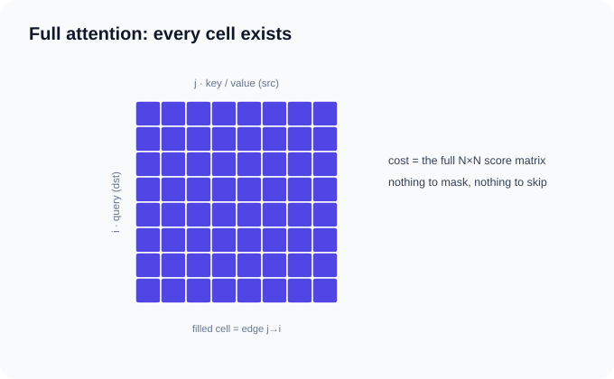
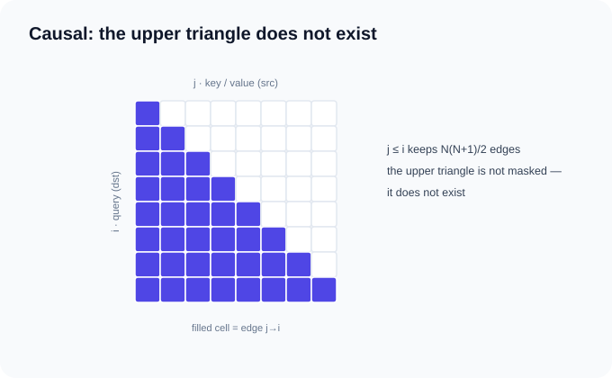
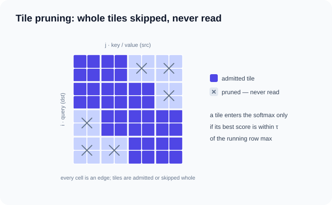

# Attention and dense relations

The first four examples require an NVIDIA GPU and the `cuda` extra; GAT selects
CPU/CUDA according to availability. Core snippets omit setup; run the complete
linked scripts. Install Torch separately before Tiga.

Attention-style workloads expressed with generic relation and reducer
semantics. The mask is never code — it is the graph: a dense relation is full
attention, a triangular relation is causal attention, and a block-diagonal CSR
is varlen causal attention with `cu_seqlens`. Tile pruning is a separate,
approximate semantic layered on the same online-softmax reducer.

- [`python examples/full_attention.py`](https://github.com/walkerchi/TIGA-lang/blob/main/examples/full_attention.py)
- [`python examples/causal_dense_relation.py`](https://github.com/walkerchi/TIGA-lang/blob/main/examples/causal_dense_relation.py)
- [`python examples/varlen_causal_attention.py`](https://github.com/walkerchi/TIGA-lang/blob/main/examples/varlen_causal_attention.py)
- [`python examples/tile_pruned_attention.py`](https://github.com/walkerchi/TIGA-lang/blob/main/examples/tile_pruned_attention.py)
- [`python examples/gat_edge_attention.py`](https://github.com/walkerchi/TIGA-lang/blob/main/examples/gat_edge_attention.py)

<span id="dense-and-causal"></span>

## Full attention, no mask { #full-attention-no-mask }

**What it is.** Attention: each of the N positions carries a query vector, a
key vector and a value vector of width D. Every output position is a weighted
average of all value vectors, where the weights are a softmax over query·key
similarity scores — so the cost is the full N×N score matrix. With no mask,
every query attends to every key. In graph terms each edge (j→i) pairs
destination position i (the query) with source position j (the key and
value); a dense relation contains all N×N edges.



$$
s_{hij} = \langle k_{hj},\, q_{hi}\rangle \cdot D^{-1/2}, \qquad
\mathrm{out}_{hi} = \sum_{j} \frac{e^{s_{hij}}}{\sum_{l} e^{s_{hil}}}\, v_{hj}
$$

This is the exact special case of everything below — the same tiled
online-softmax machinery FlashAttention uses, with every tile admitted.

```python
--8<-- "examples/full_attention.py:core"
```

??? example "Full source: examples/full_attention.py (runs as-is)"

    ```python
    --8<-- "examples/full_attention.py"
    ```

??? info "Measured compilation artifacts (Ryzen 7 255 · RTX 5070 Ti)"

    === "CUDA"

        ```text
        ### FullAttentionTorchExecutor
        backend: cuda
        provider: triton-nvidia@3.6.0
        lowering: gf-kernel-to-ttir-dense-streaming-reduction
        passes: gf-verify-domain, gf-lower-domain-to-iter, gf-lower-iter-to-kernel, capture-structured-message, expand-reducer-regions, select-cartesian-coordinate-hierarchy, select-dense-query-neighbor-tile, lower-vector-contraction, lower-streaming-reducer-state, gf-kernel-to-ttir, provider-compile-serialized-ttir
        provider cache key: triton-nvidia | cuda:nvidia | 3.6.0 | 2.11.0+cu128 | af81e84448f193cc | cuda:120:warp32
        accepted: [machine-schedule] admitted dense-query-key-tile
        unknown: [pipeline] no compiler-controlled asynchronous pipeline admitted
        remark: [planning] Cartesian relation remained implicit
        remark: [planning] multi-value message and reducer state were fused into tiles
        remark: [planning] no pairwise score or normalized-weight tensor was materialized
        variant cache: hits=0, misses=1
        ```

## Causal dense relation { #causal-dense-relation }

**What it is.** Causal attention is attention with a look-ahead ban:
position i may average only over positions j ≤ i. This is the rule in
language models that generate text left to right, where each position may
only read the past. The example expresses the mask as the graph itself: a
triangular relation contains exactly the edges (j→i) with j ≤ i, so the
edge function needs no masking code at all. As above, source j supplies
the key and value, destination i supplies the query.



$$
s_{hij} = \langle k_{hj},\, q_{hi}\rangle \cdot D^{-1/2} \quad (j \le i), \qquad
\mathrm{out}_{hi} = \sum_{j \le i} \frac{e^{s_{hij}}}{\sum_{l \le i} e^{s_{hil}}}\, v_{hj}
$$

`Graph.triangular()` carries the lower-inclusive topology through
Domain → Iter → Kernel, and an ordinary online reducer lowers to causal
streaming TTIR. Torch appears only as external CUDA storage.

```python
--8<-- "examples/causal_dense_relation.py:core"
```

??? example "Full source: examples/causal_dense_relation.py (runs as-is)"

    ```python
    --8<-- "examples/causal_dense_relation.py"
    ```

??? info "Measured compilation artifacts (Ryzen 7 255 · RTX 5070 Ti)"

    === "CUDA"

        ```text
        ### CausalWeightedValueTorchExecutor
        backend: cuda
        provider: triton-nvidia@3.6.0
        lowering: gf-kernel-to-ttir-dense-streaming-reduction
        passes: gf-verify-domain, gf-lower-domain-to-iter, gf-lower-iter-to-kernel, capture-structured-message, expand-reducer-regions, select-cartesian-coordinate-hierarchy, select-dense-query-neighbor-tile, lower-vector-contraction, lower-streaming-reducer-state, gf-kernel-to-ttir, provider-compile-serialized-ttir
        provider cache key: triton-nvidia | cuda:nvidia | 3.6.0 | 2.11.0+cu128 | af81e84448f193cc | cuda:120:warp32
        accepted: [machine-schedule] admitted dense-query-key-tile
        unknown: [pipeline] no compiler-controlled asynchronous pipeline admitted
        remark: [planning] Cartesian relation remained implicit
        remark: [planning] multi-value message and reducer state were fused into tiles
        remark: [planning] no pairwise score or normalized-weight tensor was materialized
        variant cache: hits=0, misses=1
        ```

## Varlen causal attention by graph composition { #varlen-causal-attention-with-cu_seqlens }

**What it is.** Real training batches pack many sequences of different
lengths into one flat tensor and mark the boundaries with cumulative lengths
`cu_seqlens = [0, L₁, L₁+L₂, …]` (the convention of flash-attn's varlen API).
Each sequence attends causally **within itself only** — position i may read
position j only when both lie in the same sequence and j ≤ i. As a mask that
is a block-diagonal matrix of small triangles; as a graph it is one explicit
CSR relation with exactly those edges, Σ L(L+1)/2 of them. Boundary handling
needs no code: cross-sequence attention is an edge that does not exist.

![A 5×5 attention matrix for cu_seqlens = [0, 3, 5]: two block-diagonal causal triangles — positions 0–2 attend within sequence 0 and positions 3–4 within sequence 1; every cross-sequence cell has no edge.](../assets/examples/varlen-causal-attention.svg)

$$
\mathrm{out}_{hi} = \sum_{\substack{j \le i \\ \mathrm{seq}(j)=\mathrm{seq}(i)}}
\frac{e^{s_{hij}}}{\sum_{\substack{l \le i \\ \mathrm{seq}(l)=\mathrm{seq}(i)}} e^{s_{hil}}}\, v_{hj},
\qquad
\mathrm{seq}(i) = b \;\Leftrightarrow\; \mathrm{cu}_b \le i < \mathrm{cu}_{b+1}
$$

The example composes per-sequence triangular graphs with `tg.Graph.cat`, then
runs the same unmasked edge UDF, including a length-1 sequence. Block `k` attends
only within itself. `cat` currently materializes CSR, not an implicit composite
relation. The compatibility constructor `tg.Graph.cu_seqlens(boundaries, causal=True)`
produces the same relation when cumulative boundaries begin with zero. (The tests check
all three attention examples against `F.scaled_dot_product_attention`.)
Execution falls back to the
exact eager oracle today: compiled streaming covers the dense/triangular
relations above and field-score CSR segment softmax, while an edge-computed
score over a general CSR is a compiler boundary, not a semantic one.

```python
--8<-- "examples/varlen_causal_attention.py:core"
```

??? example "Full source: examples/varlen_causal_attention.py (runs as-is)"

    ```python
    --8<-- "examples/varlen_causal_attention.py"
    ```

??? info "Measured compilation artifacts (Ryzen 7 255 · RTX 5070 Ti)"

    === "CUDA"

        ```text
        ### VarlenCausalAttentionTorchExecutor
        backend: reference
        provider: torch
        lowering: (unspecified)
        passes: validate-domain, select-reference-csr
        remark: [planning] reference evaluator selected; no performance codegen artifact exists
        remark: [planning] cross-apply fusion is handled by the @tg.jit/@tg.program capture boundary rather than the single-apply reference evaluator
        variant cache: hits=0, misses=1
        ```

<span id="sparse-and-pruned"></span>

## Tile-pruned sparse attention { #tile-pruned-sparse-attention }

### Why skip a tile? { #why-prune-a-tile }

This is an **experimental accuracy/performance tradeoff**, not a required part
of attention. Exact attention scores every allowed key and accumulates values
with softmax weights. If a whole key block scores very poorly, loading and
accumulating its values may contribute little. A tile pairs a small query block
with a small key block, matching the GPU's blockwise execution.

For example, with a running maximum score of 10 and a new tile maximum of 1,
the ratio of their exponential weights is approximately:

$$
\exp(1 - 10) \approx 0.00012
$$

`block_prune_threshold=0.01` skips that tile. This is a query-block comparison,
not a per-query error guarantee: many omitted terms or large values can still
cause substantial output error.

| Still executed | Skipped for a pruned tile |
|---|---|
| Key loads, query/key scores, threshold comparison | Value loads and subsequent softmax/value accumulation |

Pruning does not eliminate all score computation or guarantee a speedup. Larger
thresholds prune more aggressively. Omit `block_prune_threshold` for exact
computation; zero is not a valid threshold. Only the specified generated-CUDA
dense forward path supports pruning; backward does not. The example's
`width / nodes` is an illustrative choice, not a general tuning formula.

### Admission rule and limitations { #tile-admission-rule }

**What it is.** Same attention as the first example, but approximate: tile
pruning processes the keys in blocks (tiles) and skips any tile whose best
score is far below the running query-block maximum. The threshold alone is
not a bound on total omitted probability or output error: those also depend
on omitted tile count and value magnitudes. Validate accuracy for each workload.
FlashAttention is the exact special case where every tile is admitted; this
example adds the admission rule.



The near-diagonal pattern is illustrative, not a fixed local window: actual
admission depends on the data's scores.

$$
s_{hij} = \langle k_{hj},\, q_{hi}\rangle \cdot D^{-1/2}, \qquad
\mathrm{out}_{hi} = \sum_{j} \frac{e^{s_{hij}}}{\sum_{l} e^{s_{hil}}}\, v_{hj}
$$

The emitter compares the maximum score across the entire query/key tile with
the running maximum for that query block. In natural-log score units, the
admission rule uses the ratio `rho = block_prune_threshold`:

$$
m_{\mathrm{tile}} \ge m_{\mathrm{run,block}} + \ln(\rho),
\qquad 0 < \rho \le 1
$$

The TTIR implementation uses base-2 scores and `log2(rho)` equivalently.
Key loads and score computation happen before this decision; pruning skips
value loads and the subsequent softmax/value accumulation.


How the threshold works: it is a **constructor parameter of the built-in
`tg.online_softmax()` reducer that the compiler recognizes structurally** —
not a reducer subclass mechanism. The threshold rides the reducer's
specialization key into the `gf.reducer` IR as an optional attribute, and
only the generated-CUDA dense streaming provider acts on it, emitting a
dynamic `scf.if` in the tile loop that skips a low-score tile's payload
entirely. Every other path — eager oracle, native CSR, edge-nn attention,
and all backward passes — fails closed rather than silently substituting
exact softmax, so the approximation is always an explicit choice.

Subclassing `tg.Reducer` cannot reproduce this: the structured-dense
lowering accepts only the built-in online-softmax structure, and the tile
admission logic is written into the TTIR emitter, not derived from user
algebra. Subclassing `OnlineSoftmaxReducer` and setting
`block_prune_threshold` works — but that is the same built-in parameter,
not a new extension point.

```python
--8<-- "examples/tile_pruned_attention.py:core"
```

??? example "Full source: examples/tile_pruned_attention.py (runs as-is)"

    ```python
    --8<-- "examples/tile_pruned_attention.py"
    ```

??? info "Measured compilation artifacts (Ryzen 7 255 · RTX 5070 Ti)"

    === "CUDA"

        ```text
        ### TilePrunedAttentionTorchExecutor
        backend: cuda
        provider: triton-nvidia@3.6.0
        lowering: gf-kernel-to-ttir-dense-streaming-reduction
        passes: gf-verify-domain, gf-lower-domain-to-iter, gf-lower-iter-to-kernel, capture-structured-message, expand-reducer-regions, select-cartesian-coordinate-hierarchy, select-dense-query-neighbor-tile, lower-vector-contraction, lower-streaming-reducer-state, gf-kernel-to-ttir, provider-compile-serialized-ttir
        provider cache key: triton-nvidia | cuda:nvidia | 3.6.0 | 2.11.0+cu128 | af81e84448f193cc | cuda:120:warp32
        accepted: [machine-schedule] admitted dense-query-key-tile
        unknown: [pipeline] no compiler-controlled asynchronous pipeline admitted
        remark: [planning] Cartesian relation remained implicit
        remark: [planning] multi-value message and reducer state were fused into tiles
        remark: [planning] no pairwise score or normalized-weight tensor was materialized
        variant cache: hits=0, misses=1
        ```

<span id="graph-attention"></span>

## GAT edge attention with an nn score { #gat-edge-attention-with-an-nn-score }

**What it is.** Graph attention (GAT): instead of a dot product, each edge's
attention *score* is produced by a small neural network reading the edge
geometry and both endpoint features; the softmax over incoming edges then
weights the source features as before. The score network is where the
learnable capacity lives.

$$
s_e = \mathrm{MLP}\big(\,\text{pos}_j - \text{pos}_i \,\|\, x_j \,\|\, x_i\,\big),
\qquad
\mathrm{out}_i = \sum_{e\,=\,(j \to i)}
\frac{e^{s_e}}{\sum_{e'=(j' \to i)} e^{s_{e'}}}\, x_j
$$

The UDF is the first example's shape with one change — `tg.nn.trace(attn)`
produces the score. On CUDA this compiles to a row-centric fused kernel: one
program per destination row, the score MLP evaluated in registers per edge
chunk, the online-softmax state carried in loop registers — no [E, ·] score
or attention-weight tensor exists. Grad-mode calls take the fused backward
(score-chain replay + softmax Jacobian adjoint in-tile), so training
materializes nothing per edge either. The launch geometry follows the
attention defaults (`block_e=16, num_warps=1`); `tg.nn.trace` still accepts
explicit overrides.

```python
--8<-- "examples/gat_edge_attention.py:core"
```

??? example "Full source: examples/gat_edge_attention.py (runs as-is)"

    ```python
    --8<-- "examples/gat_edge_attention.py"
    ```

??? info "Measured compilation artifacts (Ryzen 7 255 · RTX 5070 Ti)"

    === "CUDA"

        ```text
        ### GATTorchExecutor
        backend: cuda
        provider: triton-nvidia@3.6.0
        lowering: gf-python-emit-edge-nn-attention-vjp
        passes: capture-edge-nn-subgraph, translate-fx-to-message-dag, prove-edge-nn-attention-structure, python-emit-edge-nn-attention-ttir, symbolic-edge-nn-attention-vjp, python-emit-edge-nn-attention-vjp-ttir, provider-compile-serialized-ttir
        provider cache key: triton-nvidia | cuda:nvidia | 3.6.0 | 2.11.0+cu128 | af81e84448f193cc | cuda:120:warp32
        remark: [planning] training path: forward persists only the O(N) softmax state (m, l); backward replays the score chain per row chunk — no [E, ·] tensor in either direction
        variant cache: hits=0, misses=2
        ```
