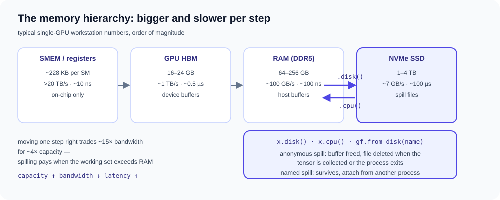

# Distributed and memory hierarchy

Multi-process graph execution and explicit memory-tier accounting. Both
examples keep the user kernel unchanged; placement and exchange are derived
below it.

- [`python examples/distributed_halo.py`](https://github.com/walkerchi/TIGA-lang/blob/main/examples/distributed_halo.py)
- [`python examples/hierarchical_memory.py`](https://github.com/walkerchi/TIGA-lang/blob/main/examples/hierarchical_memory.py)
- [`python examples/paged_giant_graph.py`](https://github.com/walkerchi/TIGA-lang/blob/main/examples/paged_giant_graph.py)
- [`python examples/auto_offload.py`](https://github.com/walkerchi/TIGA-lang/blob/main/examples/auto_offload.py)

### Distributed execution { #distributed-execution }

## Two-process halo exchange { #two-process-halo-exchange }

**What it is.** *Sharding* splits a graph across cooperating processes so
that each process owns only a slice of the nodes and their data. When a
node's computation reads a neighbor owned by another process, that neighbor
is a *halo* (ghost) node whose value must be copied across the process
boundary — the *halo exchange*. The example also differentiates the
computation: a vector-Jacobian product (VJP) propagates gradients of a
scalar loss back to the inputs with no hand-written backward pass.
Concretely, the graph is an 8-node ring with node values `x[i] = i`; each
output sums the values of the node itself and its two ring neighbors. Rank 0
owns nodes 0–3, rank 1 owns nodes 4–7, so `out[3]` and `out[4]` each need
one value from the other rank.

![An 8-node ring sharded across two processes: rank 0 owns nodes 0–3, rank 1 owns nodes 4–7; a ghost copy of x[4] crosses the boundary so rank 0 can compute out[3], and its gradient flows back](../assets/examples/distributed-halo.svg)

$$
\mathrm{out}_i = x_{(i-1)\bmod 8} + x_i + x_{(i+1)\bmod 8},
\qquad x_i = i,
\qquad \frac{\partial \sum_i \mathrm{out}_i}{\partial x_j} = 3 .
$$

The example saves one versioned `.gfg`, reopens the same ordinary `Graph`
on two processes, reads only each rank's destination/edge pages, and runs
rank-local `Graph.halo()` MessagePassing plus the automatic VJP. The
compiler/runtime derives the forward owner→ghost exchange and the reverse
ghost-cotangent→owner accumulation below the unchanged user kernel.

```python
--8<-- "examples/distributed_halo.py:core"
```

??? example "Full source: examples/distributed_halo.py (runs as-is)"

    ```python
    --8<-- "examples/distributed_halo.py"
    ```

## Running across processes and machines { #running-across-processes-and-machines }

The example above spawns two local processes for portability. The same
program runs under a real MPI launcher by swapping the transport — ranks and
world size come from the MPI communicator, and Tiga reads no rank
environment variables:

```python
from mpi4py import MPI
import tiga as gf
from tiga.distributed import DistributedRuntime

world = MPI.COMM_WORLD
graph = gf.load("ring.gfg").halo(gf.DeviceMesh("cpu", world.Get_size()), depth=1)
with DistributedRuntime.from_provider("mpi", communicator=world):
    out = NeighborSum()(graph=graph, src={"x": local_x}, dst={})
```

```bash
mpiexec -n 2 python mpi_halo.py                  # two local ranks
mpiexec -np 2 -H host1,host2 python mpi_halo.py  # across machines
```

A multi-host run needs no Tiga-side change: mpi4py hands the
communicator — network included — to the runtime, which derives the same
owner/ghost halo maps from the graph. Because the graph is a paged `.gfg`,
each rank reads only its own rows from disk; no rank ever holds the whole
adjacency in RAM. The validated configuration is two local MPICH processes
(forward and VJP, byte-exact); multi-host uses the identical API, and the
NCCL device transport is currently validated at rank-one loopback only.

A dependency-free alternative is the stdlib TCP transport: rank zero hosts
a rendezvous, the remaining ranks join through it, and the world brings up
a full mesh of sockets with a validated rank handshake:

```python
from tiga.distributed import DistributedRuntime, TCPTransport

transport = TCPTransport.host(rank=0, world_size=2, port=29617)                    # rank 0 listens
transport = TCPTransport.join(rank=1, world_size=2, host="10.0.0.1", port=29617)  # rank 1 dials
with DistributedRuntime(transport):
    out = NeighborSum()(graph=graph, src={"x": local_x}, dst={})
```

MPI is the battle-tested path for multi-host runs; the stdlib TCP transport
is the dependency-free option, currently validated over loopback.

### Memory hierarchy { #memory-hierarchy }

## Spilling tensors to disk { #spilling-tensors-to-disk }

**What it is.** Computers store data in a *memory hierarchy*: small, fast,
expensive tiers in front of larger, slower, cheaper ones. When a working set
exceeds RAM, *spilling* moves a tensor to NVMe (Non-Volatile Memory Express)
storage and frees its buffer; any later read transparently *restores* it.
The API is two chainable methods on a tensor: `.disk()` writes, `.cpu()`
reads back — the files are managed by Tiga, not the caller.



The lifecycle contract:

- **anonymous** `x.disk()` — the spill file lives in a per-process temporary
  directory and is deleted when the tensor is collected or the process exits;
- **named** `x.disk(name="...")` — the file persists in
  `TIGA_SPILL_DIR` (or `~/.cache/tiga/spill`), and another
  process attaches it with `gf.from_disk(name)`, payload loaded lazily on
  first use.

The example spills an eight-element tensor RAM → NVMe → RAM and then
re-spills it under a name. Under the hood the same bytes feed the
capacity/version-accounted `HierarchyRuntime` instances that compiler bundle
plans consume — see
[memory hierarchy and distributed execution](../memory-and-distributed.md).

```python
--8<-- "examples/hierarchical_memory.py:core"
```

??? example "Full source: examples/hierarchical_memory.py (runs as-is)"

    ```python
    --8<-- "examples/hierarchical_memory.py"
    ```

## A disk-resident giant graph { #a-disk-resident-giant-graph }

**What it is.** When the graph itself — not just the tensors on it — exceeds
RAM, *paging* keeps the topology (the CSR adjacency) on disk and reads it in
bounded destination-row pages, one page resident at a time. A background
thread *prefetches* page k+1 from disk while page k computes, so the
[kernel](https://en.wikipedia.org/wiki/Compute_kernel) never waits on the
disk. Because destination rows are independent, each page runs through the
unchanged native MessagePassing path and any
[reducer](https://en.wikipedia.org/wiki/Fold_(higher-order_function))
produces exactly the global per-row result. Fields can join the topology on
disk: `gf.save(graph, path, fields={"src": ..., "edge": ...})` persists them
as fixed-width rows, `gf.load(path).fields("src", requires_grad=True)`
returns lazily-read shells, and both the forward pass and
`gf.autograd.grad` then run paged — the only boundary left is CPU-only.

The round trip is three phases on one unchanged kernel:

$$
\text{build} \xrightarrow{\texttt{gf.save}} \texttt{.gfg on disk}
\xrightarrow[\text{stream pages}]{\texttt{gf.load} + \text{MessagePassing}}
\text{result} \xrightarrow{\texttt{out.disk(name=...)}} \text{NVMe}
\xrightarrow{\texttt{gf.from\_disk}} \text{reattach} .
$$

The example builds a 1000×1000 four-neighbor stencil (1M nodes, ~4M edges),
persists it once with `gf.save`, reopens it with `gf.load` — which reads only
the manifest, leaving the CSR on disk — runs one Jacobi smoothing step over
100k-row pages with prefetch on, spills the result under a stable name, and
reattaches it with `gf.from_disk` to verify the checksum survives the
disk → JIT → disk round trip.

Measured on a 2000×2000 stencil (4M nodes, ~16M edges, NVMe ext4, Ryzen
7 255) with `benchmarks/memory_hierarchy/paged_giant_graph.py` — identical
checksum in every row:

| page_rows | prefetch | pages | elapsed | peak RSS |
|---|---|---|---|---|
| 4,000,000 (one page) | off | 1 | 34.1 s | 3.34 GB |
| 100,000 | off | 40 | 37.7 s | 1.08 GB |
| 100,000 | on | 40 | 36.6 s | 1.09 GB |

Peak RSS tracks the page size, not the graph size (3.1× lower here, and the
gap grows with the graph). Prefetch recovers most of the paging overhead;
the remainder is page setup, not disk latency — with slower storage the
overlap matters more.

```python
--8<-- "examples/paged_giant_graph.py:core"
```

??? example "Full source: examples/paged_giant_graph.py (runs as-is)"

    ```python
    --8<-- "examples/paged_giant_graph.py"
    ```

## Automatic offload under a RAM budget { #automatic-graph-offload }

**What it is.** The explicit `gf.save`/`gf.load` dance above exists for
cross-process handoff. When the goal is simply "do not let the topology
exceed RAM", a budget does the paging decision: while
`gf.runtime.auto_offload(ram=...)` is active, every CSR builder
(`Graph.from_csr`, `Graph.stencil`, `Graph.cat`, ...) checks the CSR byte
size and, over budget, persists the topology and returns a paged graph —
the unchanged kernel call then streams pages with prefetch, no `gf.save` /
`gf.load` in sight:

```python
--8<-- "examples/auto_offload.py:core"
```

??? example "Full source: examples/auto_offload.py (runs as-is)"

    ```python
    --8<-- "examples/auto_offload.py"
    ```

The pipeline depth — pages read ahead concurrently — defaults to 2 and is
tunable per call (`prefetch_depth=4`) or process-wide
(`TIGA_PAGED_PREFETCH_DEPTH`); page size follows `page_rows=` or
`TIGA_PAGED_PAGE_ROWS`. Offloaded graphs land in a per-process
directory cleaned up at exit, or under `TIGA_SPILL_DIR` when the
graph should outlive the process. The remaining boundary is CPU graphs only;
fields can be offloaded too via `gf.save(..., fields=...)`, and both forward
and backward run paged.
??? info "Measured compilation artifacts (Ryzen 7 255 · RTX 5070 Ti)"

    === "This machine"

        ```text
        ### Smoothing
        backend: cpu:0
        provider: tiga-runtime
        lowering: gf-tensor-relation-autograd
        passes: bind-static-csr-snapshot, capture-message-passing-udf, analyze-reducer-algebra, lower-csr-to-gather-segment, fuse-edge-node-regions
        remark: [planning] edge/node UDFs remain in the differentiable Tensor DAG
        remark: [planning] gf-tensor-vjp generates CSR gather/segment-sum adjoints
        remark: [planning] reducer lowering: builtin-additive-state
        executable cache: hits=0, misses=10
        ```
