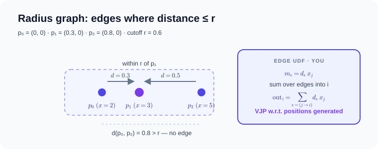
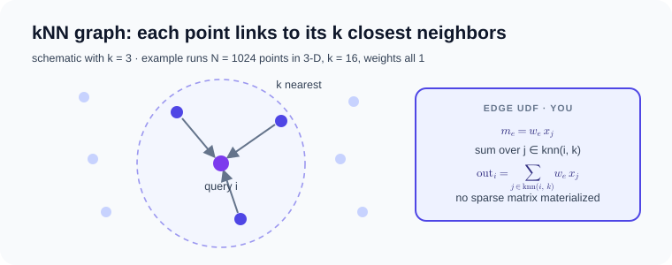

# Dynamic and generated relations

Topology generated from positions rather than imported as CSR. Relation
realization and reuse are provider decisions below an unchanged user UDF.

- [`python examples/radius_autograd.py`](https://github.com/walkerchi/TIGA-lang/blob/main/examples/radius_autograd.py)
- [`python examples/knn_message_passing.py`](https://github.com/walkerchi/TIGA-lang/blob/main/examples/knn_message_passing.py)

## Differentiable radius relation { #differentiable-radius-relation }

**What it is.** A radius graph is built from point positions: two points are
connected whenever their Euclidean distance is at most a cutoff r, so the
topology is computed from the data rather than stored. On this graph the
example runs a message-passing sum — every node i collects, from each
neighbor j inside the cutoff, the neighbor's value `x[j]` weighted by the
distance between them. It then asks for the gradient of the output with
respect to the positions and the values: a vector–Jacobian product (VJP),
the backward pass of the same computation.



$$
\text{out}_i \;=\; \sum_{e\,=\,(j \to i),\; \lVert p_j - p_i \rVert \,\le\, r} \lVert p_j - p_i \rVert \cdot x_j
$$

The example stays Torch-free: the relation is rebuilt from the current
position snapshot, `edge.distance` is differentiable with periodic-capable
minimum-image geometry, and `gf.autograd.grad` differentiates through the
radius relation itself, generating the position and source VJPs on one fixed
topology snapshot.

```python
--8<-- "examples/radius_autograd.py:core"
```

??? example "Full source: examples/radius_autograd.py (runs as-is)"

    ```python
    --8<-- "examples/radius_autograd.py"
    ```

??? info "Measured compilation artifacts (Ryzen 7 255 · RTX 5070 Ti)"

    === "CPU"

        ```text
        ### DistanceWeightedSum
        backend: cpu:0
        provider: tiga-runtime
        lowering: gf-tensor-relation-autograd
        passes: materialize-fixed-radius-snapshot, capture-message-passing-udf, analyze-reducer-algebra, lower-csr-to-gather-segment, fuse-edge-node-regions
        remark: [planning] edge/node UDFs remain in the differentiable Tensor DAG
        remark: [planning] gf-tensor-vjp generates CSR gather/segment-sum adjoints
        remark: [planning] reducer lowering: builtin-additive-state
        executable cache: hits=0, misses=1
        ```

    === "CUDA"

        ```text
        ### DistanceWeightedSum
        backend: cuda:0
        provider: tiga-runtime
        lowering: gf-tensor-relation-autograd
        passes: materialize-fixed-radius-snapshot, capture-message-passing-udf, analyze-reducer-algebra, lower-csr-to-gather-segment, fuse-edge-node-regions
        remark: [planning] edge/node UDFs remain in the differentiable Tensor DAG
        remark: [planning] gf-tensor-vjp generates CSR gather/segment-sum adjoints
        remark: [planning] reducer lowering: builtin-additive-state
        executable cache: hits=0, misses=1
        ```

## Exact kNN feeding MessagePassing { #exact-knn-feeding-messagepassing }

**What it is.** k-nearest neighbors (kNN): given N points, find for each
point the k closest other points (here by squared Euclidean distance, self
excluded). The example turns each point's k neighbors into graph edges and
runs a message-passing sum over them: every point accumulates its neighbors'
values `x[j]` multiplied by an edge weight (all ones here, so the result is
a plain neighbor sum).



$$
\text{out}_i \;=\; \sum_{j\,\in\,\mathrm{knn}(i,\,k)} w_{(j \to i)} \cdot x_j
$$

Exact kNN stays procedural: the current position snapshot is rebuilt lazily
and its fixed-k compressed sparse row (CSR) ABI is rebound to one generated
MessagePassing TTIR consumer. Selection and consume are separate contracts,
fused into a single launch — no CSR row pointer or selected-column tensor is
materialized.

```python
--8<-- "examples/knn_message_passing.py:core"
```

??? example "Full source: examples/knn_message_passing.py (runs as-is)"

    ```python
    --8<-- "examples/knn_message_passing.py"
    ```

??? info "Measured compilation artifacts (Ryzen 7 255 · RTX 5070 Ti)"

    === "CUDA"

        ```text
        ### NeighborSumTorchExecutor
        backend: cuda
        provider: triton-nvidia@3.6.0
        lowering: gf-kernel-to-ttir-ranked-select-consume
        passes: gf-verify-domain, gf-lower-domain-to-iter, gf-lower-iter-to-kernel, capture-ranked-relation, select-ranked-pairs-coordinate-hierarchy, select-candidate-tile, emit-local-stable-topk, emit-hierarchical-topk-merge, fuse-selected-edge-consumer, gf-kernel-to-ttir, provider-compile-serialized-ttir
        provider cache key: triton-nvidia | cuda:nvidia | 3.6.0 | 2.11.0+cu128 | af81e84448f193cc | cuda:120:warp32
        remark: [planning] exact candidate ranking and edge consumption share one launch
        remark: [planning] candidate tiles retain a power-of-two padded stable key state
        remark: [planning] no CSR row pointer or selected column tensor is materialized
        executable cache: hits=0, misses=1
        ```
