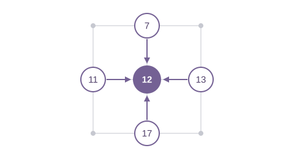

# 动态与生成式关系 { #dynamic-and-generated-relations }

关系既可以由坐标计算，也可以由规则生成；“生成式”不等于“每次调用都改变拓扑”。
以下示例直接使用 `torch.Tensor`，不需要额外包装。

| 关系 | 邻居由什么决定 | 典型用途 |
|---|---|---|
| `Graph.stencil` | 网格尺寸与固定偏移 | 图像滤波、规则网格上的局部更新 |
| `Graph.radius` | 点间距离与 cutoff | 粒子、空间邻域 |
| `Graph.knn` | 距离排名与 k | 固定邻居数的点云计算 |

## 规则网格上的五点 stencil { #regular-grid-stencil }

[Stencil](https://en.wikipedia.org/wiki/Stencil_(numerical_analysis)) 是一组固定的邻居偏移。
这里使用中心、上、下、左、右五个值的均值，做一次二维网格平滑。
它不是距离搜索，不需要 `positions` 或 kNN 建图。



`dims=(5, 5)` 表示 5 行 5 列，偏移按 `(行, 列)` 给出。
节点按行展开：坐标 `(2, 2)` 对应编号 `12`，四个邻居为 `7、17、11、13`。
`tg.stencil.von_neumann()` 宏默认包含中心点自身。

### 邻域 MACRO { #stencil-neighborhood-macros }

[Von Neumann](https://en.wikipedia.org/wiki/Von_Neumann_neighborhood) 使用
[Manhattan distance](https://en.wikipedia.org/wiki/Taxicab_geometry)；[Moore](https://en.wikipedia.org/wiki/Moore_neighborhood)
使用 [Chebyshev distance](https://en.wikipedia.org/wiki/Chebyshev_distance)。两者都展开距离 **不超过** `radius` 的整数偏移，
从 `dims` 自动推断维数，默认包含中心点。整数 Manhattan distance 的 `<= 1` 等价于 `< 2`。

| MACRO | 二维邻域 | 含中心的点数 |
|---|---|---|
| `tg.stencil.von_neumann()` | 中心与上、下、左、右 | 5 |
| `tg.stencil.von_neumann(2)` | 半径为 2 的菱形 | 13 |
| `tg.stencil.moore()` | 完整 3×3 邻域 | 9 |

```python
graph = tg.Graph.stencil((64, 64), device="cuda")  # 默认 von_neumann()。
graph = tg.Graph.stencil((64, 64), tg.stencil.moore(), device="cuda")
four_neighbors = tg.stencil.von_neumann(include_center=False)
offsets = four_neighbors.offsets(2)  # ((-1, 0), (0, -1), (0, 1), (1, 0))
```

仍可直接传入 offsets 元组。宏按字典序展开；edge 字段须与边界过滤后的顺序一致。
较小的周期网格可能让多个偏移绕回同一源点：这些边不会合并，会分别贡献消息。
完整参数见 [API reference](../api.zh.md#stencilvon_neumann)。

### 五点均值计算

$$
y_{r,c}=\frac{x_{r,c}+x_{r-1,c}+x_{r+1,c}+x_{r,c-1}+x_{r,c+1}}{5}
$$

```python
--8<-- "examples/stencil_message_passing.py:core"
```

调用 `run("cuda")` 返回结果和梯度，形状均为 `(5, 5)`。本例中心值为
`12.0`，左上角值为 `6.0`；总和对每个输入的梯度均为 `1.0`。

- `periodic=True`：越过边界后从另一侧绕回；因此左上角也有五个输入。
- `periodic=False`：跳过越界邻居，**不是零填充**；配合 `tg.mean()` 时，
  角点只平均三个有效值。
- 当前构造器尚未实现 zero/constant padding；删除一条边不等于发送零值消息，
  尤其会改变 `mean` 的分母。
- 当前 `Graph.stencil` 构造器会生成 [CSR](https://en.wikipedia.org/wiki/Sparse_matrix#Compressed_sparse_row_(CSR_or_CRS))。
  “按规则定义”不代表当前执行中省去了边数组。图尺寸与偏移不变时可复用同一张图。

运行 [`python examples/stencil_message_passing.py`](https://github.com/walkerchi/TIGA-lang/blob/main/examples/stencil_message_passing.py)；
默认使用 CUDA，无 GPU 环境可加 `--device cpu`。

??? example "完整源码：examples/stencil_message_passing.py"

    ```python
    --8<-- "examples/stencil_message_passing.py"
    ```

下面的 radius 与 kNN 则依赖点的位置。编译产物折叠区保留的是特定环境下的记录；
实际执行计划以 `kernel.explain()` 为准。

## Euclidean 与自定义距离 { #distance-metrics }

两种构造器都默认使用[欧氏距离](https://baike.baidu.com/item/欧几里得距离)。
[Cosine distance](https://en.wikipedia.org/wiki/Cosine_similarity) 是 1 减去 cosine similarity；距离越小，邻居越近。

| 构造器 | 当前距离支持 | 选边规则 |
|---|---|---|
| `Graph.radius(x, cutoff=r)` | 默认 Euclidean；可传 `metric` 函数 | 距离 ≤ cutoff |
| `Graph.knn(x, k=k)` | 目前只有 Euclidean，尚无 `metric` 参数 | 最近的 k 个候选点 |

```python
--8<-- "examples/distance_metrics.py:core"
```

`metric(src, dst, edge)` 每次接收一批候选点对，`src.position` 与 `dst.position`
形状为 `(P, D)`；额外的 `fields` 也会出现在源点与目标点对象中。
返回同设备、形状 `(P,)` 的浮点 Tensor，每个点对一个距离。
回调内可读 `edge.displacement`（周期情况下为 minimum-image 位移）；
`edge.distance` 是回调的返回结果，不是回调的输入。
可选的 `select(src, dst, edge)` 随后执行，可读 `edge.distance` 和 `edge.cutoff`，
返回 `(P,)` 的 bool Tensor，只能进一步过滤已有候选边。
本例使用 Torch 坐标与 Torch 回调；无 Torch 的原生回调须使用原生 Tensor 操作，当前仅支持 CPU。

本例 cosine radius 保留 similarity ≥ 0.75 的点对，排除自身，只连接节点 0 与 1 的两个方向。
任意自定义 metric 当前走 **all-pairs 正确性路径**，不能继续使用 Euclidean 的 cell-list 空间界限。
即使回调重新计算的就是 Euclidean distance，也会走这条路径；默认距离应省略 `metric`，
保留内置优化。自定义 metric 不代表已经具备融合 kernel 的性能。

Cosine kNN 当前通过先归一化**非零**向量实现：

$$
\|\hat{x}-\hat{y}\|_2^2 = 2\bigl(1-\cos(x,y)\bigr)
$$

除数值精度造成的并列外，两种距离排序一致。二分 kNN 的查询与 `candidates` 都须归一化。
这会改变图使用的坐标，不会把任何返回的 Euclidean 距离自动改成 cosine distance。
零向量或近零向量须提前拒绝或明确约定行为，不能直接套用这个等价关系。
离散的邻居选择不参与求导；受支持的选中边计算只对固定邻居集合上的连续运算求导。

运行 [`python examples/distance_metrics.py`](https://github.com/walkerchi/TIGA-lang/blob/main/examples/distance_metrics.py)，
默认 CUDA；可加 `--device cpu`。这个小例子显式物化 CSR 只是为了打印检查邻居。

## 可微的半径关系 { #differentiable-radius-relation }

**这是什么。** 半径图由点的位置构建：只要两点的[欧氏距离](https://baike.baidu.com/item/欧几里得距离)不超过截断半径 r，
就在它们之间连一条边，因此拓扑是从数据算出来的，而不是预先存储的。示例在
这张图上做一次消息传递求和：每个节点 i 收集截断半径内每个邻居 j 的值 `x[j]`，
并按两点间的距离加权。然后求输出对位置和取值的梯度，也就是
[向量–雅可比积（VJP）](https://en.wikipedia.org/wiki/Automatic_differentiation)——同一计算的反向 pass。


$$
\text{out}_i \;=\; \sum_{e\,=\,(j \to i),\; \lVert p_j - p_i \rVert \,\le\, r} \lVert p_j - p_i \rVert \cdot x_j
$$

示例使用 Torch Tensor 和 `torch.autograd.grad`。`edge.distance` 对已确定邻居
集合上的几何量可微；跨越 cutoff 时增加或删除边的离散决定不参与求导。

```python
--8<-- "examples/radius_autograd.py:core"
```

??? example "完整源码：examples/radius_autograd.py（可直接运行）"

    ```python
    --8<-- "examples/radius_autograd.py"
    ```

??? info "本机编译产物（Ryzen 7 255 · RTX 5070 Ti 实测）"

    === "CPU"

        ```text
        ### DistanceWeightedSum
        backend: cpu:0
        provider: tiga-runtime
        lowering: gf-tensor-relation-autograd
        passes: materialize-fixed-radius-snapshot, capture-message-passing-udf, analyze-reducer-algebra, lower-csr-to-gather-segment, fuse-edge-node-regions
        remark: [planning] edge/node UDFs remain in the differentiable Tensor DAG
        remark: [planning] gf-tensor-vjp generates CSR gather/segment-sum adjoints
        remark: [planning] reducer lowering: builtin-additive-state
        variant cache: hits=0, misses=1
        ```

    === "CUDA"

        ```text
        ### DistanceWeightedSum
        backend: cuda:0
        provider: tiga-runtime
        lowering: gf-tensor-relation-autograd
        passes: materialize-fixed-radius-snapshot, capture-message-passing-udf, analyze-reducer-algebra, lower-csr-to-gather-segment, fuse-edge-node-regions
        remark: [planning] edge/node UDFs remain in the differentiable Tensor DAG
        remark: [planning] gf-tensor-vjp generates CSR gather/segment-sum adjoints
        remark: [planning] reducer lowering: builtin-additive-state
        variant cache: hits=0, misses=1
        ```

## 精确 kNN 接入 MessagePassing { #exact-knn-feeding-messagepassing }

**这是什么。** [k 近邻](https://baike.baidu.com/item/K近邻算法)（kNN）：给定 N 个点，为每个点找出距离最近的另外
k 个点（这里按平方欧氏距离计算，排除自身）。示例把每个点的 k 个邻居当作
图的边，在其上做消息传递求和：每个点把邻居的值 `x[j]` 乘上边权后累加
（这里的边权全为 1，所以结果就是普通的邻居求和）。


$$
\text{out}_i \;=\; \sum_{j\,\in\,\mathrm{knn}(i,\,k)} w_{(j \to i)} \cdot x_j
$$

精确 kNN 仍然是过程式的：当前位置快照按需惰性重建，固定 k 的 CSR ABI
会重新绑定到一个生成的 MessagePassing TTIR 使用方。选取与使用是两个独立的
契约，但会融合成单次启动——不物化任何 CSR 行指针或选中列的张量。

```python
--8<-- "examples/knn_message_passing.py:core"
```

??? example "完整源码：examples/knn_message_passing.py（可直接运行）"

    ```python
    --8<-- "examples/knn_message_passing.py"
    ```

??? info "本机编译产物（Ryzen 7 255 · RTX 5070 Ti 实测）"

    === "CUDA"

        ```text
        ### NeighborSumTorchExecutor
        backend: cuda
        provider: triton-nvidia@3.6.0
        lowering: gf-kernel-to-ttir-ranked-select-consume
        passes: gf-verify-domain, gf-lower-domain-to-iter, gf-lower-iter-to-kernel, capture-ranked-relation, select-ranked-pairs-coordinate-hierarchy, select-candidate-tile, emit-local-stable-topk, emit-hierarchical-topk-merge, fuse-selected-edge-consumer, gf-kernel-to-ttir, provider-compile-serialized-ttir
        provider cache key: triton-nvidia | cuda:nvidia | 3.6.0 | 2.11.0+cu128 | af81e84448f193cc | cuda:120:warp32
        remark: [planning] exact candidate ranking and edge consumption share one launch
        remark: [planning] candidate tiles retain a power-of-two padded stable key state
        remark: [planning] no CSR row pointer or selected column tensor is materialized
        variant cache: hits=0, misses=1
        ```
