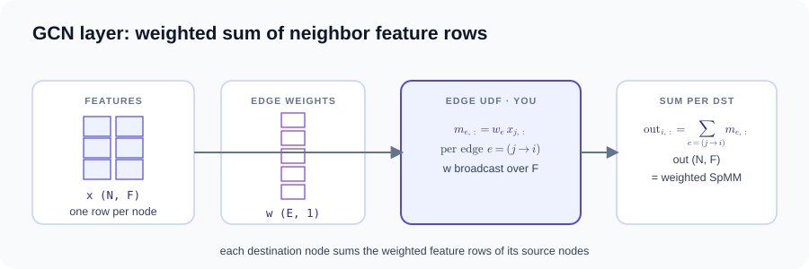
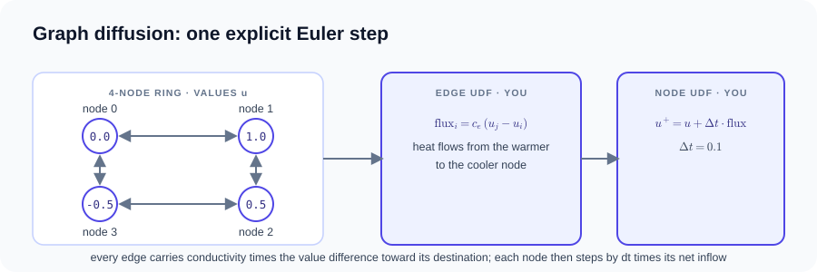
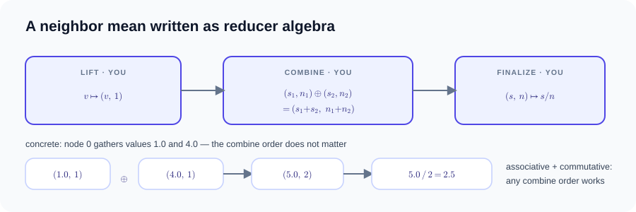
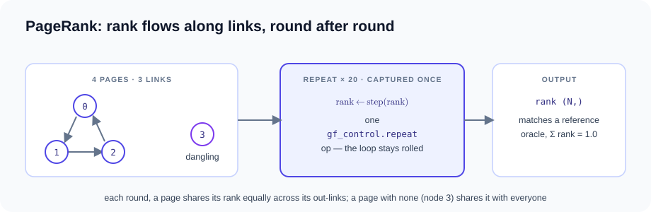

# 消息传递与图算法 { #message-passing-and-graph-algorithms }

输入和输出默认使用 Torch Tensor，通过 `torch.autograd.grad` 求导。
自定义 reducer 与 PageRank 控制流探针仍使用原生 Tensor，原因是当前 Torch
路径尚未覆盖这两类能力。以下“实测编译产物”是历史原生路径记录，
不是当前 Torch 示例运行必然生成的产物；实际计划以 `kernel.explain()` 为准。

静态拓扑的 MessagePassing 程序，以及一个固定迭代次数的图算法探针。
编译器生成关系遍历及其 VJP；用户只需编写 UDF。
[消息传递指南](../message-passing.md)介绍了该接口。每节只展示最核心的
代码片段；完整可运行的程序在折叠的源码块中，点开即可查看。

- [`python examples/message_passing_autograd.py`](https://github.com/walkerchi/TIGA-lang/blob/main/examples/message_passing_autograd.py)
- [`python examples/gcn.py`](https://github.com/walkerchi/TIGA-lang/blob/main/examples/gcn.py)
- [`python examples/diffusion.py`](https://github.com/walkerchi/TIGA-lang/blob/main/examples/diffusion.py)
- [`python examples/custom_reducer.py`](https://github.com/walkerchi/TIGA-lang/blob/main/examples/custom_reducer.py)
- [`python examples/compiler_probes/pagerank.py`](https://github.com/walkerchi/TIGA-lang/blob/main/examples/compiler_probes/pagerank.py)

<span id="basic-aggregation"></span>

## GCN 聚合 { #gcn-aggregation }

**是什么。** 一个图卷积网络（GCN）层：图中每个节点携带一个特征向量
（这里 F = 2），该层把每个节点的特征替换为指向它的节点的特征向量
之和，每条边各乘以一个标量权重。用线性代数的语言来说，这是一次加权的
[稀疏矩阵](https://baike.baidu.com/item/稀疏矩阵)–[矩阵乘法](https://baike.baidu.com/item/矩阵乘法)（SpMM）：加权邻接矩阵乘以特征矩阵。示例还将所有输出
之和对特征和权重反向求导。



$$
\text{out}_{i,f} \;=\; \sum_{e\,=\,(j \to i)} w_e \cdot x_{j,f}
$$

Torch 示例支持多特征聚合、边广播和自动梯度，张量形状与 GCN 一致。GCN 层是
用户代码，而不是库算子。

```python
--8<-- "examples/gcn.py:core"
```

??? example "完整源码：examples/gcn.py（可直接运行）"

    ```python
    --8<-- "examples/gcn.py"
    ```

??? info "本机编译产物（Ryzen 7 255 · RTX 5070 Ti 实测）"

    === "CPU"

        ```text
        ### WeightedFeatureAggregation
        backend: cpu:0
        provider: tiga-runtime
        lowering: gf-tensor-relation-autograd
        passes: bind-static-csr-snapshot, capture-message-passing-udf, analyze-reducer-algebra, lower-csr-to-gather-segment, fuse-edge-node-regions
        remark: [planning] edge/node UDFs remain in the differentiable Tensor DAG
        remark: [planning] gf-tensor-vjp generates CSR gather/segment-sum adjoints
        remark: [planning] reducer lowering: builtin-additive-state
        variant cache: hits=0, misses=1
        ```

    === "CUDA"

        ```text
        ### WeightedFeatureAggregation
        backend: cuda:0
        provider: tiga-runtime
        lowering: gf-tensor-relation-autograd
        passes: bind-static-csr-snapshot, capture-message-passing-udf, analyze-reducer-algebra, lower-csr-to-gather-segment, fuse-edge-node-regions
        remark: [planning] edge/node UDFs remain in the differentiable Tensor DAG
        remark: [planning] gf-tensor-vjp generates CSR gather/segment-sum adjoints
        remark: [planning] reducer lowering: builtin-additive-state
        variant cache: hits=0, misses=1
        ```

## 定向扩散 { #directional-diffusion }

**是什么。** 扩散：存储在图的节点上的某个量（热量、浓度）沿边从较大值
流向较小值，直到趋于均匀。流入一个节点的通量，是其所有入边上“边的
电导率乘以邻居值与自身值之差”的总和。示例在一个 4 节点环上推进一个
显式[欧拉步](https://baike.baidu.com/item/欧拉方法)——每个节点按小时间步长 Δt 乘以净通量移动——环上每个节点
都与两个邻居交换数值。



$$
\text{flux}_i \;=\; \sum_{e\,=\,(j \to i)} c_e \, (u_j - u_i),
\qquad
u^{+}_i \;=\; u_i + \Delta t \cdot \text{flux}_i
$$

字段 `u` 和边电导率都会获得编译器生成的梯度。

```python
--8<-- "examples/diffusion.py:core"
```

??? example "完整源码：examples/diffusion.py（可直接运行）"

    ```python
    --8<-- "examples/diffusion.py"
    ```

??? info "本机编译产物（Ryzen 7 255 · RTX 5070 Ti 实测）"

    === "CPU"

        ```text
        ### Diffusion
        backend: cpu:0
        provider: tiga-runtime
        lowering: gf-tensor-relation-autograd
        passes: bind-static-csr-snapshot, capture-message-passing-udf, analyze-reducer-algebra, lower-csr-to-gather-segment, fuse-edge-node-regions
        remark: [planning] edge/node UDFs remain in the differentiable Tensor DAG
        remark: [planning] gf-tensor-vjp generates CSR gather/segment-sum adjoints
        remark: [planning] reducer lowering: builtin-additive-state
        variant cache: hits=0, misses=1
        ```

    === "CUDA"

        ```text
        ### Diffusion
        backend: cuda:0
        provider: tiga-runtime
        lowering: gf-tensor-relation-autograd
        passes: bind-static-csr-snapshot, capture-message-passing-udf, analyze-reducer-algebra, lower-csr-to-gather-segment, fuse-edge-node-regions
        remark: [planning] edge/node UDFs remain in the differentiable Tensor DAG
        remark: [planning] gf-tensor-vjp generates CSR gather/segment-sum adjoints
        remark: [planning] reducer lowering: builtin-additive-state
        variant cache: hits=0, misses=1
        ```

<span id="custom-udfs-and-reducers"></span>

## 可微分的 MessagePassing UDF { #differentiable-messagepassing-udf }

**是什么。** 本示例把节点看作携带温度和
偏置的点，把边看作导体：每条边将自己的电导率乘以源节点的温度，转发给
目标节点，目标节点再加上自身的偏置。随后示例求总输出对每个输入的
导数，以向量–雅可比积（VJP）的形式返回——即前向计算的伴随——全程
无需手写任何反向代码。

该示例计算带有目标节点偏置的传导聚合，

$$
\text{out}_i \;=\; b_i \;+\; \sum_{e\,=\,(j \to i)} c_e \cdot T_j
$$

然后通过 `torch.autograd.grad` 对三个 Torch 输入求 `sum(out)` 的导数。
仅原生接口支持的 checkpoint 策略检查独立放在
[`python examples/native_checkpoint.py`](https://github.com/walkerchi/TIGA-lang/blob/main/examples/native_checkpoint.py)。

```python
--8<-- "examples/message_passing_autograd.py:core"
```

??? example "完整源码：examples/message_passing_autograd.py（可直接运行）"

    ```python
    --8<-- "examples/message_passing_autograd.py"
    ```

??? info "本机编译产物（Ryzen 7 255 · RTX 5070 Ti 实测）"

    === "CPU"

        ```text
        ### ConductiveAggregation
        backend: cpu:0
        provider: tiga-runtime
        lowering: gf-tensor-relation-autograd
        passes: bind-static-csr-snapshot, capture-message-passing-udf, analyze-reducer-algebra, lower-csr-to-gather-segment, fuse-edge-node-regions
        remark: [planning] edge/node UDFs remain in the differentiable Tensor DAG
        remark: [planning] gf-tensor-vjp generates CSR gather/segment-sum adjoints
        remark: [planning] reducer lowering: builtin-additive-state
        variant cache: hits=0, misses=1
        ```

    === "CUDA"

        ```text
        ### ConductiveAggregation
        backend: cuda:0
        provider: tiga-runtime
        lowering: gf-tensor-relation-autograd
        passes: bind-static-csr-snapshot, capture-message-passing-udf, analyze-reducer-algebra, lower-csr-to-gather-segment, fuse-edge-node-regions
        remark: [planning] edge/node UDFs remain in the differentiable Tensor DAG
        remark: [planning] gf-tensor-vjp generates CSR gather/segment-sum adjoints
        remark: [planning] reducer lowering: builtin-additive-state
        variant cache: hits=0, misses=1
        ```

## 用户自定义 reducer { #user-defined-reducer }

**是什么。** 当机器唯一能并行做的事是两两合并值时，如何计算均值。诀窍是
携带一个二元组——累计和与元素计数——而不是单个数：每个值 v 变成
(v, 1)，两个二元组按分量相加合并，最后一次除法把累积的二元组变成均值。
由于合并满足[结合律](https://baike.baidu.com/item/结合律)和[交换律](https://baike.baidu.com/item/交换律)，合并顺序——也即并行调度——是自由的。



$$
\text{lift}(v) = (v,\, 1)
\qquad
(s_l, n_l) \oplus (s_r, n_r) = (s_l + s_r,\; n_l + n_r)
\qquad
\text{mean}_i = \frac{s_i}{n_i}
$$

各方法分别在哪一步执行——下面用普通 Python 循环展示同一计算：

```python
for i in range(num_dst):                 # per destination node
    state = identity()                   # (0.0, 0.0) — before its edges
    for e in edges_into(i):
        message = edge(src, dst, edge)   # the edge() UDF, here src.value
        state = combine(state, lift(message))
    out[i] = finalize(state)             # s / n — after its edges

# node 0 traces:  (0.0, 0.0) → combine((0.0,0.0), lift(1.0)) = (1.0, 1)
#                          → combine((1.0,1),   lift(4.0))   = (5.0, 2)
#                          → finalize((5.0, 2)) = 2.5
```

上面的循环展示的是逻辑顺序，即一次左折叠。由于该代数声明了结合律和
交换律，编译器可以按任意顺序、或以树形方式合并——这正是并行调度可以
自由安排的原因。编译器证明元组状态按分量可加，对四个区域做 lowering，
并生成穿过均值的反向传播。

```python
--8<-- "examples/custom_reducer.py:core"
```

??? example "完整源码：examples/custom_reducer.py（可直接运行）"

    ```python
    --8<-- "examples/custom_reducer.py"
    ```

??? info "本机编译产物（Ryzen 7 255 · RTX 5070 Ti 实测）"

    === "CPU"

        ```text
        ### NeighborMean
        backend: cpu:0
        provider: tiga-runtime
        lowering: gf-tensor-relation-autograd
        passes: bind-static-csr-snapshot, capture-message-passing-udf, analyze-reducer-algebra, lower-csr-to-gather-segment, fuse-edge-node-regions
        remark: [planning] edge/node UDFs remain in the differentiable Tensor DAG
        remark: [planning] gf-tensor-vjp generates CSR gather/segment-sum adjoints
        remark: [planning] reducer lowering: proved-componentwise-additive-udf
        variant cache: hits=0, misses=1
        ```

    === "CUDA"

        ```text
        ### NeighborMean
        backend: cuda:0
        provider: tiga-runtime
        lowering: gf-tensor-relation-autograd
        passes: bind-static-csr-snapshot, capture-message-passing-udf, analyze-reducer-algebra, lower-csr-to-gather-segment, fuse-edge-node-regions
        remark: [planning] edge/node UDFs remain in the differentiable Tensor DAG
        remark: [planning] gf-tensor-vjp generates CSR gather/segment-sum adjoints
        remark: [planning] reducer lowering: proved-componentwise-additive-udf
        variant cache: hits=0, misses=1
        ```

<span id="iterative-control-flow"></span>

## 固定迭代的 PageRank 探针 { #fixed-iteration-pagerank-probe }

**是什么。** [PageRank](https://en.wikipedia.org/wiki/PageRank)：按重要性为网页排序的算法。每个页面以相等的
rank 开始；每一轮中，页面把自己的 rank 均分给它的出链，并收集经入链
到达的 rank，再与一个模拟随机跳转的小常数 (1 − damping)/N 混合。没有
出链的页面（悬挂节点）会让 rank 泄漏出系统，因此要把这部分 rank 均匀
重新分配给所有页面。本例：4 个页面、3 条链接、阻尼系数 0.85、20 轮。



$$
\text{base} = \frac{1-d}{N} + \frac{d}{N} \sum_{i\ \mathrm{dangling}} \text{rank}_i,
\qquad
\text{rank}'_i = \text{base} + d \sum_{e\,=\,(j \to i)} \frac{\text{rank}_j}{\mathrm{deg}^{\text{out}}_j}
$$

迭代是 `@tg.jit` 之下的普通 Python `for` 循环；20 次迭代被一次性捕获
为单个 `gf_control.repeat` 算子——循环保持卷起，不做展开（测试会对照
一个框架无关的参考实现，验证这一 IR 形状和 rank 数值）。这是编译器
探针，不是面向特定负载的核心算子，也不构成性能声明。

```python
--8<-- "examples/compiler_probes/pagerank.py:core"
```

??? example "完整源码：examples/compiler_probes/pagerank.py（可直接运行）"

    ```python
    --8<-- "examples/compiler_probes/pagerank.py"
    ```

??? info "本机编译产物（Ryzen 7 255 · RTX 5070 Ti 实测）"

    === "CPU"

        ```text
        ### PageRankStep
        backend: cpu:0
        provider: tiga-runtime
        lowering: gf-tensor-relation-autograd
        passes: bind-static-csr-snapshot, capture-message-passing-udf, analyze-reducer-algebra, lower-csr-to-gather-segment, fuse-edge-node-regions
        remark: [planning] edge/node UDFs remain in the differentiable Tensor DAG
        remark: [planning] gf-tensor-vjp generates CSR gather/segment-sum adjoints
        remark: [planning] reducer lowering: builtin-additive-state
        variant cache: hits=0, misses=1
        ```

    === "CUDA"

        ```text
        ### PageRankStep
        backend: cuda:0
        provider: tiga-runtime
        lowering: gf-tensor-relation-autograd
        passes: bind-static-csr-snapshot, capture-message-passing-udf, analyze-reducer-algebra, lower-csr-to-gather-segment, fuse-edge-node-regions
        remark: [planning] edge/node UDFs remain in the differentiable Tensor DAG
        remark: [planning] gf-tensor-vjp generates CSR gather/segment-sum adjoints
        remark: [planning] reducer lowering: builtin-additive-state
        variant cache: hits=0, misses=1
        ```
