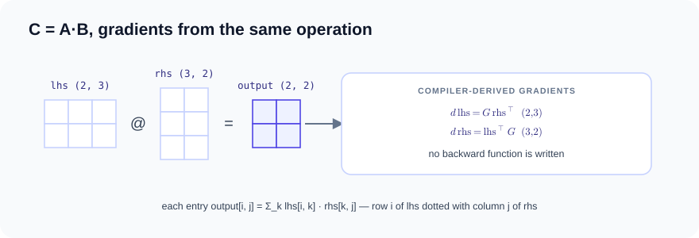
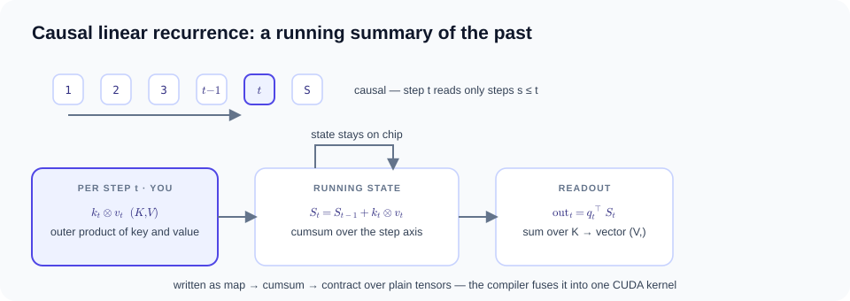
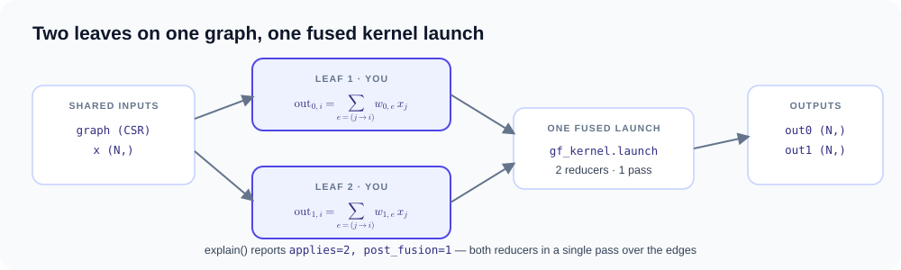
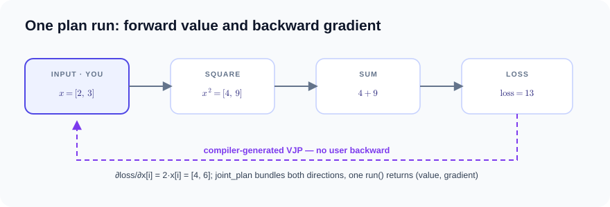
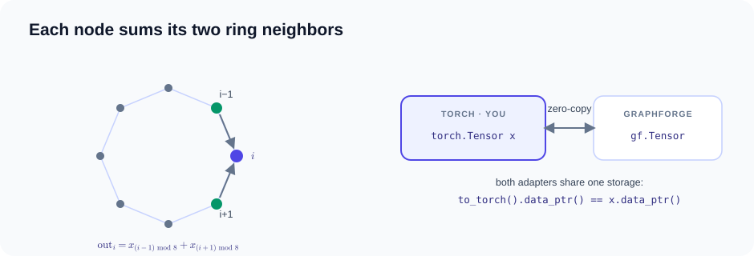
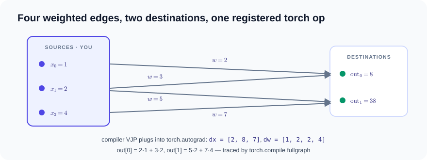
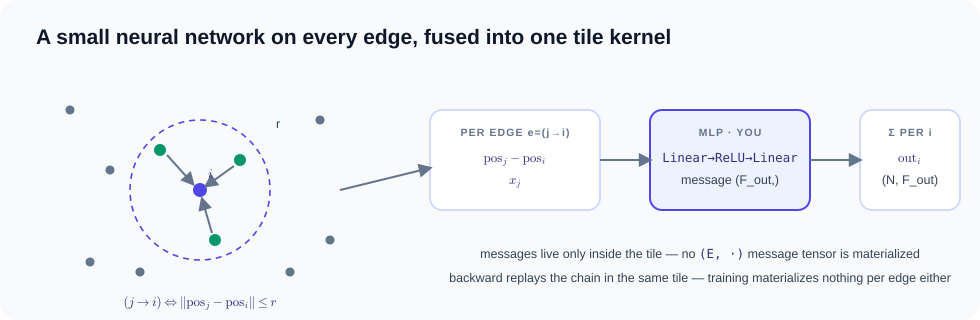

### Tensor expressions and autograd { #tensor-expressions-and-autograd }

## Matrix multiplication with derived gradients { #matrix-multiplication-with-derived-gradients }

Matrix multiplication combines an (M, K) matrix `lhs` with a (K, N) matrix
`rhs` into an (M, N) matrix whose entry (i, j) is the dot product of row i of
`lhs` with column j of `rhs`. When a scalar loss depends on the output, the
chain rule expresses the gradients of both operands as two further matrix
products with `G`, the upstream derivative of the loss with respect to the
output (the cotangent).



$$C = A\,B \quad\Longrightarrow\quad
\frac{\partial L}{\partial A} = G\,B^{\top}, \qquad
\frac{\partial L}{\partial B} = A^{\top}G, \qquad
G = \frac{\partial L}{\partial C}$$

`gf_tensor.matmul` is a first-class rank-2 contraction. The example lowers it
to CPU LLVM and FP16 GPU `tt.dot`, and the compiler derives the gradients of
both matrix operands — no backward function is written.

```python
--8<-- "examples/tensor_matmul.py:core"
```

??? example "Full source: examples/tensor_matmul.py (runs as-is)"

    ```python
    --8<-- "examples/tensor_matmul.py"
    ```

??? info "Measured compilation artifacts (Ryzen 7 255 · RTX 5070 Ti)"

    === "CPU"

        ```text
        ### output: Tensor IR (first lines)
        module {
          func.func @tensor_main(%arg0: tensor<2x3xf32>, %arg1: tensor<3x2xf32>) -> tensor<2x2xf32> {
            %0 = "gf_tensor.input"(%arg0) <{offset = 0 : i64, strides = array<i64: 3, 1>}> : (tensor<2x3xf32>) -> tensor<2x3xf32>
            %1 = "gf_tensor.input"(%arg1) <{offset = 0 : i64, strides = array<i64: 2, 1>}> : (tensor<3x2xf32>) -> tensor<3x2xf32>
            %2 = "gf_tensor.matmul"(%0, %1) : (tensor<2x3xf32>, tensor<3x2xf32>) -> tensor<2x2xf32>
            return %2 : tensor<2x2xf32>
          }
        }
        ```

    === "CUDA"

        ```text
        ### output: Tensor IR (first lines)
        module {
          func.func @tensor_main(%arg0: tensor<2x3xf32>, %arg1: tensor<3x2xf32>) -> tensor<2x2xf32> {
            %0 = "gf_tensor.input"(%arg0) <{offset = 0 : i64, strides = array<i64: 3, 1>}> : (tensor<2x3xf32>) -> tensor<2x3xf32>
            %1 = "gf_tensor.input"(%arg1) <{offset = 0 : i64, strides = array<i64: 2, 1>}> : (tensor<3x2xf32>) -> tensor<3x2xf32>
            %2 = "gf_tensor.matmul"(%0, %1) : (tensor<2x3xf32>, tensor<3x2xf32>) -> tensor<2x2xf32>
            return %2 : tensor<2x2xf32>
          }
        }
        ```

## Complex VJP { #complex-vjp }

Signal-processing and physics workloads often store data as complex numbers
a + bi, where i is the imaginary unit. Transposing such a tensor should only
change how it is indexed — a zero-copy view — not duplicate memory; a reshape
of that non-contiguous view then materializes the elements in view order.
Complex outputs also need a convention for differentiation, since ordinary
real derivatives do not apply directly: Tiga uses the conjugate-
Wirtinger convention, which treats x and its complex conjugate as independent
variables and requires an explicit cotangent for complex outputs. Under that
convention the squared magnitude |y|² has gradient 2·x.


$$y = \operatorname{vec}\!\left(x^{\top}\right), \qquad
e = \overline{y} \odot y, \qquad
\frac{\partial e}{\partial x} = 2x \;\; \text{(unit cotangent)}$$

The example exercises complex64 storage, strided zero-copy views and explicit
conjugate-Wirtinger cotangents on the native CPU runtime.

```python
--8<-- "examples/complex_autograd.py:core"
```

??? example "Full source: examples/complex_autograd.py (runs as-is)"

    ```python
    --8<-- "examples/complex_autograd.py"
    ```

??? info "Measured compilation artifacts (Ryzen 7 255 · RTX 5070 Ti)"

    === "CPU"

        ```text
        ### y: Tensor IR (first lines)
        module {
          func.func @tensor_main(%arg0: tensor<2x2xcomplex<f32>>) -> tensor<4xcomplex<f32>> {
            %0 = "gf_tensor.input"(%arg0) <{offset = 0 : i64, strides = array<i64: 2, 1>}> : (tensor<2x2xcomplex<f32>>) -> tensor<2x2xcomplex<f32>>
            %1 = "gf_tensor.permute"(%0) <{axes = array<i64: 1, 0>}> : (tensor<2x2xcomplex<f32>>) -> tensor<2x2xcomplex<f32>>
            %2 = "gf_tensor.reshape"(%1) <{shape = array<i64: 4>}> : (tensor<2x2xcomplex<f32>>) -> tensor<4xcomplex<f32>>
            return %2 : tensor<4xcomplex<f32>>
          }
        }
        ```

    === "CUDA"

        ```text
        ### y: Tensor IR (first lines)
        module {
          func.func @tensor_main(%arg0: tensor<2x2xcomplex<f32>>) -> tensor<4xcomplex<f32>> {
            %0 = "gf_tensor.input"(%arg0) <{offset = 0 : i64, strides = array<i64: 2, 1>}> : (tensor<2x2xcomplex<f32>>) -> tensor<2x2xcomplex<f32>>
            %1 = "gf_tensor.permute"(%0) <{axes = array<i64: 1, 0>}> : (tensor<2x2xcomplex<f32>>) -> tensor<2x2xcomplex<f32>>
            %2 = "gf_tensor.reshape"(%1) <{shape = array<i64: 4>}> : (tensor<2x2xcomplex<f32>>) -> tensor<4xcomplex<f32>>
            return %2 : tensor<4xcomplex<f32>>
          }
        }
        ```

## Linear recurrence from map/cumsum/contract { #linear-recurrence-from-mapcumsumcontract }

A recurrence produces each output step from the steps before it instead of
computing everything at once. This example is causal linear attention, the
core of several efficient sequence models: a sequence of S steps where step s
contributes a key vector k_s and a value vector v_s, and step t outputs a
blend of past values weighted by the similarity of each past key to the
current query q_t. "Causal" means step t may only read steps s ≤ t. Folded
into a recurrence, a running state accumulates the outer product k_s ⊗ v_s,
and each output is a readout of the query against that state.



$$S_t = \sum_{s \le t} k_s \otimes v_s, \qquad
\mathrm{out}_t = q_t^{\top} S_t$$

The expression is an ordinary Tensor map/cumsum/contract program — there is
no core linear-attention operator. On the registered CUDA shape family the
compiler recognizes the map → scan → contract structure and emits one
recurrent kernel whose state remains on chip.

```python
--8<-- "examples/linear_recurrence.py:core"
```

??? example "Full source: examples/linear_recurrence.py (runs as-is)"

    ```python
    --8<-- "examples/linear_recurrence.py"
    ```

??? info "Measured compilation artifacts (Ryzen 7 255 · RTX 5070 Ti)"

    === "CUDA"

        ```text
        ### output: execution record
        backend: cuda-ttir-triton
        compile_ms: 553.722441
        materialize_ms: 0.0
        saved_bytes: 0
        saved_compile_ms: 0.0
        checkpoint_plan: {'candidate_count': 0, 'delegated_candidate_count': 0, 'decisions': (), 'memory_budget_bytes': -1, 'spill_budget_bytes': 0, 'planned_saved_bytes': 0, 'planned_spilled_bytes': 0, 'actual_spilled_bytes': 0, 'spill_transfer_ms': 0.0, 'tiers': (), 'recompute_costs': (), 'live_intervals': (), 'peak_live_bytes': 0, 'peak_spill_bytes': 0, 'planning_ms': 0.0, 'native_load_ms': 0.0, 'ir': ''}
        cache_hit: False
        fast_math: False
        launch_ms: 0.154881
        artifact: triton-cache/034bf974a1da5e8f3e4103ba
        source: // tiga.tensor entry=gf_tensor_scan_contract block_rows=1 block_elements=16 num_warps=1 abi=arg0,arg1,arg2,out
        module {
          tt.func public @gf_tensor_scan_contract(%arg0: !tt.ptr<f32>, %arg1: !tt.ptr<f32>, %arg2: !tt.ptr<f32>, %out: !tt.ptr<f32>) attributes {noinline = false} {
            %pid_i32 = tt.get_program_id x : i32
            %pid = arith.extui %pid_i32 : i32 to i64
            %value_tiles = arith.constant 1 : i64
            %lane = arith.divui %pid, %value_tiles : i64
            %value_tile = arith.remui %pid, %value_tiles : i64
            %k_i32 = tt.make_range {end = 16 : i32, start = 0 : i32} : tensor<16xi32>
            %v_i32 = tt.make_range {end = 16 : i32, start = 0 : i32} : tensor<16xi32>
            %k_lane = arith.extsi %k_i32 : tensor<16xi32> to tensor<16xi64>
            %v_lane = arith.extsi %v_i32 : tensor<16xi32> to tensor<16xi64>
            %k_bound = arith.constant dense<16> : tensor<16xi64>
            %k_mask = arith.cmpi slt, %k_lane, %k_bound : tensor<16xi64>
            %sixteen = arith.constant 16 : i64
            %v_base = arith.muli %value_tile, %sixteen : i64
            %v_base_vec = tt.splat %v_base : i64 -> tensor<16xi64>
            %v_column = arith.addi %v_base_vec, %v_lane : tensor<16xi64>
            %v_bound = arith.constant dense<16> : tensor<16xi64>
            %v_mask = arith.cmpi slt, %v_column, %v_bound : tensor<16xi64>
            %zero_k = arith.constant dense<0.000000e+00> : tensor<16xf32>
            %zero_v = arith.constant dense<0.000000e+00> : tensor<16xf32>
            %zero_state = arith.constant dense<0.000000e+00> : tensor<16x16xf32>
            %steps_i64 = arith.constant 128 : i64
            %key_width = arith.constant 16 : i64
            %value_width = arith.constant 16 : i64
            %begin = arith.constant 0 : index
            %end = arith.constant 128 : index
            %one = arith.constant 1 : index
            %scan = scf.for %time = %begin to %end step %one iter_args(%state = %zero_state) -> (tensor<16x16xf32>) {
              %time_i64 = arith.index_cast %time : index to i64
              %lane_time_base = arith.muli %lane, %steps_i64 : i64
              %lane_time = arith.addi %lane_time_base, %time_i64 : i64
              %qk_base = arith.muli %lane_time, %key_width : i64
              %qk_base_v = tt.splat %qk_base : i64 -> tensor<16xi64>
              %qk_index = arith.addi %qk_base_v, %k_lane : tensor<16xi64>
              %q_base = tt.splat %arg0 : !tt.ptr<f32> -> tensor<16x!tt.ptr<f32>>
              %k_base = tt.splat %arg1 : !tt.ptr<f32> -> tensor<16x!tt.ptr<f32>>
              %q_ptr = tt.addptr %q_base, %qk_index : tensor<16x!tt.ptr<f32>>, tensor<16xi64>
              %k_ptr = tt.addptr %k_base, %qk_index : tensor<16x!tt.ptr<f32>>, tensor<16xi64>
              %q = tt.load %q_ptr, %k_mask, %zero_k : tensor<16x!tt.ptr<f32>>
              %k = tt.load %k_ptr, %k_mask, %zero_k : tensor<16x!tt.ptr<f32>>
              %value_time_base = arith.muli %lane_time, %value_width : i64
              %value_time_base_v = tt.splat %value_time_base : i64 -> tensor<16xi64>
              %v_index = arith.addi %value_time_base_v, %v_column : tensor<16xi64>
              %v_input_base = tt.splat %arg2 : !tt.ptr<f32> -> tensor<16x!tt.ptr<f32>>
              %v_ptr = tt.addptr %v_input_base, %v_index : tensor<16x!tt.ptr<f32>>, tensor<16xi64>
              %v = tt.load %v_ptr, %v_mask, %zero_v : tensor<16x!tt.ptr<f32>>
              %k2 = tt.expand_dims %k {axis = 1 : i32} : tensor<16xf32> -> tensor<16x1xf32>
              %v2 = tt.expand_dims %v {axis = 0 : i32} : tensor<16xf32> -> tensor<1x16xf32>
              %kb = tt.broadcast %k2 : tensor<16x1xf32> -> tensor<16x16xf32>
              %vb = tt.broadcast %v2 : tensor<1x16xf32> -> tensor<16x16xf32>
              %outer = arith.mulf %kb, %vb : tensor<16x16xf32>
              %next_state = arith.addf %state, %outer : tensor<16x16xf32>
              %q2 = tt.expand_dims %q {axis = 1 : i32} : tensor<16xf32> -> tensor<16x1xf32>
              %qb = tt.broadcast %q2 : tensor<16x1xf32> -> tensor<16x16xf32>
              %weighted = arith.mulf %next_state, %qb : tensor<16x16xf32>
              %partial = "tt.reduce"(%weighted) <{axis = 0 : i32}> ({
              ^bb0(%a: f32, %b: f32):
                %combined = arith.addf %a, %b : f32
                tt.reduce.return %combined : f32
              }) : (tensor<16x16xf32>) -> tensor<16xf32>
              %out_base_scalar = arith.muli %lane_time, %value_width : i64
              %out_base_v = tt.splat %out_base_scalar : i64 -> tensor<16xi64>
              %out_index = arith.addi %out_base_v, %v_column : tensor<16xi64>
              %out_base = tt.splat %out : !tt.ptr<f32> -> tensor<16x!tt.ptr<f32>>
              %out_ptr = tt.addptr %out_base, %out_index : tensor<16x!tt.ptr<f32>>, tensor<16xi64>
              tt.store %out_ptr, %partial, %v_mask : tensor<16x!tt.ptr<f32>>
              scf.yield %next_state : tensor<16x16xf32>
            }
            tt.return
          }
        }

        ir: module {
          func.func @tensor_main(%arg0: tensor<4x128x16xf32>, %arg1: tensor<4x128x16xf32>, %arg2: tensor<4x128x16xf32>) -> tensor<4x128x16xf32> {
            %0 = "gf_tensor.input"(%arg0) <{offset = 0 : i64, strides = array<i64: 2048, 16, 1>}> : (tensor<4x128x16xf32>) -> tensor<4x128x16xf32>
            %1 = "gf_tensor.reshape"(%0) <{shape = array<i64: 4, 128, 16, 1>}> : (tensor<4x128x16xf32>) -> tensor<4x128x16x1xf32>
            %2 = "gf_tensor.broadcast"(%1) <{shape = array<i64: 4, 128, 16, 16>}> : (tensor<4x128x16x1xf32>) -> tensor<4x128x16x16xf32>
            %3 = "gf_tensor.input"(%arg1) <{offset = 0 : i64, strides = array<i64: 2048, 16, 1>}> : (tensor<4x128x16xf32>) -> tensor<4x128x16xf32>
            %4 = "gf_tensor.reshape"(%3) <{shape = array<i64: 4, 128, 16, 1>}> : (tensor<4x128x16xf32>) -> tensor<4x128x16x1xf32>
            %5 = "gf_tensor.broadcast"(%4) <{shape = array<i64: 4, 128, 16, 16>}> : (tensor<4x128x16x1xf32>) -> tensor<4x128x16x16xf32>
            %6 = "gf_tensor.input"(%arg2) <{offset = 0 : i64, strides = array<i64: 2048, 16, 1>}> : (tensor<4x128x16xf32>) -> tensor<4x128x16xf32>
            %7 = "gf_tensor.reshape"(%6) <{shape = array<i64: 4, 128, 1, 16>}> : (tensor<4x128x16xf32>) -> tensor<4x128x1x16xf32>
            %8 = "gf_tensor.broadcast"(%7) <{shape = array<i64: 4, 128, 16, 16>}> : (tensor<4x128x1x16xf32>) -> tensor<4x128x16x16xf32>
            %9 = "gf_tensor.mul"(%5, %8) : (tensor<4x128x16x16xf32>, tensor<4x128x16x16xf32>) -> tensor<4x128x16x16xf32>
            %10 = "gf_tensor.cumsum"(%9) <{axis = 1 : i64, reverse = false}> : (tensor<4x128x16x16xf32>) -> tensor<4x128x16x16xf32>
            %11 = "gf_tensor.mul"(%2, %10) : (tensor<4x128x16x16xf32>, tensor<4x128x16x16xf32>) -> tensor<4x128x16x16xf32>
            %12 = "gf_tensor.reduce_sum"(%11) <{axes = array<i64: 2>, keep_dims = false}> : (tensor<4x128x16x16xf32>) -> tensor<4x128x16xf32>
            return %12 : tensor<4x128x16xf32>
          }
        }

        semantic_hash: 034bf974a1da5e8f3e4103baebe98bcd893cb3f4915b121fc16715c99030c4f3
        artifacts: {'ttir', 'ttgir', 'llir', 'ptx', 'cubin'}  # ~80 KB of artifacts omitted; full text via kernel.code("ptx")
        ```

### Cross-kernel compilation { #cross-kernel-compilation }

## Cross-kernel SSA capture with `@gf.jit` { #gfprogram-ssa-capture }

**What it is.** A weighted graph sum, computed twice. A graph of N = 4096
nodes with E = 16·N edges is stored in compressed sparse row (CSR) format —
one row offset array and one column index array. Each node `i` sums, over its
incoming edges `e = (j→i)`, the source value `x[j]` times the edge weight. The
program runs this twice with two different weight vectors `w0` and `w1`, and
returns one `(N,)` result per weight vector.



$$
\mathrm{out}_k[i] = \sum_{e=(j\to i)} x[j]\, w_k[e], \qquad k \in \{0, 1\}
$$

Both `WeightedSum` calls read the same graph and features, so the `@gf.jit`
capture registers them as typed static single assignment (SSA) leaves and
fuses them horizontally into a single `gf_kernel.launch` carrying two
reducers — `explain()` reports `applies=2, post_fusion=1`. There is no
explicit compile call: the first observation triggers just-in-time (JIT)
compilation, and the Kernel IR and PTX (NVIDIA GPU assembly) stay
inspectable. This first executable provider example uses the optional Torch
adapter for CUDA storage.

Just `@gf.jit`: loop capture and cross-kernel fusion are both automatic.
`@gf.jit` rewrites `for`/`while` loops into `gf_control.repeat` /
`gf_control.while` regions *and* activates the program context, so every
MessagePassing apply in the straight-line body becomes a typed SSA leaf
that can fuse across kernel boundaries. Loop bodies keep per-iteration
semantics: a kernel call inside a staged region inlines into the loop body
instead of registering as a top-level leaf, and an SSA leaf participates in
tensor arithmetic directly, so a Picard-style `state + apply(state)` loop
composes under `@gf.jit` — stacked with `@gf.program` or not. `@gf.program`
remains as a compatibility entry point for straight-line code that cannot
offer source access: it activates the same context without AST rewriting.

Autograd composes through the boundary: a leaf is differentiable when any
captured field requires gradients, and reverse mode re-expands each leaf's
kernel inline — per leaf, unfused, while the forward keeps the fused
launch. Leaves sharing one input accumulate their gradient contributions;
leaf forms without an inline differentiable expansion (provider-owned
fields, relation realizations outside the native set) fail closed with a
clear error rather than a silent wrong gradient.

```python
--8<-- "examples/graph_program.py:core"
```

??? example "Full source: examples/graph_program.py (runs as-is)"

    ```python
    --8<-- "examples/graph_program.py"
    ```

??? info "Measured compilation artifacts (Ryzen 7 255 · RTX 5070 Ti)"

    === "CUDA"

        ```text
        ### first.program: GraphProgram
        GraphProgram applies=2, post_fusion=1
        semantic_hash=fbb6aea4cd02ce6288192daae8e23c45ef7bc4f9b48471e837d6555a77596f6b
        observation triggers native Domain→Kernel→provider JIT
        kernel IR: 1 x gf_kernel.launch
        ```

    === "CPU"

        ```text
        ### WeightedSumTorchExecutor  (leaf 0 of 2 — identical for leaf 1)
        backend: cpu
        provider: torch.sparse.mm
        lowering: dispatch-native-sparse-mm
        passes: gf-verify-domain, gf-lower-domain-to-iter, gf-lower-iter-to-kernel, capture-edge-expression, recognize-linear-weighted-sum, dispatch-native-sparse-mm
        remark: [planning] no profitable generated specialization was proven; dispatched native sparse library
        # no fused product kernel exists off CUDA: each apply runs as an
        # ordinary kernel; the fusion stays an IR-level plan.
        ```

## Joint forward/backward DAG { #joint-forwardbackward-dag }

**What it is.** Reverse-mode automatic differentiation on a tiny function.
Given the vector `x = [2, 3]`, the program computes a loss — the sum of the
squared entries — and the gradient of that loss with respect to `x`. The
gradient pass is a vector–Jacobian product (VJP): it propagates the scalar
loss derivative backward through each operation to every input, here reducing
to the rule "derivative of `x²` is `2x`".



$$
\mathrm{loss} = \sum_i x_i^2 = 2^2 + 3^2 = 13, \qquad
\frac{\partial\,\mathrm{loss}}{\partial x_i} = 2x_i = [4, 6]
$$

`gf.autograd.joint_plan` bundles the forward and the compiler-derived VJP into
one inspectable dependency DAG with automatic checkpointing; a single
`plan.run()` returns both value and gradient — no user-written backward.
The plan is storage-agnostic: torch storage enters through `gf.from_torch`
(zero-copy), and results return with `.to_torch(copy=True)` — one copy on
the way out only, because the results are computed by Tiga rather than
wrapped from torch.

```python
--8<-- "examples/joint_autograd.py:core"
```

??? example "Full source: examples/joint_autograd.py (runs as-is)"

    ```python
    --8<-- "examples/joint_autograd.py"
    ```

??? info "Measured compilation artifacts (Ryzen 7 255 · RTX 5070 Ti)"

    === "CPU"

        ```text
        ### plan: JointAutogradPlan
        executable bundle: invocations=2 snapshot=0
        structure hash: 61e2b07488ff42fc
        bindings: output, gradient:0
          forward (autograd-forward) <- ready; output:write
          backward:0 (autograd-backward) <- forward; output:read, gradient:0:write
        checkpoint/spill decisions are consumed while each backward executable is physicalized

        ### dx: execution record
        backend: python-oracle
        native_error: None

        ### loss: execution record
        backend: python-oracle
        native_error: None

        ### value: execution record
        backend: python-oracle
        native_error: None
        ```

    === "CUDA"

        ```text
        ### plan: JointAutogradPlan
        executable bundle: invocations=2 snapshot=0
        structure hash: 61e2b07488ff42fc
        bindings: output, gradient:0
          forward (autograd-forward) <- ready; output:write
          backward:0 (autograd-backward) <- forward; output:read, gradient:0:write
        checkpoint/spill decisions are consumed while each backward executable is physicalized

        ### dx: execution record
        backend: python-oracle
        native_error: None

        ### loss: execution record
        backend: python-oracle
        native_error: None

        ### value: execution record
        backend: python-oracle
        native_error: None
        ```

### Torch interop { #torch-interop }

## Optional Torch interoperability { #optional-torch-interoperability }

**What it is.** Neighbor summation on a ring, plus storage sharing. Eight
nodes form a ring: each node has exactly two incoming edges, one from each
adjacent node, with unit weights — so every node's output is the sum of its
two neighbors' values. Separately, a native `gf.Tensor` is created from the
Torch tensor and converted back, sharing the same underlying storage both
ways.



$$
\mathrm{out}[i] = \sum_{e=(j\to i)} w[e]\, x[j]
= x[(i-1) \bmod 8] + x[(i+1) \bmod 8]
$$

Torch tensors call the `MessagePassing` UDF directly — no conversion, no
copy; Tiga's compiler and runtime do not depend on Torch. The
`gf.from_torch`/`to_torch` pair is only for the other direction — entering
the native `gf.Tensor` system (deferred capture, compiler VJP) while still
sharing torch storage — confirmed by an identical data pointer. Anything the
compiler must capture also requires this direction: a `@gf.jit` loop and the
`linear_solve` / `nonlinear_solve` drivers reify their iteration as
`gf_control.repeat` / `gf_control.while`, so their vectors must be
`gf.Tensor` (passing a torch tensor there raises `TypeError`). The lazy JIT
object exposes the verified, provider-neutral machine schedule selected by
`gf.kernel`.

```python
--8<-- "examples/torch_interop.py:core"
```

??? example "Full source: examples/torch_interop.py (runs as-is)"

    ```python
    --8<-- "examples/torch_interop.py"
    ```

??? info "Measured compilation artifacts (Ryzen 7 255 · RTX 5070 Ti)"

    === "CPU"

        ```text
        ### WeightedAggregationTorchExecutor
        backend: cpu
        provider: torch.sparse.mm
        lowering: dispatch-native-sparse-mm
        passes: gf-verify-domain, gf-lower-domain-to-iter, gf-lower-iter-to-kernel, capture-edge-expression, recognize-linear-weighted-sum, dispatch-native-sparse-mm
        accepted: [machine-schedule] admitted fixed-row-neighbor
        unknown: [pipeline] no compiler-controlled asynchronous pipeline admitted
        remark: [planning] no profitable generated specialization was proven; dispatched native sparse library
        executable cache: hits=0, misses=1
        ```

    === "CUDA"

        ```text
        ### WeightedAggregationTorchExecutor
        backend: cuda
        provider: triton-nvidia@3.6.0
        lowering: gf-kernel-to-ttir-fixed-csr-weighted-sum
        passes: gf-verify-domain, gf-lower-domain-to-iter, gf-lower-iter-to-kernel, capture-edge-expression, recognize-linear-weighted-sum, analyze-fixed-degree, select-fixed-row-neighbor-tile, gf-kernel-to-ttir, provider-compile-serialized-ttir
        provider cache key: triton-nvidia | cuda:nvidia | 3.6.0 | 2.11.0+cu128 | af81e84448f193cc | cuda:120:warp32
        accepted: [machine-schedule] admitted fixed-row-neighbor
        unknown: [pipeline] no compiler-controlled asynchronous pipeline admitted
        remark: [planning] physical fixed-degree proof selected a row-neighbor-feature tile
        remark: [planning] TTIR was emitted from gf_kernel IR without a @triton.jit frontend
        remark: [planning] the direct candidate passed the SOTA runtime gate on this machine
        remark: [planning] frozen CSR indices remain bound to the compiled executable
        executable cache: hits=0, misses=1
        ```

## `torch.library` registration { #torchlibrary-registration }

**What it is.** A weighted sum over a tiny bipartite graph: three source nodes
with values `[1, 2, 4]`, two destination nodes, and four weighted edges
(`0→0`, `1→0`, `1→1`, `2→1`). Each destination sums `weight · source value`
over its incoming edges. The UDF is then registered as a native Torch
operator, so `torch.compile` can trace it inside a model and `torch.autograd`
can differentiate through it.



$$
\mathrm{out}[i] = \sum_{e=(j\to i)} w[e]\, x[j]
\;\Rightarrow\;
\mathrm{out} = [\,2{\cdot}1 + 3{\cdot}2,\; 5{\cdot}2 + 7{\cdot}4\,] = [8, 38]
$$

Registration is dynamic and exact: a functional dispatcher schema, a
FakeTensor/meta kernel for tracing, automatic autograd via the
compiler-generated VJP, and an `opcheck` suite all come with the op; the
example then runs a full-graph Inductor-compiled forward/backward. The CSR
topology is part of the dispatcher ABI even though the wrapper binds it
automatically.

```python
--8<-- "examples/torch_library.py:core"
```

??? example "Full source: examples/torch_library.py (runs as-is)"

    ```python
    --8<-- "examples/torch_library.py"
    ```

??? info "Measured compilation artifacts (Ryzen 7 255 · RTX 5070 Ti)"

    === "CPU"

        ```text
        ### WeightedAggregationTorchExecutor
        backend: cpu
        provider: torch.sparse.mm
        lowering: dispatch-native-sparse-mm
        passes: gf-verify-domain, gf-lower-domain-to-iter, gf-lower-iter-to-kernel, capture-edge-expression, recognize-linear-weighted-sum, dispatch-native-sparse-mm
        accepted: [machine-schedule] admitted fixed-row-neighbor
        unknown: [pipeline] no compiler-controlled asynchronous pipeline admitted
        remark: [planning] no profitable generated specialization was proven; dispatched native sparse library
        executable cache: hits=0, misses=1
        ```

### Neural networks on edges { #neural-networks-on-edges }

## Edge nn modules with a fused tile kernel { #edge-nn-modules-with-a-fused-tile-kernel }

**What it is.** A point-cloud network. 512 random points in 3D space are
connected by a radius graph: point `j` has an edge to point `i` whenever their
distance is at most `r = 0.15`. Every edge runs a small multi-layer perceptron
(MLP) — linear layer, rectified linear unit (ReLU), linear layer — on the
edge's displacement vector concatenated with the source node's features,
producing a message vector. Each point sums the messages on its incoming
edges.



$$
\mathrm{out}[i] = \sum_{e=(j\to i):\; \|pos[j] - pos[i]\| \le r}
\mathrm{MLP}\!\left([\,pos[j] - pos[i] \;\|\; x[j]\,]\right)
$$

`gf.nn.trace` wraps a `torch.nn` module so an edge UDF can call it: eager
execution concatenates the arguments and forwards them to the module, while
the compiler proves the chain and emits one edge-centric tile kernel — no
O(E) message tensor is materialized. Because the MLP reads the edge
displacement, no node-wise precompute can hoist it. Grad-mode calls take the
same fused forward and a recompute-VJP backward, so training materializes
nothing per edge either. See
[Edge nn modules](../message-passing.md#edge-nn-modules-cuda-torch-interop)
for the contract and current limits.

```python
--8<-- "examples/edge_nn_message_passing.py:core"
```

??? example "Full source: examples/edge_nn_message_passing.py (runs as-is)"

    ```python
    --8<-- "examples/edge_nn_message_passing.py"
    ```

??? info "Measured compilation artifacts (Ryzen 7 255 · RTX 5070 Ti)"

    === "CUDA"

        ```text
        ### EdgeMLPTorchExecutor
        backend: cuda
        provider: triton-nvidia@3.6.0
        lowering: gf-python-emit-edge-nn-tile-vjp
        passes: capture-edge-nn-subgraph, translate-fx-to-message-dag, prove-edge-nn-tile-structure, python-emit-edge-nn-tile-ttir, symbolic-edge-nn-vjp, python-emit-edge-nn-vjp-ttir, provider-compile-serialized-ttir
        provider cache key: triton-nvidia | cuda:nvidia | 3.6.0 | 2.11.0+cu128 | af81e84448f193cc | cuda:120:warp32
        remark: [planning] Python emission backend (phase 2); the C++ gf-kernel-to-ttir emitter replaces it in a later phase
        remark: [planning] training path: backward recomputes per-edge activations inside the tile; no [E, ·] tensor is materialized in either direction
        executable cache: hits=0, misses=2

        ### EdgeMLPTorchExecutor
        backend: cuda
        provider: triton-nvidia@3.6.0
        lowering: gf-python-emit-edge-nn-tile
        passes: capture-edge-nn-subgraph, translate-fx-to-message-dag, prove-edge-nn-tile-structure, python-emit-edge-nn-tile-ttir, provider-compile-serialized-ttir
        provider cache key: triton-nvidia | cuda:nvidia | 3.6.0 | 2.11.0+cu128 | af81e84448f193cc | cuda:120:warp32
        remark: [planning] Python emission backend (phase 1); the C++ gf-kernel-to-ttir emitter replaces it in a later phase
        remark: [planning] edge messages are evaluated inside the tile; no O(E) message tensor is materialized
        remark: [planning] inference path; calls that could request gradients take the fused recompute VJP (gf-python-emit-edge-nn-tile-vjp)
        executable cache: hits=0, misses=1
        ```

