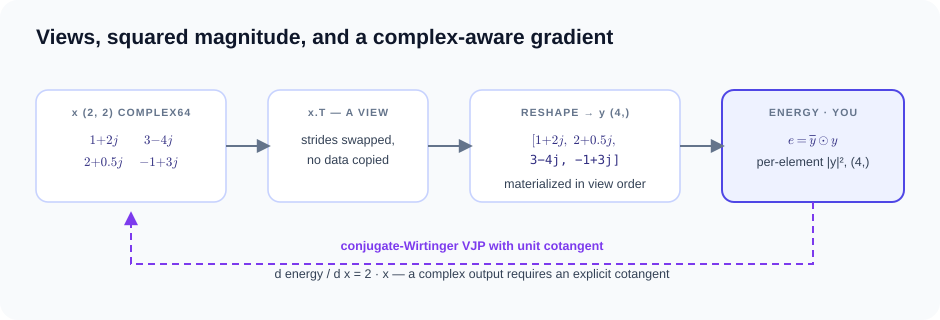

# 程序组合与高级运行时示例

普通 MessagePassing 直接使用 Torch，见[入门](../getting-started.md)。
本页的 matmul、complex VJP、recurrence 和 joint plan 用于检查原生 Tensor IR
或执行计划，因此暂时使用 `tg.Tensor`；它们不是 Torch 数学运算的替代教程。
核心片段省略的 imports 和输入可在每节折叠的完整源码中找到。

运行源码：

- [`python examples/tensor_matmul.py`](https://github.com/walkerchi/TIGA-lang/blob/main/examples/tensor_matmul.py)
- [`python examples/complex_autograd.py`](https://github.com/walkerchi/TIGA-lang/blob/main/examples/complex_autograd.py)
- [`python examples/linear_recurrence.py`](https://github.com/walkerchi/TIGA-lang/blob/main/examples/linear_recurrence.py)
- [`python examples/graph_program.py`](https://github.com/walkerchi/TIGA-lang/blob/main/examples/graph_program.py)
- [`python examples/joint_autograd.py`](https://github.com/walkerchi/TIGA-lang/blob/main/examples/joint_autograd.py)
- [`python examples/torch_interop.py`](https://github.com/walkerchi/TIGA-lang/blob/main/examples/torch_interop.py)
- [`python examples/torch_library.py`](https://github.com/walkerchi/TIGA-lang/blob/main/examples/torch_library.py)
- [`python examples/edge_nn_message_passing.py`](https://github.com/walkerchi/TIGA-lang/blob/main/examples/edge_nn_message_passing.py)

`linear_recurrence.py` 需要 CUDA；其余脚本的设备选择见完整源码。

<span id="tensor-expressions-and-autograd"></span>

## 矩阵乘法与自动推导的梯度 { #matrix-multiplication-with-derived-gradients }

[矩阵乘法](https://baike.baidu.com/item/矩阵乘法)把 (M, K) 矩阵 `lhs` 与 (K, N) 矩阵 `rhs` 组合成
(M, N) 矩阵：元素 (i, j) 是 `lhs` 第 i 行与 `rhs` 第 j 列的
点积。当标量损失依赖于输出时，由链式法则，两个操作数的梯度
都可以写成与 `G` 的矩阵乘积——`G` 是损失对输出的上游导数
（即 cotangent，余切）。


$$
C = A\,B \quad\Longrightarrow\quad
\frac{\partial L}{\partial A} = G\,B^{\top}, \qquad
\frac{\partial L}{\partial B} = A^{\top}G, \qquad
G = \frac{\partial L}{\partial C}
$$

`gf_tensor.matmul` 是一等的 rank-2 收缩运算。示例把它 lowering 到
CPU LLVM 和 FP16 GPU `tt.dot`，两个矩阵操作数的梯度都由编译器
自动推导——无需手写 backward 函数。

```python
--8<-- "examples/tensor_matmul.py:core"
```

??? example "完整源码：examples/tensor_matmul.py（可直接运行）"

    ```python
    --8<-- "examples/tensor_matmul.py"
    ```

??? info "本机编译产物（Ryzen 7 255 · RTX 5070 Ti 实测）"

    === "CPU"

        ```text
        ### output: Tensor IR (first lines)
        module {
          func.func @tensor_main(%arg0: tensor<2x3xf32>, %arg1: tensor<3x2xf32>) -> tensor<2x2xf32> {
            %0 = "gf_tensor.input"(%arg0) <{offset = 0 : i64, strides = array<i64: 3, 1>}> : (tensor<2x3xf32>) -> tensor<2x3xf32>
            %1 = "gf_tensor.input"(%arg1) <{offset = 0 : i64, strides = array<i64: 2, 1>}> : (tensor<3x2xf32>) -> tensor<3x2xf32>
            %2 = "gf_tensor.matmul"(%0, %1) : (tensor<2x3xf32>, tensor<3x2xf32>) -> tensor<2x2xf32>
            return %2 : tensor<2x2xf32>
          }
        }
        ```

    === "CUDA"

        ```text
        ### output: Tensor IR (first lines)
        module {
          func.func @tensor_main(%arg0: tensor<2x3xf32>, %arg1: tensor<3x2xf32>) -> tensor<2x2xf32> {
            %0 = "gf_tensor.input"(%arg0) <{offset = 0 : i64, strides = array<i64: 3, 1>}> : (tensor<2x3xf32>) -> tensor<2x3xf32>
            %1 = "gf_tensor.input"(%arg1) <{offset = 0 : i64, strides = array<i64: 2, 1>}> : (tensor<3x2xf32>) -> tensor<3x2xf32>
            %2 = "gf_tensor.matmul"(%0, %1) : (tensor<2x3xf32>, tensor<3x2xf32>) -> tensor<2x2xf32>
            return %2 : tensor<2x2xf32>
          }
        }
        ```

## 复数 VJP { #complex-vjp }

信号处理和物理计算常把数据存储为[复数](https://baike.baidu.com/item/复数) a + bi，其中 i 为虚数
单位。转置这样的张量应该只改变索引方式——一个零拷贝视图——
而不是复制内存；对这个非连续视图做 reshape 时，才会按视图
顺序真正物化元素。复数输出还需要一套微分约定，因为普通的
实数导数不能直接套用：Tiga 采用共轭 Wirtinger 约定，
把 x 与其复共轭视为独立变量，并要求为复数输出显式提供
cotangent。在该约定下，模平方 |y|² 的梯度为 2·x。



$$
y = \operatorname{vec}\!\left(x^{\top}\right), \qquad
e = \overline{y} \odot y, \qquad
\frac{\partial e}{\partial x} = 2x \;\; \text{(unit cotangent)}
$$

该示例在原生 CPU 运行时上演示了 complex64 存储、带步长的
零拷贝视图，以及显式的共轭 Wirtinger cotangent。

```python
--8<-- "examples/complex_autograd.py:core"
```

??? example "完整源码：examples/complex_autograd.py（可直接运行）"

    ```python
    --8<-- "examples/complex_autograd.py"
    ```

??? info "本机编译产物（Ryzen 7 255 · RTX 5070 Ti 实测）"

    === "CPU"

        ```text
        ### y: Tensor IR (first lines)
        module {
          func.func @tensor_main(%arg0: tensor<2x2xcomplex<f32>>) -> tensor<4xcomplex<f32>> {
            %0 = "gf_tensor.input"(%arg0) <{offset = 0 : i64, strides = array<i64: 2, 1>}> : (tensor<2x2xcomplex<f32>>) -> tensor<2x2xcomplex<f32>>
            %1 = "gf_tensor.permute"(%0) <{axes = array<i64: 1, 0>}> : (tensor<2x2xcomplex<f32>>) -> tensor<2x2xcomplex<f32>>
            %2 = "gf_tensor.reshape"(%1) <{shape = array<i64: 4>}> : (tensor<2x2xcomplex<f32>>) -> tensor<4xcomplex<f32>>
            return %2 : tensor<4xcomplex<f32>>
          }
        }
        ```

    === "CUDA"

        ```text
        ### y: Tensor IR (first lines)
        module {
          func.func @tensor_main(%arg0: tensor<2x2xcomplex<f32>>) -> tensor<4xcomplex<f32>> {
            %0 = "gf_tensor.input"(%arg0) <{offset = 0 : i64, strides = array<i64: 2, 1>}> : (tensor<2x2xcomplex<f32>>) -> tensor<2x2xcomplex<f32>>
            %1 = "gf_tensor.permute"(%0) <{axes = array<i64: 1, 0>}> : (tensor<2x2xcomplex<f32>>) -> tensor<2x2xcomplex<f32>>
            %2 = "gf_tensor.reshape"(%1) <{shape = array<i64: 4>}> : (tensor<2x2xcomplex<f32>>) -> tensor<4xcomplex<f32>>
            return %2 : tensor<4xcomplex<f32>>
          }
        }
        ```

## 用 map/cumsum/contract 拼出线性递推 { #linear-recurrence-from-mapcumsumcontract }

递推的每一步输出都由之前的步骤算出，而不是一次性算出所有
结果。本示例是因果线性[注意力](https://baike.baidu.com/item/注意力机制)——若干高效序列模型的核心：
序列共 S 步，第 s 步贡献键向量 k_s 和值向量 v_s；第 t 步
输出历史值的加权和，权重是每个历史键与当前查询 q_t 的
相似度。“因果”指第 t 步只能读取 s ≤ t 的步骤。折叠成
递推形式后，递推状态不断累积外积 k_s ⊗ v_s，每个输出就是
查询对该状态的一次读出。


$$
S_t = \sum_{s \le t} k_s \otimes v_s, \qquad
\mathrm{out}_t = q_t^{\top} S_t
$$

这个表达式就是一个普通的 Tensor map/cumsum/contract 程序——
并没有内置的线性注意力算子。在已注册的 CUDA 形状族上，
编译器会识别出 map → scan → contract 结构，生成一个递推
[kernel](https://en.wikipedia.org/wiki/Compute_kernel)，其状态始终留在片上。

```python
--8<-- "examples/linear_recurrence.py:core"
```

??? example "完整源码：examples/linear_recurrence.py（可直接运行）"

    ```python
    --8<-- "examples/linear_recurrence.py"
    ```

??? info "本机编译产物（Ryzen 7 255 · RTX 5070 Ti 实测）"

    === "CUDA"

        ```text
        ### output: execution record
        backend: cuda-ttir-triton
        compile_ms: 553.722441
        materialize_ms: 0.0
        saved_bytes: 0
        saved_compile_ms: 0.0
        checkpoint_plan: {'candidate_count': 0, 'delegated_candidate_count': 0, 'decisions': (), 'memory_budget_bytes': -1, 'spill_budget_bytes': 0, 'planned_saved_bytes': 0, 'planned_spilled_bytes': 0, 'actual_spilled_bytes': 0, 'spill_transfer_ms': 0.0, 'tiers': (), 'recompute_costs': (), 'live_intervals': (), 'peak_live_bytes': 0, 'peak_spill_bytes': 0, 'planning_ms': 0.0, 'native_load_ms': 0.0, 'ir': ''}
        cache_hit: False
        fast_math: False
        launch_ms: 0.154881
        artifact: triton-cache/034bf974a1da5e8f3e4103ba
        source: // tiga.tensor entry=gf_tensor_scan_contract block_rows=1 block_elements=16 num_warps=1 abi=arg0,arg1,arg2,out
        module {
          tt.func public @gf_tensor_scan_contract(%arg0: !tt.ptr<f32>, %arg1: !tt.ptr<f32>, %arg2: !tt.ptr<f32>, %out: !tt.ptr<f32>) attributes {noinline = false} {
            %pid_i32 = tt.get_program_id x : i32
            %pid = arith.extui %pid_i32 : i32 to i64
            %value_tiles = arith.constant 1 : i64
            %lane = arith.divui %pid, %value_tiles : i64
            %value_tile = arith.remui %pid, %value_tiles : i64
            %k_i32 = tt.make_range {end = 16 : i32, start = 0 : i32} : tensor<16xi32>
            %v_i32 = tt.make_range {end = 16 : i32, start = 0 : i32} : tensor<16xi32>
            %k_lane = arith.extsi %k_i32 : tensor<16xi32> to tensor<16xi64>
            %v_lane = arith.extsi %v_i32 : tensor<16xi32> to tensor<16xi64>
            %k_bound = arith.constant dense<16> : tensor<16xi64>
            %k_mask = arith.cmpi slt, %k_lane, %k_bound : tensor<16xi64>
            %sixteen = arith.constant 16 : i64
            %v_base = arith.muli %value_tile, %sixteen : i64
            %v_base_vec = tt.splat %v_base : i64 -> tensor<16xi64>
            %v_column = arith.addi %v_base_vec, %v_lane : tensor<16xi64>
            %v_bound = arith.constant dense<16> : tensor<16xi64>
            %v_mask = arith.cmpi slt, %v_column, %v_bound : tensor<16xi64>
            %zero_k = arith.constant dense<0.000000e+00> : tensor<16xf32>
            %zero_v = arith.constant dense<0.000000e+00> : tensor<16xf32>
            %zero_state = arith.constant dense<0.000000e+00> : tensor<16x16xf32>
            %steps_i64 = arith.constant 128 : i64
            %key_width = arith.constant 16 : i64
            %value_width = arith.constant 16 : i64
            %begin = arith.constant 0 : index
            %end = arith.constant 128 : index
            %one = arith.constant 1 : index
            %scan = scf.for %time = %begin to %end step %one iter_args(%state = %zero_state) -> (tensor<16x16xf32>) {
              %time_i64 = arith.index_cast %time : index to i64
              %lane_time_base = arith.muli %lane, %steps_i64 : i64
              %lane_time = arith.addi %lane_time_base, %time_i64 : i64
              %qk_base = arith.muli %lane_time, %key_width : i64
              %qk_base_v = tt.splat %qk_base : i64 -> tensor<16xi64>
              %qk_index = arith.addi %qk_base_v, %k_lane : tensor<16xi64>
              %q_base = tt.splat %arg0 : !tt.ptr<f32> -> tensor<16x!tt.ptr<f32>>
              %k_base = tt.splat %arg1 : !tt.ptr<f32> -> tensor<16x!tt.ptr<f32>>
              %q_ptr = tt.addptr %q_base, %qk_index : tensor<16x!tt.ptr<f32>>, tensor<16xi64>
              %k_ptr = tt.addptr %k_base, %qk_index : tensor<16x!tt.ptr<f32>>, tensor<16xi64>
              %q = tt.load %q_ptr, %k_mask, %zero_k : tensor<16x!tt.ptr<f32>>
              %k = tt.load %k_ptr, %k_mask, %zero_k : tensor<16x!tt.ptr<f32>>
              %value_time_base = arith.muli %lane_time, %value_width : i64
              %value_time_base_v = tt.splat %value_time_base : i64 -> tensor<16xi64>
              %v_index = arith.addi %value_time_base_v, %v_column : tensor<16xi64>
              %v_input_base = tt.splat %arg2 : !tt.ptr<f32> -> tensor<16x!tt.ptr<f32>>
              %v_ptr = tt.addptr %v_input_base, %v_index : tensor<16x!tt.ptr<f32>>, tensor<16xi64>
              %v = tt.load %v_ptr, %v_mask, %zero_v : tensor<16x!tt.ptr<f32>>
              %k2 = tt.expand_dims %k {axis = 1 : i32} : tensor<16xf32> -> tensor<16x1xf32>
              %v2 = tt.expand_dims %v {axis = 0 : i32} : tensor<16xf32> -> tensor<1x16xf32>
              %kb = tt.broadcast %k2 : tensor<16x1xf32> -> tensor<16x16xf32>
              %vb = tt.broadcast %v2 : tensor<1x16xf32> -> tensor<16x16xf32>
              %outer = arith.mulf %kb, %vb : tensor<16x16xf32>
              %next_state = arith.addf %state, %outer : tensor<16x16xf32>
              %q2 = tt.expand_dims %q {axis = 1 : i32} : tensor<16xf32> -> tensor<16x1xf32>
              %qb = tt.broadcast %q2 : tensor<16x1xf32> -> tensor<16x16xf32>
              %weighted = arith.mulf %next_state, %qb : tensor<16x16xf32>
              %partial = "tt.reduce"(%weighted) <{axis = 0 : i32}> ({
              ^bb0(%a: f32, %b: f32):
                %combined = arith.addf %a, %b : f32
                tt.reduce.return %combined : f32
              }) : (tensor<16x16xf32>) -> tensor<16xf32>
              %out_base_scalar = arith.muli %lane_time, %value_width : i64
              %out_base_v = tt.splat %out_base_scalar : i64 -> tensor<16xi64>
              %out_index = arith.addi %out_base_v, %v_column : tensor<16xi64>
              %out_base = tt.splat %out : !tt.ptr<f32> -> tensor<16x!tt.ptr<f32>>
              %out_ptr = tt.addptr %out_base, %out_index : tensor<16x!tt.ptr<f32>>, tensor<16xi64>
              tt.store %out_ptr, %partial, %v_mask : tensor<16x!tt.ptr<f32>>
              scf.yield %next_state : tensor<16x16xf32>
            }
            tt.return
          }
        }

        ir: module {
          func.func @tensor_main(%arg0: tensor<4x128x16xf32>, %arg1: tensor<4x128x16xf32>, %arg2: tensor<4x128x16xf32>) -> tensor<4x128x16xf32> {
            %0 = "gf_tensor.input"(%arg0) <{offset = 0 : i64, strides = array<i64: 2048, 16, 1>}> : (tensor<4x128x16xf32>) -> tensor<4x128x16xf32>
            %1 = "gf_tensor.reshape"(%0) <{shape = array<i64: 4, 128, 16, 1>}> : (tensor<4x128x16xf32>) -> tensor<4x128x16x1xf32>
            %2 = "gf_tensor.broadcast"(%1) <{shape = array<i64: 4, 128, 16, 16>}> : (tensor<4x128x16x1xf32>) -> tensor<4x128x16x16xf32>
            %3 = "gf_tensor.input"(%arg1) <{offset = 0 : i64, strides = array<i64: 2048, 16, 1>}> : (tensor<4x128x16xf32>) -> tensor<4x128x16xf32>
            %4 = "gf_tensor.reshape"(%3) <{shape = array<i64: 4, 128, 16, 1>}> : (tensor<4x128x16xf32>) -> tensor<4x128x16x1xf32>
            %5 = "gf_tensor.broadcast"(%4) <{shape = array<i64: 4, 128, 16, 16>}> : (tensor<4x128x16x1xf32>) -> tensor<4x128x16x16xf32>
            %6 = "gf_tensor.input"(%arg2) <{offset = 0 : i64, strides = array<i64: 2048, 16, 1>}> : (tensor<4x128x16xf32>) -> tensor<4x128x16xf32>
            %7 = "gf_tensor.reshape"(%6) <{shape = array<i64: 4, 128, 1, 16>}> : (tensor<4x128x16xf32>) -> tensor<4x128x1x16xf32>
            %8 = "gf_tensor.broadcast"(%7) <{shape = array<i64: 4, 128, 16, 16>}> : (tensor<4x128x1x16xf32>) -> tensor<4x128x16x16xf32>
            %9 = "gf_tensor.mul"(%5, %8) : (tensor<4x128x16x16xf32>, tensor<4x128x16x16xf32>) -> tensor<4x128x16x16xf32>
            %10 = "gf_tensor.cumsum"(%9) <{axis = 1 : i64, reverse = false}> : (tensor<4x128x16x16xf32>) -> tensor<4x128x16x16xf32>
            %11 = "gf_tensor.mul"(%2, %10) : (tensor<4x128x16x16xf32>, tensor<4x128x16x16xf32>) -> tensor<4x128x16x16xf32>
            %12 = "gf_tensor.reduce_sum"(%11) <{axes = array<i64: 2>, keep_dims = false}> : (tensor<4x128x16x16xf32>) -> tensor<4x128x16xf32>
            return %12 : tensor<4x128x16xf32>
          }
        }

        semantic_hash: 034bf974a1da5e8f3e4103baebe98bcd893cb3f4915b121fc16715c99030c4f3
        artifacts: {'ttir', 'ttgir', 'llir', 'ptx', 'cubin'}  # ~80 KB of artifacts omitted; full text via kernel.code("ptx")
        ```

<span id="cross-kernel-compilation"></span>

## `@tg.jit` 跨 kernel SSA 捕获 { #gfprogram-ssa-capture }

**它是什么。** 一个加权图求和，计算两次。一张包含 N = 4096 个节点、
E = 16·N 条边的图，以压缩稀疏行（CSR）格式存储——一个行偏移数组加一个列索引数组。
每个节点 `i` 沿其入边 `e = (j→i)`，把源值 `x[j]` 乘以边权后求和。程序分别用两个
不同的权重向量 `w0` 和 `w1` 各算一遍，每个权重向量各返回一个 `(N,)` 结果。


$$
\mathrm{out}_k[i] = \sum_{e=(j\to i)} x[j]\, w_k[e], \qquad k \in \{0, 1\}
$$

两个 `WeightedSum` 调用读取同一张图和同一份特征，因此 `@tg.jit` 的自动捕获将它们
登记为带类型的静态单赋值（SSA）叶子，再横向融合成单个 `gf_kernel.launch`，
由该 launch 携带两个 reducer——`explain()` 报告 `applies=2, post_fusion=1`。整个过程
没有显式的编译调用：首次观测即触发即时（[JIT](https://en.wikipedia.org/wiki/Just-in-time_compilation)）编译，Kernel IR 与 PTX（NVIDIA
GPU 汇编）随时可查看。这是第一个可执行的 provider 示例，CUDA 存储由可选的
Torch 适配器提供。

只要 `@tg.jit`：循环捕获和跨 kernel 融合都是自动的。`@tg.jit` 把
`for`/`while` 循环改写成 `gf_control.repeat` / `gf_control.while`
区域，同时自动激活 program 上下文——直线部分里的每个 MessagePassing
调用仍然成为带类型的 SSA 叶子，跨 kernel 边界融合；两个
`WeightedSum` 调用共享一次 launch 靠的就是它。循环体保持逐迭代语义：
staged 区域内调用的 kernel 内联进循环体，而不会注册成顶层叶子；SSA
叶子可以直接参与张量算术，因此 Picard 风格的 `state + apply(state)`
循环在 `@tg.jit` 下照常工作（再叠一层 `@tg.program` 也合法）。
`tg.program` 保留为兼容入口：面向无法提供源码的直线代码场景，只激活
同一个上下文，不做 AST 改写。

自动微分同样穿过边界：任一捕获字段带 `requires_grad` 时叶子可微，
反向逐叶子把其 kernel 重新内联展开求 VJP——不融合，前向则保持融合
launch；共享同一输入的叶子会累加各自的梯度贡献。没有可微内联展开的
叶子形态（provider 持有的字段、原生支持集合之外的关系实现）直接报
NotImplementedError，绝不返回静默错误的梯度。

```python
--8<-- "examples/graph_program.py:core"
```

??? example "完整源码：examples/graph_program.py（可直接运行）"

    ```python
    --8<-- "examples/graph_program.py"
    ```

??? info "本机编译产物（Ryzen 7 255 · RTX 5070 Ti 实测）"

    === "CUDA"

        ```text
        ### first.program: GraphProgram
        GraphProgram applies=2, post_fusion=1
        semantic_hash=fbb6aea4cd02ce6288192daae8e23c45ef7bc4f9b48471e837d6555a77596f6b
        observation triggers native Domain→Kernel→provider JIT
        kernel IR: 1 x gf_kernel.launch
        ```

    === "CPU"

        ```text
        ### WeightedSumTorchExecutor  (leaf 0 of 2 — identical for leaf 1)
        backend: cpu
        provider: torch.sparse.mm
        lowering: dispatch-native-sparse-mm
        passes: gf-verify-domain, gf-lower-domain-to-iter, gf-lower-iter-to-kernel, capture-edge-expression, recognize-linear-weighted-sum, dispatch-native-sparse-mm
        remark: [planning] no profitable generated specialization was proven; dispatched native sparse library
        # no fused product kernel exists off CUDA: each apply runs as an
        # ordinary kernel; the fusion stays an IR-level plan.
        ```

## 联合前向/反向 DAG { #joint-forwardbackward-dag }

**它是什么。** 在一个微小函数上做反向模式[自动微分](https://baike.baidu.com/item/自动微分)。给定向量 `x = [2, 3]`，
程序计算损失——各分量平方之和——以及损失对 `x` 的梯度。这里的梯度 pass 是一个
[VJP](https://en.wikipedia.org/wiki/Automatic_differentiation)（向量–雅可比积）：把标量损失导数沿每个操作反向传播到所有输入，
本例中就归结为规则“`x²` 的导数是 `2x`”。


$$
\mathrm{loss} = \sum_i x_i^2 = 2^2 + 3^2 = 13, \qquad
\frac{\partial\,\mathrm{loss}}{\partial x_i} = 2x_i = [4, 6]
$$

`tg.autograd.joint_plan` 把前向和编译器推导出的 VJP 打包成一个可查看的
依赖 [DAG](https://en.wikipedia.org/wiki/Directed_acyclic_graph)，并自动插入 checkpoint；一次 `plan.run()` 同时返回函数值和
梯度——无需用户手写反向。plan 不关心存储来自哪里：torch 存储经
`tg.from_torch` 零拷贝进入，结果用 `.to_torch(copy=True)` 读回——只有
出口这一次拷贝，因为结果是 Tiga 算出来的，不是从 torch 包装的。

```python
--8<-- "examples/joint_autograd.py:core"
```

??? example "完整源码：examples/joint_autograd.py（可直接运行）"

    ```python
    --8<-- "examples/joint_autograd.py"
    ```

??? info "本机编译产物（Ryzen 7 255 · RTX 5070 Ti 实测）"

    === "CPU"

        ```text
        ### plan: JointAutogradPlan
        executable bundle: invocations=2 snapshot=0
        structure hash: 61e2b07488ff42fc
        bindings: output, gradient:0
          forward (autograd-forward) <- ready; output:write
          backward:0 (autograd-backward) <- forward; output:read, gradient:0:write
        checkpoint/spill decisions are consumed while each backward executable is physicalized

        ### dx: execution record
        backend: python-oracle
        native_error: None

        ### loss: execution record
        backend: python-oracle
        native_error: None

        ### value: execution record
        backend: python-oracle
        native_error: None
        ```

    === "CUDA"

        ```text
        ### plan: JointAutogradPlan
        executable bundle: invocations=2 snapshot=0
        structure hash: 61e2b07488ff42fc
        bindings: output, gradient:0
          forward (autograd-forward) <- ready; output:write
          backward:0 (autograd-backward) <- forward; output:read, gradient:0:write
        checkpoint/spill decisions are consumed while each backward executable is physicalized

        ### dx: execution record
        backend: python-oracle
        native_error: None

        ### loss: execution record
        backend: python-oracle
        native_error: None

        ### value: execution record
        backend: python-oracle
        native_error: None
        ```

<span id="torch-interop"></span>

## 默认 Torch 接口与可选原生存储桥 { #optional-torch-interoperability }

**它是什么。** 环上的邻居求和，外加存储共享。八个节点构成一个环：每个
节点恰好有两条入边，分别来自两个相邻节点，权重均为 1——因此每个节点的
输出是其两个邻居值之和。另外，原生 `tg.Tensor` 可以由 Torch 张量创建，
也能转换回去，两个方向共享同一份底层存储。


$$
\mathrm{out}[i] = \sum_{e=(j\to i)} w[e]\, x[j]
= x[(i-1) \bmod 8] + x[(i+1) \bmod 8]
$$

Torch 张量直接调用 `MessagePassing` UDF——无转换、无拷贝；Torch 由使用者单独安装，不是默认安装依赖。
原生编译器和底层运行时仍可独立工作。`tg.from_torch`/`to_torch` 这对 API 只用于另一个
方向：进入原生 `tg.Tensor` 体系（延迟捕获、编译器 VJP），同时仍共享
torch 存储——相同的数据指针证实了这一点。目前需要原生结构化控制流捕获的场景才要求此转换：`@tg.jit` 循环和 `linear_solve` / `nonlinear_solve`
驱动器会把迭代具象化为 `gf_control.repeat` / `gf_control.while`，因此
它们的向量必须是 `tg.Tensor`（在那里传 torch 张量会抛 `TypeError`）。
惰性 JIT 对象会暴露 `gf.kernel`
选定的机器调度，经过验证且与 provider 无关。

```python
--8<-- "examples/torch_interop.py:core"
```

??? example "完整源码：examples/torch_interop.py（可直接运行）"

    ```python
    --8<-- "examples/torch_interop.py"
    ```

??? info "本机编译产物（Ryzen 7 255 · RTX 5070 Ti 实测）"

    === "CPU"

        ```text
        ### WeightedAggregationTorchExecutor
        backend: cpu
        provider: torch.sparse.mm
        lowering: dispatch-native-sparse-mm
        passes: gf-verify-domain, gf-lower-domain-to-iter, gf-lower-iter-to-kernel, capture-edge-expression, recognize-linear-weighted-sum, dispatch-native-sparse-mm
        accepted: [machine-schedule] admitted fixed-row-neighbor
        unknown: [pipeline] no compiler-controlled asynchronous pipeline admitted
        remark: [planning] no profitable generated specialization was proven; dispatched native sparse library
        variant cache: hits=0, misses=1
        ```

    === "CUDA"

        ```text
        ### WeightedAggregationTorchExecutor
        backend: cuda
        provider: triton-nvidia@3.6.0
        lowering: gf-kernel-to-ttir-fixed-csr-weighted-sum
        passes: gf-verify-domain, gf-lower-domain-to-iter, gf-lower-iter-to-kernel, capture-edge-expression, recognize-linear-weighted-sum, analyze-fixed-degree, select-fixed-row-neighbor-tile, gf-kernel-to-ttir, provider-compile-serialized-ttir
        provider cache key: triton-nvidia | cuda:nvidia | 3.6.0 | 2.11.0+cu128 | af81e84448f193cc | cuda:120:warp32
        accepted: [machine-schedule] admitted fixed-row-neighbor
        unknown: [pipeline] no compiler-controlled asynchronous pipeline admitted
        remark: [planning] physical fixed-degree proof selected a row-neighbor-feature tile
        remark: [planning] TTIR was emitted from gf_kernel IR without a @triton.jit frontend
        remark: [planning] the direct candidate passed the SOTA runtime gate on this machine
        remark: [planning] frozen CSR indices remain bound to the compiled executable
        variant cache: hits=0, misses=1
        ```

## `torch.library` 注册 { #torchlibrary-registration }

**它是什么。** 在一个微型二部图上做加权求和：三个取值为 `[1, 2, 4]` 的
源节点、两个目标节点，以及四条加权边（`0→0`、`1→0`、`1→1`、`2→1`）。每个
目标在其入边上对 `权重 · 源值` 求和。随后该 UDF 注册为原生 Torch
算子——`torch.compile` 可以在模型内部追踪，`torch.autograd`
也能穿透求导。


$$
\mathrm{out}[i] = \sum_{e=(j\to i)} w[e]\, x[j]
\;\Rightarrow\;
\mathrm{out} = [\,2{\cdot}1 + 3{\cdot}2,\; 5{\cdot}2 + 7{\cdot}4\,] = [8, 38]
$$

注册是动态且完备的：函数式 dispatcher schema、用于追踪的 FakeTensor/meta
kernel、基于编译器生成 VJP 的自动求导，外加一套 `opcheck` 测试，都随算子
一并提供；示例随后运行了一次由 Inductor 全图编译的前向/反向。CSR 拓扑是
dispatcher ABI 的一部分，尽管包装器会自动绑定。

```python
--8<-- "examples/torch_library.py:core"
```

??? example "完整源码：examples/torch_library.py（可直接运行）"

    ```python
    --8<-- "examples/torch_library.py"
    ```

??? info "本机编译产物（Ryzen 7 255 · RTX 5070 Ti 实测）"

    === "CPU"

        ```text
        ### WeightedAggregationTorchExecutor
        backend: cpu
        provider: torch.sparse.mm
        lowering: dispatch-native-sparse-mm
        passes: gf-verify-domain, gf-lower-domain-to-iter, gf-lower-iter-to-kernel, capture-edge-expression, recognize-linear-weighted-sum, dispatch-native-sparse-mm
        accepted: [machine-schedule] admitted fixed-row-neighbor
        unknown: [pipeline] no compiler-controlled asynchronous pipeline admitted
        remark: [planning] no profitable generated specialization was proven; dispatched native sparse library
        variant cache: hits=0, misses=1
        ```

<span id="neural-networks-on-edges"></span>

## Edge nn 模块与融合 tile kernel { #edge-nn-modules-with-a-fused-tile-kernel }

**它是什么。** 一个点云网络。三维空间中的 512 个随机点通过半径图连接：
只要点 `j` 与点 `i` 的距离不超过 `r = 0.15`，就存在一条从 `j` 到 `i` 的
边。每条边运行一个小型[多层感知机](https://baike.baidu.com/item/多层感知机)（MLP）——线性层、修正线性单元（ReLU）、
线性层——输入是该边的位移向量与源节点特征的拼接，输出一个消息向量。
每个点对其入边上的消息求和。


$$
\mathrm{out}[i] = \sum_{e=(j\to i):\; \|pos[j] - pos[i]\| \le r}
\mathrm{MLP}\!\left([\,pos[j] - pos[i] \;\|\; x[j]\,]\right)
$$

`tg.nn.trace` 包装一个 `torch.nn` 模块，让边 UDF 可以调用它：eager 模式下
直接拼接参数并转发给该模块；编译器则会证明整条调用链，生成单个以边为
中心的 tile kernel——不会物化 O(E) 的消息张量。由于 MLP 读取边位移，任何
逐节点预计算都无法外提。梯度模式下的调用沿用同一个融合前向，反向
使用重计算 VJP，因此训练时同样不会物化任何逐边数据。契约与当前限制见
[Edge nn 模块](../message-passing.md#edge-nn-modules-cuda-torch-interop)。

```python
--8<-- "examples/edge_nn_message_passing.py:core"
```

??? example "完整源码：examples/edge_nn_message_passing.py（可直接运行）"

    ```python
    --8<-- "examples/edge_nn_message_passing.py"
    ```

??? info "本机编译产物（Ryzen 7 255 · RTX 5070 Ti 实测）"

    === "CUDA"

        ```text
        ### EdgeMLPTorchExecutor
        backend: cuda
        provider: triton-nvidia@3.6.0
        lowering: gf-python-emit-edge-nn-tile-vjp
        passes: capture-edge-nn-subgraph, translate-fx-to-message-dag, prove-edge-nn-tile-structure, python-emit-edge-nn-tile-ttir, symbolic-edge-nn-vjp, python-emit-edge-nn-vjp-ttir, provider-compile-serialized-ttir
        provider cache key: triton-nvidia | cuda:nvidia | 3.6.0 | 2.11.0+cu128 | af81e84448f193cc | cuda:120:warp32
        remark: [planning] Python emission backend (phase 2); the C++ gf-kernel-to-ttir emitter replaces it in a later phase
        remark: [planning] training path: backward recomputes per-edge activations inside the tile; no [E, ·] tensor is materialized in either direction
        variant cache: hits=0, misses=2

        ### EdgeMLPTorchExecutor
        backend: cuda
        provider: triton-nvidia@3.6.0
        lowering: gf-python-emit-edge-nn-tile
        passes: capture-edge-nn-subgraph, translate-fx-to-message-dag, prove-edge-nn-tile-structure, python-emit-edge-nn-tile-ttir, provider-compile-serialized-ttir
        provider cache key: triton-nvidia | cuda:nvidia | 3.6.0 | 2.11.0+cu128 | af81e84448f193cc | cuda:120:warp32
        remark: [planning] Python emission backend (phase 1); the C++ gf-kernel-to-ttir emitter replaces it in a later phase
        remark: [planning] edge messages are evaluated inside the tile; no O(E) message tensor is materialized
        remark: [planning] inference path; calls that could request gradients take the fused recompute VJP (gf-python-emit-edge-nn-tile-vjp)
        variant cache: hits=0, misses=1
        ```
