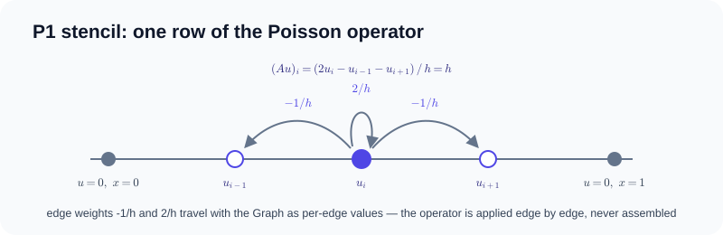
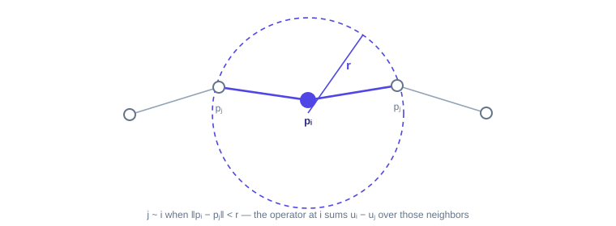
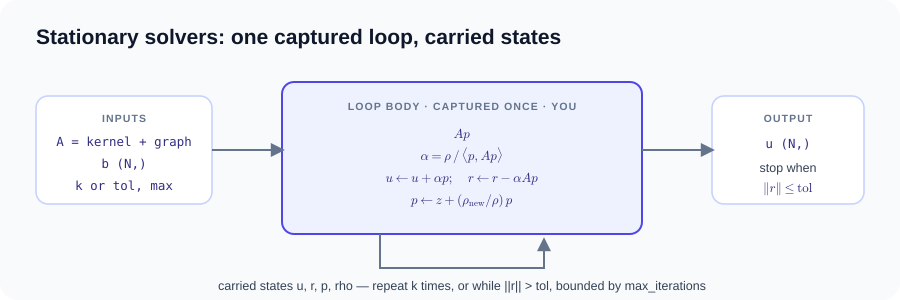

# Linear solvers and control flow

Matrix-free linear solvers: a MessagePassing kernel bound to a Graph is the
operator — never an assembled matrix — and the iteration loop is expressed as
device-side control flow (`gf_control.repeat` / `gf_control.while`) or as
natural Python `for`/`while` under `@gf.jit`.

- [`python examples/fem_poisson.py`](https://github.com/walkerchi/TIGA-lang/blob/main/examples/fem_poisson.py)
- [`python examples/meshfree_linear_solve.py`](https://github.com/walkerchi/TIGA-lang/blob/main/examples/meshfree_linear_solve.py)
- [`python examples/nonlinear_solve.py`](https://github.com/walkerchi/TIGA-lang/blob/main/examples/nonlinear_solve.py)

!!! note "gf.Tensor vs torch.Tensor"

    A kernel call accepts either — `src`/`dst`/`edge` fields may be torch
    tensors directly, and `gf.from_torch(x)` / `.to_torch()` are zero-copy in
    both directions. The solver drivers on this page are different:
    `linear_solve` / `nonlinear_solve` capture the iteration loop as
    device-side control flow (`gf_control.repeat` / `gf_control.while`), so
    their vectors must be `gf.Tensor`. Wrap torch storage at the boundary with
    `gf.from_torch(x)` and read the result back with `.to_torch()` — neither
    direction copies.

### Matrix-free linear solves { #matrix-free-linear-solves }

## Matrix-free FEM operator and solver loop { #matrix-free-fem-operator-and-solver-loop }

**What it is.** The finite element method (FEM) turns a differential equation
into a system of linear equations by sampling the unknown function at mesh
points. Here the equation is the Poisson equation −u″(x) = 1 on the unit
interval with u fixed to zero at both ends — the steady shape of a uniformly
loaded string, whose exact answer is the parabola u(x) = x(1−x)/2. With N
equally spaced interior points, each row of the system couples one point to its
two immediate neighbors through the piecewise-linear ("P1") stencil. The system
is solved by conjugate gradient (CG), an iterative method for symmetric
positive-definite systems that only ever applies the operator to a vector and
never needs the matrix itself.



$$
\frac{2u_i - u_{i-1} - u_{i+1}}{h} \;=\; h,
\qquad
u_0 = u_{N+1} = 0
$$

$$
h = \frac{1}{N+1},
\qquad
u_{\text{exact}}(x) = \tfrac{1}{2}\,x(1-x)
$$

One `solve()` drives the whole example: by default the stopping condition is
the residual norm at tolerance 10⁻⁶ (captured as one mandatory-bounded
`gf_control.while`, lowered to CPU LLVM without host polling); passing
`iterations=k` switches to a fixed-count `gf_control.repeat` instead.
`load_gradient()` then differentiates sum(u) with respect to the load through
the captured iterations (reverse-mode automatic differentiation, i.e. a
vector–Jacobian product).

The stiffness matrix is never assembled: the mesh topology is a `Graph`
built in one line (`Graph.stencil` with the three P1 offsets), the
stencil weights ride on its edges, and applying the operator is an ordinary
MessagePassing UDF (`edge.value * src.u` summed per destination). See
[linear solvers and implicit differentiation](../linear-solvers.md) for the
remaining GPU/distributed loop and implicit-VJP contracts.

```python
--8<-- "examples/fem_poisson.py:core"
```

??? example "Full source: examples/fem_poisson.py (runs as-is)"

    ```python
    --8<-- "examples/fem_poisson.py"
    ```

??? info "Measured compilation artifacts (Ryzen 7 255 · RTX 5070 Ti)"

    === "CPU"

        ```text
        ### StiffnessApply
        backend: cpu:0
        provider: tiga-runtime
        lowering: gf-tensor-relation-autograd
        passes: bind-static-csr-snapshot, capture-message-passing-udf, analyze-reducer-algebra, lower-csr-to-gather-segment, fuse-edge-node-regions
        remark: [planning] edge/node UDFs remain in the differentiable Tensor DAG
        remark: [planning] gf-tensor-vjp generates CSR gather/segment-sum adjoints
        remark: [planning] reducer lowering: builtin-additive-state
        executable cache: hits=0, misses=2

        ### StiffnessApply
        backend: cpu:0
        provider: tiga-runtime
        lowering: gf-tensor-relation-autograd
        passes: bind-static-csr-snapshot, capture-message-passing-udf, analyze-reducer-algebra, lower-csr-to-gather-segment, fuse-edge-node-regions
        remark: [planning] edge/node UDFs remain in the differentiable Tensor DAG
        remark: [planning] gf-tensor-vjp generates CSR gather/segment-sum adjoints
        remark: [planning] reducer lowering: builtin-additive-state
        executable cache: hits=0, misses=2
        ```

## Dynamic-radius matrix-free linear solve { #dynamic-radius-matrix-free-linear-solve }

**What it is.** Here there is no mesh file at all — the graph is generated from
data. Given N points in the plane, any two points closer than a cutoff radius r
become neighbors (a radius graph). On that graph the example solves
(m·I + L) u = b, where L is the graph Laplacian: for each point, the sum over
its neighbors of the difference between the point's own value and the
neighbor's value. The mass shift m = 1 keeps the operator positive definite,
and the right-hand side is the periodic pattern b_i = 1 + (i mod 3).



$$
\big((mI + L)\,u\big)_i
\;=\;
m\,u_i \;+ \sum_{j \,:\, \lVert p_i - p_j \rVert < r} (u_i - u_j)
\;=\;
b_i,
\qquad
b_i = 1 + (i \bmod 3)
$$

The example places the points on a line with spacing h and sets r = 1.01·h, so
each point's neighborhood is exactly its two immediate neighbors and the
generated relation is a path.

The solver and operator interfaces are unchanged from the FEM case: the
topology is produced by `Graph.radius`, and relation realization and reuse are
provider decisions below the MessagePassing UDF. CG captures its convergence
test and four carried states in one `gf_control.while`; no adjacency or sparse
matrix is written by the user.

```python
--8<-- "examples/meshfree_linear_solve.py:core"
```

??? example "Full source: examples/meshfree_linear_solve.py (runs as-is)"

    ```python
    --8<-- "examples/meshfree_linear_solve.py"
    ```

??? info "Measured compilation artifacts (Ryzen 7 255 · RTX 5070 Ti)"

    === "CPU"

        ```text
        ### ShiftedRadiusLaplacian
        backend: cpu:0
        provider: tiga-runtime
        lowering: gf-tensor-relation-autograd
        passes: materialize-fixed-radius-snapshot, capture-message-passing-udf, analyze-reducer-algebra, lower-csr-to-gather-segment, fuse-edge-node-regions
        remark: [planning] edge/node UDFs remain in the differentiable Tensor DAG
        remark: [planning] gf-tensor-vjp generates CSR gather/segment-sum adjoints
        remark: [planning] reducer lowering: builtin-additive-state
        executable cache: hits=0, misses=3
        ```

    === "CUDA"

        ```text
        ### ShiftedRadiusLaplacian
        backend: cuda:0
        provider: tiga-runtime
        lowering: gf-tensor-relation-autograd
        passes: materialize-fixed-radius-snapshot, capture-message-passing-udf, analyze-reducer-algebra, lower-csr-to-gather-segment, fuse-edge-node-regions
        remark: [planning] edge/node UDFs remain in the differentiable Tensor DAG
        remark: [planning] gf-tensor-vjp generates CSR gather/segment-sum adjoints
        remark: [planning] reducer lowering: builtin-additive-state
        executable cache: hits=0, misses=3
        ```

### Shared solver entry { #shared-solver-entry }

## Shared solver sugar: `linear_solve` { #shared-solver-sugar-linear_solve }

**What it is.** Both examples above solve A·u = b by stationary iteration:
start from a guess and repeatedly apply A to shrink the residual r = b − A·u.
Three methods are provided, selected by one `method=` argument:

| `method=` | Algorithm | Operator contract |
|---|---|---|
| `"cg"` (default) | conjugate gradient | symmetric positive-definite |
| `"bicgstab"` | BiCGStab | nonsymmetric |
| `"richardson"` | damped fixed-step iteration | any, slowest |

Richardson takes the naive correction step u ← u + ω·r. Conjugate gradient
does better when A is symmetric positive-definite: it walks a sequence of
A-orthogonal search directions, carrying four states between iterations —
the solution u, the residual r, the search direction p, and the inner product
ρ = ⟨r, z⟩, where z is the (optionally preconditioned) residual. BiCGStab
drops the symmetry requirement at the price of two operator applications per
step, carrying additionally the shadow residual r̂ = r₀, the operator images
v = A·p and t = A·s, and the scalars ρ, α, ω.



$$
u_{k+1} \;=\; u_k + \omega\,(b - A u_k)
\qquad\text{(Richardson)}
$$

$$
\alpha_k = \frac{\langle r_k, z_k \rangle}{p_k^{\top} A\, p_k},
\qquad
u_{k+1} = u_k + \alpha_k p_k,
\qquad
r_{k+1} = r_k - \alpha_k A p_k,
\qquad
p_{k+1} = z_{k+1} + \frac{\langle r_{k+1}, z_{k+1} \rangle}{\langle r_k, z_k \rangle}\, p_k
\quad\text{(CG)}
$$

$$
\rho_k = \langle \hat r, r_{k-1} \rangle,
\qquad
p_k = r_{k-1} + \underbrace{\tfrac{\rho_k}{\rho_{k-1}} \tfrac{\alpha_{k-1}}{\omega_{k-1}}}_{\beta}\,(p_{k-1} - \omega_{k-1} v_{k-1}),
\qquad
\alpha_k = \frac{\rho_k}{\langle \hat r, A p_k \rangle}
$$

$$
s = r_{k-1} - \alpha_k A p_k,
\qquad
\omega_k = \frac{\langle A s,\, s \rangle}{\langle A s,\, A s \rangle},
\qquad
u_k = u_{k-1} + \alpha_k p_k + \omega_k s,
\qquad
r_k = s - \omega_k A s
\quad\text{(BiCGStab)}
$$

`solvers.py` composes these from `gf_control` primitives, with the loops
written as natural Python `for`/`while` under `@gf.jit`. Each example wraps
its operator construction in a local `solve()`; the solver itself is one
`linear_solve(operator, rhs, method="cg", …)` call — there is nothing else
named solve. The module is deliberately not part of the core package — it is
grammar sugar, not a primitive.

??? example "examples/solvers.py (full source)"

    ```python
    --8<-- "examples/solvers.py"
    ```

### Nonlinear solves { #nonlinear-solves }

## Nonlinear diffusion by Picard iteration { #nonlinear-diffusion-by-picard-iteration }

**What it is.** Same P1 grid, same stopping contracts — but the operator is
now nonlinear: the diffusion coefficient depends on the solution itself,
k(u) = 1 + u². The equation −∇·(k(u)∇u) = 1 is the steady state of heat
flow whose conductivity grows with temperature. Because the assembled form
F(u) = A(u)·u changes with the iterate, Krylov methods no longer apply
directly; the simplest fixed-point scheme is the damped Picard (nonlinear
Richardson) step, which only ever needs the operator image F(u) — still one
MessagePassing kernel, never an assembled matrix. The damping ω must keep
ω·λ_max of the Jacobian of F below 2; here λ_max ≈ 4·max(k)/h.

$$
F(u)_i \;=\; \frac{1}{h}\sum_{j} k_e\,(u_i - u_j)
\;+\; \frac{\delta_i}{h}\Bigl(1 + \tfrac{u_i^2}{2}\Bigr)\,u_i,
\qquad
k_e \;=\; 1 + \frac{u_i^2 + u_j^2}{2}
$$

$$
u \;\leftarrow\; u + \omega\,\bigl(b - F(u)\bigr)
$$

The per-edge conductance k_e averages k at the two endpoints of the current
iterate, so the edge UDF reads both `src.u` and `dst.u`; the two boundary
elements (δ_i = 1 at the end nodes, 0 inside) contribute a diagonal term
through the node UDF, which removes the constant null mode the pure
difference stencil would otherwise have. One
`nonlinear_solve(operator, b, omega=…)` drives both contracts:
`iterations=k` captures a fixed, differentiable `gf_control.repeat`, and
`tolerance=eps` captures a bounded device-side `gf_control.while` — one
flat loop either way, since control regions do not nest.
`load_gradient()` differentiates sum(u) with respect to the load through
the unrolled repeat; the count stays in the low single digits because the
unrolled VJP's compile time grows quickly with iterations, and the test
cross-checks the gradient against a finite difference of the same map.

```python
--8<-- "examples/nonlinear_solve.py:core"
```

??? example "Full source: examples/nonlinear_solve.py (runs as-is)"

    ```python
    --8<-- "examples/nonlinear_solve.py"
    ```

??? info "Measured compilation artifacts (Ryzen 7 255 · RTX 5070 Ti)"

    === "CPU"

        ```text
        ### NonlinearDiffusionApply
        backend: cpu:0
        provider: tiga-runtime
        lowering: gf-tensor-relation-autograd
        passes: bind-static-csr-snapshot, capture-message-passing-udf, analyze-reducer-algebra, lower-csr-to-gather-segment, fuse-edge-node-regions
        remark: [planning] edge/node UDFs remain in the differentiable Tensor DAG
        remark: [planning] gf-tensor-vjp generates CSR gather/segment-sum adjoints
        remark: [planning] reducer lowering: builtin-additive-state
        executable cache: hits=0, misses=3

        ### NonlinearDiffusionApply
        backend: cpu:0
        provider: tiga-runtime
        lowering: gf-tensor-relation-autograd
        passes: bind-static-csr-snapshot, capture-message-passing-udf, analyze-reducer-algebra, lower-csr-to-gather-segment, fuse-edge-node-regions
        remark: [planning] edge/node UDFs remain in the differentiable Tensor DAG
        remark: [planning] gf-tensor-vjp generates CSR gather/segment-sum adjoints
        remark: [planning] reducer lowering: builtin-additive-state
        executable cache: hits=0, misses=1
        ```
