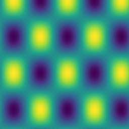
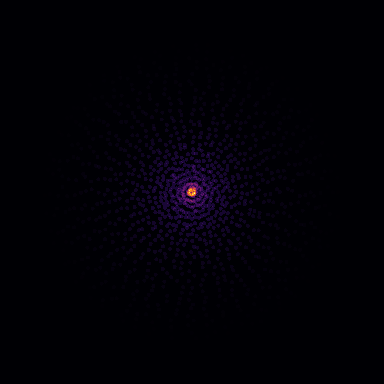
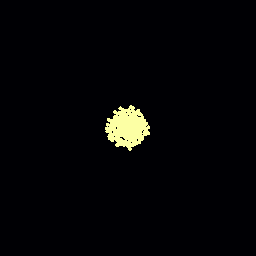
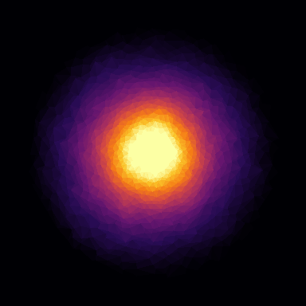
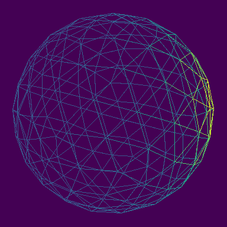
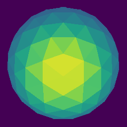
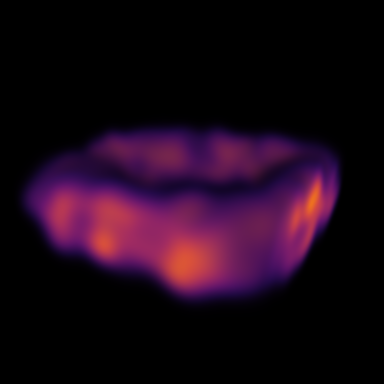
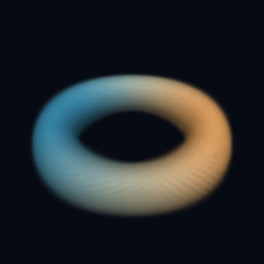

# 可视化

场变成图像和视频而不离开 Tensor IR：colormap 是编译出的 kernel，
几何光栅化（溅射、三角剖分）是 host 端的准备步骤，复用同一个颜色表达式；
视频导出把 raster 流经 Pillow 或 ffmpeg。

## GPU 热力图可视化准备 { #gpu-heatmap-visualization-prep }

[热力图](https://baike.baidu.com/item/热力图)把数字网格变成图像：每个数值映射为一种颜色。这里的
网格是取值在 [0, 1] 内的二维正弦图案；colormap 把每个标量
转换成红-绿-蓝（RGB）三元组，每个网格点对应一行像素数据。



$$\mathrm{field}[y, x] = 0.5 + 0.5\,\sin\!\left(\tfrac{x}{17}\right)
\cos\!\left(\tfrac{y}{23}\right)$$

`gf.visualize.heatmap` 把广播算术和 colormap 组合成单个
“标量到 RGB”的 kernel。生成的 MLIR/provider 产物对外暴露，
可以直接查看；可选的 PNG 编码则留在编译器核心之外。

```python
--8<-- "examples/gpu_heatmap.py:core"
```

默认 colormap 是内置的 `viridis`；`cmap` 切换到其他多停靠点 colormap——
名称、RGB 颜色列表或 `(position, RGB)` 停靠点——`low`/`high` 则给出
朴素的双色 ramp，始终是同一个融合 kernel：

```python
raster = gf.visualize.heatmap(field, cmap="magma")   # 名称见 gf.visualize.colormaps()
```

![heatmap 自身的直接输出：七个内置 colormap，自上而下 coolwarm、gray、inferno、jet、magma、plasma、viridis——每条色带都是编译出的 kernel 在 [0, 1] ramp 上的求值结果。](../assets/examples/heatmap-colormaps.png)

??? example "完整源码：examples/gpu_heatmap.py（可直接运行）"

    ```python
    --8<-- "examples/gpu_heatmap.py"
    ```

## 从位置出发的粒子与视频 { #particles-and-video }

**它是什么。** `visualize_fields.py` 跑了一个极简 FEM 式仿真：圆盘上的
稳态热传导，离散为带抖动的极坐标点集。核区（r ≤ 0.2）固定 T = 1，
外缘（r ≥ 0.95）固定 T = 0，每个内部节点向邻居均值松弛——即
[拉普拉斯方程](https://baike.baidu.com/item/拉普拉斯方程)的
[Jacobi](https://en.wikipedia.org/wiki/Jacobi_method) 迭代，用 mean
reducer 的 message passing 加 Dirichlet 掩码表达：

$$T_i \leftarrow \frac{1}{|\mathcal{N}(i)|} \sum_{j \in \mathcal{N}(i)} T_j \;\; \text{（内部节点）}, \qquad T = 1 \;\text{于}\; \Gamma_{\mathrm{core}}, \quad T = 0 \;\text{于}\; \Gamma_{\mathrm{rim}}$$

邻居关系来自同一组点的 Delaunay 三角剖分，因此图与渲染网格严格一致。
每个节点渲染为一个圆盘，松弛过程由 `gf.visualize.save_video` 流式导出
为 GIF 或 MP4。





```python
--8<-- "examples/visualize_fields.py:core"
```

??? example "完整源码：examples/visualize_fields.py（可直接运行）"

    ```python
    --8<-- "examples/visualize_fields.py"
    ```

## 网格：从散点 Delaunay 或加载 OBJ { #simulation-meshes-load-shade-orbit }

**它是什么。** 渲染连续表面需要 faces 而不只是 positions——faces 有两种
来源。仿真只给出离散位置时，由 [Delaunay](https://en.wikipedia.org/wiki/Delaunay_triangulation)
三角剖分现算：`gf.visualize.delaunay` 把圆盘点集变成网格，每个三角形
按顶点值均值填充——稳态温度场由此呈现为经典的 FEM 云图。



```python
--8<-- "examples/visualize_fields.py:delaunay"
```

当三角剖分本身就是数据的一部分——求解器的表面网格、建模好的 3-D
模型——`visualize_mesh.py` 直接加载：用 `gf.visualize.load_obj` 从
[OBJ](https://en.wikipedia.org/wiki/Wavefront_.obj_file) 文件读入一个
细分 2 级的 icosphere（162 顶点、320 面），把无重复的网格边变成无向
`Graph.from_csr` 关系，并让一个高斯包从某个顶点出发经 mean reducer
扩散。随后同一 mesh 在固定 camera 下渲染，外加一段 12 帧 azimuth 环绕
导出的 GIF。

`gf.visualize.mesh` 直接使用给定的 faces——`gf.visualize.delaunay`
是从点现算三角剖分，`mesh` 则渲染仿真已经产出的三角形。重叠关系由
[painter's algorithm](https://en.wikipedia.org/wiki/Painter%27s_algorithm)
解决：三角形按顶点深度均值从远到近填充，球面近侧干净地遮挡远侧。
固定的 `vmin`/`vmax` 让各帧之间的颜色可比。

同一脚本还把几何体导出给 [Blender](https://en.wikipedia.org/wiki/Blender_(software))
使用：`gf.visualize.export_ply` 写出 binary PLY，顶点同时携带扩散场的
顶点颜色与原始 `scalar_value` 属性；`gf.visualize.export_obj` 写出纯
positions/faces 文本格式，`load_obj` 可恒等读回。

{ width="49%" }
{ width="49%" }



```python
--8<-- "examples/visualize_mesh.py:core"
```

??? example "完整源码：examples/visualize_mesh.py（可直接运行）"

    ```python
    --8<-- "examples/visualize_mesh.py"
    ```

## Gaussian splats 与体渲染 { #gaussian-splats-and-volumes }

**它是什么。** 有些场景既不是网格也不是 mesh，而是一团各向异性的 3-D
[高斯](https://baike.baidu.com/item/高斯函数)——即 3-D [Gaussian Splatting](https://en.wikipedia.org/wiki/Gaussian_splatting)
从照片训练出的表示。`gf.visualize.splats` 直接渲染：每个高斯的协方差
（quaternion 旋转 + 逐轴 scale）经透视投影的 Jacobian 投成 2-D 椭圆，
颜色按 transmittance 从近到远合成：

$$\Sigma = R\,\mathrm{diag}(s^2)\,R^\top, \qquad
C = \sum_{i} T_i\,\alpha_i\,c_i, \qquad
\alpha_i = o_i \, e^{-\frac{1}{2}\,\delta^\top \Sigma'^{-1} \delta}, \qquad
T_i = \prod_{j<i} (1 - \alpha_j)$$

`visualize_gaussians.py` 构造一个沿切向拉伸的彩色高斯圆环，用两种方式
渲染：显式 splat，以及累积成体素密度网格后由 `gf.visualize.volume`
做 ray marching——同一场景的两种标准读法，体渲染的吸收系数为

$$\alpha = 1 - e^{-\sigma \Delta t}$$

{ width="49%" }
{ width="49%" }



```python
--8<-- "examples/visualize_gaussians.py:core"
```

??? example "完整源码：examples/visualize_gaussians.py（可直接运行）"

    ```python
    --8<-- "examples/visualize_gaussians.py"
    ```

3-D Gaussian Splatting 训练导出的 PLY 经 `gf.visualize.load_ply` 读入：
vertex 附加属性携带 `f_dc_*`、`opacity`、`scale_*` 与 `rot_*`
quaternion。标准转换为

$$\mathrm{RGB} = 0.5 + 0.2821 \cdot f_{dc}, \qquad
o = \mathrm{sigmoid}(\text{opacity}), \qquad
s = \exp(\text{scale})$$

——每个字段一次 `np.column_stack`，结果原样喂给 `splats`。
