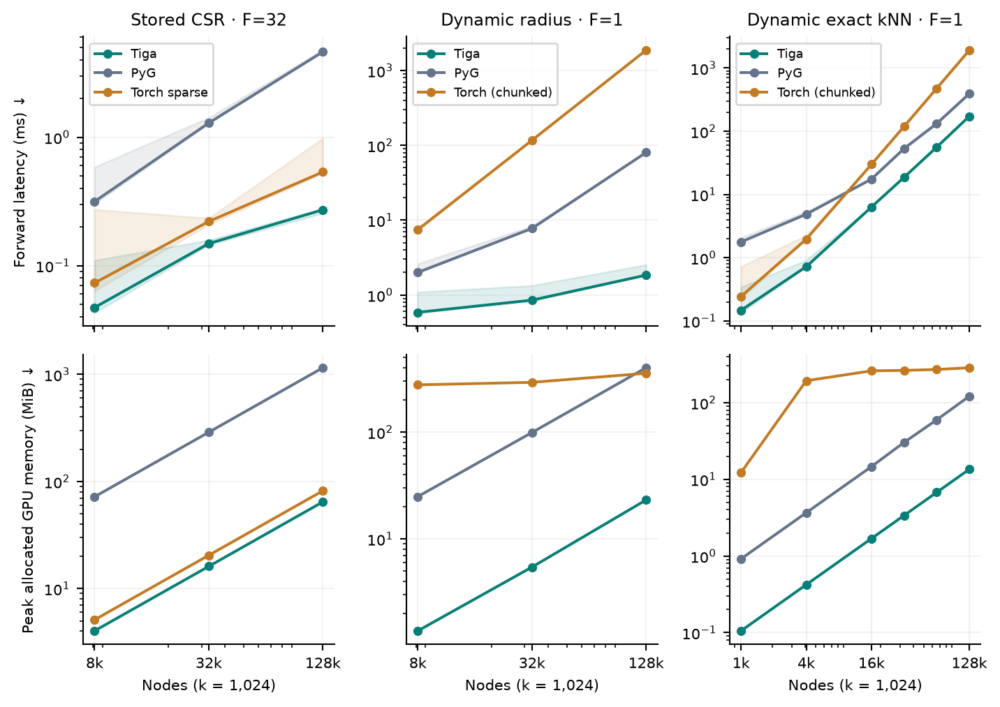
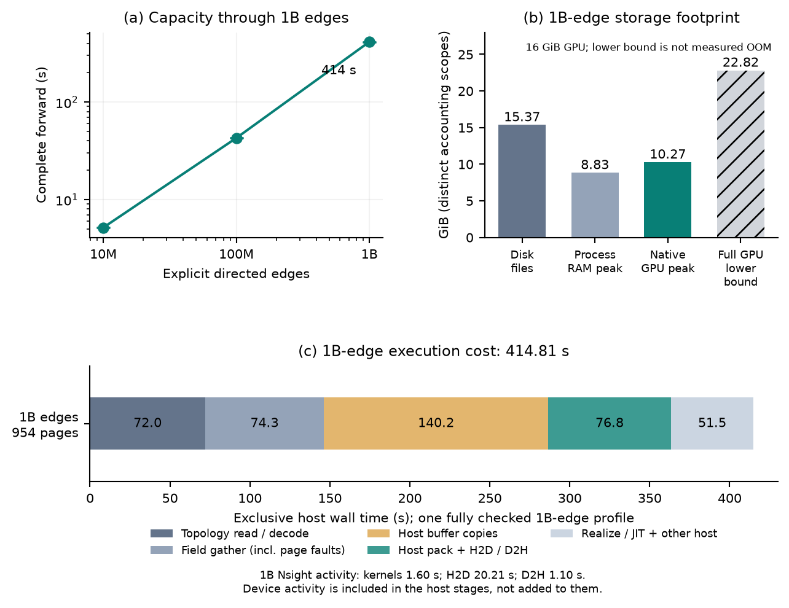
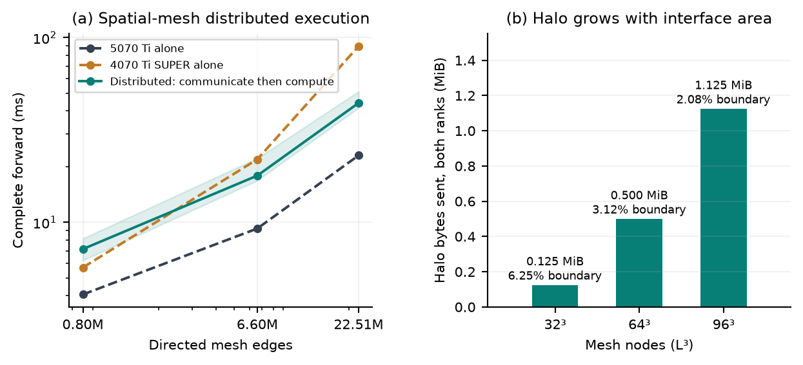

# Performance, capacity, and distributed execution

Compare execution time and memory use, assess billion-edge single-GPU capacity,
and inspect distributed communication overhead. Measurements use FP32 forward
execution, not complete training; results include both speedups and slowdowns.
Recorded September 19, 2026. [Historical benchmark archive](benchmark-results.md).

[Download raw data, source and profiler trace](assets/results/three-questions/evidence.zip) ·
[Reproduction protocol](assets/results/three-questions/REPRODUCE.txt)

On narrow screens, scroll figures horizontally or open the linked full-size image.

## Runtime performance and memory efficiency

Top row: completed-call latency. Bottom row: measured peak allocated GPU memory.
Lower is better in both rows; the axes are logarithmic. Columns are separate
workloads, not directly comparable scores.

| Largest measured case | Tiga / matched peer time | Tiga / peer GPU allocation |
|---|---|---|
| Stored [CSR](https://en.wikipedia.org/wiki/Sparse_matrix#Compressed_sparse_row_(CSR,_CRS_or_Yale_format)), 131,072 nodes, 32 features; Torch sparse peer | 0.272 / 0.536 ms | 64.50 / 81.83 MiB |
| Dynamic radius, 131,072 points, scalar features; PyG peer | 1.84 / 80.24 ms | 23.14 / 400.22 MiB |
| Exact [kNN](https://en.wikipedia.org/wiki/K-nearest_neighbors_algorithm), 131,072 points, scalar features; PyG peer | 172.37 / 393.21 ms | 13.50 / 121.13 MiB |

Stored CSR is **1.49–1.97× faster than Torch sparse** across the three measured
sizes, with approximately 1.27× lower allocation. Radius improves both metrics
on this dataset. After semantic executable reuse and exact tile-selection
pruning, kNN is **2.28–12.06× faster than the measured PyG path** across six
sizes from 1,024 to 131,072 points, with lower allocation. The largest case is
2.28× faster and uses about one ninth of PyG's allocated memory. Selected edges
are still recomputed every call; this is not cached-neighbor lookup.

Dynamic calls alternate two genuinely different coordinate snapshots and include
coordinate copy, neighbor search and aggregation. Full edge sets are checked
before timing; every measured output is checked. Radius uses a binary coordinate
grid with its cutoff between squared-distance levels; the neighbor cap is
verified not to truncate either snapshot. Each configuration has four warmups
and ten samples in a fresh process: 36 configurations in total. Shading is the
observed sample range, not a cross-process confidence interval.

The PyG curve is its builder plus COO `MessagePassing` path, not every PyG
optimization. The CSR column also includes `torch.sparse.mm`. **Torch (chunked)**
is pure Torch construction and aggregation, with no Tiga/PyG builder: direct
squared-distance blocks followed by top-k/gather/sum for kNN, or CSR construction
and `torch.sparse.mm` for radius. Each distance block contains at most 16,777,216
pairs; multiple temporary planes can coexist. This avoids allocating the 64 GiB
full distance matrix at 128K points. The largest kNN Torch case takes 1,908.43 ms
and allocates 285.00 MiB; radius takes 1,870.09 ms and 355.01 MiB. These all-pairs
builders are explicit references, not optimized spatial indices. The
generated dynamic cases use one feature, unlike the 32-feature CSR case.
Memory includes live inputs, output and intermediates, but excludes allocator
reserve, CUDA context/modules and other processes. Separate largest-shape audits
found no additional Tiga-native device-buffer allocations on these Torch paths.
The download at the top of this page includes the source version, raw samples
and configuration for each measurement.

## Billion-edge execution on a single GPU

**1B explicit directed edges complete in 414.25 seconds** on the 16 GiB RTX 5070 Ti.
The 411.36–415.61 second range covers three fresh processes. All two billion
output scalars pass an exact independent [oracle](https://en.wikipedia.org/wiki/Test_oracle).
This is the largest tested size, not an absolute maximum.

| Resource at 1B edges | Amount | Meaning |
|---|---|---|
| Disk | 15.37 GiB | Stored topology and source features |
| RAM | 8.83 GiB | Maximum process RSS during forward, including mapped pages |
| GPU | 10.27 GiB | Maximum native tracked allocation, not total physical usage |
| Full residency | 22.82 GiB | Calculated CSR + source + output requirement; not an executed OOM |

The graph has 16 neighbors per row and 32 FP32 features. Pages contain 65,536
destination rows. The benchmark explicitly uses `prefetch=False`: this is a
serialized capacity baseline, not compiler-scheduled asynchronous IO. Runtime
prefetch can read topology pages ahead and issue contiguous field hints; it
does not overlap the entire source-gather, GPU-staging and output pipeline.
The output still occupies 7.45 GiB on the GPU. Device-wide
samples including existing services and pools reach 13.25 GiB. These consumer
GPUs use GDDR device memory, not HBM.

The lower panel shows a **1B-edge execution profile**, with all two billion
output scalars checked afterward. The profiled window is **414.81 seconds**;
the outer call is 417.05 seconds including profiler start/stop. This single
instrumented call is separate from the three-trial capacity median above.
[Nsight](https://en.wikipedia.org/wiki/Nvidia_Nsight) records **1.60 s** of GPU
kernels, **20.21 s H2D** and **1.10 s D2H**. Exclusive host stages are topology
read/decode (71.98 s), field gather (74.27 s), buffer copies (140.22 s),
packing/transfers (76.79 s), and realization/setup/assembly (51.55 s).

Staging expands an 8 GB stored source field into 128 GB of gathered values;
total H2D traffic is 144.50 GB. Fixture-only eviction hints produce 16.50 GB
of process physical reads. The host stages include page faults and transfers,
not pure disk service times. GPU activity is contained in those stages, not
added to them. The dataset fits RAM; the breakdown is measured at 1B edges,
not extrapolated from smaller graphs.

The full-residency requirement is a calculated lower bound. Competing-method
OOM behavior and manually chunked baselines were not measured. CUDA paged backward,
1B recurrence and output offload remain outside this result.

## Distributed execution and communication overhead

The input is a nonperiodic 3D hexahedral spatial mesh: distinct nodes sharing
an element are connected in both directions, with 26 neighbors for an interior
node. This is FEM-style connectivity; the operation is 16-feature neighbor
summation, not a complete FEM solve. Cubes have sides 32, 64 and 96, reaching
884,736 nodes and 22,508,920 directed edges.

The RTX 5070 Ti and RTX 4070 Ti SUPER split the cube across a spatial plane,
each owning half the destination nodes and exchanging remote features through
[halo](https://en.wikipedia.org/wiki/Halo_(computer_science)) maps. For side length L:

$$
N=L^3,\qquad N_{\mathrm{halo,rank}}=L^2,\qquad f_{\mathrm{boundary}}=2/L.
$$

Boundary fractions decrease from 6.25% to 3.125% and 2.083%; both-rank halo
traffic is 0.125, 0.500 and 1.125 MiB per call. The runtime traces and actual
transfer records verify the surface-to-volume relationship. This is two-rank
graph partitioning, not feature-axis tensor parallelism.

Each call exchanges halo features before computing local outputs. The figure
compares partitioned execution on two GPUs with each GPU running the full graph.

At 22.51M edges, the full-graph single-GPU medians are **23.00 ms** on the 5070 Ti
and **89.75 ms** on the 4070 Ti SUPER. The paired-rank distributed median is
**44.22 ms**. In this configuration, distributed latency falls between the two
single-GPU results and is approximately 1.92 times that of the 5070 Ti alone.

??? info "Measurement configuration"

    | Item | Configuration |
    |---|---|
    | Devices and partition | RTX 5070 Ti + RTX 4070 Ti SUPER; fixed spatial-plane split with equal destination-node counts |
    | Communication | Cross-host NCCL Socket; full network configuration in the [reproduction protocol](assets/results/three-questions/REPRODUCE.txt) |
    | Timing scope | One complete forward call: halo exchange, runtime scheduling, computation and synchronization waits |
    | Aggregation | Maximum of the paired rank times per sample, then the median of five samples |
    | Sampling | Two warmups and five measured calls; inputs change and full outputs are checked each time |
    | Topology and memory | Full topology stored on each host; setup is untimed. This experiment measures latency, not pooled-memory capacity |

For partitioning and launch instructions, see [memory and distributed execution](memory-and-distributed.md).
