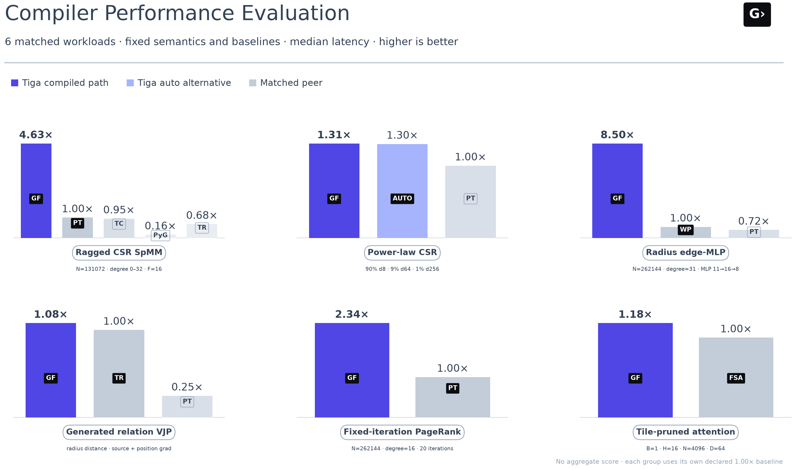
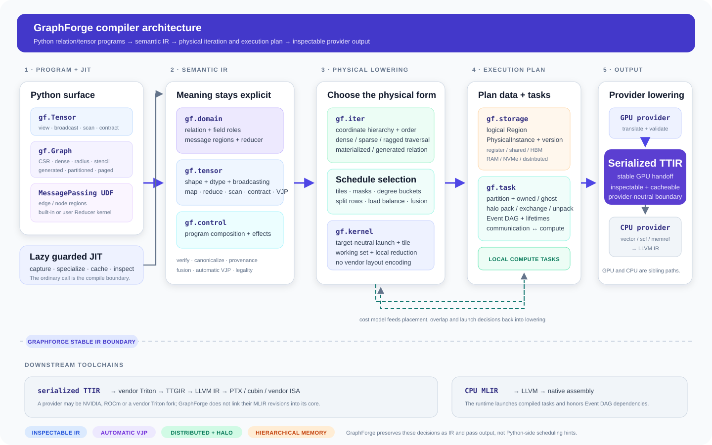

---
hide:
  - navigation
  - toc
---

<section class="gf-hero">
  <div class="gf-hero__copy">
    <div class="gf-eyebrow"><span></span> Relation-oriented compiler · alpha</div>
    <h1>One program.<br><em>Structure-aware</em> kernels.</h1>
    <p class="gf-hero__lead">
      GraphForge compiles sparse, dense, generated, paged, and distributed
      relations from Python UDFs—while retaining enough structure to choose
      traversal, fusion, memory placement, and provider lowering.
    </p>
    <div class="gf-actions">
      <a class="gf-button gf-button--primary" href="getting-started/">Build the first kernel <span>→</span></a>
      <a class="gf-button" href="compiler-pipeline/">Explore the compiler</a>
    </div>
    <div class="gf-install"><code>pip install graphforge-compiler</code><span>first public release pending</span></div>
  </div>
  <div class="gf-hero__trace" aria-label="GraphForge lowering stages">
    <div class="gf-trace__top"><span>captured program</span><code>Diffusion()(graph, u)</code></div>
    <div class="gf-trace__rail" aria-hidden="true"></div>
    <div class="gf-trace__stage"><span>01</span><div><strong>Domain IR</strong><small>relation · UDF · reducer</small></div><code>gf.apply</code></div>
    <div class="gf-trace__stage"><span>02</span><div><strong>Iteration IR</strong><small>dense · sparse · generated</small></div><code>gf.iter</code></div>
    <div class="gf-trace__stage"><span>03</span><div><strong>Kernel + Task IR</strong><small>tiles · memory · halo events</small></div><code>gf.kernel</code></div>
    <div class="gf-trace__stage gf-trace__stage--accent"><span>04</span><div><strong>Provider handoff</strong><small>serialized TTIR or LLVM</small></div><code>TTIR</code></div>
  </div>
</section>

<div class="gf-proof-strip">
  <div><strong>Domain → Iter → Kernel</strong><span>Inspectable progressive lowering</span></div>
  <div><strong>Torch optional</strong><span>Native Tensor, autograd, and runtime</span></div>
  <div><strong>Storage-aware</strong><span>HBM, RAM, NVMe, and halo Task IR</span></div>
  <div><strong>Measured, not projected</strong><span>Registered cases and confidence gates</span></div>
</div>

!!! warning "Release status"

    GraphForge is alpha software and is not published to PyPI yet. Install from
    source today. CUDA and CPU are executable locally; ROCm/DCU, Metal, and PPU
    remain provider contracts until their plugins pass real-hardware conformance.

## Program the relation, not its storage format

GraphForge exposes one `Graph` interface while preserving how a relation was
created and when it changes. The compiler—not a workload name—chooses the
physical realization.

<div class="gf-concept-grid">
  <div class="gf-concept-card"><div class="gf-concept-card__icon">CSR</div><span>Materialized</span><h3>Static and irregular</h3><p>Fixed, bounded-ragged, power-law, paged, or partitioned adjacency with degree-aware scheduling.</p></div>
  <div class="gf-concept-card"><div class="gf-concept-card__icon">R(t)</div><span>Generated</span><h3>Radius and ranked</h3><p>Build and consume neighbors in one kernel when exactness and resource bounds permit it.</p></div>
  <div class="gf-concept-card"><div class="gf-concept-card__icon">Q×K</div><span>Implicit</span><h3>Dense and triangular</h3><p>Stream relation tiles through online reducers without allocating an edge matrix.</p></div>
</div>

## A small semantic surface

<div class="gf-code-story" markdown>

```python
import graphforge as gf

class WeightedAggregation(gf.MessagePassing):
    reducer = gf.sum()

    def edge(self, src, dst, edge):
        return edge.weight * src.x

out = WeightedAggregation()(
    graph=graph,
    src={"x": x},
    edge={"weight": weight},
)
```

<div class="gf-code-story__copy">
  <span class="gf-kicker">Lazy JIT is the normal call</span>
  <h3>No explicit compile step is required.</h3>
  <p>The first compatible call captures and compiles a guarded variant. Warm calls reuse the executable while its graph, shape, dtype, layout, target, and provider guards remain valid.</p>
  <div class="gf-inspect-list"><code>program.explain()</code><code>program.ir("domain")</code><code>program.ir("kernel")</code><code>program.ir("gf.kernel.ttir")</code><code>program.code("ptx")</code></div>
</div>

</div>

## Retained structure changes the algorithm

The overview below reports matched, registered workloads. Each panel keeps its
own declared baseline; unlike operations are not averaged into a synthetic
score. Open the [interactive performance report](benchmark-results.md) for
hover details, all cases, confidence bounds, and exclusions.

<figure class="gf-figure gf-figure--showcase">
  <object type="image/svg+xml" data="assets/compiler-performance-overview.svg" aria-label="GraphForge compiler performance across six matched workloads">
    
  </object>
  <figcaption>Compiler-emitted paths range from mature-primitive parity to structural wins that eliminate materialization or change scheduling. <a href="benchmark-results/">Inspect the evidence →</a></figcaption>
</figure>

## From semantics to provider code

The GPU handoff is serialized TTIR so each vendor can own its downstream
Triton toolchain. CPU lowering is a sibling MLIR-to-LLVM path. Storage and
distributed tasks remain explicit around local kernels instead of leaking
communication calls into user UDFs.

<figure class="gf-figure gf-figure--architecture">
  <object type="image/svg+xml" data="assets/compiler-pipeline-overview.svg" aria-label="GraphForge compiler pipeline from Python capture to TTIR or LLVM">
    
  </object>
  <figcaption><a href="compiler-pipeline/">Follow every IR level and pass boundary</a> · <a href="assets/compiler-pipeline-overview.svg">Open the full-size SVG</a></figcaption>
</figure>

## What is executable today?

| Area | Executable slice | Explicit boundary |
|---|---|---|
| Sparse relations | scalar/vector CSR, bounded-ragged rows, and measured natural-degree schedules | coverage remains shape, dtype, index-width, and distribution specific |
| Dynamic relations | generated Euclidean radius plus exact ranked kNN for arbitrary `k≤64` | general metric UDF, large-k spill/task plans, and ranked backward remain open |
| Dense relations | Cartesian/triangular traversal, grouped lanes, online reducers, tensor-core TTIR | registered attention and matmul shapes are not universal performance claims |
| Tensor + VJP | views, broadcast, reduce, scan, matmul, complex values, and relation-aware automatic VJP | unsupported combinations fail or use a clearly labeled correctness oracle |
| Memory + distribution | single-node HBM/RAM/NVMe planning; MPI halo execution; CUDA task ordering | real 2+ GPU NCCL/RCCL performance is not yet claimed |

<div class="gf-status-note">
  <span>Source of truth</span>
  <p>The <a href="roadmap/">status and roadmap</a> summarizes the authoritative <code>PROJECT.md §15.3</code> ledger. Design notes never promote partial work to supported functionality.</p>
</div>

## Choose a path

<div class="gf-link-grid">
  <a class="gf-link-card" href="getting-started/"><span>01 · Use it</span><strong>Build and run</strong><p>Compile the native tools, execute a differentiable program, and inspect its artifacts.</p></a>
  <a class="gf-link-card" href="programming-model/"><span>02 · Model it</span><strong>Relations and reducers</strong><p>Learn Graph, MessagePassing, reducer algebra, and lazy specialization.</p></a>
  <a class="gf-link-card" href="performance/"><span>03 · Verify it</span><strong>Reproduce results</strong><p>Understand matched boundaries, raw evidence, confidence gates, and generated reports.</p></a>
</div>
