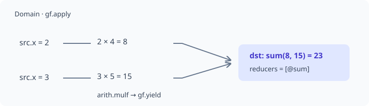
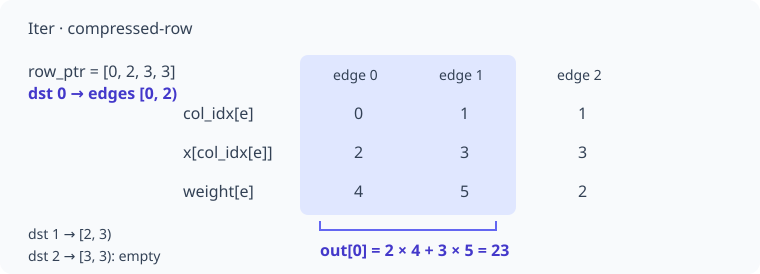
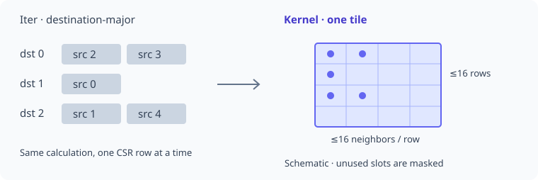
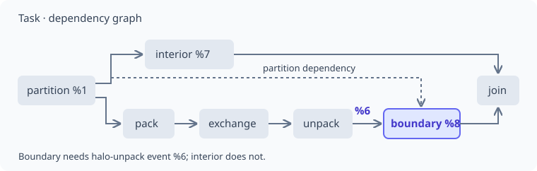

# IR by example

Prerequisite: [compiler introduction](compiler-pipeline.md). This walkthrough
starts with one weighted-neighbor computation and follows **the same compiler
fixture** through Domain, Iter, Kernel and Task IR. No GPU is needed to inspect
these transformations.

This is a compiler-development exercise, not a dump of the native CPU
quickstart. Native Tensor programs can instead use `gf_tensor`; see
[execution paths](compiler-pipeline.md#execution-paths).

## 1. Start with the computation { #computation }

The message has the same meaning as this Python definition:

```python
import tiga as tg

class WeightedAggregation(tg.MessagePassing):
    reducer = tg.sum()

    def edge(self, src, dst, edge):
        return src.x * edge.weight
```

Source values are multiplied by edge weights, then summed per destination.
The [homepage](index.md#a-small-semantic-surface) supplies a complete Python call.
Here the input is the checked
[distributed-plan.mlir fixture](https://github.com/walkerchi/TIGA-lang/blob/main/tests/mlir/distributed-plan.mlir):
it also describes 1,024 entities, degree bounds 4–16 and partition metadata.
That extra placement information makes task planning visible.

The fixture is hand-authored MLIR. The four expandable outputs below are
generated from it by the real compiler, not manually invented diagrams or
claims that a Python call always produces these stages.

## 2. Read the notation { #notation }

[MLIR](https://en.wikipedia.org/wiki/MLIR_(software)) is a textual way to
represent typed operations. The fragment below needs only a few conventions:

| Notation | Meaning |
|---|---|
| `%x`, `%message` | A named value; names can change when the compiler prints IR |
| `@sum` | A reference to a symbol defined elsewhere in the module |
| `f32`, `i64` | A 32-bit float and a 64-bit integer |
| `tensor<?xf32>` | A one-dimensional float Tensor with a runtime length |
| `^bb0(...)` | A block with arguments, here the inputs to one edge's computation |
| `arith.mulf` | Floating-point multiplication |
| `"gf.yield"` | Return the message from this region, not Python's generator `yield` |
| `{...}` / `<{...}>` | Attribute/property dictionaries; the printer may canonicalize their placement |

A [region](https://en.wikipedia.org/wiki/MLIR_(software)) contains operations;
the edge function becomes such a region. A
[pass](https://en.wikipedia.org/wiki/Compiler_pass) analyzes or transforms IR.

## 3. Domain IR: preserve the message { #domain }

<figure class="ir-diagram" markdown>



</figure>

The numbers illustrate one row; they are not constants in the compiler fixture.
The key is **one message per edge, reduced per destination**.
Traversal and thread assignment are not specified yet.

This is the fixture's `gf.apply` operation, with line wrapping adjusted.
The graph relation and `@sum` definition are in the full module below:

```mlir
%out = "gf.apply"(%relation, %x, %weight) ({
^bb0(%source: f32, %edge: f32):
  %message = arith.mulf %source, %edge : f32
  "gf.yield"(%message) : (f32) -> ()
}) {reducers = [@sum], region_kinds = array<i64: 0>,
    input_segment_sizes = array<i64: 2>,
    snapshot_versions = array<i64: 3, 3>,
    effects = ["read", "read"], deterministic = false,
    input_roles = ["src", "edge"], input_names = ["x", "weight"]
} : (!gf.relation, tensor<?xf32>, tensor<?xf32>) -> tensor<?xf32>
```

Read the useful parts first:

- `%relation` is the graph; `%x` and `%weight` are input arrays.
- `input_roles = ["src", "edge"]` binds the first array to source nodes and
  the second to edges. `%source` and `%edge` are scalar block arguments.
- `arith.mulf` preserves the Python multiplication.
- `reducers = [@sum]` identifies the sum
  [reducer](https://en.wikipedia.org/wiki/Fold_(higher-order_function)).
- The version/effect attributes preserve validity and data-access information.
  They do not yet choose a GPU block size.

The actual dialect prefix here is `gf`, not `gf.domain`.

??? example "Full compiler output: domain"

    ```mlir
    --8<-- "docs/includes/ir/domain.mlir"
    ```

## 4. Iter IR: choose a traversal { #iter }

The `gf-lower-domain-to-iter` pass replaces `gf.apply` with
`gf_iter.traverse`.

Domain specifies the messages and per-destination reduction. **Iter specifies
how to enumerate the relation coordinates**, not GPU threads or explicit loop instructions.

### Walk three destination rows { #iter-csr-example }

Use a smaller [CSR](https://en.wikipedia.org/wiki/Sparse_matrix#Compressed_sparse_row_(CSR,_CRS_or_Yale_format))
example with the same message formula. These numbers are **not** the actual data
of the 1,024-node compiler fixture. The complete program uses ordinary Torch tensors:
[`python examples/ir_csr_walkthrough.py`](#iter-python-source).

```python
import torch

row_ptr = torch.tensor([0, 2, 3, 3], dtype=torch.int64)
col_idx = torch.tensor([0, 1, 1], dtype=torch.int64)
x = torch.tensor([2., 3.], requires_grad=True)
weight = torch.tensor([4., 5., 2.])
```

`row_ptr` has one more element than the destination count. Each position in
`col_idx` identifies an edge; the stored value identifies its source node.
There are three destinations, two sources and three edges. Edge IDs are not source IDs.

<figure class="ir-diagram" markdown>



</figure>

| Destination `i` | Edge range `[row_ptr[i], row_ptr[i+1])` | Sources `col_idx[e]` | Messages and result |
|---|---|---|---|
| 0 | `[0, 2)`: edges 0, 1 | 0, 1 | `2*4 + 3*5 = 23` |
| 1 | `[2, 3)`: edge 2 | 1 | `3*2 = 6` |
| 2 | `[3, 3)`: empty row | None | sum identity: 0 |

This **explanatory Python loop** shows the meaning; it is neither compiler output
nor code that a Tiga application must write:

```python
row_ptr, col_idx = [0, 2, 3, 3], [0, 1, 1]
x, weight = [2., 3.], [4., 5., 2.]
out = []
for i in range(len(row_ptr) - 1):
    accumulator = 0.0  # @sum.identity()
    for e in range(row_ptr[i], row_ptr[i + 1]):
        j = col_idx[e]
        message = x[j] * weight[e]  # edge region
        accumulator += message    # @sum.lift / combine
    out.append(accumulator)        # @sum.finalize
assert out == [23., 6., 0.]
```

`destination-major` groups traversal by destination, then visits that row's neighbors.
`compressed-row` locates those neighbors through CSR offsets and column indices.
Neither property sorts source IDs, rebuilds topology or assigns GPU blocks.

### Complete Torch program { #iter-python-source }

This CPU program outputs `[23, 6, 0]`, with source gradient `[4, 7]`.

??? example "Full source: examples/ir_csr_walkthrough.py"

    ```python
    --8<-- "examples/ir_csr_walkthrough.py"
    ```

### Read the actual Iter operation { #iter-operation }

The following excerpt preserves the compiler's SSA names; line wrapping and
attribute order are adjusted:

```mlir
%1 = "gf_iter.traverse"(%0, %arg2, %arg3) <{
  coordinate_hierarchy = "compressed-row", ordering = "destination-major",
  reducers = [@sum], region_kinds = array<i64: 0>,
  input_segment_sizes = array<i64: 2>, snapshot_versions = array<i64: 3, 3>,
  input_roles = ["src", "edge"], input_names = ["x", "weight"],
  effects = ["read", "read"], deterministic = false
}> ({
^bb0(%arg4: f32, %arg5: f32):
  %2 = arith.mulf %arg4, %arg5 : f32
  "gf_iter.yield"(%2) : (f32) -> ()
}) : (!gf.relation, tensor<?xf32>, tensor<?xf32>) -> tensor<?xf32>
```

| IR part | Meaning in this example |
|---|---|
| `%0` | Result of `gf.relation`, wrapping topology; not node zero |
| `%arg2` / `%arg3` | Entire source field `x` / edge field `weight` |
| `%arg4` / `%arg5` | Scalars for the current edge: `x[col_idx[e]]` / `weight[e]`, not whole rows |
| `arith.mulf` → `gf_iter.yield` | Compute and return **one message**, not the destination's final reduction |
| `reducers = [@sum]` | Traverse invokes the module's sum algebra; its addition is not inside the edge region |
| `%1` | Output array for all destinations, not one edge |
| `region_kinds = [0]`, `input_segment_sizes = [2]` | One edge region, two field inputs, no additional node region |
| `snapshot_versions = [3,3]` / `effects` | Logical input versions and read effects, not iteration counts or array lengths |
| `deterministic = false` | No fixed reduction order requested; destination-major does not imply bitwise floating-point determinism |

There are still no `block_rows`, warp counts or streams; those belong to Kernel / Task
planning. Zero is the empty-row result of this sum algebra, not every reducer.

### How other relations traverse { #iter-hierarchies }

The pass chooses coordinates from the relation kind; not every graph becomes CSR:

| Relation | `coordinate_hierarchy` | Enumeration |
|---|---|---|
| Materialized CSR | `compressed-row` | Read existing edges from row ranges |
| Dense / triangular | `cartesian-product` | Source/destination combinations, retaining relation boundary conditions |
| Generated radius | `generated-neighborhood` | Select candidates using neighborhood generation rules |
| Ranked kNN | `ranked-pairs` | Select relation coordinates by ranking |

This is a pass classification, not universal provider coverage. Paged relations remain
in Domain IR in this pass rather than being forced into compressed-row traversal.
See [LowerDomainToIter.cpp](https://github.com/walkerchi/TIGA-lang/blob/main/lib/Transforms/LowerDomainToIter.cpp)
and the [Iter verifier](https://github.com/walkerchi/TIGA-lang/blob/main/lib/Dialect/Iter/IterOps.cpp).

??? example "Full compiler output: iter"

    ```mlir
    --8<-- "docs/includes/ir/iter.mlir"
    ```

## 5. Kernel IR: choose an execution schedule { #kernel }

<figure class="ir-diagram" markdown>



</figure>

The left specifies traversal order; the right groups work into a tile.
The grid is schematic, not the full 16 × 16 tile or a one-cell-per-thread mapping.

The next passes replace traversal with `gf_kernel.launch` and select a
schedule. This fixture produces these attributes:

```mlir
traversal = "csr-row"
schedule_kind = "bounded-ragged-row-neighbor"
block_rows = 16 : i64
block_neighbors = 16 : i64
num_warps = 4 : i64
pipeline_stages = 1 : i64
```

The [kernel](https://en.wikipedia.org/wiki/Compute_kernel) now carries work
grouping and resource contracts. The row/neighbor
[tile](https://en.wikipedia.org/wiki/Loop_nest_optimization#Loop_tiling)
bounds come from the selected plan for this fixture; they are not universal
defaults or user-written parameters. Target code still has to be generated.

??? example "Full compiler output: kernel"

    ```mlir
    --8<-- "docs/includes/ir/kernel.mlir"
    ```

## 6. Task IR: express dependencies { #task }

<figure class="ir-diagram" markdown>



</figure>

Arrows show dependencies, not duration. **Boundary must wait for halo data**;
interior has no such dependency. This compiler fixture demonstrates dependency
representation. The public distributed runtime uses the
[communication-then-compute sequence](memory-and-distributed.md#forward-interiorboundary-split-and-overlap).

Because this fixture includes partition metadata, the
`gf-plan-distributed-tasks` pass adds a partition, a
[halo](https://en.wikipedia.org/wiki/Halo_(computer_science)) exchange plan,
and task dependencies. These two actual operations show the distinction
(line wrapping adjusted):

```mlir
%7 = "gf_task.launch"(%1) <{
  callee = @distributed, operandSegmentSizes = array<i32: 1, 0>,
  reads = ["x"], snapshot_version = 3 : i64,
  task_kind = "interior", writes = ["out"]
}> : (!gf_task.partition) -> !gf_storage.event

%8 = "gf_task.launch"(%1, %6) <{
  callee = @distributed, operandSegmentSizes = array<i32: 1, 1>,
  reads = ["x"], snapshot_version = 3 : i64,
  task_kind = "boundary", writes = ["out"]
}> : (!gf_task.partition, !gf_storage.event) -> !gf_storage.event
```

`%1` is the partition. `%6` is the event produced by halo unpack:

- Interior work needs only the partition/local data.
- Boundary work also consumes `%6`, so it waits for halo data.
- `gf_storage.join` joins their completion events.
- `gf_kernel.launch` still carries the message computation; task planning
  does not replace the multiplication with communication.

This is an IR planning test. It does **not** launch a real multi-GPU job or
prove communication overlap. Without this placement requirement, a simple
program need not acquire these tasks.

??? example "Full compiler output: task"

    ```mlir
    --8<-- "docs/includes/ir/task.mlir"
    ```

## 7. Reproduce the outputs { #reproduce }

First complete the [compiler test build](development.md#mlir-tests).
From the repository root:

```bash
export TIGA_OPT="$PWD/build/compiler/bin/gf-opt"

"$TIGA_OPT" tests/mlir/distributed-plan.mlir

"$TIGA_OPT" tests/mlir/distributed-plan.mlir \
  -gf-lower-domain-to-iter

"$TIGA_OPT" tests/mlir/distributed-plan.mlir \
  -gf-lower-domain-to-iter -gf-lower-iter-to-kernel \
  -gf-select-kernel-schedule

"$TIGA_OPT" tests/mlir/distributed-plan.mlir \
  -gf-lower-domain-to-iter -gf-lower-iter-to-kernel \
  -gf-select-kernel-schedule -gf-plan-distributed-tasks
```

The documentation snapshots are checked against compiler output:

```bash
python tools/render_ir_docs.py --gf-opt "$TIGA_OPT" --check
```

After an intentional compiler change, run the same command without `--check`
to regenerate the snapshots, review the changes, then rebuild the docs.
The [source test](https://github.com/walkerchi/TIGA-lang/blob/main/tests/mlir/distributed-plan.mlir)
also checks the halo/task structure.

## Next

[Build and contribute](development.md) maps these layers to implementation files.
[Memory and distributed execution](memory-and-distributed.md) explains ownership,
storage instances and events in more depth.
