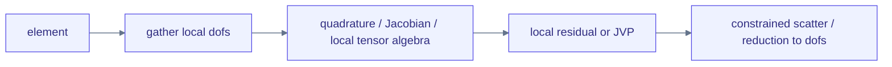
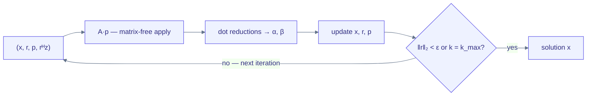

# Matrix-free solvers and implicit differentiation

Global solvers should consume Tiga kernels without flattening them into
an unstructured list of MessagePassing calls: the local operator, loop state,
convergence test, reductions, communication, and differentiation rule all carry
structure the compiler can use.

## The first executable slice

Solvers are grammar sugar, not core API: `examples/solvers.py` composes Tensor
algebra, relation application and `gf_control` control in ordinary Python, with
solver loops written as natural `for`/`while` under `@gf.jit` and staged into
the same control ops. A MessagePassing kernel bound to a `Graph` already is the
matrix-free operator, so it is passed to the solver directly—there is no
wrapper object to construct:

```python
class StiffnessApply(gf.MessagePassing):
    reducer = gf.sum()

    def edge(self, src, dst, edge):
        return edge.value * src.u

x = linear_solve(StiffnessApply(), b, method="cg",
                 graph=mesh_relation,
                 field="u",              # iterated unknown bound to src/dst
                 edge={"value": element_coefficients},
                 iterations=k)

# Or stop from a scalar residual predicate inside bounded device control.
x = linear_solve(StiffnessApply(), b, method="cg",
                 graph=mesh_relation, field="u",
                 edge={"value": element_coefficients},
                 tolerance=1e-6, max_iterations=1000)
```

Pure Tensor algebra (diagonal scaling, Jacobi sweeps) can be passed as a plain
`Tensor -> Tensor` callable instead; the solver validates that each application
is shape/dtype/device-preserving and never materializes a matrix. `method="cg"`
carries the symmetric positive-definite contract, exactly as in scipy — the
sugar layer does not attempt a symmetry proof; `method="bicgstab"` lifts it for
nonsymmetric operators at two applications per step, and `method="richardson"`
is the fixed-count damped fallback.

The control lowering keeps iteration state explicit and compact:

- Both CG forms carry `(x, r, p, rᴴz)` as four typed SSA values; iteration
  bounds do not grow forward IR, and CPU lowering allocates two reusable
  buffers per carried value.
- The while condition is a rank-zero `gf_tensor.compare` over the residual
  norm and lowers with the body to `scf.while`, so Python never polls a
  scalar.
- CPU lowering hoists rank-zero body SSA (dot-product reductions and dependent
  scalar algebra) ahead of element loops and stores each once per iteration,
  so a scalar reduction referenced by three CG vector updates is not
  recomputed per element. Multi-use vectors such as `A(p)` and the next
  residual are likewise materialized once per iteration; single-use vectors
  remain producer-consumer fused. The CPU artifact reports scalar and tensor
  temporary counts.
- Downstream Tensor algebra stays Pythonic (`loss = x.sum()`): the current
  single-output CPU executable ABI stages a nested control result, while a
  future multi-output program ABI may fuse the loop epilogue.

Single-state CUDA repeat reuses two buffers and one prepared operator launch
per iteration; multi-state CUDA repeat/while scheduling remains an open
performance item and fails closed instead of introducing host polling.

[examples/fem_poisson.py](https://github.com/walkerchi/TIGA-lang/blob/main/examples/fem_poisson.py)
applies a one-dimensional P1 Poisson stiffness operator through MessagePassing
without assembling a sparse matrix and compares against the closed-form
solution.
[examples/meshfree_linear_solve.py](https://github.com/walkerchi/TIGA-lang/blob/main/examples/meshfree_linear_solve.py)
uses the same solver interface with a procedural `Graph.radius` relation and a
MessagePassing shifted graph Laplacian. The current position snapshot
determines topology; changing it invalidates/rebuilds the physical relation
without changing the operator kernel or solver call.

### FEM topology is not always a radius graph

The example's mesh connectivity is frozen while its stiffness coefficients may
change—the common moving-mesh case, where geometry is dynamic but element
incidence is not. Remeshing, fracture, contact, or adaptive refinement can
replace the logical relation snapshot while the solver call stays the same. A
`Graph.radius` operator is more natural for meshfree/particle methods than for
ordinary conforming FEM.

Pairwise MessagePassing covers edge-decomposable scalar P1 operators. General
FEM additionally needs a retained element relation:



That requires element-to-dof hyperrelations, local tensor-valued state,
quadrature/layout metadata, and explicit essential-constraint semantics. It
should lower through the same gather/UDF/reducer machinery, but must not be
faked as pairwise edges when doing so loses the element tensor structure.

## Fixed and convergence-driven CG

`linear_solve(..., iterations=k)` emits fixed `repeat` control, while
`linear_solve(..., tolerance=eps, max_iterations=k)` emits bounded `while`
control with an absolute Euclidean residual contract. Both accept an optional
compiler-visible preconditioner. Early convergence prevents the next CG
division from executing; `max_iterations` still provides a finite resource and
failure bound.

One CG iteration carries four pieces of state and spends them on one
matrix-free operator application plus a handful of reductions:

$$
\begin{aligned}
\alpha_k &= \frac{r_k^{\top} r_k}{p_k^{\top} A\, p_k},
& x_{k+1} &= x_k + \alpha_k\, p_k,
& r_{k+1} &= r_k - \alpha_k\, A p_k \\[4pt]
\beta_k &= \frac{r_{k+1}^{\top} r_{k+1}}{r_k^{\top} r_k},
& p_{k+1} &= r_{k+1} + \beta_k\, p_k,
& \text{stop} &\;\text{when } \lVert r_k \rVert_2 < \varepsilon \text{ or } k = k_{\max}
\end{aligned}
$$



| Primitive | Why the compiler must see it | Status |
|---|---|---|
| MessagePassing apply as operator | preserve matrix-free graph/stencil application and differentiable field/parameter dependencies | executable frontend |
| element gather/local tensor/scatter | retain higher-order and mixed FEM structure beyond pairwise P1 edges | design exists as hyperrelation; executable solver slice pending |
| boundary/constraint projection | enforce essential constraints consistently in primal, adjoint, and distributed ownership | pending |
| dot, norm, scalar comparison | expose reductions and their distributed collective boundary | native Tensor/MLIR/CPU LLVM execution; solver-level distributed collective semantics pending |
| multi-value loop-carried SSA | keep CG vectors/scalars in one bounded region with reusable buffers | executable frontend + CPU LLVM lowering |
| bounded `gf_control.while` | device-side convergence with `max_iterations` as a mandatory safety/resource bound | executable frontend/verifier + CPU `scf.while`; GPU provider plans pending |
| preconditioner operator | permit Jacobi/block/multigrid or provider-library choice without changing CG semantics | callable frontend; schedule/performance gates pending |
| multi-state CUDA loop plan | reuse all carried buffers and choose host command graph vs persistent/cooperative execution | pending |
| loop memory/checkpoint plan | choose saved states, recomputation, or hierarchy spill for reverse mode | fixed-repeat correctness fallback exists; structured reverse loop pending |

The emitted control form is structurally similar to:

```mlir
%x, %r, %p, %rr = gf_control.while
    max_iterations = 1000
    (%x0, %r0, %p0, %rr0) {
  cond(%x, %r, %p, %rr):
    %continue = arith.cmpf ogt, %rr, %tolerance_squared
    gf_control.condition %continue
  body(%x, %r, %p, %rr):
    // A(p), dot products, vector updates, and optional collectives
    gf_control.yield %x1, %r1, %p1, %rr1
}
```

`max_iterations` is part of specialization/resource planning even when the
condition exits earlier. On distributed graphs, dot products become explicit
collective tasks; the planner may select pipelined CG and overlap reductions
with halo/interior work only when dependency analysis proves it legal.

## Backward has two distinct contracts

Differentiating through iterations and differentiating the converged equation
are not interchangeable.

### Algorithmic or unrolled VJP

The derivative is for exactly the executed finite iteration algorithm:

$$
\bar{\theta}_{\mathrm{algo}} \;=\;
\frac{\partial\; \mathrm{iterate}^{K}(x_0, \theta)}{\partial \theta}
\quad\text{— unrolled over the } K \text{ executed steps}
$$

Current multi-state `gf_control.repeat` reuses existing
Tensor/MessagePassing VJP rules, but its correctness path specializes the
reverse body per iteration, so backward IR and compile work grow with
iteration count. This is useful for testing and truncated optimization; it is
not a performance-complete solver VJP. A control-autodiff pass must instead
emit a reverse `gf_control.repeat/while` plus a compiler-planned tape,
checkpoint, recomputation, or hierarchy spill.

### Implicit VJP

For a converged system, the implicit rule is:

$$
\begin{aligned}
\text{primal:} \quad& A(\theta)\, x = b \\
\text{adjoint:} \quad& A(\theta)^{\top} \lambda = \bar{x} \\
\text{rhs VJP:} \quad& \bar{b} = \lambda \\
\text{parameter VJP:} \quad& \bar{\theta} = -\lambda^{\top} \frac{dA(\theta)}{d\theta}\, x
\end{aligned}
$$

The user should not write this backward. The operator's differentiable data is
already visible: edge/field bindings and UDF parameters are captured Tensor
dependencies of the MessagePassing apply, so Tiga can apply normal
MessagePassing VJP to the scalar contraction `λᵀ A(θ)x`. Forward and adjoint
may use different tolerances or preconditioners, but the API and IR must record
those choices. Implicit VJP is valid only under a declared convergence/residual
contract and fails closed when the adjoint operator is missing or the solve did
not converge.

Generic `gf_control.while` executes the primal algorithm but is intentionally
insufficient evidence for implicit differentiation: after arbitrary control
lowering, the compiler cannot assume the loop solved `A(x)=b`. The next
semantic step is a retained `gf_linalg.solve` op with
operator/adjoint/preconditioner regions and an explicit stopping contract,
returning at least `(solution, converged, iterations, residual_norm)`.
Autodiff may replace that op with an adjoint solve only when `converged` and
the recorded residual policy prove the implicit rule valid; ordinary
differentiation of `gf_control.repeat/while` remains algorithmic
differentiation.

The remaining primitive boundary:

- retained `gf_linalg.solve` operator/adjoint regions, taking the captured
  MessagePassing apply and its Tensor dependencies directly rather than opaque
  Python closures;
- bounded multi-state control, dot/norm/compare, and first-class distributed
  all-reduce dependencies;
- solver status values and residual policy (`absolute`, `relative`, norm and
  accumulation dtype), not a Python boolean;
- constraint/projector and preconditioner regions, so primal and adjoint use
  compatible boundary conditions;
- a structured reverse-control pass with tape/checkpoint/hierarchy planning
  for algorithmic VJP, plus a separate implicit-solve VJP rewrite;
- element gather/local quadrature/scatter for general FEM, because pairwise
  MessagePassing alone does not retain every element tensor contraction.

If that retained op lands, the Python surface stays a thin staging of it; until
then, solver code lives in `examples/solvers.py`.

## JIT, fusion, and variants

There is no separate user-facing `autofuse` or `jit` module. Calling the solver
creates the same lazy program boundary as calling a kernel. Whole-program
passes can fuse pointwise updates with operator epilogues, reuse relation
snapshots, plan ping-pong buffers, and overlap halo/collective tasks.
`@gf.jit` captures sibling kernel calls automatically; `@gf.program`
remains a compatibility entry point for source-free straight-line code, not
an optimization hint.

Likewise, `gf.variant` should not be a numerical primitive. A compiled variant
is a guarded implementation selected from graph statistics, shapes, dtype,
target, provider, memory budget, and distributed topology. Kernel objects
expose the selected `last_variant` and the guarded `variants` collection; they
may eventually accept a narrow policy constraint, but solver code should not
branch on named kernels.
