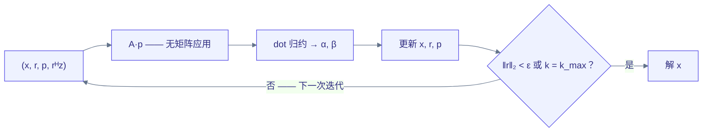

# 无矩阵求解器与隐式微分 { #matrix-free-solvers-and-implicit-differentiation }

全局求解器应当直接消费 Tiga kernel，而不是将其展开为一份无结构的
MessagePassing 调用列表：局部算子、循环状态、收敛判据、归约、通信以及微分规则
都携带着编译器可以利用的结构。

## 第一个可执行切片 { #the-first-executable-slice }

求解器是语法糖，而非核心 API：`examples/solvers.py` 用普通 Python 组合 Tensor
代数、关系应用与 `gf_control` 控制，求解循环以自然的 `for`/`while` 书写在
`@gf.jit` 之下，并被 staged 进相同的控制 op。绑定到 `Graph` 的 MessagePassing
kernel 本身就是无矩阵算子，因此直接传给求解器即可——无需构造任何包装对象：

```python
class StiffnessApply(gf.MessagePassing):
    reducer = gf.sum()

    def edge(self, src, dst, edge):
        return edge.value * src.u

x = linear_solve(StiffnessApply(), b, method="cg",
                 graph=mesh_relation,
                 field="u",              # iterated unknown bound to src/dst
                 edge={"value": element_coefficients},
                 iterations=k)

# Or stop from a scalar residual predicate inside bounded device control.
x = linear_solve(StiffnessApply(), b, method="cg",
                 graph=mesh_relation, field="u",
                 edge={"value": element_coefficients},
                 tolerance=1e-6, max_iterations=1000)
```

纯 Tensor 代数（对角缩放、Jacobi 扫描）也可以作为普通的
`Tensor -> Tensor` 可调用对象传入；求解器会验证每次应用都保持
shape/dtype/device 不变，且绝不物化矩阵。`method="cg"` 携带对称正定契约，
与 scipy 完全一致——语法糖层不尝试对称性证明；`method="bicgstab"` 针对
非对称算子放开该契约，代价是每步两次算子应用；`method="richardson"` 是
固定迭代次数的阻尼回退。

控制 lowering 让迭代状态保持显式且紧凑：

- 两种 CG 形式都以四个带类型的 SSA 值携带 `(x, r, p, rᴴz)`；迭代上界不会
  使前向 IR 膨胀，CPU lowering 为每个被携带的值分配两个可复用缓冲区。
- while 条件是作用于残差范数的零秩 `gf_tensor.compare`，与循环体一起
  lowering 为 `scf.while`，因此 Python 侧永远不需要轮询标量。
- CPU lowering 将零秩循环体 SSA（点积归约及其依赖的标量代数）提升到
  逐元素循环之前，每次迭代只存储一次，因此被三次 CG 向量更新引用的标量
  归约不会逐元素重算。`A(p)` 和下一步残差这类多次使用的向量同样每次迭代
  只物化一次；单次使用的向量保持生产者—消费者融合。CPU 产物会报告标量与
  张量临时量计数。
- 下游 Tensor 代数保持 Pythonic（`loss = x.sum()`）：当前的单输出 CPU 可执行
  ABI 会将嵌套的控制结果 staged 出来，而未来的多输出程序 ABI 可能将循环尾声
  融合掉。

单状态 CUDA repeat 每次迭代复用两个缓冲区和一个已准备好的算子启动；
多状态 CUDA repeat/while 调度仍是未决的性能事项，采取 fail closed 策略，
而不是引入主机轮询。

[examples/fem_poisson.py](https://github.com/walkerchi/TIGA-lang/blob/main/examples/fem_poisson.py)
通过 MessagePassing 应用一维 P1 [泊松方程](https://baike.baidu.com/item/%E6%B3%8A%E6%9D%BE%E6%96%B9%E7%A8%8B)刚度算子，不组装稀疏矩阵，
并与闭式解对比。
[examples/meshfree_linear_solve.py](https://github.com/walkerchi/TIGA-lang/blob/main/examples/meshfree_linear_solve.py)
使用相同的求解器接口，配合程序化 `Graph.radius` 关系和 MessagePassing 的
移位图拉普拉斯算子。当前位置快照决定拓扑；改变位置会使物理关系失效/重建，
而算子 kernel 与求解器调用保持不变。

### FEM 拓扑并不总是半径图 { #fem-topology-is-not-always-a-radius-graph }

示例中的网格连通性是冻结的，而刚度系数可以变化——这是常见的动网格情形：
几何是动态的，但单元关联关系不变。重划分网格、断裂、接触或自适应加密
可以替换逻辑关系快照，而求解器调用保持不变。`Graph.radius` 算子对
无网格/粒子方法比传统的协调 [FEM](https://en.wikipedia.org/wiki/Finite_element_method) 更自然。

成对 MessagePassing 覆盖可按边分解的标量 P1 算子。一般 FEM 还需要保留的
单元关系：


这需要单元到自由度的超关系、局部张量值状态、积分点/布局元数据以及显式的
本质约束语义。这条路径应当经由同一套 gather/UDF/reducer 机制 lowering，但绝不能
伪装成成对边——那样做会丢失单元张量结构。

## 固定次数与收敛驱动的 CG { #fixed-and-convergence-driven-cg }

`linear_solve(..., iterations=k)` 生成固定的 `repeat` 控制，而
`linear_solve(..., tolerance=eps, max_iterations=k)` 生成有界 `while` 控制，
携带绝对欧氏残差契约。两者都接受可选的、编译器可见的
[预条件子](https://baike.baidu.com/item/%E9%A2%84%E6%9D%A1%E4%BB%B6%E5%AD%90)。
提前收敛会阻止下一次 CG 除法执行；`max_iterations` 仍然提供有限的资源与
失败上界。

一次 CG 迭代携带四份状态，开销是一次无矩阵算子应用加上若干归约：

$$
\begin{aligned}
\alpha_k &= \frac{r_k^{\top} r_k}{p_k^{\top} A\, p_k},
& x_{k+1} &= x_k + \alpha_k\, p_k,
& r_{k+1} &= r_k - \alpha_k\, A p_k \\[4pt]
\beta_k &= \frac{r_{k+1}^{\top} r_{k+1}}{r_k^{\top} r_k},
& p_{k+1} &= r_{k+1} + \beta_k\, p_k,
& \text{停止} &\;\text{当 } \lVert r_k \rVert_2 < \varepsilon \text{ 或 } k = k_{\max}
\end{aligned}
$$



| 原语 | 编译器为何必须看到它 | 状态 |
|---|---|---|
| MessagePassing 应用作为算子 | 保留无矩阵图/stencil 应用以及可微分的字段/参数依赖 | 可执行前端 |
| 单元 gather/局部张量/scatter | 保留超出成对 P1 边的高阶与混合 FEM 结构 | 已有超关系设计；可执行求解器切片未决 |
| 边界/约束投影 | 在原始、伴随与分布式归属中一致地强制本质约束 | 未决 |
| dot、norm、标量比较 | 暴露归约及其分布式集合通信边界 | 原生 Tensor/MLIR/CPU LLVM 执行；求解器级分布式集合语义未决 |
| 多值循环携带 SSA | 将 CG 向量/标量保持在单个有界区域内并复用缓冲区 | 可执行前端 + CPU LLVM lowering |
| 有界 `gf_control.while` | 设备侧收敛，`max_iterations` 作为强制安全/资源上界 | 可执行前端/验证器 + CPU `scf.while`；GPU provider 计划未决 |
| 预条件算子 | 允许 Jacobi/块/多重网格或 provider 库选择，而不改变 CG 语义 | 可调用前端；调度/性能门禁未决 |
| 多状态 CUDA 循环计划 | 复用所有被携带缓冲区，并在主机命令图与持久/协作执行之间选择 | 未决 |
| 循环内存/checkpoint 计划 | 为反向模式选择保存状态、重算或跨层换出 | 已有固定 repeat 正确性回退；结构化反向循环未决 |

生成的控制形式在结构上类似：

```mlir
%x, %r, %p, %rr = gf_control.while
    max_iterations = 1000
    (%x0, %r0, %p0, %rr0) {
  cond(%x, %r, %p, %rr):
    %continue = arith.cmpf ogt, %rr, %tolerance_squared
    gf_control.condition %continue
  body(%x, %r, %p, %rr):
    // A(p), dot products, vector updates, and optional collectives
    gf_control.yield %x1, %r1, %p1, %rr1
}
```

即使条件提前退出，`max_iterations` 仍是特化/资源规划的一部分。在分布式
图上，点积变成显式的集合通信任务；只有当依赖分析证明合法时，规划器才可以
选择流水线化 [CG](https://en.wikipedia.org/wiki/Conjugate_gradient_method) 并将归约与 halo/内部工作重叠。

## 反向传播有两种不同的契约 { #backward-has-two-distinct-contracts }

对迭代过程求微分与对收敛后的方程求微分不可互换。

### 算法式（展开）VJP { #algorithmic-or-unrolled-vjp }

导数恰好对应实际执行的有限迭代算法：

$$
\bar{\theta}_{\mathrm{algo}} \;=\;
\frac{\partial\; \mathrm{iterate}^{K}(x_0, \theta)}{\partial \theta}
\quad\text{—— 沿实际执行的 } K \text{ 步逐步展开}
$$

当前的多状态 `gf_control.repeat` 复用现有的 Tensor/MessagePassing VJP
规则，但其正确性路径按迭代特化反向循环体，因此反向 IR 与编译工作量随
迭代次数增长。这对测试和截断优化有用，但不是一个性能完备的求解器 VJP。
控制流自动微分 pass 应当改为生成反向 `gf_control.repeat/while`，加上由
编译器规划的 tape、checkpoint、重算或跨层换出。

### 隐式 VJP { #implicit-vjp }

对于已收敛的系统，[隐式](https://baike.baidu.com/item/%E9%9A%90%E5%87%BD%E6%95%B0%E5%AE%9A%E7%90%86)规则为：

$$
\begin{aligned}
\text{primal:} \quad& A(\theta)\, x = b \\
\text{adjoint:} \quad& A(\theta)^{\top} \lambda = \bar{x} \\
\text{rhs VJP:} \quad& \bar{b} = \lambda \\
\text{parameter VJP:} \quad& \bar{\theta} = -\lambda^{\top} \frac{dA(\theta)}{d\theta}\, x
\end{aligned}
$$

使用者不应手写这个反向过程。算子的可微数据已经可见：边/字段绑定和 UDF
参数是 MessagePassing 应用所捕获的 Tensor 依赖，因此 Tiga 可以对标量
收缩 `λᵀ A(θ)x` 应用常规的 MessagePassing VJP。前向与伴随可以使用不同的
容差或预条件子，但 API 和 IR 必须记录这些选择。隐式 VJP 仅在声明的
收敛/残差契约下有效，伴随算子缺失或求解未收敛时 fail closed。

通用 `gf_control.while` 执行原始算法，但刻意设计为不足以充当隐式微分的
证据：经过任意控制 lowering 之后，编译器无法假定该循环求解的是 `A(x)=b`。
下一个语义步骤是保留的 `gf_linalg.solve` op，带有
算子/伴随/预条件子区域和显式停止契约，至少返回
`(solution, converged, iterations, residual_norm)`。只有当 `converged`
以及记录的残差策略证明隐式规则有效时，自动微分才可以用伴随求解替换该 op；
对 `gf_control.repeat/while` 的普通微分仍然是算法式微分。

剩余的原语边界：

- 保留的 `gf_linalg.solve` 算子/伴随区域，直接接收被捕获的 MessagePassing
  应用及其 Tensor 依赖，而不是不透明的 Python 闭包；
- 有界多状态控制、dot/norm/compare，以及一等公民的分布式 all-reduce 依赖；
- 求解器状态值与残差策略（`absolute`、`relative`、范数与累加 dtype），
  而非 Python 布尔值；
- 约束/投影与预条件子区域，使原始与伴随使用相容的边界条件；
- 用于算法式 VJP 的结构化反向控制 pass（含 tape/checkpoint/层次规划），
  以及独立的隐式求解 VJP 重写；
- 面向一般 FEM 的单元 gather/局部积分/scatter，因为仅靠成对 MessagePassing
  无法保留所有单元张量收缩。

如果该保留 op 落地，Python 表层将保持为它的薄 staging 层；在那之前，
求解器代码位于 `examples/solvers.py`。

## JIT、融合与变体 { #jit-fusion-and-variants }

不存在独立的面向用户的 `autofuse` 或 `jit` 模块。调用求解器与调用
kernel 创建的是同一种惰性程序边界。全程序 pass 可以融合逐点更新与算子尾声、复用
关系快照、规划乒乓缓冲区，并重叠 halo/集合通信任务。`@gf.jit` 自动捕获
平级的 kernel 调用；`@gf.program` 保留为无源码直线代码的兼容入口，
而不是优化提示。

同样，`gf.variant` 不应是数值原语。编译变体是基于图统计信息、形状、dtype、
目标、provider、内存预算和分布式拓扑选择的带守卫实现。Kernel 对象暴露所选
的 `last_variant` 和带守卫的 `variants` 集合；未来可能接受收窄的策略
约束，但求解器代码不应按具名 kernel 分支。
