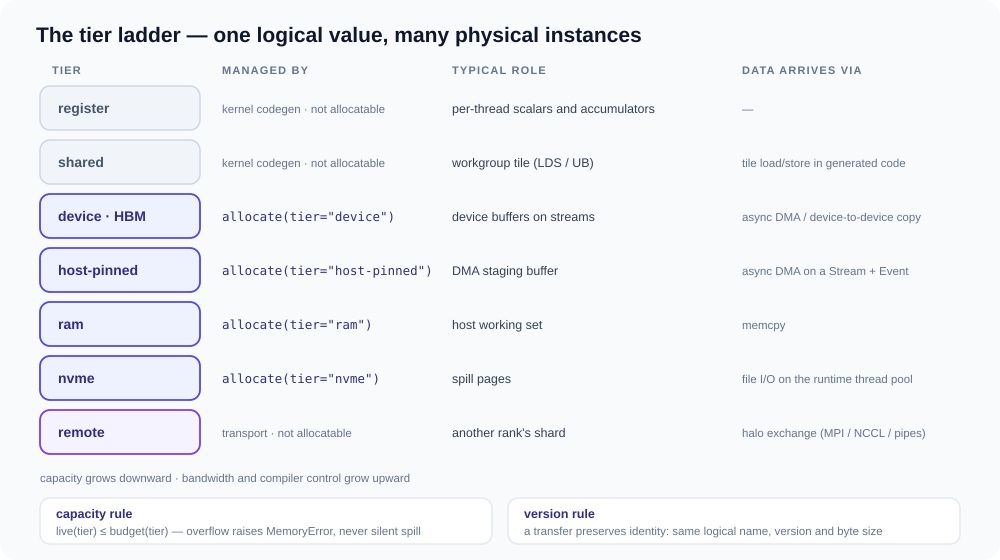
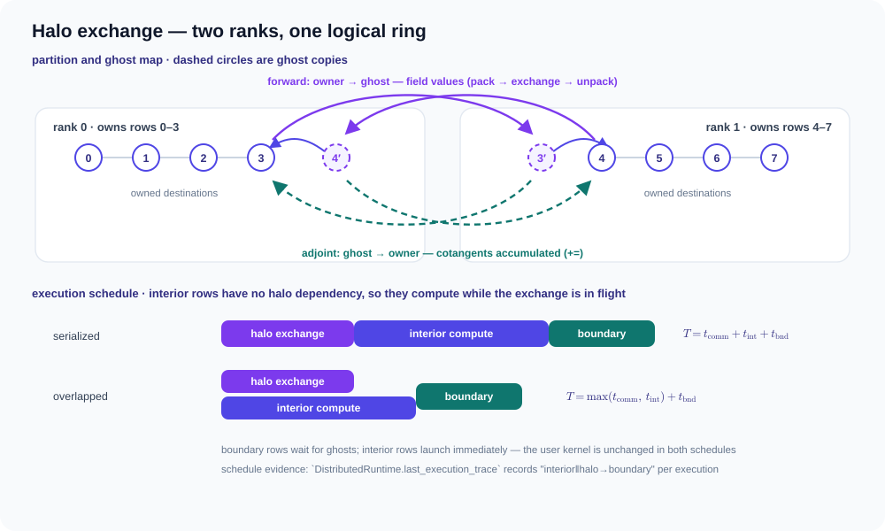

# 内存层级与分布式执行 { #memory-hierarchy-and-distributed-execution }

这些是编译器维度，而不是另一套用户 API。同一个 `MessagePassing`
程序必须在关系驻留于单块 GPU、从 [NVMe](https://en.wikipedia.org/wiki/NVM_Express)
流式读取、或跨 rank 分区时都保持有效。

!!! note "当前状态"

    单机带容量记账的 RAM/pinned/[HBM](https://en.wikipedia.org/wiki/High_Bandwidth_Memory)/NVMe
    执行已实现，包括编译器规划的 transfer/release 和原生异步
    [DMA](https://en.wikipedia.org/wiki/Direct_memory_access)。带类型的
    owned/ghost/halo task、分页 `.gfg` 分片，以及真实双进程
    [MPI](https://en.wikipedia.org/wiki/Message_Passing_Interface) 前向/VJP
    路径均已可执行。CPU 通信/内部计算重叠已有受控链路基准；
    [CUDA](https://en.wikipedia.org/wiki/CUDA) 已有原生缓冲区绑定和经过验证的
    stream 依赖排序。单 rank 的 NCCL 测试只证明了 provider 绑定，尚未证明对等通信。
    真实 2 卡以上 GPU 的 NCCL/RCCL 正确性、profiler 重叠与性能仍是未关闭的门禁。

## 内存层级 { #memory-hierarchy }

Tiga 将**逻辑值**与其**物理实例**分离。版本 7 的 `state`
字段可能同时以 HBM 缓冲区、pinned 暂存缓冲区和 NVMe 换出页的形式存在；
runtime 负责跟踪哪些实例存活、哪一份最新。



阶梯上有三种管理方式：

- **kernel 管理**（`register`、`shared`）——永远不可分配，由生成的
  kernel 代码持有；
- **runtime 可分配**（`device`、`host-pinned`、`ram`、`nvme`）——通过
  `HierarchyRuntime.allocate` 创建，通过
  `HierarchyRuntime.transfer` 传输；
- **传输管理**（`remote`）——属于其他 rank 的分片，只能通过
  halo 交换到达（见下一节）。

### 容量与版本记账 { #capacity-and-version-accounting }

每个实例创建时都带有显式的字节容量，每一层都有预算。记账规则是硬门禁，
不是提示：

$$
\text{live}(t) \;=\; \sum_{i\ \text{live on}\ t} \text{capacity}_i \;\le\; \text{budget}(t)
$$

超出预算会抛出 `MemoryError`——**换出（spill）是显式的跨层
transfer，绝不是运行时偷偷做的决定**。两条契约保证实例一致性：

- 一次 `transfer(source, destination)` 要求相同的逻辑名、相同的
  `version` 和相同的字节大小，并在启动前等待双方各自的挂起工作
  （WAW 顺序）；
- `runtime.latest("state")` 解析出存活实例中版本最高的那一份，
  编译器计划永远不必猜测哪份拷贝是当前的。

所有 transfer 都是异步完成（`transfer(...)` 返回带 `.ready` /
`.wait()` 的句柄）：缓冲区拷贝搭乘带池化事件的 CUDA 或 CPU
`Stream`，NVMe 页则搭乘 runtime 的文件 I/O 线程池。

用户侧的 `.disk()` 换出和编译器 bundle 计划最终都落到这个 runtime 上。
直接调用就能写出一次手动的 RAM → NVMe 换出：

```python
nbytes, version = 256 << 20, 7        # a 256 MiB logical tensor "state" at version 7

with gf.runtime.HierarchyRuntime(budgets={"ram": 1 << 30, "nvme": 4 << 30}) as rt:
    hot = rt.allocate("state", version, tier="ram",  capacity_bytes=nbytes)
    cold = rt.allocate("state", version, tier="nvme", capacity_bytes=nbytes)
    rt.transfer(hot, cold).wait()       # async spill; same name + version + size required
    hot.close()                         # live("ram") drops; latest("state") is now cold
```

可运行版本（含往返完整性校验）见
[examples/hierarchical_memory.py](examples/distributed-memory.md#spilling-tensors-to-disk)；
pinned↔HBM 与 RAM↔NVMe 带宽由
`python -m benchmarks.memory_hierarchy.transfer --quick` 测量。

### 编译器打包计划 { #compiler-bundle-plans }

runtime 之上是编译器的物理计划：`ExecutableBundlePlan` 是一份经过校验的调用
[DAG](https://en.wikipedia.org/wiki/Directed_acyclic_graph) 加上一组
`ResourceRequirement`（名称、内存空间、容量、快照版本）。
`allocate_hierarchy(runtime)` 把需求映射到各层实例，三个保留符号为计划提供显式的
存储控制：`__gf_transfer`（跨层移动）、`__gf_release`（关闭实例）和 `__gf_join`。

合法性规则值得直说：**每一次写/写或读/写冲突都必须由显式依赖定序**，
除非两次访问通过同一分区被证明不相交——runtime 绝不会凭空发明依赖。
违反此规则的 bundle 在构造时即被拒绝，而不是在一次数据损坏的运行之后再去调试。

## 分布式执行 { #distributed-execution }

分布式图仍然是普通的 `Graph`。`graph.halo(mesh, ...)`
只是附加声明式放置——没有数据移动，也不出现 subtype：

```python
mesh = gf.DeviceMesh("cuda", (2, 4), names=("rack", "gpu"))
graph = graph.halo(mesh, partition=gf.ByDestination(mesh_axis="gpu"), depth="auto")
```

### 精确定义：owned 与 ghost { #ownership-and-ghosts-exactly }

设有 $N$ 个目标实体和 $W$ 个 rank，默认的均衡分区把连续的行区间分给
rank $r$：

$$
\text{owned}_r \;=\; \big[\, r\big\lfloor \tfrac{N}{W} \big\rfloor + \min(r,\; N \bmod W),
\;\; (r{+}1)\big\lfloor \tfrac{N}{W} \big\rfloor + \min(r{+}1,\; N \bmod W) \big)
$$

ghost 集合由关系推导而来，而非声明：

$$
H_r \;=\; \{\, j \;\mid\; \exists\, e = (j \to i),\; i \in \text{owned}_r,\; j \notin \text{owned}_r \,\}
$$

`derive_halo_map` 仅凭 owned 的 CSR 行按 rank 计算出该集合；对于分页
`.gfg` 存储，每个 rank 只读取自己的行区间，因此任何 rank 都不会物化
全局邻接结构。



### 前向：内部/边界拆分与通信重叠 { #forward-interiorboundary-split-and-overlap }

执行前，编译器把 owned 行拆分为**内部（interior）**（只引用 owned
源——无 halo 依赖）和**边界（boundary）**（可能引用 ghost）。调度为
`interior ‖ halo → boundary`：

- halo 交换（`pack_halo` → `exchange_packed` → `unpack_halo`，数值从
  owner 流向 ghost）最先启动；
- 内部计算立即启动，与交换并行；
- 边界计算等待 ghost 就绪。

$$
T_{\text{serial}} = t_{\text{comm}} + t_{\text{int}} + t_{\text{bnd}}
\qquad\Longrightarrow\qquad
T_{\text{overlap}} = \max(t_{\text{comm}},\, t_{\text{int}}) + t_{\text{bnd}}
$$

每次执行都会记录一条带类型的 trace
（`DistributedRuntime.last_execution_trace`，schema 为
`tiga.distributed-execution-trace.v1`），因此重叠结论来自实测调度，
而不是期望。受控链路的 CPU 测量见
[基准测试结果](benchmark-results.md) 页面（Distributed 标签页）。

### 反向：伴随同样是一次 halo 交换 { #backward-the-adjoint-is-also-a-halo-exchange }

前向把每个组合后的源字段包装为 `distributed_halo_snapshot`
叶子节点，生成的 VJP 无需用户代码就知道反向通信模式：ghost 的余切
被送回其 owner，并**累积**进 owned 行——

$$
\bar{x}_j \;\mathrel{+}=\!\! \sum_{\substack{e = (j \to i) \\ i\ \text{owned by } r}} \!\! \bar{m}_e^{(r)}
\quad \text{for every remote rank } r
$$

这正是前向 owner→ghost gather 的伴随。
[distributed halo 示例](examples/distributed-memory.md#two-process-halo-exchange)
在一个 8 节点环上端到端验证了这一点：每个 rank 的本地梯度均为 3，
包括跨越 rank 边界的贡献。

### Runtime 与 transport { #runtimes-and-transports }

执行要求有活跃的 runtime；没有 runtime 时调用分布式图会
fail closed（`NotImplementedError`）：

```python
with gf.distributed.DistributedRuntime(transport):
    out = Diffusion()(graph=graph, src={"u": local_u}, dst={"u": local_u})
```

transport 是进程初始化时选定的部署插件——kernel 与图代码从不指名任何一个：

- `PipeTransport`——标准库 `multiprocessing` 管道（示例与双进程测试使用）；
- `TCPTransport` / `from_provider("tcp")`——零依赖的跨机 transport，基于纯
  socket（rendezvous 注册、rank 握手、带帧数据流）；
- `DistributedRuntime.from_provider("mpi")`——一个轻薄的 mpi4py 封装；
- `from_provider("nccl", rank=..., world_size=..., communicator_id=..., ...)`
  绑定真实的 `libnccl` 通信器（仅分组 send/recv；rank 0 创建 128 字节的
  `ncclUniqueId`，由启动器广播）；
- 第三方通过 `tiga.transport` entry-point 组注册。

持久化拓扑保持同一套 API：`gf.save(graph, "mesh.gfg")` 写入带版本的分页存储
（manifest + `row_ptr.bin` + `col_idx.bin`），
`gf.load("mesh.gfg").halo(mesh, depth="auto")` 回到同一个分区快照，
每个 rank 只读取自己的页。`gf.load` 只读取 manifest；`resolve_csr()`
仍是显式的调试物化。

这些路径的实测 transfer、halo 交换、重叠与 NCCL 证据汇总在
[基准测试结果](benchmark-results.md) 页面。
