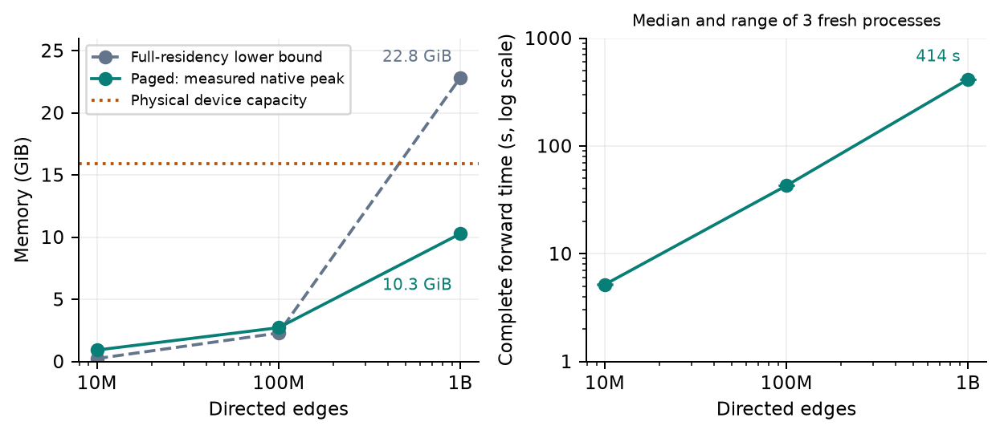

# 内存与存储 { #memory-and-storage }

从普通的 [Tensor](https://en.wikipedia.org/wiki/Tensor_(machine_learning)) 运算开始。内存策略放在程序外层，不写进 message 函数。

## 完整例子 { #a-complete-example }

本例需要原生 CPU runtime，不依赖 Torch；同时验证 spill 后的梯度和持久化数值的往返一致性。

```python
--8<-- "examples/hierarchical_memory.py:core"
```

运行 [`python examples/hierarchical_memory.py`](https://github.com/walkerchi/TIGA-lang/blob/main/examples/hierarchical_memory.py)。预期梯度为 `[0, 2, 4, 6, 8, 10, 12, 14]`。

## 四件事，四个入口 { #four-separate-operations }

| 意图 | API | 契约 |
|---|---|---|
| 设置分配策略 | `tg.execution(device=..., memory=..., spill_dir=...)` | 作用于作用域内新建分配的默认值与记账 |
| 改变驻留位置 | `x.spill()` / `x.realize()` | 保留同一个逻辑 Tensor、设备、数值和 autograd 历史，临时存到磁盘 |
| 拷贝到设备 | `y = x.to("cpu")` / `x.cpu()` | 同设备返回已 realize 的自身；跨设备返回可微拷贝，不改变原设备 |
| 持久化数值 | `tg.save(x, path)` / `tg.load(path)` | 显式路径快照；不换出，不保存 autograd 计算图 |

CUDA Tensor spill 后的逻辑设备仍是 CUDA。`realize()` 恢复到原设备，`cpu()` 则返回 CPU 拷贝。`x.residency` 提供 `device`、`resident`、`backing`、`bytes` 和 `version`；驻留位置不是数学值的变化。

## 预算与生命周期 { #budget-and-lifetime }

`memory={"host": "1GiB", "device": "4GiB", "nvme": "8GiB"}` 接受非负整数字节数，或整数 IEC 容量（`KiB/MiB/GiB/TiB`）。`host` 是 `ram` 的别名，`hbm` 是 `device` 的别名，`ssd` 是 `nvme` 的别名；未指定的层不限额。Pinned 分配单独计入 `host-pinned`。

硬限制覆盖**作用域内新建的**存活原生 buffer 与临时 spill payload，包括 CPU 分页预取线程。共享 buffer 只计费一次，只要 view 仍持有它就继续计费。因此，spill 不保证释放仍被 view、prepared launch 或其他对象持有的分配。超额时在新的受管分配发生前抛出 `MemoryError`。

`run.memory_report()` 返回各层的存活、峰值、预算字节数，以及统计范围和排除项。这**不是进程 [RSS](https://en.wikipedia.org/wiki/Resident_set_size) 限制**：外部 Torch 存储、先前分配、Python/compiler 内存、OS page cache、有界文件 I/O 暂存和持久化快照文件均不计入。文件搬运每块至多 1 MiB；非连续 Tensor 按逻辑元素收集，保存可能较慢。

退出作用域只恢复默认值，返回的 Tensor 仍然有效，继续归原来的记账对象管理。不支持嵌套 execution。匿名 spill 在恢复或 Tensor 回收时清理；显式快照由应用删除。`save` 默认拒绝覆盖已有路径，只有 `overwrite=True` 才允许替换；Tiga 原子替换路径后，已经 attach 的读取者仍读取原快照。

## 大图的当前边界 { #large-graphs-current-boundary }

`tg.execution` 的 `page_rows` 与 `prefetch_depth` 设置 `paged_csr` 调用的默认值，显式调用参数优先。页高是行数，**不是由字节预算推导出的调度**。减小页高和预取深度可以降低工作集压力。

CPU 支持分页前向和 VJP。CUDA 现已验证带磁盘字段的 FP32 分页前向：
`tg.load(path, device="cuda")` 将拓扑留在磁盘，`graph.fields("src")`
创建对应逻辑设备上的惰性字段句柄，不分配完整 payload；原 Graph 释放后句柄仍保持有效。
每页字段先在 host gather，再拷贝到 CUDA。完成的页结果经 host 暂存后，
立即写入最终输出的对应行；不会在 host 上累积另一份完整输出。
这**不是 GPUDirect Storage**，也不承诺 GPU 与 I/O 异步重叠。
完整输出仍驻留设备，递推时还需要上一轮输出；CUDA 分页 backward 仍明确抛出
`NotImplementedError`。完整例子
[`python examples/paged_cuda.py`](https://github.com/walkerchi/TIGA-lang/blob/main/examples/paged_cuda.py)
逐轮核对独立 oracle，需要 NumPy 和原生 CUDA provider。

编译代码缓存与每次调用的输入分配独立管理；预算拒绝或 LRU spill 前会先回收不可达的
Python 循环引用。回收可能增加延迟。计数仍不包含 allocator pool 和编译器资源，
因此不能将预算视为整张 GPU 的物理显存上限。

RAM 限额也作为默认 topology offload 阈值；旧的 `tg.runtime.auto_offload` 作用域可覆盖这个阈值。CSR builder 仍先构造输入，再决定是否 offload；图过大时可能在构造阶段就超预算。打开已有 `.gfg` 可以有界读取拓扑，但当前构造器不是外存图构造器。参见[分页图例子](examples/distributed-memory.zh.md#a-disk-resident-giant-graph)。

## 十亿条边的容量验证 { #billion-edge-capacity }

2026-09-19 的实验在 16 GiB RTX 5070 Ti 上执行 **10 亿条显式有向边**：
6250 万节点，每行 16 个邻居，32 维 FP32 特征。每条边都参与邻居均值计算，
全部输出值逐项核对。这是规则周期图，不是幂律图。

CSR、输入和输出全部驻留至少需要 **22.82 GiB**；即使改成 32 位索引，
仍需要 18.86 GiB。分页执行将 7.45 GiB 的最终输出和有界页缓冲保留在 GPU，
拓扑与源字段从 NVMe 文件经 host staging 读取。实验构图脚本按块写入现有存储格式，
不是新增的 Graph 构造接口。进程设置 12 GiB 原生缓冲安全预算，已有服务占用约
3 GiB；容量结论比较的是 GPU 物理容量，不是该软件预算。

[](assets/results/billion-capacity.png)

左图比较**计算得到的完整驻留下界**与原生分配实测峰值，不是实测 resident OOM。
右图为包含分页、搬运、JIT 和输出组装的完整前向时间。点表示三个独立进程的中位数，
误差棒表示三次结果的范围。构图与完整输出核对不计入前向时间；
不清空 OS 或编译器缓存，GPU 上的已有服务保持运行。

1B 点的前向中位时间为 **414.25 秒**，范围 411.36–415.61 秒。
三次试验中最大的原生 GPU 分配峰值为 **10.27 GiB**（含输出），
前向期间进程峰值 RSS 为 8.83 GiB；两者是不同的内存计数。

[原始测量](assets/results/billion/results.json) ·
[环境与测量口径](assets/results/billion/ENVIRONMENT.txt) ·
[复现命令](assets/results/billion/REPRODUCE.txt) ·
[实验源码](assets/results/billion/billion_edges.py) ·
[源码快照](assets/results/billion/source.tar.gz)

该实验验证单 GPU 前向容量，**不是加速比或训练结论**。图仍能放入主机 RAM。
十亿边递推还需同时容纳上一轮字段与下一轮输出，这些单次前向实验不证明该能力。

## 自动换出闲置 Tensor { #automatic-eviction }

使用 [LRU](https://en.wikipedia.org/wiki/Cache_replacement_policies#Least_recently_used_(LRU)) 策略时，在分配前选择最近最少使用、未被当前计算占用的原生 Tensor，同步换出到 `spill_dir`；读取时恢复到原逻辑设备。

```python
import tempfile
import tiga as tg

with tempfile.TemporaryDirectory() as directory:
    with tg.execution(device="cuda:0", memory={"device": 128, "nvme": 1024},
                      spill_dir=directory, eviction="lru") as run:
        x = tg.tensor([2., 3.], requires_grad=True)
        idle = [tg.tensor([10., 20.]) for _ in range(20)]
        assert not x.residency["resident"]
        assert (x * x).tolist() == [4., 9.]
        assert tg.autograd.grad((x * x).sum(), x).tolist() == [4., 6.]
        print(run.memory_report())
        del idle, x  # 临时目录删除前释放仍然 attach 的值
```

这个小预算是触发换出的教学示例，不是性能配置。CPU 可改用 `device="cpu"` 和 `memory={"ram": 128, "nvme": 1024}`。

- 默认 `eviction="error"` 不自动换出；`"lru"` 必须显式设置 `spill_dir`，目录应位于容量充足的磁盘上。层名 `nvme` 不检测硬盘介质，也不代表 GPUDirect Storage。
- 当前计算的输入会被保护，CUDA 完成后才解除保护。采用同步搬运，不承诺 I/O 与 kernel 重叠。
- 按**整个 Tensor**换出，不会把单个 kernel 自动切成小页；输入、输出和临时量同时装不下仍抛出 `MemoryError`。磁盘容量不足或 I/O 失败也会直接报错。
- 只管理本作用域拥有的原生分配，不换出外部 Torch buffer、先前分配或固定地址的 prepared launch；`prepare()` 在 LRU 作用域中明确报错。view 仍可能持有底层分配。
- `memory_report()` 额外报告 `eviction_policy`、`evictions` 与 `restores`。这不是跨进程、跨 GPU 的统一显存池；每个 rank 分别设置预算。

通用 GPU↔NVMe 外存 kernel 调度、按预算自动推导页高与多层异步预取仍未实现。

## 兼容入口与编译器内部 { #compatibility-and-compiler-internals }

保留 `x.disk()` 临时 spill 入口，以及旧的 `disk(name=...)` / `tg.from_disk(name)` 命名存储；命名入口使用旧的共享目录，拒绝重名和路径分隔符。新代码的持久化使用显式 `save/load` 路径。

编译器的 `HierarchyRuntime` 管理带名称和版本的物理实例，不管理公开 Tensor 身份；它与 Tensor 存储共享分配记账和分块文件搬运原语，图分页仍是独立执行路径。参见[编译器内存与分布式](memory-and-distributed.zh.md)及 [API 契约](api.zh.md#spill-and-disk)。
