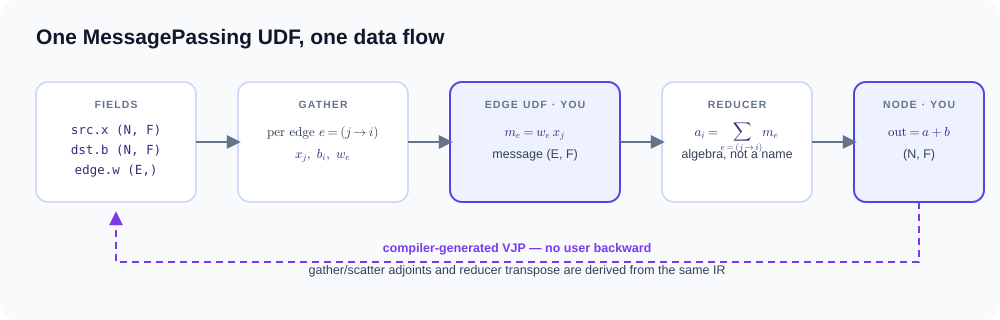

# Message passing

`gf.MessagePassing` is the main way to write a graph program: declare what
travels along each edge and how messages combine; the compiler generates the
relation traversal, the parallel schedule and the reverse-mode VJP.



## A complete program in three pieces

```python
import tiga as gf

class WeightedSum(gf.MessagePassing):
    reducer = gf.sum()                       # 1. how messages combine

    def edge(self, src, dst, edge):          # 2. what each edge sends
        return edge.weight * src.x

    def node(self, dst, aggregate):          # 3. optional node update
        return aggregate + dst.bias

x = gf.tensor([1.0, 2.0, 3.0], requires_grad=True)
weight = gf.tensor([0.5] * num_edges, requires_grad=True)
out = WeightedSum()(graph=graph, src={"x": x}, dst={"bias": bias},
                    edge={"weight": weight})
dx, dw = gf.autograd.grad(out.sum(), (x, weight))
```

No backward function is written anywhere — `gf.autograd.grad` uses the
compiler-generated VJP.

## Usage patterns

Every supported way to drive `MessagePassing`, each with its semantics as a
formula and a runnable example. Notation: $e = (j \to i)$ is one edge,
$m_e$ its message, and the result is per destination node $i$.

**Scalar message sum.** [message_passing_autograd.py](examples/message-passing.md#differentiable-messagepassing-udf).

$$
\text{out}_i = \sum_{e=(j\to i)} w_e\, x_j
$$

**Multi-feature aggregation (GCN/SpMM).** [gcn.py](examples/message-passing.md#gcn-aggregation).

$$
\text{out}_i = \sum_{j\in\mathcal{N}(i)} w_{ji}\, \mathbf{x}_j, \qquad \mathbf{x}_j \in \mathbb{R}^F
$$

**Two-sided messages.** Both endpoint roles in one expression; [diffusion.py](examples/message-passing.md#directional-diffusion).

$$
m_{ji} = u_j - u_i
$$

**Per-edge data.** $c$ lives on the relation itself; [message_passing_autograd.py](examples/message-passing.md#differentiable-messagepassing-udf).

$$
m_e = c_e\, T_j
$$

**Optional node update.** [message_passing_autograd.py](examples/message-passing.md#differentiable-messagepassing-udf).

$$
\text{out}_i = \text{aggregate}_i + b_i
$$

**Compiler-generated gradients.** Derived by the compiler for any field with `requires_grad`; [message_passing_autograd.py](examples/message-passing.md#differentiable-messagepassing-udf).

$$
\partial L / \partial x, \qquad \partial L / \partial w
$$

**Custom reducer algebra.** A mean as tuple state; [custom_reducer.py](examples/message-passing.md#user-defined-reducer).

$$
\begin{aligned}
\text{lift}(v) &= (v, 1) \\
(s, n) \oplus (s', n') &= (s + s', n + n') \\
\text{out}_i &= s / n
\end{aligned}
$$

**Radius relations with implicit geometry.** Positions differentiable; [radius_autograd.py](examples/dynamic-relations.md#differentiable-radius-relation).

$$
m_e = f(\mathbf{p}_j - \mathbf{p}_i,\; \lVert \mathbf{p}_j - \mathbf{p}_i \rVert)
$$

**Exact kNN relations.** The relation feeds the UDF; [knn_message_passing.py](examples/dynamic-relations.md#exact-knn-feeding-messagepassing).

$$
\mathcal{N}(i) = \operatorname{kNN}(\mathbf{p}_i, k)
$$

**Dense and triangular relations as attention masks.** [full_attention.py](examples/attention.md#full-attention-no-mask), [causal_dense_relation.py](examples/attention.md#causal-dense-relation), [varlen_causal_attention.py](examples/attention.md#varlen-causal-attention-with-cu_seqlens).

$$
\text{out}_i = \sum_{j \le i} \operatorname{softmax}_j(\mathbf{q}_i \mathbf{k}_j^\top)\, \mathbf{v}_j
$$

**Online-softmax reducer.** Streamed as a monoid, no score matrix materialized; [tile_pruned_attention.py](examples/attention.md#tile-pruned-sparse-attention).

$$
\text{out}_i = \dfrac{\sum_e e^{s_e}\, \mathbf{v}_e}{\sum_e e^{s_e}}
$$

**nn-scored attention (GAT).** Row-centric fused kernel, forward and backward; [gat_edge_attention.py](examples/attention.md#gat-edge-attention-with-an-nn-score).

$$
s_e = \operatorname{MLP}_\theta([\mathbf{h}_i \,\|\, \mathbf{h}_j]), \qquad \text{out}_i = \sum_j \alpha_{ij}\, \mathbf{v}_j
$$

**torch.nn modules inside `edge`.** Fused into one tile kernel and trainable end to end; [edge_nn_message_passing.py](examples/programs-and-interop.md#edge-nn-modules-with-a-fused-tile-kernel).

$$
m_e = \operatorname{MLP}_\theta([\mathbf{p}_j - \mathbf{p}_i \,\|\, \mathbf{x}_j]), \qquad \text{out}_i = \sum_e m_e
$$

**Zero-copy torch interop.** torch tensors as fields, no conversion layer; [torch_interop.py](examples/programs-and-interop.md#optional-torch-interoperability).

**Fixed-iteration loops around kernels.** Captured once as rolled `gf_control.repeat` (PageRank); [pagerank.py](examples/message-passing.md#fixed-iteration-pagerank-probe).

$$
\mathbf{x}^{(t+1)} = \mathbf{x}^{(t)} + \omega\,(\mathbf{b} - A \mathbf{x}^{(t)})
$$

**Distributed halo exchange.** $\text{out}^{(r)}_i$ computed rank-locally over a partitioned relation; [distributed_halo.py](examples/distributed-memory.md#two-process-halo-exchange).

## The subclass contract

- `reducer` — class attribute (default `gf.sum()`), or set it per instance in
  `__init__`. Any `gf.Reducer` works; see [Reducers](#reducers).
- `edge(self, src, dst, edge, **params)` — **required**. Returns the message
  for one edge.
- `node(self, dst, aggregate, **params)` — **optional**; default returns the
  aggregate unchanged.

Extra call-time keyword arguments are forwarded as `params`. If the UDF
declares `**params` it receives all of them; otherwise only the names present
in its signature are passed, so `def node(self, dst, aggregate, dt)` picks up
`dt=...` from the call site.

The positional namespaces `src, dst, edge` are always passed, so the
signature must accept them — but an unused one is simply never referenced.
Only the attributes actually read enter the captured IR; there is no need
to `del` an unused namespace (older revisions of the examples did this as a
convention, it has no effect on compilation).

## Field namespaces

Edges are directed — each is a `(j→i)` pair — and `src`/`dst` name the two
endpoint *roles*, not two node sets. Inside `edge`, three staged namespaces
expose the fields passed at the call:

| Namespace | Per-edge value | Source |
|---|---|---|
| `src.<name>` | gathered source field | `src={...}` |
| `dst.<name>` | expanded destination field | `dst={...}` |
| `edge.<name>` | edge field | `edge={...}` plus implicit graph fields |

On a homogeneous relation the same node set plays both roles, so one
`ndata={...}` mapping binds every field to both `src` and `dst` — no double
declaration:

```python
kernel(graph=ring, ndata={"u": u}, edge={"conductivity": c}, dt=0.1)
```

`ndata=` cannot be combined with `src=`/`dst=`, and a bipartite relation
(`num_src != num_dst`, e.g. attention's query vs key/value nodes) requires
the explicit `src=`/`dst=` pair — that is exactly the case `ndata` cannot
name.

Generated relations contribute implicit edge fields — `Graph.radius` and
`Graph.knn` provide differentiable `edge.displacement` and `edge.distance`.
Shadowing a graph-provided name in `edge={...}` is an error, not silent
override.

`node` receives the *ungathered* destination namespace plus the reduced
`aggregate`.

## Calling and execution

The call is keyword-only and returns one `gf.Tensor` of shape
`(num_dst, *feature_shape)`:

```python
out = kernel(graph=graph, src={...}, dst={...}, edge={...}, dt=0.1)
```

- Native path: field values must be `gf.Tensor` with leading dimension
  `num_src` / `num_dst` / `num_edges` respectively, on the graph's device.
- If any value is a Torch tensor, the call routes to the optional Torch
  interop adapter (zero-copy `from_torch` adaptation).
- The first call captures, specializes, lowers and caches; later calls with
  the same structure reuse the compiled variant. There is no separate compile
  step.

## Reducers

A reducer is captured algebra, not a string like `"sum"` — the full contract,
built-in signatures and the lowering ladder live in the
[reducers guide](reducers.md). The one thing this page needs: streaming
reducers are *called inside `edge`* and return a staged item.

```python
class Attention(gf.MessagePassing):
    reducer = gf.online_softmax()

    def edge(self, src, dst, edge, scale):
        score = (src.key * dst.query).sum(dim=-1) * scale
        return self.reducer(score, src.value)   # online-softmax item
```

User reducers subclass `gf.Reducer` and may carry tuple state — a mean is
`(sum, count)`, see the runnable
[custom reducer](examples/message-passing.md#user-defined-reducer).

## What UDF code may contain

UDFs build a lazy Tensor expression DAG, not arbitrary Python. Supported:
broadcasting arithmetic with tensors and scalars, unary `-`, `exp`, `sqrt`,
`conj`, `matmul`/`@`, comparisons, `reshape`/`permute`/`transpose`,
`unsqueeze`/`squeeze`, `broadcast_to`, `.sum(dim=...)`, `gather`, `cumsum`.
Rejected, failing closed:

- Python truthiness on a tensor (`if tensor:`) raises `TypeError`;
- with `gf.sum()`, `edge` must return exactly one `gf.Tensor`;
- multi-message returns require a custom reducer and share one trailing
  feature shape.

MessagePassing UDFs are never AST-transformed — [`@gf.jit` control
flow](api.md#control) applies around kernels, not inside them.

## Edge nn modules (CUDA, torch interop)

`gf.nn.trace` wraps a `torch.nn` module so it can be called inside `edge()`.
One source drives two paths: eager execution concatenates the arguments and
calls the module; the compiler proves the chain structure and emits one
fused tile kernel in which the message never leaves the tile — no O(E)
message tensor is materialized anywhere.

```python
class EdgeMLP(gf.MessagePassing):
    def __init__(self, mlp):
        super().__init__()
        self.mlp = gf.nn.trace(mlp)          # nn.Sequential(Linear, ReLU, Linear)

    def edge(self, src, dst, edge):
        # message_e = MLP([pos_src − pos_dst ‖ x_src]); out = Σ_e message_e
        return self.mlp(edge.displacement, src.x)

with torch.no_grad():                        # inference: compiled tile kernel
    out = EdgeMLP(mlp)(graph=graph, src={"x": x}, dst={})
```

Contract and current limits — anything outside falls back to the exact eager
oracle, results unchanged:

| Aspect | Contract |
|---|---|
| Module structure | a **linear chain** — one stream, no branches — of `nn.Linear`, edge-local elementwise ops, and feature-wise `nn.LayerNorm` |
| Elementwise ops | module or functional form: `ReLU`, `GELU` (exact), `Sigmoid`, `Tanh`, `SiLU`, `ELU`, `LeakyReLU`, `Hardtanh`/`torch.clamp` (`ReLU6` included), `Hardsigmoid`, `Hardswish`, `Mish`, `SELU`, `Softplus`, `exp`, `log`, `sqrt`, `rsqrt`, `abs`, `sin`, `cos`, `square` |
| Scalar arithmetic | constants anywhere in the chain — `x * c`, `x + c`, `c - x`, `x / c`, `c / x`, `x ** p`, `-x` — for temperature scaling and affine shifts |
| `nn.LayerNorm(width)` | normalizes each edge's message vector over its own feature axis (edge-local by construction), with symbolic gradients for `weight`/`bias`; `elementwise_affine=False` works too; `nn.Identity` is skipped |
| Inputs | per-edge field gathers (`src`/`dst`/`edge` fields, plus implicit `displacement`); fields and weights are float32 |
| Reducers that fuse | `gf.sum()` → edge-centric tile (this section); `gf.online_softmax()` → GAT-style attention where the nn produces a scalar score per edge and `value` is a field gather, compiled to a row-centric online-softmax tile kernel, forward and fused backward ([example](examples/attention.md#gat-edge-attention-with-an-nn-score)) |
| Launch geometry | a tuning knob, not semantics: `gf.nn.trace(mlp, block_e=256, num_warps=8)` sets the tile size (power of two, 16–1024). Defaults are per-lowering: 128/4 for sum tiles — the sweet spot of a sweep on the 4M-edge radius workload (2.9 ms fwd+bwd vs 3.3 ms at 64 and 3.5 ms at 256) — and 16/1 for attention tiles, where small chunks waste fewer lanes at typical attention degrees |
| Unsupported structure | rejected at `gf.nn.trace` time with `NotImplementedError`: `BatchNorm` (statistics are taken across the edge batch — inherently cross-edge), dropout (stochastic state the recompute VJP cannot replay), branches/residuals (outside the proven linear-chain structure); calls outside the runtime envelope (reducer, dtypes, devices) fall back to the exact eager oracle |
| Training | fused too: a grad-mode call runs the same tile forward under an autograd bridge whose backward is a symbolic-VJP recompute tile kernel — per-edge activations are replayed inside the tile, so no `[E, ·]` tensor exists in either direction. Gradients flow to fields, positions and all module weights |
| Emission backend | the TTIR is produced by the Python emission backend (phase 1 forward, phase 2 VJP); a later phase moves the emitter into the C++ `gf-kernel-to-ttir` translation |

Why these limits exist: the fused kernel processes each edge tile
independently — a message is computed in registers and reduced in place, so
no `[E, ·]` activation ever exists. `BatchNorm` breaks that by construction
(coupling every edge to the whole batch) and would force materializing all
messages plus a second pass. Dropout is edge-local but stochastic; the
backward replays the forward tile and must reproduce identical values, which
a random mask cannot do — and dropout is a no-op at inference anyway.
Branches and residuals are edge-local in principle, so rejecting them is an
engineering boundary, not a fundamental one: the structural proof and the
symbolic-VJP replay currently cover linear chains only. The eager fallback is
a contract, not a shrug — the oracle owns the semantics, compiled kernels
must reproduce it exactly, and calls outside the envelope keep identical
results.

On the radius edge-MLP workload (`benchmarks/neural_networks/radius_edge_mlp.py`,
8.1M edges) the compiled forward matches a handwritten fused Triton oracle
within 1% and is ~12× faster than the eager path, with zero per-edge
activation memory. The training step
(`benchmarks/autograd/edge_nn_backward.py`, 4.0M edges) runs **13.5×**
faster than eager Torch autograd with **18×** lower peak memory (65 MiB vs
1.2 GiB).

## Autograd and checkpoints

```python
gf.autograd.grad(output, inputs, *, grad_output=None,
                 allow_unused=False, checkpoint="auto")
```

Any `src`/`dst`/`edge` field with `requires_grad=True` is differentiable
(float/complex dtypes), as are the implicit `distance`/`displacement` fields
of a radius relation — position gradients flow through generated geometry.
`checkpoint="save"` inserts explicit `Tensor.checkpoint()` saves in the VJP,
`"recompute"` fuses the primal into the backward, and `"auto"` leaves the
budget decision to the compiler.

## Which graphs a kernel can consume

Every `Graph` constructor works with the same `MessagePassing` call; what
differs is which execution paths can serve it:

| Constructor | Torch-tensor call | Compiled CUDA specialization | Native `gf.Tensor` + generated VJP |
|---|---|---|---|
| `Graph.from_csr` / `from_coo` | ✓ eager oracle | weighted-sum, edge-nn tile, nn-attention kernels | ✓ |
| `Graph.radius` | ✓ eager oracle | generated radius kernel, edge-nn tiles | ✓, including position VJP |
| `Graph.knn` | ✓ eager oracle | fixed-degree weighted-sum kernel | — |
| `Graph.dense` / `triangular` | ✓ eager oracle | dense streaming attention kernels | — |
| `graph.halo(...)` | — | — | distributed rank-local execution |

The eager oracle is always available and defines the semantics; compiled
specializations must match it exactly. A call no specialization can serve
still runs — through the oracle, with correct results and autograd.

## Inspecting the compilation

Every kernel instance doubles as an inspection handle:

```python
kernel = WeightedSum()
out = kernel(graph=graph, src={"x": x}, dst={}, edge={"weight": weight})

print(kernel.explain())
# backend: reference
# provider: torch
# lowering: (unspecified)
# passes: validate-domain, select-reference-csr
# remark: [planning] reference evaluator selected; no performance codegen artifact exists
# remark: [planning] cross-apply fusion is handled by the @gf.jit/@gf.program capture boundary rather than ...
# executable cache: hits=0, misses=1
```

A call served by a compiled CUDA specialization reports its real lowering
instead — e.g. `provider: triton`, `lowering: edge-nn-tile`, with the pass
list (`capture-message-passing-udf`, `prove-edge-nn-tile-structure`,
`gf-kernel-to-ttir`, …). Beyond `explain()`:

- `kernel.ir("domain" | "iter" | "kernel" | "task" | "kernel_ttir")` and
  `kernel.code("ptx" | ...)` — compiler IR and generated code as text;
- `kernel.diagnostics` / `kernel.schedules` — typed `AnalysisFinding` and
  `MachineSchedule` records;
- `kernel.cache_info`, `kernel.last_variant` — cache accounting and the
  compiled variant record.

See the [API reference](api.md#messagepassing) for exact signatures.
