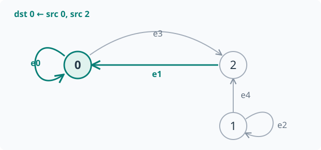
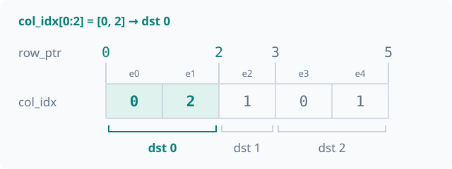

# Programming model

Prerequisite: [installation and the first program](getting-started.md).
This page explains the public concepts through one working example:
**the graph, fields, messages and aggregation**. Ordinary use does not require
handwritten IR or thread scheduling.

## A complete example { #a-60-second-example }

Three nodes and five edges. Each edge sends its source temperature multiplied
by an edge conductivity; each destination sums the messages and adds its bias.

```python
import torch
import tiga as tg

class Conductive(tg.MessagePassing):
    reducer = tg.sum()

    def edge(self, src, dst, edge):
        return edge.c * src.T

    def node(self, dst, incoming):
        return incoming + dst.b

graph = tg.Graph.from_csr(
    torch.tensor([0, 2, 3, 5], dtype=torch.int64),
    torch.tensor([0, 2, 1, 0, 1], dtype=torch.int64),
    num_src=3,
)
T = torch.tensor([1.0, 2.0, 3.0], requires_grad=True)
c = torch.tensor([2.0, 3.0, 4.0, 5.0, 6.0], requires_grad=True)
b = torch.tensor([0.1, 0.2, 0.3], requires_grad=True)

out = Conductive()(graph=graph, src={"T": T}, dst={"b": b}, edge={"c": c})
dT, dc, db = torch.autograd.grad(out.sum(), (T, c, b))
print(out.tolist())                 # approximately [11.1, 8.2, 17.3]
print(dT.tolist())                  # [7.0, 10.0, 3.0]
print(dc.tolist())                  # [1.0, 3.0, 2.0, 1.0, 2.0]
print(db.tolist())                  # [1.0, 1.0, 1.0]
```

`tg` is an import alias for `tiga`. Inputs and outputs are ordinary
`torch.Tensor` values; no `tg.tensor()` or conversion is required.

## 1. Graph describes connections { #graph-is-a-relation-not-a-csr-tensor }

### Read the arrows first { #read-the-connections }

`Graph` answers: **which nodes can send a message to each destination?**
It does not define the message calculation or hold this example's temperature
and conductivity; those values are bound as fields later. The program above has
three nodes, numbered 0, 1 and 2. An arrow `2 → 0` sends a message from source
node `src=2` to destination node `dst=0`.

<figure class="ir-diagram graph-diagram" markdown>



<figcaption>Focus on green: destination 0 receives from sources 0 and 2. e0–e4 are edge IDs, not node IDs. A node can both send and receive.</figcaption>
</figure>

In storage order, the five edges are `e0: 0 → 0`, `e1: 2 → 0`, `e2: 1 → 1`,
`e3: 0 → 2` and `e4: 1 → 2`. The [self-loops](https://en.wikipedia.org/wiki/Loop_(graph_theory))
`0 → 0` and `1 → 1` include the node itself as a message source.
Reverse edges are not added automatically: `1 → 2` does not imply `2 → 1`.

### The same graph as two arrays { #connections-as-csr }

[CSR](https://en.wikipedia.org/wiki/Sparse_matrix#Compressed_sparse_row_(CSR,_CRS_or_Yale_format))
is an array encoding of these arrows, not another graph computation. Tiga groups
incoming edges **by destination**: node 0 has sources `[0, 2]`, node 1 has `[1]`,
and node 2 has `[0, 1]`. Concatenating those lists gives `col_idx = [0, 2, 1, 0, 1]`.

`row_ptr = [0, 2, 3, 5]` stores the group boundaries: **array positions, not node IDs**.
Destination 0 reads positions 0 up to but excluding 2; destination 1 reads 2 up
to 3; destination 2 reads 3 up to 5.

<figure class="ir-diagram graph-diagram" markdown>



<figcaption>The green group encodes the two green arrows above. row_ptr selects a slice; col_idx identifies the sources inside it.</figcaption>
</figure>

An ordinary Torch slice exposes the neighbors of a destination, without any IR:

```python
row_ptr = torch.tensor([0, 2, 3, 5], dtype=torch.int64)
col_idx = torch.tensor([0, 2, 1, 0, 1], dtype=torch.int64)
dst_id = 0
begin, end = row_ptr[dst_id].item(), row_ptr[dst_id + 1].item()
sources = col_idx[begin:end].tolist()  # [0, 2]: sources sending to destination 0
graph = tg.Graph.from_csr(row_ptr, col_idx, num_src=3)
```

`num_src=3` gives the number of source nodes. The destination count is
`len(row_ptr) - 1`, also 3 here; the edge count is `len(col_idx)`, or 5.
Equal adjacent boundaries mean a destination has no incoming edges.
Graph determines only the first three columns below. The final column also
needs fields `T`, `c` and the calculation defined in `edge()`.

| Destination | Edge interval | Source nodes | Weighted messages |
|---|---|---|---|
| 0 | `[0, 2)` | `[0, 2]` | `2 * 1 + 3 * 3 = 11` |
| 1 | `[2, 3)` | `[1]` | `4 * 2 = 8` |
| 2 | `[3, 5)` | `[0, 1]` | `5 * 1 + 6 * 2 = 17` |

Other relation constructors exist, but construction
and execution coverage are separate: see the [support matrix](roadmap.md#feature-support).

## 2. Fields attach data to the graph { #fields }

| Call binding | Meaning | Length in this example |
|---|---|---|
| `src={"T": T}` | Temperature per source node | 3 |
| `dst={"b": b}` | Bias per destination node | 3 |
| `edge={"c": c}` | Conductivity per edge, in CSR edge order | 5 |

`src` and `dst` are endpoint roles, not necessarily different node sets.
Even when both roles refer to the same nodes, they can carry different fields.
Field names belong to the program; `T`, `b` and `c` are not compiler keywords.

## 3. MessagePassing defines edge computation { #messagepassing-describes-semantics }

Inside `edge()`, `src.T` is the current edge's source temperature and
`edge.c` is that edge's conductivity. One vectorized call covers the relation;
no Python loop over neighbors is needed.

The optional `node()` updates nodes after aggregation. Here it adds bias,
producing approximately `[11.1, 8.2, 17.3]`.

Exact parameter rules, field shapes, the `ndata` shorthand and allowed
expressions are in the [MessagePassing contract](message-passing.md).

## 4. A reducer combines messages { #reducers-carry-algebra }

A [reducer](https://en.wikipedia.org/wiki/Fold_(higher-order_function))
combines the incoming messages for one destination into a result.
`tg.sum()` sums, `tg.mean()` averages, and `tg.prod()` multiplies.
Start with a built-in; a custom algebra is not required.

Empty-row behavior and execution coverage differ between reducers;
see the [reducer guide](reducers.md).

## Calls, results and gradients { #calling-is-jit-compilation }

The call returns a `torch.Tensor`. `torch.autograd.grad` obtains gradients
through the same definition without a handwritten backward function.
Node 0 affects the result through coefficients 2 and 5, so its temperature
gradient is 7.

[Execution and troubleshooting](execution.md) explains policies, reference
evaluation and caches. Torch-path planning diagnostics live on the kernel, not on Torch result objects.

## Next

- [MessagePassing contract](message-passing.md): fields, parameters and call rules.
- [Examples](examples.md): select a workload.
- [Compiler introduction](compiler-pipeline.md): optional implementation reading.
