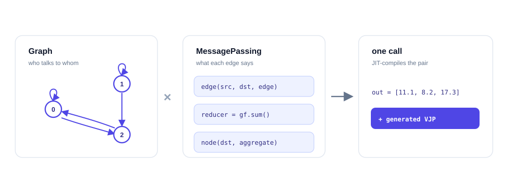

# 编程模型 { #programming-model }

Tiga 把**计算什么**和**如何运行**分开。只需要写两样东西：一个
`Graph`，描述*谁和谁通信*；一个 `MessagePassing` 程序，描述*通信时传递
什么*。写好之后，一次普通调用就会把二者一起编译：



## 60 秒示例 { #a-60-second-example }

这就是上图里的那个程序 —— 三个节点、五条边、一个 UDF：

```python
import torch
import tiga as gf

class Conductive(gf.MessagePassing):
    reducer = gf.sum()

    def edge(self, src, dst, edge):        # message on edge e=(j→i)
        return edge.c * src.T

    def node(self, dst, incoming):         # optional node update
        return incoming + dst.b

# the graph in the diagram: edges 0→0, 2→0, 1→1, 0→2, 1→2
graph = gf.Graph.from_csr(torch.tensor([0, 2, 3, 5]),               # (N+1,)
                          torch.tensor([0, 2, 1, 0, 1]),            # (E,)
                          num_src=3)
T = torch.tensor([1.0, 2.0, 3.0], requires_grad=True)               # src field  (N,)
c = torch.tensor([2.0, 3.0, 4.0, 5.0, 6.0], requires_grad=True)     # edge field (E,)
b = torch.tensor([0.1, 0.2, 0.3], requires_grad=True)               # dst field  (N,)

out = Conductive()(graph=graph, src={"T": T}, dst={"b": b}, edge={"c": c})
# out = [11.1, 8.2, 17.3]; e.g. out[0] = b0 + c0·T0 + c1·T2
out.sum().backward()     # torch autograd — no backward function is written
# T.grad = [7, 10, 3]   c.grad = [1, 3, 2, 1, 2]   b.grad = [1, 1, 1]
```

直接使用 torch [张量](https://baike.baidu.com/item/张量) —— 无需转换、无需拷贝。同一程序也可以脱离 torch
在原生 `gf.Tensor` 运行时上运行，此时梯度来自 `gf.autograd.grad` 和
编译器生成的 VJP。

没有编译步骤，也不需要手写反向函数 —— 四个理念支撑了这一切：

## Graph 是关系，不是 CSR 张量 { #graph-is-a-relation-not-a-csr-tensor }

`gf.Graph` 记录逻辑拓扑和来源信息。[CSR](https://en.wikipedia.org/wiki/Sparse_matrix) 只是一种可能的物化方式；稠密
笛卡尔关系和程序生成的 radius/[kNN](https://en.wikipedia.org/wiki/K-nearest_neighbors_algorithm) 关系都可以保持隐式。

```python
static = gf.Graph.from_csr(row_ptr, col_idx, num_src=n)   # frozen adjacency
dense = gf.Graph.dense(n, device=x.device)                # full N×N relation
dynamic = gf.Graph.radius(position, cutoff=0.3)           # geometry-generated
nearest = gf.Graph.knn(position, k=16)                    # exact kNN search
packed = gf.Graph.cat([gf.Graph.triangular(L) for L in lengths])  # varlen blocks
```

三个内部维度相互独立：

| 维度 | 含义 | 示例 |
|---|---|---|
| 来源（origin） | 邻接关系从何而来 | 外部索引、程序化规则 |
| 生命周期（lifecycle） | 何时变化 | 冻结、可重建 |
| 实现方式（realization） | 如何执行 | 物化、分页、生成 |

这就是为什么基于 [SSD](https://en.wikipedia.org/wiki/Solid-state_drive) 或[分布式](https://baike.baidu.com/item/分布式)的关系也使用同一套 `Graph` API：
存储是一个物理执行计划，而不是另一套算法 API。

## MessagePassing 描述语义 { #messagepassing-describes-semantics }

`src`、`dst` 和 `edge` 是 staged 的字段命名空间。字段名是用户数据，
而不是编译器的模式开关：任何合法优化都必须能从捕获的表达式、
关系性质和 reducer 代数中证明出来。[消息传递指南](message-passing.md)
涵盖完整接口 —— 命名空间、参数转发、checkpoint、查看编译产物。

## Reducer 自带代数 { #reducers-carry-algebra }

reducer 不是 `"sum"` 这样的字符串 —— 它是显式的 `identity` / `lift`
/ `combine` / `finalize` 区域，并声明了结合性，因此元组状态可以表达
[online softmax](https://en.wikipedia.org/wiki/Softmax_function) 这类数值稳定的流式算法。编译器看到的是一个结构化的
代数，绝不是 `Attention` 操作码，也不会按类名 dispatch。[reducer 指南](reducers.md)
详细介绍这一契约以及 lowering 阶梯。

## 调用即 JIT 编译 { #calling-is-jit-compilation }

```python
out = Program()(graph=graph, src=src, dst=dst, edge=edge)
```

普通调用会自动完成捕获、特化、lowering 和缓存。显式编译 API 只留给
预热、[AOT](https://en.wikipedia.org/wiki/Ahead-of-time_compilation) 导出或部署场景，常规执行用不到。
