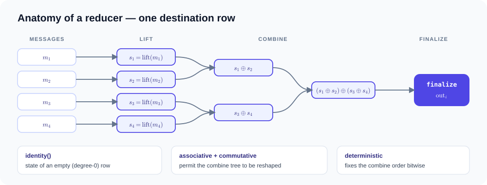

# reducer { #reducers }

reducer 是**可执行的代数**，而不是 `"sum"` 这样的名字。它是每个
MessagePassing 程序的第三个成员：edge UDF 产生消息，reducer 定义这些
消息如何组合成每个目标节点的一个值。下面这四个方法会被捕获为一等公民
`gf.reducer` IR，并在 provider lowering 之前与关系遍历融合——这正是
编译器能为手写的 reducer 生成
[VJP](https://en.wikipedia.org/wiki/Automatic_differentiation) 的原因。

对于目标节点 `i` 及其入边消息 $m_e$，其语义是一个 [fold](https://en.wikipedia.org/wiki/Fold_(higher-order_function))（折叠）：

$$
\text{out}_i \;=\; \text{finalize}\!\Big( \bigoplus_{e\,=\,(j \to i)} \text{lift}(m_e) \Big),
\qquad
s \oplus s' = \text{combine}(s, s')
$$

把同一个 fold 写成普通 Python 循环，可以看出每个方法各自在何时运行：

```python
for i in range(num_dst):                 # per destination node
    state = identity()                   # before its edges
    for e in edges_into(i):
        m = edge(src, dst, edge)         # your edge() UDF produces the message
        state = combine(state, lift(m))
    out[i] = finalize(state)             # after its edges
```

这里展示的是逻辑顺序，即左折叠。如果声明了结合律/交换律，编译器就
可以按任意顺序组合，或组织成平衡树。



## 用法一览 { #usage-patterns }

下面列出 reducer 的所有用法，每种都附一个可运行的示例：

**`gf.sum(identity=…)`。** 加法[幺半群](https://baike.baidu.com/item/幺半群)，直接 lowering 成段归约求和；
[gcn.py](examples/message-passing.md#gcn-aggregation)。

$$
\text{out}_i = \sum_e m_e
$$

**`gf.mean()`。** 邻居均值，用内置元组状态 $(\text{sum}, \text{count})$
实现；[见下文](#gfmean)。

$$
\text{out}_i = \frac{1}{\deg i} \sum_e m_e
$$

**`gf.prod()`。** 乘积幺半群，提升为零安全的乘积 IR；[见下文](#gfprod)。

$$
\text{out}_i = \prod_e m_e
$$

**`gf.online_softmax()`。** 把 flash attention 写成元组状态
$(m, l, a)$ 上的幺半群，调用方式为 `self.reducer(score, value)`；
[tile_pruned_attention.py](examples/attention.md#tile-pruned-sparse-attention)。

**tile 剪枝。** `block_prune_threshold` 让稠密 [CUDA](https://en.wikipedia.org/wiki/CUDA) 路径跳过低于
阈值的分数 tile（一种语义近似，默认关闭）；
[tile_pruned_attention.py](examples/attention.md#tile-pruned-sparse-attention)。

**手写元组状态版的均值。** 把 `gf.mean()` 内置背后的代数显式写成
自定义 reducer；[custom_reducer.py](examples/message-passing.md#user-defined-reducer)。

**单遍矩统计。** 用 $(n, \sum x, \sum x^2)$ 一遍算出[方差](https://baike.baidu.com/item/方差)，已证明
逐分量可加，并带有生成的 VJP；[见下文](#neighbor-variance-in-one-pass)。

**手写乘积幺半群。** 把 `gf.prod()` 内置背后的代数显式写出来，用于
gate 可靠性；[见下文](#product-of-edge-gates)。

$$
\prod_e p_e
$$

**手写 [online softmax](https://en.wikipedia.org/wiki/Softmax_function)。** 把内置代数显式写成用户 reducer，走同一族
lowering；[见下文](#online-softmax-written-by-hand)。

**多消息 reducer 调用。** `self.reducer(score, value)` 会得到一个
双字段的 staged 绑定，而不是一个普通值；
[full_attention.py](examples/attention.md#full-attention-no-mask)。

**用 `gf.sum()` 聚合 torch.nn 产生的消息。** 消息是一个融合、可训练的
边 [MLP](https://en.wikipedia.org/wiki/Multilayer_perceptron)；[edge_nn_message_passing.py](examples/programs-and-interop.md#edge-nn-modules-with-a-fused-tile-kernel)。

**用 `gf.online_softmax()` 聚合 torch.nn 产生的分数。** GAT 风格的
[注意力](https://baike.baidu.com/item/注意力机制)，其中边*分数*是一个小网络；编译为以行为中心的融合
[kernel](https://en.wikipedia.org/wiki/Compute_kernel)（前向和反向）；[gat_edge_attention.py](examples/attention.md#gat-edge-attention-with-an-nn-score)。

**检查 reducer。** `reducer.mlir(...)` 以文本形式返回捕获到的
`gf.reducer` op；[custom_reducer.py](examples/message-passing.md#user-defined-reducer)。

## 四个 region 方法 { #the-four-region-methods }

| 方法 | 角色 | 默认 |
|---|---|---|
| `identity(self)` | 空（度为 0）行的状态 | *必须实现* |
| `lift(self, *messages)` | 把一条边的消息映射到状态 | 单消息透传；多消息为元组 |
| `combine(self, left, right)` | 合并两个状态 | *必须实现* |
| `finalize(self, state)` | 把行的状态映射为节点结果 | identity |

状态可以是标量或元组。邻居均值是最典型的元组状态例子——
$\text{lift}(v) = (v, 1)$，
$(s_l, n_l) \oplus (s_r, n_r) = (s_l + s_r,\; n_l + n_r)$，
$\text{finalize}((s, n)) = s / n$——见可运行的
[自定义 reducer 示例](examples/message-passing.md#user-defined-reducer)。

## 类属性与 `__init__` { #class-attributes-and-init }

| 属性 | 含义 | 对编译的影响 |
|---|---|---|
| `name` | IR 符号名（默认 `"custom"`） | 缓存/特化键的一部分 |
| `associative` | $(a \oplus b) \oplus c = a \oplus (b \oplus c)$ | **原生并行 lowering 要求 `True`**；永远不会从 Python 源码推导——声明即契约 |
| `commutative` | $a \oplus b = b \oplus a$ | 允许 combine 树重排操作数 |
| `deterministic` | 实例标志，`__init__(*, deterministic=False)` | `True` 选择固定顺序的顺序归约（逐位稳定）；`False` 允许平衡树 |

编译器信任这些标志，而不去推断它们：给不满足结合律的
代数声明 `associative = True`，生成的并行代码就是错的，这属于
用户错误。

## 在 `edge` 内调用 reducer { #calling-a-reducer-inside-edge }

用消息调用 reducer 会返回一个 **staged 绑定**，而不是一个值：

```python
def edge(self, src, dst, edge):
    return self.reducer(src.value)          # ReducerCall(reducer, (value,))
```

- 至少需要一个消息（否则抛出 `TypeError`）。
- 多个消息会变成元组状态：
  `return self.reducer(score, payload)`。
- staged 项让编译器能把 lift 融合进 edge region，并把 combine/finalize
  保留在归约中。

## 内置 reducer，逐个讲 { #built-in-reducers-op-by-op }

### `gf.sum(identity=0)` { #gfsumidentity0 }

加法幺半群——每个方法都是平凡的实现：

$$
\text{identity}() = 0, \qquad
\text{lift}(m) = m, \qquad
a \oplus b = a + b, \qquad
\text{finalize}(s) = s
$$

所以 $\text{out}_i = \sum_e m_e$，直接 lowering 成段归约求和。
`identity` 改变度为 0 的行所产生的值。

### `gf.mean()` { #gfmean }

用内置元组状态 $(s, n)$ 实现的邻居均值：

$$
\begin{aligned}
\text{identity}() &= (0, 0), \qquad
\text{lift}(m) = (m, 1) \\
(s, n) \oplus (s', n') &= (s + s',\; n + n') \\
\text{finalize}\big((s, n)\big) &= s / n
\end{aligned}
$$

所以 $\text{out}_i = \frac{1}{\deg i} \sum_e m_e$。该代数已证明逐分量
可加，因此原生路径会把它 lowering 成两个段归约求和加最后一次除法，
并带有生成的 VJP。度为 0 的行会 finalize 出 $0/0$，产生
[NaN](https://en.wikipedia.org/wiki/NaN)——如果
希望孤立节点输出零，请改用 `gf.sum()`，再自己除以 clamp 过的度数。

### `gf.prod()` { #gfprod }

乘法幺半群：

$$
\text{identity}() = 1, \qquad
\text{lift}(m) = m, \qquad
a \oplus b = a \cdot b, \qquad
\text{finalize}(s) = s
$$

所以 $\text{out}_i = \prod_e m_e$——例如 gate 可靠性 $\prod_e p_e$，
即进入 $i$ 的每个 gate 都保持打开的概率。编译器会把它提升为零安全的乘积
IR 并生成 VJP；度为 0 的行得到单位元 $1$。

### `gf.online_softmax()` { #gfonline_softmax }

以元组状态 $(m, l, a)$ 流式计算的 softmax 加权均值——滚动最大值、
归一化项、加权和：

$$
\begin{aligned}
\text{identity}() &= (-\infty,\; 0,\; 0) \\
\text{lift}(s, v) &= (s,\; 1,\; v) \\
(m_1, l_1, a_1) \oplus (m_2, l_2, a_2) &=
\big(m,\;\; l_1 e^{m_1 - m} + l_2 e^{m_2 - m},\;\; a_1 e^{m_1 - m} + a_2 e^{m_2 - m}\big) \\
\text{finalize}\big((m, l, a)\big) &= a \,/\, l
\end{aligned}
$$

其中 $m = \max(m_1, m_2)$：合并前先把两个部分状态重新缩放到
同一范围，因此 $\text{out}_i = \sum_e \mathrm{softmax}(s_e)\, v_e$。重新缩放发生在
`combine` 内部，所以部分状态可以按任意顺序合并，而且永远不会物化分数
矩阵——这就是 flash attention 的 online softmax，写成了幺半群的形式。
它在 `edge` 中以 `self.reducer(score, value)` 调用。分数本身可以是
一个 `gf.nn.trace` 过的网络（GAT 风格的学习注意力）：在 CUDA 上它会
编译为以行为中心的融合 kernel，并带有融合的反向——见
[GAT 示例](examples/attention.md#gat-edge-attention-with-an-nn-score)。

- `accumulation_dtype`——流式状态的 dtype。
- `block_prune_threshold`，取值 $(0, 1]$——一种**语义近似策略**，
  而不是调度提示：当某个分数 tile 的最大 softmax 权重低于当前滚动块
  最大值的这一比例时，稠密流式实现可以跳过整个 tile。`None`（默认）
  保持精确的 online softmax。目前只在生成的 CUDA DenseGraph 路径上
  生效。

**为什么没有 `max` / `min` / `median` 内置？** max 幺半群只有一行
代数，但原生可微的 op 集合里还没有带次梯度 VJP 的 `maximum` op——
添加它已列入项目路线图。在此之前，按最大权重聚合通常本来就更适合
用 `gf.online_softmax()`（一个平滑、完全可微的 max）。median 和
分位数则是本质上的另一回事：**不是结合幺半群**——不存在固定
大小的状态 $(s \oplus s')$ 能累积出 median——从根本上不属于
单遍 reducer 语义，需要两遍算法或 sketch（t-digest、矩）。

## 让 nn 产出消息或 score { #neural-networks-in-the-message-or-the-score }

一个 `gf.nn.trace` 过的 `torch.nn` 模块可以在两个点融合进归约——
两者都编译为单个融合的 CUDA kernel，逐边激活永远不会离开 tile，
且两者都能端到端训练（字段、位置以及所有模块权重都会收到生成的
梯度）：

**nn 产生消息**，由 `gf.sum()` 组合——编译为以边为中心的 tile kernel
（[示例](examples/programs-and-interop.md#edge-nn-modules-with-a-fused-tile-kernel)）：

$$
m_e = \operatorname{MLP}_\theta\big([\,\mathbf{x}_j \,\|\, \mathbf{x}_i\,]\big),
\qquad
\text{out}_i = \sum_{e=(j \to i)} m_e
$$

**nn 产生分数**，由 `gf.online_softmax()` 组合——GAT 风格的学习
注意力，编译为以行为中心的 online softmax tile kernel，并融合反向
（[示例](examples/attention.md#gat-edge-attention-with-an-nn-score)）：

$$
s_e = \operatorname{MLP}_\theta\big([\,\mathbf{h}_i \,\|\, \mathbf{h}_j\,]\big),
\qquad
\text{out}_i = \sum_{j} \operatorname{softmax}_j(s_{ji})\, \mathbf{v}_j
$$

分数链必须为每条边产出一个标量（`out_features=1`），且 softmax 的
`value` 必须是一次字段 gather。自定义 reducer 里的 nn 不匹配任何融合
形式，会回退到精确的 eager oracle——结果正确，但不快。op 白名单、
LayerNorm 支持和 launch geometry 参数见
[消息传递指南](message-passing.md#edge-nn-modules-cuda-torch-interop)。

## 自定义 reducer { #inventing-your-own }

下面三个代数都能真正跑在原生路径上——每一个都被编译器识别为已证明的
形式，因此前向 kernel 及其 VJP 都是生成的。内置 reducer 只是便利写法，
并非享有特权的编译器路径。

### 单遍计算邻居方差 { #neighbor-variance-in-one-pass }

一次遍历累积矩 $(n, \sum x, \sum x^2)$，并 finalize 为
$\text{out}_i = \mathbb{E}[x^2] - \mathbb{E}[x]^2$——对需要邻域统计的
特征归一化层很有用：

```python
class Variance(gf.Reducer):
    associative = True
    commutative = True

    def identity(self):
        return 0.0, 0.0, 0.0                 # (count, sum, sum of squares)

    def lift(self, value):
        return 1.0, value, value * value

    def combine(self, left, right):
        return (left[0] + right[0],
                left[1] + right[1],
                left[2] + right[2])

    def finalize(self, state):
        mean = state[1] / state[0]
        return state[2] / state[0] - mean * mean


class NeighborVariance(gf.MessagePassing):
    reducer = Variance()

    def edge(self, src, dst, edge):
        return self.reducer(src.x)


out = NeighborVariance()(graph=graph, src={"x": x}, dst={})  # (N,)
```

编译器从结构上证明这个代数**逐分量可加**。注意，`finalize` 也会对度
为 0 行的 `identity()` 运行——这里孤立节点会算出 $0/0$，所以选择
identity/finalize 组合时要把空行考虑进去。

### 边 gate 的乘积 { #product-of-edge-gates }

可靠性风格的聚合：$\text{out}_i = \prod_e p_e$，即进入 $i$ 的*每个*
gate 都保持打开的概率。这正是 `gf.prod()` 内置所用的代数——这里手写
一遍，展示其中的机制：

```python
class Product(gf.Reducer):
    associative = True
    commutative = True

    def identity(self):
        return 1.0

    def combine(self, left, right):
        return left * right


class GateReliability(gf.MessagePassing):
    reducer = Product()

    def edge(self, src, dst, edge):
        return self.reducer(edge.open_probability)
```

`lift` 和 `finalize` 继承基类默认（透传）。编译器从表达式树证明出
**乘积幺半群**——单位元 $1$、透传 lift、`mul` combine——并将其提升
为零安全的乘积 IR，带有生成的 VJP。

### 手写 online softmax { #online-softmax-written-by-hand }

`gf.online_softmax()` 并没有什么魔法——把同一个代数写成用户 reducer，
同样会被从结构上证明为 **stable-weighted**，并走同一族 lowering：

```python
class Softmax(gf.Reducer):
    associative = True
    commutative = True

    def identity(self):
        return float("-inf"), 0.0, 0.0       # (max, denominator, numerator)

    def lift(self, score, value):
        return score, 1.0, value

    def combine(self, left, right):
        m = left[0].maximum(right[0])
        l = left[1] * (left[0] - m).exp() + right[1] * (right[0] - m).exp()
        a = left[2] * (left[0] - m).exp() + right[2] * (right[0] - m).exp()
        return m, l, a

    def finalize(self, state):
        return state[2] / state[1]
```

能捕获的标量运算只有元组状态上的算术、`.exp()` 和 `.maximum()`。
不匹配任何已证明形式的代数也仍然能运行——按一般的显式归约树执行
（只含算术和 `exp`），只保证正确性，绝不是性能承诺。

## 编译器如何选择 lowering { #how-the-compiler-picks-a-lowering }

在原生路径上，reducer 按结构匹配，顺序如下：

1. `gf.sum()` → 直接段归约求和；nn 子图消息进一步 lowering 为以边
   为中心的融合 tile kernel（及其符号 VJP 反向）；
2. `gf.mean()` → 已证明逐分量可加的元组状态：两个段归约求和加
   最后一次除法，带有生成的 VJP；
3. `gf.prod()` → 已证明的乘积幺半群，提升为零安全的乘积 IR，带有
   生成的 VJP；
4. `gf.online_softmax()` → tile 化的稳定流式路径；nn 子图分数进一步
   lowering 为以行为中心的融合注意力 kernel（及其融合反向）；
5. 被证明为 **stable-weighted**、**乘积幺半群**（提升为零安全的乘积
   IR）或**逐分量可加**（元组状态）的用户 reducer → 生成的归约，带有
   生成的 VJP；
6. 其他一切 → 一般的显式归约树：`deterministic=True` 时顺序执行，
   否则为平衡树；标量结果。

不匹配任何已证明形式的代数仍然只有正确性保证，绝不是性能承诺。

## 检查 reducer { #inspecting-a-reducer }

`reducer.mlir(message_dtypes=(gf.float32,), symbol="user_mean")` 会把
四个 region 捕获为一个经过验证的 `gf.reducer` op，并返回其文本——
正是自定义 reducer 示例所指向的那个产物。reducer 的标志和构造配置
构成其特化键，所以两个代数不同的 reducer 永远不会共享编译缓存条目。

扁平列表见 [API 参考](api.md#reducers)。
