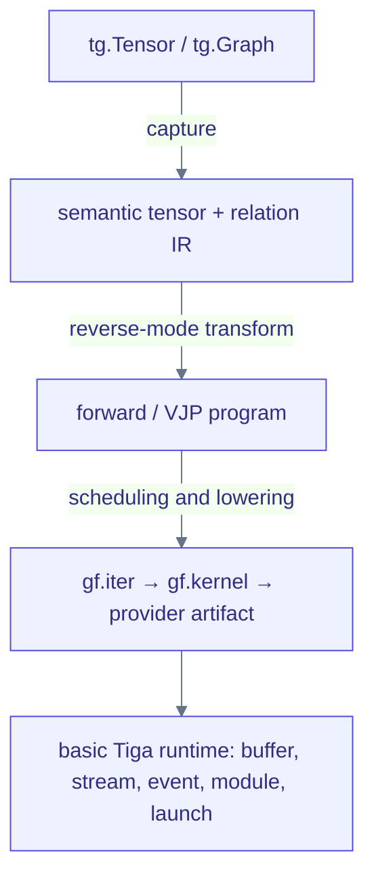

# Native Tensor runtime and autograd (advanced)

Ordinary applications use `torch.Tensor` and Torch autograd, as shown in
[getting started](getting-started.md). This page describes the internal native
runtime and compiler inspection surface, not a second tensor API to learn first.

Tiga implements only the low-level value/runtime surface needed to run
compiled tensor and relation programs. Optimizers, neural-network modules and
datasets are deliberately outside the current scope.



## Current implemented slice { #current-alpha-slice }

- The native C ABI owns aligned CPU buffers plus CUDA Driver allocations,
  streams, events, modules and kernels, and exposes page-locked host buffers
  and asynchronous CPU↔CUDA/CUDA↔CUDA transfers.
- `tg.Tensor` records shape, dtype, strides, device, storage offset, version
  and ready event without wrapping a Torch Tensor.
- The generic expression slice supports right-aligned broadcasting, `add`,
  `mul`, `conj`, arbitrary-axis `sum`, `reshape`, `permute`/`transpose`,
  `squeeze`/`unsqueeze` and zero-stride `expand`.
- Contiguous reshapes, permutations and expansions alias storage; reshaping a
  non-contiguous logical view materializes only when observed.

```python
import tiga as tg

x = tg.tensor([1.0, 2.0, 3.0], requires_grad=True)
loss = (x * x + 2.0).sum()
dx = tg.autograd.grad(loss, x)

assert loss.tolist() == 20.0
assert dx.tolist() == [2.0, 4.0, 6.0]
```

Native results are deferred. Observation may use `python-oracle` under the
default `auto` policy; set `TIGA_TENSOR_BACKEND=native` to require compilation.
`Tensor.execution` identifies the actual backend after realization. The
compiler pipeline below describes supported compiled paths, not every call.

`tg.autograd.grad` constructs a new symbolic VJP expression; it does not mutate
`.grad` fields or maintain an eager tape, and `value_and_grad` provides a
functional transform. `Tensor.mlir()` emits canonical `gf_tensor` operations
and `Tensor.mlir(verify=True)` round-trips them through the native C++
verifier. `tg.autograd.grad_mlir()` shows either the explicit
`gf_tensor.grad` request or the ordinary Tensor IR produced by
`gf-tensor-vjp`. The Python expression evaluator is only a correctness oracle;
`Tensor.expression()` remains informal debug text. Supported CPU DAGs are
built by the native OpBuilder, lowered to explicit SCF/MemRef loops, converted
to the LLVM dialect and launched by an in-process MLIR ExecutionEngine, with
structural caching keyed by canonical MLIR semantic hash. No C/C++ source
emitter or system compiler participates.

`tg.autograd.joint_plan(output, inputs)` binds generated gradients into one
versioned executable bundle. Forward completion is an explicit dependency of
each backward task, while checkpoint/spill decisions are consumed during
backward physicalization. `explain()` exposes task topology and resource
effects; users still write no backward function.

`tg.autograd.grad(..., checkpoint="auto|save|recompute")` controls primal
storage for backward. `auto` emits `gf_tensor.checkpoint_candidate`; the native
`gf-plan-tensor-checkpoints` MLIR pass selects save or recompute under
`TIGA_CHECKPOINT_BUDGET_BYTES`, and a selected save becomes
`gf_tensor.checkpoint`. CUDA currently proves irregular relation gathers
profitable; CPU uses a zero-byte budget. Diagnostics report native compiler
load, planning, `saved_bytes`, checkpoint compile/materialization, backward
compile and warm launch separately. This is a compiler memory decision, not a
handwritten workload-specific kernel.

For a broadcast edge scalar `weight[E,1]` multiplying `x[src,F]`, ordinary
broadcast VJP produces an axis-1 reduction. CUDA lowering fuses destination
gather, multiplication with the saved source field and the per-edge feature
sum into one TTIR kernel. No MessagePassing-specific backward method is needed.

`complex64` and `complex128` use native interleaved storage. Complex VJPs use
the conjugate-Wirtinger convention, so multiplication differentiates through
the conjugate of the opposite operand and `conj` conjugates its cotangent.
Because no canonical real loss can be inferred from an arbitrary complex
scalar, callers must supply `grad_output` for complex outputs. The CUDA
pointwise provider lowers interleaved complex64/complex128 directly to paired
real TTIR SSA, including add/multiply/divide/negate/conjugate; it is covered
by device differential tests rather than an eager complex fallback.

Prepared CUDA submissions bind a stable ABI once. Tiga-owned buffers
continue through the standalone CUDA Driver runtime; an all-Torch-owned
prepared binding reuses the vendor launcher's already packed current-stream
ABI, avoiding a Python/ctypes dispatch gap without changing the compiler TTIR.
Mixed/external low-level bindings can use the runtime's ordered no-extra-event
launch, while ordinary launches still return an explicit Tiga completion
event.

Shape polymorphism uses guard-and-specialize: bounded `Dim` symbols are unified
across `TensorSpec` arguments, and their concrete binding enters the executable
cache key. Providers therefore receive static launch bounds without requiring
the user to author a separate program for every size.

The CPU fusion benchmark is reproducible with:

```bash
python -m benchmarks.compiler.tensor_fusion \
  --rows 4096 --cols 1024 --torch-compile
python -m benchmarks.compiler.tensor_fusion \
  --rows 4096 --cols 1024 --dtype complex64 --torch-compile
```

It times a result-ready boundary, records cold compilation separately and
compares identical broadcast-multiply-add-axis-sum semantics. Relaxed math is
explicit in the JSON; pass `--strict` to disable reassociation.

## Runtime provider status

The compiler constructs `gf_tensor` in process, verifies
broadcasting/views/reductions, runs reverse-mode AD and lowers executable CPU
and CUDA subsets. CPU vectorization and range-parallel relation loops are
implemented. Per-provider runtime
support is tracked in the [roadmap](roadmap.md) support matrix; providers
without a vendor runtime plugin fail explicitly.

## Relation-aware reverse mode

Autograd must differentiate `MessagePassing` at semantic relation level. The
forward reduces edge messages into each destination; the VJP is the same
traversal transposed — source gradients become a scatter back along the same
edges:

$$
\mathrm{out}_i = \bigoplus_{e=(j \to i)} m_e
\;\;\Longrightarrow\;\;
\frac{\partial L}{\partial x_j}
= \sum_{e=(j \to i)} \frac{\partial L}{\partial\, \mathrm{out}_i}
\cdot \frac{\partial m_e}{\partial x_j}
$$

Reducer VJP rules determine what state must be saved or recomputed. Online
softmax must retain or recompute bounded statistics instead of materializing
all edge scores.

Dynamic graph topology is non-differentiable by default. Positions and edge
geometry may be differentiable while radius/select membership is treated as a
fixed snapshot. Forward and backward must reference the same topology version.
For a distributed snapshot, reverse mode also reverses halo/scatter data flow
and retains collective dependencies in `gf.task`.

Linear solves add a second differentiation contract—algorithmic VJP for finite
fixed iterations versus an adjoint-solve implicit VJP for converged systems.
See [matrix-free solvers and implicit differentiation](linear-solvers.md); no
implicit-solve performance claim is made yet.

## Torch interoperability

Torch is the recommended application interface when installed separately;
it is not a default dependency. Native Tensor/runtime/autograd and CPU
MessagePassing remain executable without Torch, not just importable. Native MessagePassing/VJP can reach CPU LLVM
and CUDA TTIR kernels. The standalone runtime owns CUDA Driver resources;
the Torch bridge supplies storage sharing and current-stream binding. DLPack and external buffer binding will preserve this
zero-copy boundary.
