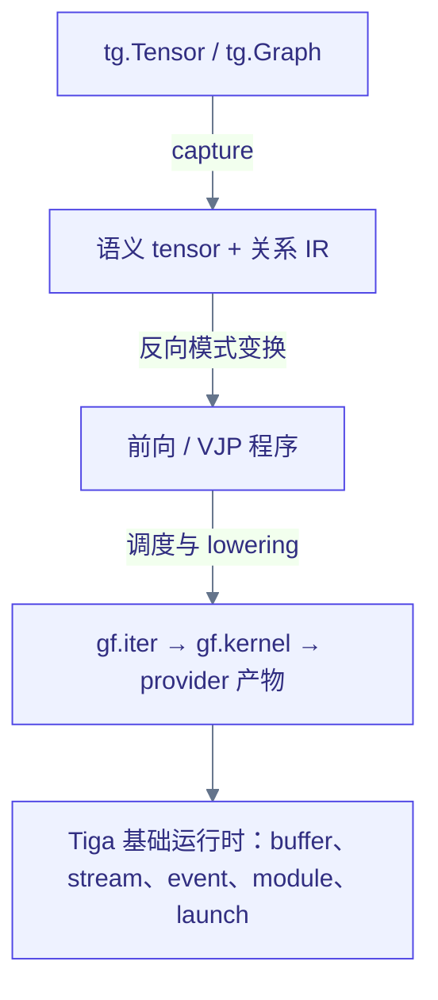

# Tensor 运行时与 autograd { #tensor-runtime-and-autograd }

普通应用直接使用 `torch.Tensor` 与 Torch 求导，见[入门教程](getting-started.md)。
本页讲解高级原生运行时和编译器检查接口，不是日常使用的前置知识。

Tiga 只实现运行编译后的张量与关系程序所需的底层值和运行时接口；
优化器、神经网络模块和数据集刻意不在范围内。



## 当前实现切片 { #current-alpha-slice }

- 原生 C ABI 持有对齐的 CPU buffer 和 [CUDA](https://en.wikipedia.org/wiki/CUDA)
  Driver 分配、stream、事件、模块与 kernel，并提供锁页 host buffer
  以及异步的 CPU↔CUDA/CUDA↔CUDA 传输。
- `tg.Tensor` 记录形状、dtype、步长、设备、存储偏移、版本与就绪事件，
  不包装 Torch Tensor。
- 通用表达式切片支持右对齐广播、`add`、`mul`、`conj`、任意轴 `sum`、
  `reshape`、`permute`/`transpose`、`squeeze`/`unsqueeze` 以及零步长 `expand`。
- 连续的 reshape、permute 和 expand 共享同一块存储；对非连续逻辑视图的
  reshape 只在被观察到时才物化。

```python
import tiga as tg

x = tg.tensor([1.0, 2.0, 3.0], requires_grad=True)
loss = (x * x + 2.0).sum()
dx = tg.autograd.grad(loss, x)

assert loss.tolist() == 20.0
assert dx.tolist() == [2.0, 4.0, 6.0]
```

原生结果延迟执行；默认 `auto` 策略在读取结果时可能使用 `python-oracle`。
设置 `TIGA_TENSOR_BACKEND=native` 可要求原生编译；物化后由
`Tensor.execution` 标识实际 backend。以下流水线描述受支持的编译路径，
不是每次调用都经过全部阶段。

`tg.autograd.grad` 构造新的符号 [VJP](https://en.wikipedia.org/wiki/Automatic_differentiation)
表达式：不修改 `.grad` 字段，也不维护 eager tape；`value_and_grad`
提供函数式变换。`Tensor.mlir()` 发出规范的 `gf_tensor` 操作，
`Tensor.mlir(verify=True)` 再用原生 C++ 验证器往返验证。
`tg.autograd.grad_mlir()` 展示显式的 `gf_tensor.grad` 请求，或
`gf-tensor-vjp` 产出的普通 Tensor IR。Python 表达式求值器只是正确性
oracle；`Tensor.expression()` 仍是非正式的调试文本。受支持的 CPU DAG
由原生 OpBuilder 构建，经 lowering 变为显式 SCF/MemRef 循环，转换到
[LLVM](https://en.wikipedia.org/wiki/LLVM) dialect，再由进程内 MLIR
ExecutionEngine 启动，缓存以规范 MLIR 语义哈希为键。整个过程没有 C/C++
源码 emitter 或系统编译器参与。

`tg.autograd.joint_plan(output, inputs)` 把生成的梯度绑定为一个带版本的
可执行 bundle。前向完成是每个反向任务的显式依赖；checkpoint/spill
决策在反向物化时生效。`explain()` 暴露任务拓扑与资源影响；依然无需
手写任何反向函数。

`tg.autograd.grad(..., checkpoint="auto|save|recompute")` 控制反向所需的
primal 存储。`auto` 发出 `gf_tensor.checkpoint_candidate`；原生
`gf-plan-tensor-checkpoints` MLIR pass 在
`TIGA_CHECKPOINT_BUDGET_BYTES` 预算下选择 save 或 recompute，被选中
的 save 变为 `gf_tensor.checkpoint`。目前 CUDA 能证明不规则关系 gather
有利可图；CPU 使用零字节预算。诊断分别报告原生编译器加载、规划、
`saved_bytes`、checkpoint 编译/物化、反向编译与热启动（warm launch）。
这是编译器做出的内存决策，而非针对特定工作负载手写的 kernel。

对广播边标量 `weight[E,1]` 与 `x[src,F]` 相乘的情形，普通广播 VJP 会
产生一个轴 1 [归约](https://baike.baidu.com/item/归约)。CUDA lowering
把目标端 gather、与已保存源字段的乘法以及逐边特征求和融合进一个 TTIR
kernel。无需任何 MessagePassing 专属的反向方法。

`complex64` 与 `complex128` [复数](https://baike.baidu.com/item/复数)
使用原生交错存储。复数 VJP 采用共轭
[Wirtinger](https://en.wikipedia.org/wiki/Wirtinger_derivatives) 约定：
乘法经由另一侧操作数的共轭求导，`conj` 则对余切（cotangent）取
共轭。由于无法从任意复数标量推断出规范的实值损失，调用方必须为复数
输出提供 `grad_output`。CUDA pointwise provider 将交错的
complex64/complex128 直接 lowering 为成对的实数 TTIR SSA，涵盖
加/乘/除/取负/共轭；由设备端差分测试覆盖，而不是 eager 复数回退。

预编译的 CUDA 提交只绑定一次稳定 ABI。Tiga 自有 buffer 继续经由
独立的 CUDA Driver 运行时；完全由 Torch 持有的 prepared 绑定复用厂商
launcher 已打包的 current-stream ABI，避免 Python/ctypes 的 dispatch
空档，且不改变编译器 TTIR。混合/外部底层绑定可以用运行时的有序、
无额外事件启动；普通启动仍返回显式的 Tiga 完成事件。

形状多态采用 guard-and-specialize（守卫加特化）：有界 `Dim` 符号在
`TensorSpec` 参数间统一，其具体绑定进入可执行缓存键。因此 provider
获得静态 launch 边界，无需为每个尺寸单独编写程序。

CPU 融合基准可用以下命令复现：

```bash
python -m benchmarks.compiler.tensor_fusion \
  --rows 4096 --cols 1024 --torch-compile
python -m benchmarks.compiler.tensor_fusion \
  --rows 4096 --cols 1024 --dtype complex64 --torch-compile
```

该基准计时 result-ready 边界，单独记录冷编译，并比较完全相同的
broadcast-multiply-add-axis-sum 语义。宽松数学（relaxed math）在 JSON
中显式标注；传入 `--strict` 可禁用重结合。

## 运行时 provider 状态 { #runtime-provider-status }

编译器在进程内构造 `gf_tensor`，验证广播/视图/归约，运行反向模式
[自动微分](https://baike.baidu.com/item/自动微分) 并 lowering 出可执行
的 CPU 与 CUDA 子集。CPU 支持向量化和区间并行的关系循环。
各 provider 的运行时支持情况在[路线图](roadmap.md)
支持矩阵中跟踪；没有厂商运行时插件的 provider 会显式失败。

## 关系感知的反向模式 { #relation-aware-reverse-mode }

自动微分必须在语义关系层面对 `MessagePassing` 求导。前向把边上的消息
归约进每个目标节点；VJP 是同一次遍历的转置——源梯度沿同样的边
scatter 回去：

$$
\mathrm{out}_i = \bigoplus_{e=(j \to i)} m_e
\;\;\Longrightarrow\;\;
\frac{\partial L}{\partial x_j}
= \sum_{e=(j \to i)} \frac{\partial L}{\partial\, \mathrm{out}_i}
\cdot \frac{\partial m_e}{\partial x_j}
$$

Reducer VJP 规则决定必须保存或重算哪些状态。Online softmax 必须保留或
重算有界统计量，而不是物化所有边分数。

动态图拓扑默认不可微。位置和边几何量可微，半径/选择的成员资格则
视为固定快照。前向与反向必须引用同一拓扑版本。对分布式快照，反向
模式还会反转 halo/scatter 数据流，并在 `gf.task` 中保留集合通信依赖。

线性求解引入第二份微分契约——有限固定迭代使用算法 VJP，收敛系统使用
伴随求解隐式 VJP。参见[无矩阵求解器与隐式微分](linear-solvers.md)；
目前尚不对隐式求解性能做任何声明。

## Torch 互操作 { #torch-interoperability }

Torch 是安装后推荐的应用接口，不是默认安装依赖。没有 Torch 时，
原生 Tensor/运行时/autograd 与 CPU MessagePassing 仍可执行，不只是能够导入。
原生 MessagePassing/VJP 可走 CPU LLVM 与 CUDA TTIR kernel。
独立运行时拥有 CUDA Driver 资源；Torch 桥提供存储共享与 current-stream 绑定。DLPack 与外部 buffer 绑定将保持这一
零拷贝边界。
